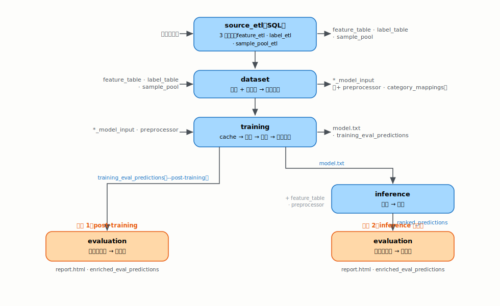

# recsys_tfb — 排序問題批次建模框架，以銀行產品推薦為示例

> 專案入口文件。各深入主題的連結見 [§5 文件地圖](#5-文件地圖--建議閱讀順序)。

## 0. 這是什麼

recsys_tfb 是一套處理**排序問題**的批次建模框架：對每個查詢群組（query group），把群組內的候選項目依模型分數由高到低排名。本文件以**銀行產品推薦**為示例，但框架不限定於這個應用。

> **和二元分類差在哪？**
> 二元分類替每個產品各自判斷客戶會不會買；排序則把同一位客戶在同一個快照日面對的所有候選產品放進**同一組**互相比較，決定誰該排前面。我們要的是組內的**相對名次**，不是每筆的絕對機率。這一組對象，就是一個 query group。

框架用一組**可配置的欄位角色**來描述資料，在 `conf/base/parameters.yaml` 的 `schema` 區塊設定。每個 query group 預設由 `time + entity` 界定，組內把 `item` 依 `score` 排出 `rank`：

| schema 角色 | 意義 | 銀行產品推薦示例 |
|---|---|---|
| `time` | 時間切點 | `snap_date`，快照日 |
| `entity` | 被排序、要分配資源的對象 | `cust_id`，客戶 |
| `item` | 每個對象的候選項目 | `prod_name`，金融產品 |
| `label` | 是否發生，0 或 1 | 客戶是否承作該產品 |
| `score` / `rank` | 模型分數與名次 | 推薦優先順序 |
| query group | 一次排名的範圍 | 每位客戶、每個快照日 |

**方法與評估**

- **方法可選**：只訓練一個共用的 LightGBM 模型，訓練目標可切換 —— pointwise（預設 `binary`）或 learning-to-rank（`lambdarank`、`rank_xendcg`）。設定見 `conf/base/parameters_training.yaml`。
- **評估固定**：不論用哪種目標訓練，評估一律是 per query group（每位客戶、每個快照日）的排序指標 mAP，而非逐筆準確率。這也是它與「逐產品二元分類」最大的不同，詳見手冊 [`gbdt_learning_to_rank.md`](docs/handbooks/gbdt_learning_to_rank.md)。
- **規模**：生產環境每週批次推論，約 1,000 萬客戶 × 22 產品 × 1,500 特徵。本 repo 的合成資料較小，只有 8 產品，供試跑與示意。

## 1. 應用情境

### 要解決的問題

行銷團隊人力有限，無法對每位客戶推銷每一支產品。框架把它變成一個**排序問題**：對每位客戶，把候選產品依模型分數排名，讓 PM 依名次決定**優先聯繫哪些客戶、優先推薦哪些產品**。一般化來說，就是對每個 query group，把候選 `item` 排名，供下游依名次分配有限資源。

### 限制條件（生產環境）

- **引擎**：PySpark 3.3.2，跑在 Hadoop / HDFS / Hive 上，整體流程以 DAG 編排。
- **三條硬限制**：不可用 Spark UDF、無對外網路、不可安裝額外套件。
- **硬體**：純 CPU，4 核心 / 128GB 記憶體。
- **影響**：重運算一律走 Spark SQL / DataFrame；模型訓練是 driver 上的單機 LightGBM。

### 輸入與輸出

**輸入** —— 三張由 `source_etl` 維護的 Hive 來源表。下表用 schema 角色說明；完整欄位與範例資料見 [`docs/data-lineage.html`](docs/data-lineage.html)。

| 來源表 | 內容 | 主鍵（角色） |
|---|---|---|
| `feature_table` | 每位客戶在每個快照日的特徵寬表 | `time, entity` |
| `label_table` | 客戶是否承作某產品的 ground truth（`label` 0/1） | `time, entity, item` |
| `sample_pool` | 每個 query group 要納入排名的候選範圍，並帶分群欄供分層抽樣 | `time, entity, item` |

**輸出** —— 一張 Hive 表，示例名為 `ranked_predictions`。每個 query group 內，`item` 依 `score` 由高到低排出 `rank`：

| 欄位 | 角色 | 說明 |
|---|---|---|
| `cust_id`、`score`、`rank` | `entity`、`score`、`rank` | 資料欄：客戶、分數、名次 |
| `snap_date`、`prod_name`、`model_version` | `time`、`item`、版本 | partition 維度 |

---

## 2. 快速上手

指令格式一律是 `python -m recsys_tfb <pipeline> [選項]`，`<pipeline>` 直接寫指令名，如 `dataset`、`training`（沒有 `run` 子指令、也沒有 `--pipeline` 旗標）。`--env` 選擇設定環境（預設 `local`）。目前 `conf/` 只有 `base/`、沒有 `local` / `production` overlay，所以 `--env` 影響有限（主要差別：`*_etl` 在 `--env local` 預設為 **dry-run、不寫表**，見下方執行 commands 的提醒）。

### Pipeline 總覽

整條流程分兩種機制：三個 `*_etl` 指令走 SQL，其餘是 DAG pipeline。`evaluation` 有兩個使用情境 —— 訓練後直接評（post-training），或上線 `inference` 後做監控。



文字版流程：`source_etl → dataset → training`，之後分兩條評估路徑 —— 訓練後直接評（`training → evaluation`，加 `--post-training`），或上線後監控（`training → inference → evaluation`）。

### Data lineage 總覽

上方 Pipeline 總覽已標出各階段的輸入 / 輸出表。中介表、版本層與所有產物的完整 lineage，以及每張表的 schema 與範例，見 [`docs/data-lineage.html`](docs/data-lineage.html)。

### 各 pipeline 的 node 全貌

`source_etl` 走 SQL、非 DAG 節點，先說明；其餘為 DAG pipeline，逐一列出節點與主要功能。

**source_etl**（SQL，非節點）：`feature_etl`、`label_etl`、`sample_pool_etl` 各自串接多支 SQL（例如 `feature_etl` 跑 aum → sav → ccard → info → concat → table），依 `partition_by` 做 `INSERT OVERWRITE`，最終產出 `feature_table` / `label_table` / `sample_pool`。

**dataset**

| node | 輸入 | 主要功能 | 產出 |
|---|---|---|---|
| `validate_data_consistency` | `sample_pool`、`label_table` | 抽樣前先檢查 item 集合與設定一致（資料一致性檢查，fail-fast） | —（擋錯） |
| `select_*_keys` / `split_train_keys` | `sample_pool` | 依分群鍵抽樣，挑各 split 要用的 key（`time, entity, item` 三欄組合） | `*_keys` |
| `fit_preprocessor_metadata` | `feature_table` | 在 train 期 `feature_table` 上 fit 編碼字典等前處理 | `preprocessor`、`category_mappings` |
| `apply_preprocessor_to_features` | `feature_table`、`preprocessor` | 對 `feature_table` 編碼一次，各 split 共用 | `preprocessed_feature_table` |
| `build_model_input` | `*_keys`、`preprocessed_feature_table`、`label_table` | keys join 特徵、再 join label，組各 split 訓練輸入 | `*_model_input` |
| `filter_groups_with_positives` | `val/test_model_input`（未濾） | 丟掉 val/test 中沒有任何正例的查詢群組（這種 group 對排序指標 mAP 沒有意義） | `val/test_model_input` |

> `train`、`train_dev` 是訓練資料的兩份切分（`dataset` 由 `split_train_keys` 切出），HPO 與最終訓練都會用到。

**training**

| node | 輸入 | 主要功能 | 產出 |
|---|---|---|---|
| `cache_{train,train_dev,val,test}_model_input` | `*_model_input` | 把各 split 從 Hive 拉成 driver-local parquet 快取 | 各 split parquet handle |
| `tune_hyperparameters` | train / train_dev / val 的 parquet handle | Optuna 調參（HPO） | `best_params`、HPO 模型 |
| `finalize_model` | train / train_dev 快取、HPO 模型 | 產出最終 LightGBM 模型 | `model`（model.txt） |
| `calibrate_model`（可選） | 模型、calibration 快取 | 機率校準（如 sigmoid） | 校準後 `model` |
| `predict_and_write_test_predictions` | `model`、test 快取 | 對 test set 評分並寫 Hive | `training_eval_predictions` |
| `compute_*` 診斷 | `model`、特徵 | 特徵統計 / 原生 importance / SHAP | 診斷 JSON |

**evaluation**

| node | 輸入 | 主要功能 | 產出 |
|---|---|---|---|
| `prepare_eval_data` | 預測（`ranked_predictions` 或 `training_eval_predictions`）、`label_table` | join 標籤、備好評估資料 | `eval_predictions` |
| `compute_metrics` | `eval_predictions` | 算排序指標（mAP / NDCG…） | 指標 dict |
| `compute_baseline_metrics` | `eval_predictions`、`label_table` | popularity baseline 對照 | baseline 指標 |
| `generate_report` | 指標、`eval_predictions` | 產 HTML 報表 | `report.html` |
| `persist_eval_predictions` | `eval_predictions` | 寫回 Hive 供後續比較 | `enriched_eval_predictions` |

**inference**

| node | 輸入 | 主要功能 | 產出 |
|---|---|---|---|
| `build_scoring_dataset` | `feature_table` | 組出要評分的客戶 × 產品母體 | `scoring_dataset` |
| `apply_preprocessor` | `scoring_dataset`、`preprocessor` | 用訓練時的前處理編碼 | `X_score` |
| `predict_scores` | `model`、`X_score` | 模型評分 | `score_table` |
| `rank_predictions` | `score_table` | 每個 query group 內依 score 排名 | `ranked_predictions` |

### 各 pipeline 要編寫 / 設定的檔

只列「要動哪些檔」；逐欄怎麼填見對應的 `docs/pipelines/<name>.md`。

| pipeline | 要編寫 / 設定的檔 |
|---|---|
| `source_etl` | <ul><li><code>conf/sql/etl/&lt;stage&gt;/*.sql</code>：各 ETL 的 SQL（feature / label / sample_pool 各一子目錄）</li><li><code>conf/base/parameters_{feature,label,sample_pool}_etl.yaml</code>：執行順序 <code>depends_on</code>、<code>target_dates</code></li><li><code>conf/base/catalog.yaml</code>：註冊下游要讀的表</li></ul> |
| `dataset` | <ul><li><code>conf/base/parameters_dataset.yaml</code>：抽樣分群、各 split 日期、前處理</li><li><code>catalog.yaml</code>：dataset 各表</li></ul> |
| `training` | <ul><li><code>conf/base/parameters_training.yaml</code>：<code>objective</code>、HPO <code>search_space</code>、<code>calibration</code>、<code>sample_weights</code></li><li><code>catalog.yaml</code>：model 等產物路徑</li></ul> |
| `inference` | <ul><li><code>conf/base/parameters_inference.yaml</code>：<code>snap_dates</code></li><li><code>catalog.yaml</code>：<code>score_table</code>、<code>ranked_predictions</code></li></ul> |
| `evaluation` | <ul><li><code>conf/base/parameters_evaluation.yaml</code>：k 值、指標、<code>compare_sources</code></li><li><code>catalog.yaml</code>：報表、<code>enriched_eval_predictions</code></li></ul> |

### 設定怎麼來：從來源資料推導

`source_etl` 產出後，有些 `dataset` / `training` 設定不是手填，而是用輔助工具從 `sample_pool` / `feature_table` 推導（這一步很容易漏掉）：

- `scripts/sampling_overrides_editor.py`：profile `sample_pool`、在瀏覽器調整後輸出 YAML，決定 `parameters_dataset.yaml` 的 `sample_ratio_overrides` 與 `parameters_training.yaml` 的 `sample_weights`。
- `scripts/suggest_categorical_cols.py`：從資料推斷類別欄，決定 `parameters_dataset.yaml` 的 `prepare_model_input.categorical_columns`。

### pipeline 之間如何銜接

各 pipeline **各自用 CLI 執行，沒有串接它們的 glue script**。實際銜接靠：

- **Hive 表**：`dataset` 寫 `*_model_input` → `training` 讀；`inference` 寫 `ranked_predictions` → `evaluation` 讀。
- **版本對齊**：透過 `dataset` 寫出的版本 manifest 與 `latest` symlink 自動對齊，各 pipeline 自行解析出對應版本（細節見版本管理文件）。
- **driver-local 產物**：`model.txt`、`preprocessor` 等非 DataFrame 產物寫在 driver 本機檔案系統。

上線時用 `scripts/promote_model.py` 把某個 `model_version` 設為 `best`（人工觸發，不自動）。

### 執行 commands

```bash
# 1. 來源 ETL（來源資料更新時；--target-dates 需涵蓋 dataset 用到的所有 snap_date）
#    注意：--env local 時 *_etl 預設 dry-run、不寫表；要實際建表用 --env production
#    或在 parameters_*_etl.yaml 設 dry_run: false
python -m recsys_tfb feature_etl     --env local --target-dates 2025-01-31
python -m recsys_tfb label_etl       --env local --target-dates 2025-01-31
python -m recsys_tfb sample_pool_etl --env local --target-dates 2025-01-31

# 2. 首次或來源資料變動時：用輔助工具從來源資料推導設定
python scripts/suggest_categorical_cols.py ml_recsys.feature_table
#   → 貼進 parameters_dataset.yaml 的 prepare_model_input.categorical_columns
python scripts/sampling_overrides_editor.py profile ml_recsys.sample_pool
#   → 在瀏覽器調整、匯出 JSON 後，轉成 YAML：
python scripts/sampling_overrides_editor.py to-yaml data/profiling/sampling_overrides_export.json
#   → 貼進 parameters_dataset.yaml 的 sample_ratio_overrides 與 parameters_training.yaml 的 sample_weights

# 3. 建資料集 → 訓練
python -m recsys_tfb dataset  --env local
python -m recsys_tfb training --env local

# 4a. 情境 1：訓練後評估（讀 training_eval_predictions）
python -m recsys_tfb evaluation --env local --post-training

# 4b. 情境 2：上線（升版 → 評分 → 監控評估）
python scripts/promote_model.py                 # 把某個 model_version 設為 best（人工觸發）
python -m recsys_tfb inference  --env local
python -m recsys_tfb evaluation --env local
```

常用選項：

- `training`：`--base-dataset-version`、`--train-variant` 指定版本，預設取最新。
- `evaluation`：`--post-training`（情境 1）、`--compare` / `--compare-only`、`--model-version`。
- `inference`：`--model-version`，預設用 `best`。
- `promote_model.py`：不給版本則自動選 mAP 最佳；`--dry-run` 只列出版本不升版。

## 3. FAQ

**Q1. 這跟我做過的「逐產品二元分類」差在哪？我不也是訓一個輸出機率的模型？**

模型可以還是同一種（預設就是 `binary`），差別在**評估**與**你優化的目標**：

- 二元分類問「這位客戶會不會買產品 A」，逐筆看絕對機率、逐筆算 AUC / logloss。
- 這裡問「對這位客戶，所有候選產品該怎麼**排先後**」，評估一律是 per query group 的排序指標 mAP（mAP 怎麼算見 [`docs/metrics.html`](docs/metrics.html)）。
- 你還可以把訓練目標從 `binary` 換成 learning-to-rank（`lambdarank` / `rank_xendcg`），讓模型直接優化排序。

排序與分類的數學差異，見手冊 [`gbdt_learning_to_rank.md`](docs/handbooks/gbdt_learning_to_rank.md)。

**Q2. 為什麼資料要切成 train / train_dev / val / calibration / test 五份？各做什麼？**

| split | 設定（`parameters_dataset.yaml`） | 角色 |
|---|---|---|
| `train` | `train_snap_dates` | 建樹的主訓練資料 |
| `train_dev` | 從 `train` 同期按 `train_dev_ratio` 切出 | early-stopping 監控集：**單次訓練內**決定樹長到第幾棵就停 |
| `val` | `val_snap_dates` | HPO（超參數搜尋）目標集：**跨多次試驗**，Optuna 拿它的排序分數挑超參 |
| `calibration` | `calibration_snap_dates`（`enable_calibration`） | 機率校準的 fit 資料（可選） |
| `test` | `test_snap_dates` | 最終 held-out，產 `training_eval_predictions` 供情境 1 評估 |

各 split 用**不同且時間向前**的快照日（範例設定：train 2025-01～10 → calibration 2025-11 → val 2025-12 → test 2026-01），避免拿未來資料回頭評估造成洩漏。

**Q3. objective 要選 `binary` 還是 `lambdarank`？**

- 預設 `binary`（pointwise，逐筆獨立評分後再排）：最穩、最接近你熟的分類流程，而且評估照樣是排序指標。建議先從這裡開始。pointwise / pairwise / listwise 的差別見手冊 [`gbdt_learning_to_rank.md`](docs/handbooks/gbdt_learning_to_rank.md)。
- 想讓模型直接優化排序：切 `lambdarank` / `rank_xendcg`，但必須同時滿足兩件事——metric 用排序指標（`ndcg` / `map`，留空會自動帶 `ndcg`），且 query group（`schema.time + entity`）有定義。否則啟動時會被一致性閘擋下（見 §4）。

設定都在 `parameters_training.yaml` 的 `algorithm_params`。

**Q4. 排序只看相對名次，為什麼還要做機率校準（calibration）？**

純看排名確實不需要校準。會需要校準，是當下游要把 `score` 當「機率」解讀時——例如算期望收益、或跨快照日比較絕對水準。可選步驟，由兩個設定一起控制：dataset 端 `enable_calibration` 產出校準資料、training 端 `training.calibration.enabled` 實際做校準。

**Q5. 模型訓練好後怎麼上線？**

用 `scripts/promote_model.py` 把某個 `model_version` 設為 `best`（**人工觸發、不會自動**）；`inference` 預設就用 `best` 那一版評分。不給版本時 `promote_model.py` 會自動挑 mAP 最佳，加 `--dry-run` 只列出候選、不真的升版。

**Q6. evaluation 的兩個情境怎麼選？**

| 情境 | 指令 | 讀什麼 | 什麼時候用 |
|---|---|---|---|
| 訓練後評估 | `evaluation --post-training` | `training_eval_predictions`（test set） | 剛訓完、想看這版在 test 上的排序表現 |
| 上線後監控 | `evaluation`（預設） | `ranked_predictions`（inference 產出） | 模型上線後，定期追蹤線上排名品質 |

**Q7. 為什麼有些設定要先用 script 從資料推導，不能手填？**

`sample_ratio_overrides` / `sample_weights` 的 key 是資料裡**實際出現的分群組合**，`categorical_columns` 要對齊資料**實際的類別欄**。手填很容易跟資料對不上，啟動時就被一致性閘擋下。所以改用 `scripts/sampling_overrides_editor.py`、`scripts/suggest_categorical_cols.py` 從 `sample_pool` / `feature_table` 推導（見 §2「設定怎麼來」）。

## 4. 常見錯誤

框架有兩道**會直接 fail-loud 的閘**，把設定 / 資料不一致擋在跑完長流程之前。兩道閘都**一次列出所有問題**（不是遇到第一個就停），讓你一輪修完。下表用**訊息中可搜尋的片段**對應原因與修法。

### 設定一致性閘（CLI 一啟動就檢查）

任何 `python -m recsys_tfb <pipeline>` 啟動時都會跑；失敗會印 `Config consistency check failed (N issue(s)):` 並中止（例外型別 `ConfigConsistencyError`）。下表「怎麼修」提到的 `parameters*.yaml`（含 `parameters.yaml`、`parameters_dataset.yaml`…）都在 `conf/base/`。

| 訊息片段（可搜尋） | 代表什麼 | 怎麼修 |
|---|---|---|
| `is missing from dataset.prepare_model_input.categorical_columns` | 你把 `item`（如 `prod_name`）從類別欄拿掉了；排序任務裡 item 必須是特徵 | 把 item 加回 `categorical_columns` |
| `has no schema.categorical_values[...] declaration` | item 宣告成類別欄，卻沒給它的值清單 | 在 `parameters.yaml` 的 `schema.categorical_values.<item>` 補上完整產品清單 |
| `is declared in BOTH ... drop_columns and categorical_columns` | 同一欄同時要丟掉又要當類別特徵，意圖矛盾 | 二選一：要當特徵就移出 `drop_columns`，要排除就移出 `categorical_columns` |
| `inference.products disagrees with schema.categorical_values` | `inference.products` 與 schema 宣告的產品集合不一致 | 兩邊改成相同集合 |
| `sample_ratio_overrides references item value(s) ... absent` | override 的 key 拼錯產品名，或用了沒宣告的值 | 修正 key，或在 `schema.categorical_values` 補該值 |
| `is a ranking objective but metric=... is not a ranking metric` ／ `the query group ... is undefined` | 用了 `lambdarank` / `rank_xendcg` 卻配非排序 metric，或 `schema.entity` 空（沒有 query group） | metric 設 `ndcg` / `map`（或留空自動帶 `ndcg`）；確認 `schema.entity` 有設 |
| `sample_weight_keys column(s) ... are not in the train model_input parquet` | 拿來當 weight 維度的欄沒被帶進訓練資料 | 把該欄加進 `parameters_dataset.yaml` 的 `carry_columns`，重跑 `dataset`（資料集版本 `base_dataset_version` 會更新、需重算） |
| `sample_weights key(s) ... do not have N ... segment(s)` | weight 表的 key 是 `sample_weight_keys` 各欄值用 `\|` 串起來（如 `mass\|ccard_ins`），段數要等於欄數 | 對齊段數，或直接用 `scripts/sampling_overrides_editor.py` 產生 key |
| `segment_columns entries ... have no evaluation.segment_sources` | 要分群報表的欄沒有對應的 segment 來源 | 在 `evaluation.segment_sources` 補來源，或從 `segment_columns` 移除 |

### 資料一致性閘（`dataset` pipeline 第一個節點）

在抽樣 / 前處理**之前**，先比對「設定宣告的產品」與「資料實際出現的產品」；失敗會 raise `DataConsistencyError`。

| 訊息片段（可搜尋） | 代表什麼 | 怎麼修 |
|---|---|---|
| `sample_pool has item value(s) ... not in schema.categorical_values` | 資料有、設定沒宣告的產品——會被編成 -1（跟 null 同碼）悄悄汙染訓練 | 在 `schema.categorical_values.<item>` 補上，或修 `sample_pool` 的 SQL |
| `declares value(s) ... that sample_pool never produces` | 設定宣告了、但 `sample_pool` 從不產生的產品——永遠不會被排名 | 從設定移除，或修 SQL 讓它產出 |
| `label_table has item value(s) ... not in schema.categorical_values` | label 的 SQL 產出了模型不認識的產品 | 對齊 label SQL 與 `schema.categorical_values` |

> 修設定相關錯誤的逐情境 SOP（加產品 / 加特徵 / 改訓練目標各要動哪些檔），見 [`docs/change-guide.md`](docs/change-guide.md)。

## 5. 文件地圖 / 建議閱讀順序

### 我想做什麼 → 看哪裡

| 你想做什麼 | 看這裡 |
|---|---|
| 搞懂這是什麼、排序問題長怎樣 | 本文件 §0–§1；不熟排序先讀手冊 [`gbdt_learning_to_rank.md`](docs/handbooks/gbdt_learning_to_rank.md) |
| 把整條流程跑起來 | 本文件 §2 |
| 看資料怎麼流、每張表的 schema 與範例 | [`docs/data-lineage.html`](docs/data-lineage.html) |
| 深入某一個 pipeline | [`docs/pipelines/`](docs/pipelines)（`source_etl` / `dataset` / `training` / `evaluation`） |
| 改設定（加產品 / 加特徵 / 改訓練目標） | [`docs/change-guide.md`](docs/change-guide.md) ＋ 本文件 §4 |
| 搞懂指標怎麼算 | [`docs/metrics.html`](docs/metrics.html) |
| 理解設計取捨與最反直覺的行為 | [`docs/design-principles.md`](docs/design-principles.md)、[`docs/behavior-diagrams.html`](docs/behavior-diagrams.html) |

### 概念手冊（自學，建議循序）

從二元分類一路鋪到排序，不熟排序問題的人建議照順序讀：

1. [`gbdt_binary_classification.md`](docs/handbooks/gbdt_binary_classification.md) — GBDT 二元分類基礎
2. [`gbdt_class_imbalance.md`](docs/handbooks/gbdt_class_imbalance.md) — 類別不平衡的數學影響
3. [`gbdt_multiitem_imbalance.md`](docs/handbooks/gbdt_multiitem_imbalance.md) — 多 item 共享模型的冷熱門
4. [`gbdt_learning_to_rank.md`](docs/handbooks/gbdt_learning_to_rank.md) — learning-to-rank 與 binary 的差異

（手冊都在 `docs/handbooks/`；每篇都有對應的 `*_offline.html` 自包式版本可直接開。）

### 完整文件地圖

按分類列出所有文件（上面「我想做什麼」表是任務導向的捷徑）；`.html` 可直接用瀏覽器開、含圖表，`.md` 為純文字。

| 分類 | 文件 | 用途 |
|---|---|---|
| 入口 | `README.md`（本檔） | 看懂 ＋ 跑起來 |
| 資料 | `docs/data-lineage.html` | 全表 lineage ＋ schema ＋ 範例 |
| pipeline | `docs/pipelines/{source_etl,dataset,training,evaluation}.md` | 各 pipeline 的節點、設定、重跑語意 |
| 指標 | `docs/metrics.html` | mAP / NDCG / per-item 怎麼算、報表怎麼讀 |
| 設計 | `docs/design-principles.md` | 設計原則、三層版本、一致性不變量 |
| 設計 | `docs/behavior-diagrams.html` | 最反直覺的程式行為圖解 |
| 修改 | `docs/change-guide.md` | 加產品 / 特徵 / 改設定的逐情境 SOP |
| 概念 | `docs/handbooks/gbdt_*.md`（4 篇手冊） | 排序與不平衡的數學自學 |
| 本機開發（選讀） | `docs/operations/worktree-venv-setup.md`、`docs/operations/spark-connection-architecture.md` | 在本機 dev-cluster 跑這個 repo 的環境設定 |

> 公司生產環境的 Spark / Hive 連線已配置好，一般使用者不需要碰「本機開發」那一列。
