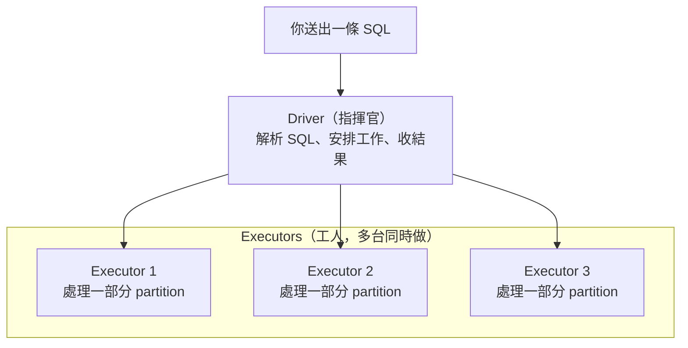
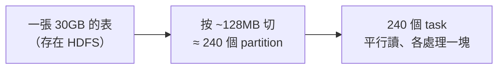
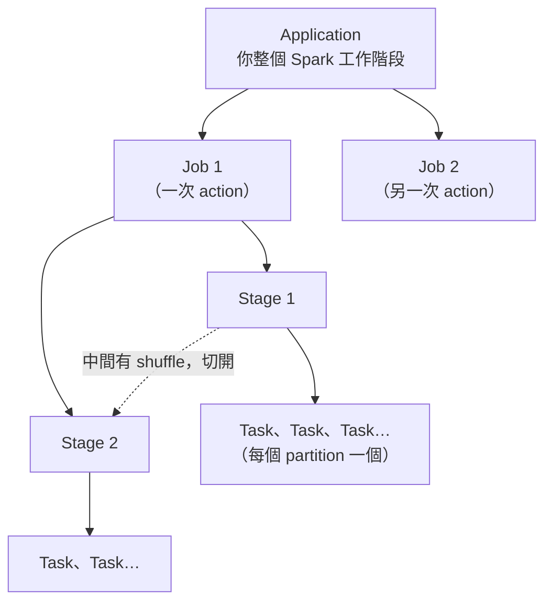
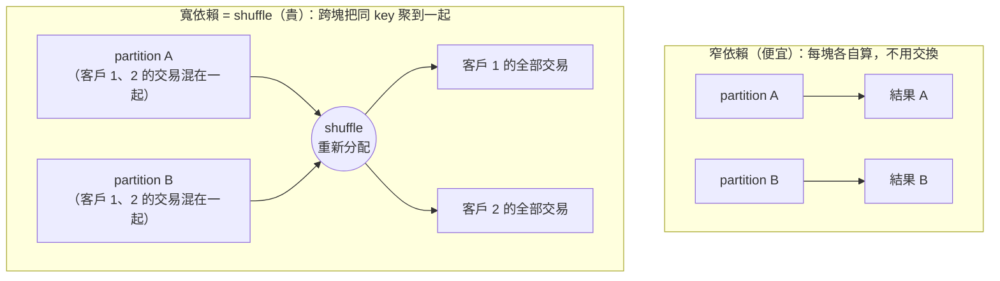
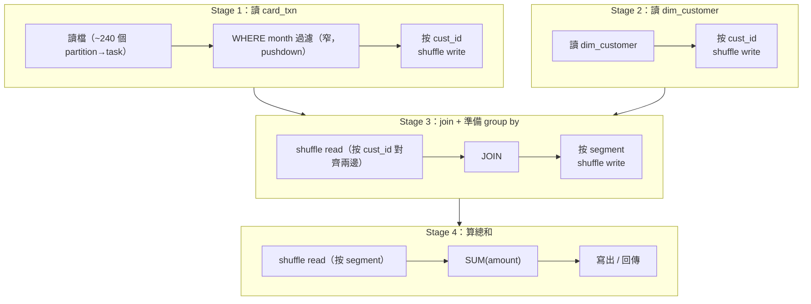

# 01 · Spark 怎麼跑你的 SQL

> **本章前提**：你會寫 SQL。不需要任何分散式系統或資料工程背景。
>
> 這一章不教你怎麼調優，而是先建立一個心智模型：你送出一條 SQL 後，Spark 在背後做了什麼、用了多少機器。後面每一章的建議，追根究柢都是在「讓 Spark 少做這個模型裡最貴的那件事，或把有限的機器用在刀口上」。
>
> 每節末尾附 📚 **來源**，方便你自行查證；章末「資料來源與精確度說明」另列出哪些地方是刻意簡化、不該當精確值。

---

## 1.1 你的查詢，其實是一群機器一起做

當你在自己的筆電上對一個 CSV 跑 SQL，是一顆 CPU 從頭讀到尾。Spark 不是這樣。

你的資料表沒有放在一台機器上，而是被切成很多塊、散在叢集的多台機器上（存在 **HDFS**——叢集的分散式檔案系統，把大檔案切塊、分存到多台機器）。每一塊叫一個 **partition**。一張 3000 萬筆的信用卡帳務表，可能被切成幾百個 partition，每個 partition 幾十萬筆。

跑查詢時，叢集分成兩種角色：

- **Driver**：指揮官。它解析你的 SQL、安排工作、把結果收回來。只有一個。
- **Executor**：工人。實際讀 partition、做運算。有很多個、可以同時開工（嚴格說，executor 是跑在機器上的一支程式／行程，一台機器可能同時跑好幾個）。



> 在我們的 **CDP**（Cloudera 的大數據平台）叢集上，HDFS 負責存資料，**YARN**（叢集的資源管家）負責分配這些 executor 要用幾台、多大記憶體。第 04 章會談怎麼跟它要資源。

**為什麼這件事重要**：因為運算被切開平行做，所以「資料怎麼切、要不要在機器之間搬動、給你多少台機器」就決定了快慢——這是本手冊反覆出現的主軸。

> 📚 **來源**：driver／executor／task 的角色定義見 [Spark Cluster Overview（Glossary）](https://spark.apache.org/docs/latest/cluster-overview.html)（executor 嚴格是「行程」，同頁）；HDFS 把檔案切塊分存見 [Apache Hadoop HDFS 架構](https://hadoop.apache.org/docs/stable/hadoop-project-dist/hadoop-hdfs/HdfsDesign.html)。

### 順帶認識：你查的「表」存在哪、又是誰記得它在哪

你在 Hue 打 `SELECT … FROM card_txn`，這個 `card_txn` 其實是**兩樣東西合起來**：

- **資料本身**：一堆檔案，照前面說的存在 **HDFS** 上（被切塊、分散在多台機器）。
- **「這張表長什麼樣」的登記**：另有一份目錄，記著「有哪些表、每張表有哪些欄位、分成哪些分區、檔案放在 HDFS 的哪個路徑」。這份目錄叫 **Hive Metastore**（常簡稱 HMS；它存的是「描述資料的資料」，即 metadata／中繼資料）。

所以一條查詢真正發生的事是：引擎先問 **Metastore**「`card_txn` 在哪、欄位是什麼」，拿到 HDFS 路徑後，再去 **HDFS** 把資料讀進來算。**HDFS 存的是位元組、Metastore 記的是「有哪些表、在哪裡」**——分工不同、缺一不可。（第 05 章 §5.6 會講，`ANALYZE TABLE` 算出的表大小統計也是存在這份 Metastore 裡；第 06 章整章則建立在「多個引擎共用這同一份 Metastore」之上。）

**這裡要趁早澄清一個常見混淆**：「Hive」這個字，在你的平台上其實指**兩件不同的事**——

1. **Hive 表 ／ Hive Metastore**：上面這份**三個引擎共用**的表目錄與資料（這三個引擎是 Spark、Hive，以及 **Impala**——一種專做高速互動查詢的引擎，第 06 章詳談）。你用哪個引擎查，看的都是同一份登記、同一份 HDFS 資料。
2. **Hive 這個查詢引擎**：實際把 SQL 跑起來的其中一種引擎（另兩種是 Spark、Impala）。下面 §1.9、以及第 06 章講的「Hive 快不快、該選哪個引擎」，是這個意思。

把這兩個分開，後面很多話才不會打結：「我用 Spark 也能查別人用 Hive 建的表」講的是第 1 點（**共用目錄**）；「Spark 通常比老 Hive 快」（§1.9）講的是第 2 點（**引擎**）。**你平常在 Hue 選的那個「Hive」，就是第 2 個（引擎）；它查到的表，登記在第 1 個（Metastore）裡。**

> 📚 **來源**：CDP 上 Hive／Impala／Spark 共用同一個 Hive Metastore（記錄表／分區／欄位／儲存位置的中繼目錄）、同一張 external 表跨引擎可讀見 [Cloudera CDP — Apache Spark access to Apache Hive](https://docs-archive.cloudera.com/runtime/7.1.0/securing-hive/topics/hive_spark_access_to_hive.html)；Spark SQL 透過 Hive Metastore 存取既有 Hive 表見 [Spark SQL — Hive Tables](https://spark.apache.org/docs/latest/sql-data-sources-hive-tables.html)。⚠️「三引擎共用同一份資料／Metastore」是第 06 章的立論，本節只先建立心智模型；Hive Metastore 與 §1.2／§5.4 那個 HDFS NameNode（記「檔案清單」的）是兩份不同的目錄，別混為一談。

---

## 1.2 你的資料被切成幾塊？partition 從哪來

上一節說資料被切成 partition——但切成幾塊？這個數字很關鍵，因為 **一個 partition 對應一個 task**（下面 §1.4 會正式講），所以 partition 數＝這一步**最多能同時做幾件事**。

讀檔時，Spark 大致按**固定大小**把檔案切成 partition，一塊預設約 **128MB**（由 `spark.sql.files.maxPartitionBytes` 控制）。所以一張 30GB 的表讀進來，大約 30GB ÷ 128MB ≈ **240 個 partition → 240 個 task** 平行讀。（這是粗估：很多小檔、或像 gzip（一種常見壓縮格式，壓縮後不能從中間切開讀）這種「不能從中間切開」的檔，實際塊數會不一樣。）

為什麼你該在意這個數字：

- **太少（每塊太大）**：平行度不足，機器在閒著；而且單一 task 要嚼的資料太多，記憶體不夠就 **spill**（溢寫到磁碟——暫時放不下的資料先寫去磁碟，慢；§1.6 會詳述）。極端情況——整張大表只有 1 個 partition，等於一個 task 扛全部，叢集再大也沒用。
- **太多（每塊太小）**：每個 task 都有固定的啟動、排程開銷；幾萬個只有幾 KB 的 task，光開銷就拖垮你，寫出時還會產生一堆小檔（第 05 章的小檔問題）。



partition 數**不是固定的**：讀進來是一個數，經過 shuffle 後會變成另一個數（§1.6 會講），自己重新分配也會變。但你心裡最好隨時有個「現在大概幾塊、每塊多大」的概念——這是判斷「夠不夠平行、會不會 spill」的基礎。

> 📚 **來源**：讀檔每塊預設 128MB（`spark.sql.files.maxPartitionBytes` = 134217728）見 [Spark SQL Performance Tuning](https://spark.apache.org/docs/latest/sql-performance-tuning.html)；partition↔task 一對一見《Spark: The Definitive Guide》Ch.15。⚠️「30GB÷128MB≈240」是教學一階近似——很多小檔會更多塊（每開一檔約多算 4MB 成本），gzip 等不可切分的檔再大也只算一塊（[SPARK-29102](https://issues.apache.org/jira/browse/SPARK-29102)）。

---

## 1.3 Spark 不會馬上算：先攢計畫，再一次跑

第三個和單機 SQL 很不一樣的地方：你寫的查詢，Spark **不是讀到就算**。

像 `SELECT`、`WHERE`、`JOIN`、`GROUP BY` 這些，Spark 只是把它們記下來，攢成一份「待辦計畫」，先不動手。這叫 **lazy evaluation（延遲求值）**。

要等你做一件「真的要結果」的事，整份計畫才會一次跑起來。這種會觸發執行的動作叫 **action**，常見的有：

- 把結果存成一張表 / 寫成檔案
- 把結果撈回來看（例如 `collect`、或在 **Hue**——你平常打 SQL 的那個網頁工具——按下執行去顯示資料）
- 算總數 `count`

**為什麼這件事重要**：因為 Spark 看得到「整份計畫」才動手，它就有機會幫你優化——例如把 `WHERE` 條件提早、把用不到的欄位整段砍掉（下一節的優化器在做的事）。你寫 SQL 的方式會影響它能不能優化得動。

> 📚 **來源**：lazy evaluation（transformation 只記不算、action 才觸發）見 [Spark RDD Programming Guide](https://spark.apache.org/docs/latest/rdd-programming-guide.html) 與《Spark: The Definitive Guide》Ch.2。

---

## 1.4 從 SQL 到一群 task：工作分成四層

當 action 觸發後（§1.3），你交給 Spark 的工作會由大到小分成四層。先把名字對齊——第 02 章用 Spark UI 找瓶頸時，畫面上看到的就是這四層：

- **Application（應用）**：你這一次連上 Spark 的整個工作階段（你的 SparkSession、一支程式、或一個 Hue 連線跑的所有東西——你在 Hue 每開一個 Spark 查詢視窗，背後就是一個 SparkSession）。一個 application 從頭到尾共用同一批 executor——這批 executor 被你佔著時，別人的 application 就得排隊（多租戶饑餓），第 04 章會談怎麼配才不互相卡死。
- **Job（作業）**：**每觸發一次 action，就產生一個 job**（絕大多數情況如此；極少數 action 會拆成多個 job，本手冊的批次情境幾乎不會遇到）。所以一段程式裡跑了三次 `count`、又寫了一次表，大致就是四個 job。
- **Stage（階段）**：一個 job 內，一段「不用在機器之間搬資料」就能連續做完的工作。**每遇到一次 shuffle（§1.5 會講），就切成下一個 stage。**
- **Task（任務）**：一個 stage 裡最小的工作單位。**一個 partition 對應一個 task**。100 個 partition 就是 100 個 task，由眾多 executor 分頭平行跑。



那這四層是怎麼從你的 SQL 變出來的？把鏡頭拉近到**一個 job 內部**：你的 SQL 會先被轉成計畫、優化，再切成這個 job 的 stage 與 task——下面這張流程圖畫的就是「上圖某一個 job 裡發生的事」。


- **Logical Plan / Physical Plan**：logical plan 是「你要的結果長什麼樣」，physical plan 是「實際照什麼步驟、用什麼方式去做」。你寫的 SQL 先變成前者，再被優化成後者。
- **Catalyst**：Spark 內建的查詢優化器，負責把 logical plan 改寫成更省的 physical plan（例如自動把過濾條件下推到讀檔階段）。你不用直接操作它，但你的寫法決定它能幫多少忙。

> **為什麼要在乎這四層？** 第 02 章你會在 Spark UI 看到 Job 列表，點進去看它由哪些 Stage 組成，再看每個 Stage 的 Task 時間分佈。「慢在哪一層」決定你往哪裡查。

> 📚 **來源**：application／job（每 action 一個）／stage（shuffle 切）／task（一 partition 一個）的定義見 [Spark Cluster Overview（Glossary）](https://spark.apache.org/docs/latest/cluster-overview.html) 與《Spark: The Definitive Guide》Ch.15；Catalyst 把 logical plan 優化成 physical plan（含 predicate pushdown）見 [Databricks：Deep Dive into Catalyst Optimizer](https://www.databricks.com/blog/2015/04/13/deep-dive-into-spark-sqls-catalyst-optimizer.html)（Spark SQL 核心開發者所寫）。⚠️「一 action 一 job」是心智模型；少數情況（如讀 CSV 推斷 schema）一個 action 會被拆成多個 job。

---

## 1.5 兩種運算：自己算的（便宜）vs 要交換的（貴）

機器和分工講完了，回到「運算本身」。Spark 的運算可以粗分成兩類，差別在於**一塊資料能不能自己算完、還是得跟別塊交換**。

**窄依賴（narrow）—— 便宜**：每個 partition 自己算自己的，算完就好，不用看別的 partition。
例如 `WHERE amount > 1000`（過濾）、`SELECT col_a, col_b`（取欄位）、`amount * 1.05`（逐列計算）。100 個 partition 各做各的、互不打擾，這正是平行運算最舒服的情況。

**寬依賴（wide）—— 貴**：要把散在各 partition、但「同一個 key」的資料聚到一起，才算得出來。
例如 `GROUP BY cust_id`（同一客戶的交易可能散在每個 partition，得先聚過來）、`JOIN`（兩邊相同 join key 的列要碰頭）、`DISTINCT`、`ORDER BY`。

這個「把同 key 的資料跨機器重新分配」的動作，就是 **shuffle**。它就是 §1.4 說的「切 stage 的那一刀」。



> 📚 **來源**：窄／寬依賴定義、「寬依賴＝shuffle＝跨叢集重新分配」見《Spark: The Definitive Guide》Ch.2 與 [Spark RDD Programming Guide（Shuffle operations）](https://spark.apache.org/docs/latest/rdd-programming-guide.html)。

---

## 1.6 為什麼 shuffle 是頭號敵人

用一個具體的例子體會「貴」到什麼程度。假設你要算**每位客戶這個月刷了多少**：

```sql
SELECT cust_id, SUM(amount) AS total
FROM card_txn
WHERE month = '2026-05'
GROUP BY cust_id;
```

`card_txn` 一個月約 **3000 萬筆**，散在幾百個 partition 裡，而**同一位客戶的交易並不會剛好都在同一個 partition**——它們散落各處。要做 `GROUP BY cust_id`，Spark 必須把屬於同一個 `cust_id` 的所有交易搬到同一個地方才能加總。這個搬動分兩步：

1. **Shuffle write**：每個 task 把自己手上的資料按 `cust_id` 重新分組，**序列化後寫到本機磁碟**（序列化＝把資料轉成可傳輸的位元組）。
2. **Shuffle read**：負責某些客戶的 task，再從**其他機器跨網路**把屬於它的那些資料拉過來。

於是這 3000 萬筆資料，幾乎**每一筆都經歷了一次「序列化 → 落地磁碟 → 過網路」**。相較之下，前面的 `WHERE month = '2026-05'` 是窄依賴：每個 partition 各自篩掉不要的列，完全不搬資料，幾乎不花什麼成本。

差距的根源在於：**CPU 算數很快，但寫磁碟、過網路慢得多。** shuffle 把大量資料推去做這些慢事，所以它通常是一個查詢裡最花時間、也最容易出問題的環節。

**麻煩一：記憶體不夠時，還會「額外」spill。** 先釐清一個常見誤解：上面步驟 1 的 shuffle write **本來就一定會寫本機磁碟**（為了交棒給下一個 stage、也為了容錯），跟記憶體夠不夠無關。**spill 是在這之外的另一次磁碟寫**——當要排序／聚合的暫存資料連記憶體都塞不下，Spark 把一部分溢寫到磁碟（§1.2 提過的 **spill**），於是在 shuffle 本來的寫之上再多一筆 I/O。換句話說：shuffle 一定寫磁碟，spill 只是雪上加霜。之所以 shuffle 特別容易觸發 spill，是因為 shuffle 要把同一個 key 的資料全聚到同一個 task，單一 task 手上的暫存量遠大於「各自算、各自放」的窄依賴，自然更容易把記憶體塞爆。

**麻煩二：shuffle 會讓大家「等齊」（stage barrier）。** 一個 stage 的所有 task 沒有全部跑完，下一個 stage **一個都不能開始**——因為 shuffle read 必須等所有 shuffle write 都寫好了才能拉。這帶出 **資料傾斜（skew）** 為什麼這麼痛：如果某些 key 的資料量特別大（例如某個超級大戶、或一個 `NULL` key 吃掉一大塊），它們會全擠到少數幾個 task；於是 199 個 task 三秒做完，剩 1 個肥 task 跑了五分鐘，**其他人只能乾等它**，整個 stage 卡在最慢的那一個（第 03 章會教怎麼拆這種熱點）。

**麻煩三：shuffle 之後有幾塊？預設被「重設」成 200。** 一個常見困惑：很多人發現 shuffle 後的 stage 永遠是 200 個 task。原因是——shuffle 輸出的 partition 數**不是延續輸入**，而是被重設成一個固定值 `spark.sql.shuffle.partitions`，**預設 200**。這個數字太大太小都不好：對只有幾 MB 的小結果，200 塊＝ 200 個幾乎空的 task ＋一堆小檔；對好幾百 GB 的大結果，200 塊＝每塊太大、狂 spill。好消息是 Spark 3.3 的 **AQE**（Adaptive Query Execution）會自動把過小的 partition 合併、緩解「太多小塊」的問題，所以這個值你多半不必手動煩惱——但你要看得懂「為什麼是 200」。AQE 能做什麼、有什麼限制（例如過大的塊它不拆），第 04 章詳談。

> 📚 **來源**：shuffle 成本＝磁碟 I/O＋序列化＋網路 I/O、且 shuffle 一定在磁碟產生中間檔，見 [Spark RDD Programming Guide（Shuffle operations）](https://spark.apache.org/docs/latest/rdd-programming-guide.html)；`spark.sql.shuffle.partitions` 預設 200、AQE 自動合併過小 partition（`coalescePartitions`，預設開）、skew join 處理見 [Spark SQL Performance Tuning](https://spark.apache.org/docs/latest/sql-performance-tuning.html)；stage barrier（reduce 端要等上游所有 map output 寫好才能拉）是 shuffle 機制的直接後果——見上述 RDD guide ＋ [Cluster Overview（stage 互相依賴）](https://spark.apache.org/docs/latest/cluster-overview.html)。⚠️「CPU 很快、磁碟／網路慢得多」方向正確但無官方逐字倍率；shuffle write 的「分桶」是觀念簡化（sort-based shuffle 實作為單一資料檔＋索引檔）；AQE 只「合併過小」、不「拆過大」。

---

## 1.7 一個 executor 該多大？core、記憶體、台數的取捨

> （若你的叢集資源由 IT 統一管理、你不自己設定，這節可快速瀏覽、建立直覺即可；操作細節在第 04 章。）

知道 shuffle 會 spill、磁碟很慢之後，就能談「該給每個工人配多少資源」了。一個 executor 由兩種資源組成：

- **Cores（核心數）**：一個 executor 有幾個 core，就能**同時跑幾個 task**。5 個 core 的 executor，一次做 5 個 task。
- **Memory（記憶體）**：這個 executor 上**所有同時在跑的 task 共用**的一塊記憶體。

於是「我的查詢有多平行」很好算：

> **同時能跑的 task 數 ＝ executor 台數 × 每台 core 數。**

例如 10 台 executor、每台 5 core，就是同時 50 個 task。若這個 stage 有 200 個 task，得分成大約 4 批（一批叫一個 wave）才跑得完——wave 數越多、總時間越長，所以 task 數 ÷ 同時可跑的 task 數就是這個 stage 最少要幾輪（第 04 章談怎麼估來幫你設資源）。想更快，就要讓更多 task 能同時跑——加台數，或加每台的 core 數。

但「加 core」不是免費的，這帶出 executor 大小的取捨。假設 YARN 分給你的額度是**共 100 個 core、400 GB 記憶體**，你可以切成很多種形狀，兩個極端是：

| 切法 | 台數 × 每台 core × 每台記憶體 | 特性 |
|---|---|---|
| **胖 executor** | 5 台 × 20 core × 80 GB | 行程少、單台記憶體大 |
| **瘦 executor** | 20 台 × 5 core × 20 GB | 行程多、單台記憶體小 |

關鍵在於**記憶體是被同一台上並行的 task 分掉的**。直覺一下：胖的那台 80 GB 給 20 個並行 task，平均一個 task 約 4 GB；core 開越多，這個「平均每個 task 能用的記憶體」就被切越細，越容易 spill（上一節那個拖慢速度的溢寫）。

兩種極端各有代價：

- **太胖**（每台塞太多 core）：①一次跑 20 個 task **搶同一份記憶體**，平均每個能用的變少，容易 spill 到磁碟；②一台同時對 HDFS（§1.1 的分散式檔案系統）開太多讀取，**吞吐反而卡住**；③記憶體配到非常大時，系統在背景整理／回收記憶體（稱為 GC，垃圾回收）時，偶爾會讓那台短暫卡一下；④一台掛掉，一次損失 20 個 task 的進度。
- **太瘦**（每台 core 太少）：①每台 executor 都要額外保留一塊「管理用」記憶體（overhead）——YARN 上實際能用的 heap 比你設定的小一截（約 10% 拿去當 overhead），台數越多、被它吃掉的總量越多（操作細節 forward 第 04 章）；②廣播出去的小表（第 03 章會講）要**每台各複製一份**，台數越多、總記憶體花得越凶。

所以實務上常見的起手建議是**每台 executor 抓大約 4～5 個 core**（在 HDFS 吞吐與管理開銷之間取平衡），記憶體則抓到「讓同時在跑的 task 各自夠用、不要一直 spill」為原則。

> 這裡先有直覺就好。**怎麼在 CDP/YARN 上把這些值實際設下去、怎麼用 dynamic allocation（動態分配，讓 executor 台數隨工作量自動增減）隨需求伸縮而不佔著資源排擠別的作業，第 04 章詳談。** 而且你會發現：很多時候與其糾結這些數字，不如先照第 03 章把 SQL 寫法和統計弄對，省下來的更多。

> 📚 **來源**：core ＝同時可跑的 task 數（`spark.executor.cores`／`spark.task.cpus`）、overhead 約佔一成（`spark.executor.memoryOverheadFactor` = 0.10）見 [Spark Configuration](https://spark.apache.org/docs/latest/configuration.html)；廣播變數「每台機器各快取一份、而非隨每個 task 送」見 [Spark RDD Programming Guide（Broadcast Variables）](https://spark.apache.org/docs/latest/rdd-programming-guide.html)；「每 executor 約 5 個 task 才有完整 HDFS 寫吞吐、記憶體過大→GC 長停頓」與 4～5 core 起手值見 [Cloudera CDP：Tuning Resource Allocation](https://docs.cloudera.com/runtime/7.2.10/tuning-spark/topics/spark-admin-tuning-resource-allocation.html)（目標環境同系）。⚠️ 100 core／400 GB 的胖／瘦範例是把總額度乾淨對切的示意（實務每台還要再扣約 10% overhead，無法整包配成 heap）。

---

## 1.8 把它全部串起來：一條 SQL 的旅程

前面的零件——partition、窄/寬依賴、shuffle、stage、task——現在組起來看一條真實的查詢。假設你要算**每個客群這個月的總刷卡金額**，需要把帳務表接上客戶維度表：

```sql
SELECT c.segment, SUM(t.amount) AS total
FROM card_txn t
JOIN dim_customer c ON t.cust_id = c.cust_id
WHERE t.month = '2026-05'
GROUP BY c.segment;
```

Spark 大致會這樣跑（`dim_customer` 是大表的情況）：



（圖中每個 stage 結尾的 `shuffle write`，和它**箭頭指向的下一個 stage** 開頭的 `shuffle read`，是同一次 shuffle 的兩半——前者寫出去、後者再拉回來。）

讀法：

1. `WHERE month` 是**窄依賴**，跟著讀檔一起做、不搬資料——而且因為是 partition 欄位，根本不會去讀其他月份（第 03、05 章的 partition 裁剪）。
2. `JOIN` 和 `GROUP BY` 各是一次 **shuffle**，所以這條查詢有 **兩個 shuffle、被切成多個 stage**。每個 shuffle 都是前面說的「序列化→落地→過網路」，是這條 SQL 的主要成本。
3. 每個 stage 的 task 數＝它的 partition 數：讀 `card_txn` 那段約 240 個；shuffle 之後的 stage 預設 200 個（§1.6 的 200）。

**同一條查詢，換個寫法成本差很多。** 如果 `dim_customer` 其實很小（例如幾 MB 的客群對照表），Spark 可以把它**廣播**到每台 executor，`JOIN` 就地完成、**完全不用為 join 做 shuffle**——於是少掉一整個 shuffle、少切好幾個 stage。這就是第 03 章 broadcast join 的威力，也是「為什麼同一條 SQL，懂的人寫起來快得多」的具體例子。

> 📚 **來源**：partition 欄位的 WHERE → partition pruning（不讀其他月目錄）見 [Spark Parquet（Partition Discovery）](https://spark.apache.org/docs/latest/sql-data-sources-parquet.html)；JOIN／GROUP BY 各一次 shuffle、shuffle 切 stage 見《Spark: The Definitive Guide》Ch.15；小表 broadcast「送到每台 worker、免去 join 的 shuffle」見 [Spark SQL Performance Tuning（autoBroadcastJoinThreshold／AQE）](https://spark.apache.org/docs/latest/sql-performance-tuning.html)。⚠️ DAG 圖把 sort-merge join 的 Sort 算子併入「JOIN」格、為清楚而省略。

---

## 1.9 為什麼 Spark 通常比老 Hive（MapReduce）快

你可能也用 Hive 跑過 SQL。（提醒：這裡說的「Hive」是那個**查詢引擎**，不是 §1.1 那份三引擎共用的 Hive 表／Metastore——同名、不同事。）老式的 Hive 跑在 **MapReduce** 上時，一條多步驟的查詢會被拆成一個個 MapReduce job，**每個 job 之間都把整批中間結果落地到 HDFS**，下一個 job 再從 HDFS 讀回來——多步驟就是多次「寫 HDFS→讀 HDFS」的來回。

Spark 的做法不同：它把整條多步驟查詢規劃成**一張 DAG**（上一節那條 SQL 的 stage 圖就是），在一個 stage 內把多個窄依賴運算**在記憶體裡串著做、中間不落地**，只有遇到 shuffle 才把中間結果寫到**本機磁碟**（§1.6 的 shuffle write，且是本機磁碟、不是 HDFS）。比起 MapReduce 每個 job 之間都來回一趟 HDFS，Spark 少掉大量磁碟來回，這是它通常更快的主因。

但要持平說：Spark 不是「永遠比較快」。對非常單純的大批次掃描，差距有限；而且**現在的 Hive 多半跑在 Tez 上（不是 MapReduce）**，Tez 也用 DAG、把這個差距縮小了不少。哪個引擎適合哪種工作，第 06 章專門討論。

> 📚 **來源**：「Spark 用 DAG、stage 內窄依賴在記憶體 pipeline、只在 shuffle 落本機磁碟」見《Spark: The Definitive Guide》Ch.15（Pipelining）；「CDP 的 Hive 執行引擎是 Tez、MapReduce 不支援」見 [Cloudera CDP：Hive on Tez（7.1.9）](https://docs.cloudera.com/cdp-private-cloud-base/7.1.9/hive-introduction/topics/hive-on-tez.html)。⚠️ 嚴格說 MR 單一 job 內 map↔reduce 的 shuffle 也是寫本機磁碟，落 HDFS 的是 job 與 job 之間（本章已採此較精準說法）。

---

## 1.10 一句話帶走：優化＝少搬、少讀、用對機器

把這章收斂成一條主軸，後面所有技巧都掛在它底下：

> **讓 Spark 少搬資料（減少或減輕 shuffle）、少讀資料（只讀真正需要的 partition 與欄位），並把有限的 executor 用在刀口上。**

接下來：

- 你怎麼**知道**自己的查詢卡在 shuffle、卡在讀太多、還是卡在某個肥 task（資料傾斜）？→ 第 02 章用 Spark UI 看。
- 怎麼**改 SQL** 來少搬少讀（partition 裁剪、broadcast join、拆 skew）？→ 第 03 章。
- 哪些 **Spark 設定**值得調？Spark 3.3 的 **AQE**（Adaptive Query Execution）會在查詢途中**自動調整執行計畫**、合併過多的 shuffle partition、處理傾斜；第 04 章會說它已自動做了什麼、§1.7 那些 executor 資源怎麼實際設、還剩什麼值得手動調。
- 怎麼從**資料儲存**端就讓查詢少讀（檔案格式、partition 設計、別讓小檔爆掉）？→ 第 05 章。

---

## 資料來源與精確度說明

**版本對齊**：上面各節的 Spark 官方連結指向「最新版」頁面（撰寫時自動工具無法直接驗證版本鎖定的 3.3.2 頁是否可達）。要對齊本手冊版本，把網址裡的版本字串改掉即可，例如 `…/docs/latest/…` → `…/docs/3.3.2/…`。本章引用的關鍵預設值（`maxPartitionBytes` 128MB、`shuffle.partitions` 200、AQE 自 Spark 3.2 起預設開）自 Spark 3.2/3.3 起未變、已對 3.3 核對。

**本章刻意簡化、或屬「方向正確但無官方逐字數字」之處**（自行斟酌、別當精確值）：

1. **§1.2** partition 數 ≈ 資料大小 ÷ 128MB —— 一階近似；實際還受小檔的開檔成本、不可切分檔、平行度下限影響。
2. **§1.6** 「CPU 很快、寫磁碟／過網路慢得多」—— 量級為常識性陳述，官方未給逐字倍率。
3. **§1.6** shuffle write 的「分桶」—— 觀念簡化；sort-based shuffle 實作是「單一資料檔＋索引檔」，非一桶一檔。
4. **§1.7** 胖／瘦 executor 的 80／20 GB —— 把總額度乾淨對切的示意，未扣每台的 overhead。
5. **§1.8** stage DAG 圖 —— 省略了 sort-merge join 的 Sort 算子。
6. **「一個 action 一個 job」** —— 心智模型；少數 action（如讀 CSV 推斷 schema）會被拆成多個 job。
7. **§1.1（順帶認識）** Hive Metastore 與 HDFS NameNode 是兩份不同的目錄（前者記「有哪些表」、後者記「有哪些檔案塊」）；「三引擎共用同一份 Metastore」是第 06 章的立論，本章只先建立心智模型、不展開跨引擎存取的細節（如 managed 表要走 HWC，見 §5.8／第 06 章）。


> 引用原則：以 Spark 官方文件、Apache Hadoop 官方文件、Cloudera CDP 官方文件、Spark 核心開發者文章（如 Databricks Catalyst 文）、《Spark: The Definitive Guide》(Chambers & Zaharia) 為限，不引用未經認證的個人部落格。

---

*下一章 →* [02 · 用 Spark UI 找瓶頸](02-diagnose-with-spark-ui.md)　|　*回* [手冊首頁](index.md)
