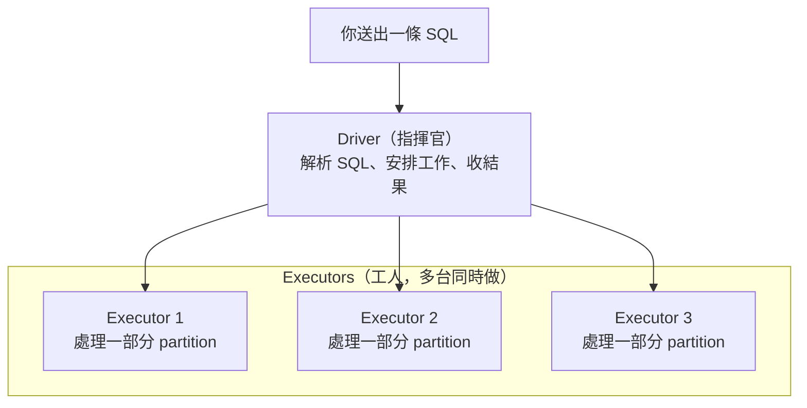
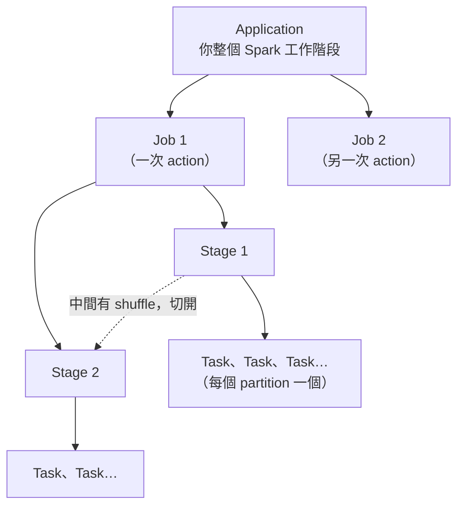
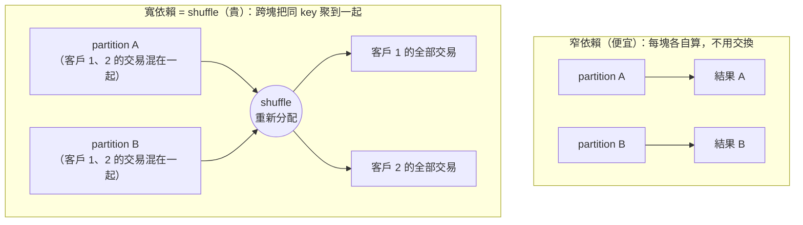

# 01 · Spark 怎麼跑你的 SQL

> **本章前提**：你會寫 SQL。不需要任何分散式系統或資料工程背景。
>
> 這一章不教你怎麼調優，而是先建立一個心智模型：你送出一條 SQL 後，Spark 在背後做了什麼、用了多少機器。後面每一章的建議，追根究柢都是在「讓 Spark 少做這個模型裡最貴的那件事，或把有限的機器用在刀口上」。

---

## 1.1 你的查詢，其實是一群機器一起做

當你在自己的筆電上對一個 CSV 跑 SQL，是一顆 CPU 從頭讀到尾。Spark 不是這樣。

你的資料表沒有放在一台機器上，而是被切成很多塊、散在叢集的多台機器上（存在 **HDFS**——叢集的分散式檔案系統，把大檔案切塊、分存到多台機器）。每一塊叫一個 **partition**。一張 3000 萬筆的信用卡帳務表，可能被切成幾百個 partition，每個 partition 幾十萬筆。

跑查詢時，叢集分成兩種角色：

- **Driver**：指揮官。它解析你的 SQL、安排工作、把結果收回來。只有一個。
- **Executor**：工人。實際讀 partition、做運算。有很多個、可以同時開工（嚴格說，executor 是跑在機器上的一支程式／行程，一台機器可能同時跑好幾個）。



> 在我們的 **CDP**（Cloudera 的大數據平台）叢集上，HDFS 負責存資料，**YARN**（叢集的資源管家）負責分配這些 executor 要用幾台、多大記憶體。第 04 章會談怎麼跟它要資源。

**為什麼這件事重要**：因為運算被切開平行做，所以「資料怎麼切、要不要在機器之間搬動、給你多少台機器」就決定了快慢——這是本手冊反覆出現的主軸。

---

## 1.2 Spark 不會馬上算：先攢計畫，再一次跑

第二個和單機 SQL 很不一樣的地方：你寫的查詢，Spark **不是讀到就算**。

像 `SELECT`、`WHERE`、`JOIN`、`GROUP BY` 這些，Spark 只是把它們記下來，攢成一份「待辦計畫」，先不動手。這叫 **lazy evaluation（延遲求值）**。

要等你做一件「真的要結果」的事，整份計畫才會一次跑起來。這種會觸發執行的動作叫 **action**，常見的有：

- 把結果存成一張表 / 寫成檔案
- 把結果撈回來看（例如 `collect`、或在 **Hue**——你平常打 SQL 的那個網頁工具——按下執行去顯示資料）
- 算總數 `count`

**為什麼這件事重要**：因為 Spark 看得到「整份計畫」才動手，它就有機會幫你優化——例如把 `WHERE` 條件提早、把用不到的欄位整段砍掉（下一節的優化器在做的事）。你寫 SQL 的方式會影響它能不能優化得動。

---

## 1.3 從 SQL 到一群 task：工作分成四層

當 action 觸發後（§1.2），你交給 Spark 的工作會由大到小分成四層。先把名字對齊——第 02 章用 Spark UI 找瓶頸時，畫面上看到的就是這四層：

- **Application（應用）**：你這一次連上 Spark 的整個工作階段（你的 SparkSession、一支程式、或一個 Hue 連線跑的所有東西）。一個 application 從頭到尾共用同一批 executor。
- **Job（作業）**：**每觸發一次 action，就產生一個 job**（絕大多數情況如此；極少數 action 會拆成多個 job，本手冊的批次情境幾乎不會遇到）。所以一段程式裡跑了三次 `count`、又寫了一次表，大致就是四個 job。
- **Stage（階段）**：一個 job 內，一段「不用在機器之間搬資料」就能連續做完的工作。**每遇到一次 shuffle（§1.5 會詳談），就切成下一個 stage。**
- **Task（任務）**：一個 stage 裡最小的工作單位。**一個 partition 對應一個 task**。100 個 partition 就是 100 個 task，由眾多 executor 分頭平行跑。



那這四層是怎麼從你的 SQL 變出來的？把鏡頭拉近到**一個 job 內部**：你的 SQL 會先被轉成計畫、優化，再切成這個 job 的 stage 與 task——下面這張流程圖畫的就是「上圖某一個 job 裡發生的事」。


- **Logical Plan / Physical Plan**：logical plan 是「你要的結果長什麼樣」，physical plan 是「實際照什麼步驟、用什麼方式去做」。你寫的 SQL 先變成前者，再被優化成後者。
- **Catalyst**：Spark 內建的查詢優化器，負責把 logical plan 改寫成更省的 physical plan（例如自動把過濾條件下推到讀檔階段）。你不用直接操作它，但你的寫法決定它能幫多少忙。

> **為什麼要在乎這四層？** 第 02 章你會在 Spark UI 看到 Job 列表，點進去看它由哪些 Stage 組成，再看每個 Stage 的 Task 時間分佈。「慢在哪一層」決定你往哪裡查。

---

## 1.4 兩種運算：自己算的（便宜）vs 要交換的（貴）

機器和分工講完了，回到「運算本身」。Spark 的運算可以粗分成兩類，差別在於**一塊資料能不能自己算完、還是得跟別塊交換**。

**窄依賴（narrow）—— 便宜**：每個 partition 自己算自己的，算完就好，不用看別的 partition。
例如 `WHERE amount > 1000`（過濾）、`SELECT col_a, col_b`（取欄位）、`amount * 1.05`（逐列計算）。100 個 partition 各做各的、互不打擾，這正是平行運算最舒服的情況。

**寬依賴（wide）—— 貴**：要把散在各 partition、但「同一個 key」的資料聚到一起，才算得出來。
例如 `GROUP BY cust_id`（同一客戶的交易可能散在每個 partition，得先聚過來）、`JOIN`（兩邊相同 join key 的列要碰頭）、`DISTINCT`、`ORDER BY`。

這個「把同 key 的資料跨機器重新分配」的動作，就是 **shuffle**。它就是 §1.3 說的「切 stage 的那一刀」。



---

## 1.5 為什麼 shuffle 是頭號敵人

用一個具體的例子體會「貴」到什麼程度。

假設你要算**每位客戶這個月刷了多少**：

```sql
SELECT cust_id, SUM(amount) AS total
FROM card_txn
WHERE month = '2026-05'
GROUP BY cust_id;
```

`card_txn` 一個月約 **3000 萬筆**，散在幾百個 partition 裡，而**同一位客戶的交易並不會剛好都在同一個 partition**——它們散落各處。要做 `GROUP BY cust_id`，Spark 必須把屬於同一個 `cust_id` 的所有交易搬到同一個地方才能加總。這個搬動分兩步：

1. **Shuffle write**：每個 task 把自己手上的資料按 `cust_id` 重新分組，**序列化後寫到本機磁碟**（序列化＝把資料轉成可傳輸的位元組）。
2. **Shuffle read**：負責某些客戶的 task，再從**其他機器跨網路**把屬於它的那些資料拉過來。

於是這 3000 萬筆資料，幾乎**每一筆都經歷了一次「序列化 → 落地磁碟 → 過網路」**。相較之下，前面的 `WHERE month = '2026-05'` 是窄依賴：每個 partition 各自篩掉不要的列，完全不搬資料，幾乎不花什麼成本。

差距的根源在於：**CPU 算數很快，但寫磁碟、過網路慢得多。** shuffle 把大量資料推去做這些慢事，所以它通常是一個查詢裡最花時間、也最容易出問題的環節。常見的兩種麻煩是：

- **記憶體不夠**：要搬、要聚的資料太多，記憶體塞不下，Spark 只好把一部分**溢寫到磁碟（spill，溢寫）**，又被磁碟拖慢一次。
- **資料傾斜（skew）**：某些 key 的資料量特別大，全擠到少數幾個 task，別的 task 都做完了還在等它一個（第 03 章會教怎麼處理）。

記住 spill 這個詞，下一節馬上會用到。

---

## 1.6 一個 executor 該多大？core、記憶體、台數的取捨

知道 shuffle 會 spill、磁碟很慢之後，就能談「該給每個工人配多少資源」了。一個 executor 由兩種資源組成：

- **Cores（核心數）**：一個 executor 有幾個 core，就能**同時跑幾個 task**。5 個 core 的 executor，一次做 5 個 task。
- **Memory（記憶體）**：這個 executor 上**所有同時在跑的 task 共用**的一塊記憶體。

於是「我的查詢有多平行」很好算：

> **同時能跑的 task 數 ＝ executor 台數 × 每台 core 數。**

例如 10 台 executor、每台 5 core，就是同時 50 個 task。若這個 stage 有 200 個 task，得分成大約 4 批（一批叫一個 wave）才跑得完。想更快，就要讓更多 task 能同時跑——加台數，或加每台的 core 數。

但「加 core」不是免費的，這帶出 executor 大小的取捨。假設 YARN 分給你的額度是**共 100 個 core、400 GB 記憶體**，你可以切成很多種形狀，兩個極端是：

| 切法 | 台數 × 每台 core × 每台記憶體 | 特性 |
|---|---|---|
| **胖 executor** | 5 台 × 20 core × 80 GB | 行程少、單台記憶體大 |
| **瘦 executor** | 20 台 × 5 core × 20 GB | 行程多、單台記憶體小 |

關鍵在於**記憶體是被同一台上並行的 task 分掉的**。直覺一下：胖的那台 80 GB 給 20 個並行 task，平均一個 task 約 4 GB；core 開越多，這個「平均每個 task 能用的記憶體」就被切越細，越容易 spill（上一節那個拖慢速度的溢寫）。

兩種極端各有代價：

- **太胖**（每台塞太多 core）：①一次跑 20 個 task **搶同一份記憶體**，平均每個能用的變少，容易 spill 到磁碟；②一台同時對 HDFS（§1.1 的分散式檔案系統）開太多讀取，**吞吐反而卡住**；③記憶體配到非常大時，系統在背景整理／回收記憶體（稱為 GC，垃圾回收）時，偶爾會讓那台短暫卡一下；④一台掛掉，一次損失 20 個 task 的進度。
- **太瘦**（每台 core 太少）：①每台 executor 都要額外保留一塊「管理用」記憶體（overhead，約佔該台記憶體的一成），台數越多、被它吃掉的總量越多；②廣播出去的小表（第 03 章會講）要**每台各複製一份**，台數越多、總記憶體花得越凶。

所以實務上常見的起手建議是**每台 executor 抓大約 4～5 個 core**（在 HDFS 吞吐與管理開銷之間取平衡），記憶體則抓到「讓同時在跑的 task 各自夠用、不要一直 spill」為原則。

> 這裡先有直覺就好。**怎麼在 CDP/YARN 上把這些值實際設下去、怎麼用 dynamic allocation 隨需求伸縮而不佔著資源餓死同事，第 04 章詳談。** 而且你會發現：很多時候與其糾結這些數字，不如先照第 03 章把 SQL 寫法和統計弄對，省下來的更多。

---

## 1.7 一句話帶走：優化＝少搬、少讀、用對機器

把這章收斂成一條主軸，後面所有技巧都掛在它底下：

> **讓 Spark 少搬資料（減少或減輕 shuffle）、少讀資料（只讀真正需要的 partition 與欄位），並把有限的 executor 用在刀口上。**

接下來：

- 你怎麼**知道**自己的查詢卡在 shuffle、卡在讀太多、還是卡在某個 task（資料傾斜）？→ 第 02 章用 Spark UI 看。
- 怎麼**改 SQL** 來少搬少讀？→ 第 03 章。
- 哪些 **Spark 設定**值得調？Spark 3.3 內建一個叫 **AQE**（Adaptive Query Execution）的機制，會在查詢跑的途中**自動調整執行計畫**、幫你處理掉不少 shuffle 與傾斜問題；第 04 章會說它已經自動做了什麼、以及 §1.6 那些 executor 資源該怎麼實際設、還剩什麼值得手動調。
- 怎麼從**資料儲存**端就讓查詢少讀？→ 第 05 章。

---

*下一章 →* [02 · 用 Spark UI 找瓶頸](02-diagnose-with-spark-ui.md)　|　*回* [手冊首頁](index.md)
