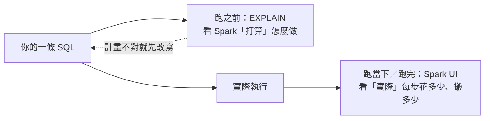
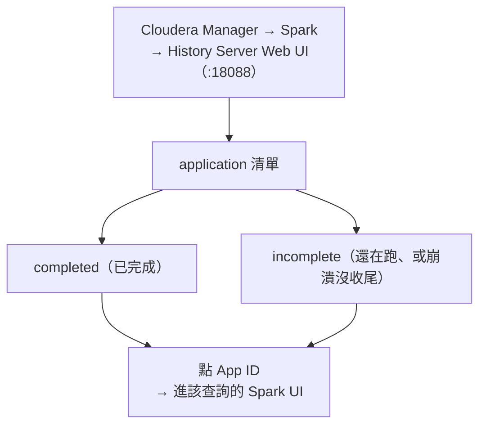
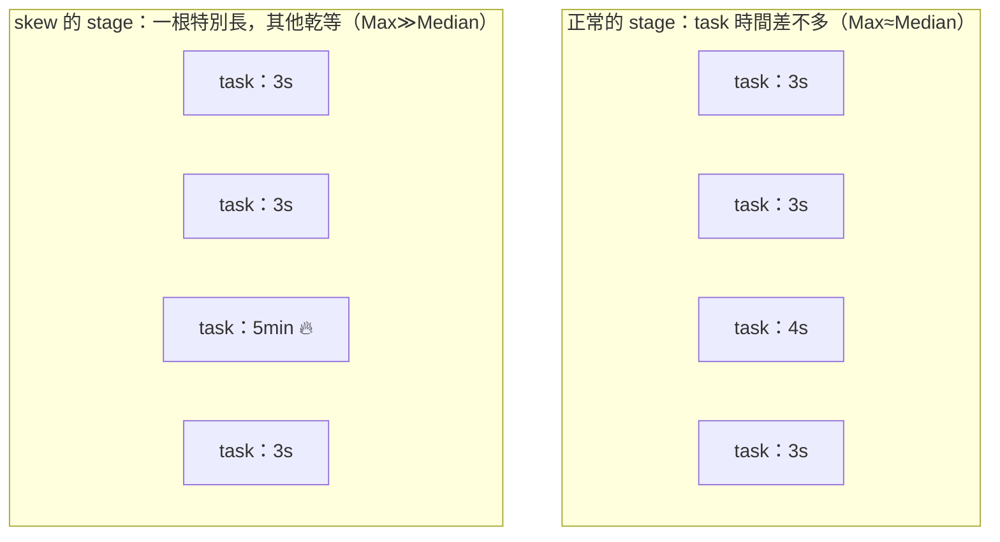

# 02 · 用 Spark UI 找瓶頸（手把手診斷）

> **本章前提**：你讀過[第 01 章](01-how-spark-runs-your-sql.md)，對 partition、shuffle、stage、task、spill、skew、executor 已經有心智模型；你會寫 SQL。
>
> 第 01 章告訴你「一條 SQL 在叢集裡會發生什麼、為什麼 shuffle 最貴」。但你怎麼**知道**自己手上這條查詢到底卡在哪？這一章是一本**操作手冊**：帶你一個頁籤一個頁籤地讀 Spark UI（Spark 內建的網頁監控介面）——**畫面顯示什麼 → 正常還是異常 → 代表哪個問題 → 該翻到第幾章去修**。讀完你能照著做：對自己的 SQL、Spark 設定、寫表邏輯，看 UI 找出問題、再到對應章節下手。
>
> **本章的分工（很重要）**：第 02 章只負責**「看出問題、指對方向」**——把症狀讀出來，然後告訴你去[第 03 章（SQL 寫法）](03-sql-tuning.md)／[第 04 章（Spark 設定）](04-spark-config.md)／[第 05 章（儲存）](05-storage-efficiency.md)的哪一節修。**怎麼修是那三章的事，本章不重講**，免得重複、也讓你一條路走到底。
>
> 每節末附 📚 **來源**；章末「資料來源與精確度說明」列出哪些是刻意簡化、或工具沒能逐字查證的地方。

---

## 2.1 先量再調，不要憑感覺

新手最常犯的錯，是查詢一慢就開始亂槍打鳥：把記憶體調大、把 `spark.sql.shuffle.partitions` 改一改、到處加 hint（提示語法，告訴 Spark 該怎麼做某件事，第 03 章會講）。多數時候沒效，因為**沒先搞清楚到底慢在哪**。一條查詢可能慢在掃了太多資料、慢在某個 shuffle、慢在一個被 skew 拖住的肥 task——病因不同，藥也不同。**先量，再調。**

「量」有兩個時機、兩個工具：

- **跑之前——`EXPLAIN`**：不真的執行，只請 Spark 把「它打算怎麼做」這份計畫印出來給你看。幾秒就有結果，適合在送出大查詢前先檢查「我以為會發生的優化，真的有發生嗎」（例如該裁掉的月份有沒有被裁掉、小表有沒有走 broadcast）。
- **跑當下／跑完——Spark UI**：查詢實際執行時，Spark 把每個 stage、每個 task 花了多久、搬了多少資料、spill 了沒，全部記錄下來，用一個網頁介面呈現。這是「事後完整診斷」也是「現場監看」，告訴你計畫**實際**跑起來的數字。



兩個工具互補：`EXPLAIN` 看「計畫對不對」（便宜、快），Spark UI 看「實際貴在哪」（要真的跑一遍）。本章其餘部分就是這兩樣的操作手冊：§2.2 教怎麼進去、§2.3 教 `EXPLAIN`、§2.4–§2.8 一個頁籤一個頁籤帶你讀畫面、§2.9–§2.11 收成查表、checklist、和一個完整診斷。

> **怎麼用本章**：遇到問題時你**不必從頭讀**。先看 §2.9 的「症狀 → 面板 → 章」總表對號入座，再回到對應頁籤那節看細節；或直接照 §2.10 的三張 checklist 逐項打勾。第一次讀建議照順序走一遍，建立「哪個畫面看哪件事」的地圖。

> 📚 **來源**：`EXPLAIN` 用於檢視查詢計畫、Spark Web UI 用於監看執行，兩者定位見 [Spark SQL EXPLAIN 語法](https://spark.apache.org/docs/latest/sql-ref-syntax-qry-explain.html) 與 [Spark Monitoring and Instrumentation](https://spark.apache.org/docs/latest/monitoring.html)。「先量再調」是效能調校的通則，亦見《Spark: The Definitive Guide》Ch.18–19。

---

## 2.2 怎麼打開 Spark UI（在 CDP 上）

Spark UI 不是另外一個程式，而是每次跑 Spark 時它附帶的一個網頁。在 CDP 上，不論你的查詢**還在跑**還是**已經跑完**，都從同一個地方進去：**Spark History Server**。進去的方式：

1. 打開 **Cloudera Manager**（你們平台的管理介面）→ 點 **Spark** 服務 → 點 **History Server Web UI** 連結；
2. 或直接開 `http://<history-server-host>:18088`（這個 URL 不知道就**問 IT**，或從你平常用的 **Hue 作業／查詢頁**點過去——Hue 通常有連到該作業 Spark UI 的入口）。

> 你以前可能只在 **Hue** 裡看查詢結果、沒進過 History Server。第一次進去確實多一道門檻：拿不到那個網址就直接問 IT 是哪台、什麼 port，不用自己猜。

進去會看到一張 application 清單，分成兩種：

- **completed（已完成）**：已經跑完的查詢。
- **incomplete（未完成）**：**還在跑的查詢也在這裡**——所以你不必等它跑完，就能即時點進去看它現在卡在哪。（嚴格說，incomplete 是「還沒把自己標記成完成」的；所以萬一某個查詢中途崩潰、沒正常收尾，也會留在這個清單。）

清單畫面大致長這樣（**示意數字**，欄位順序依平台略有差異）：

```text
Spark History Server — Applications（示意）
App ID                              Name                    User    Started              Completed            Duration   Status
application_1700000000000_12345     insert mart_txn_summary alice   2026-05-20 02:13:—   (still running)      —          incomplete  ← 還在跑的也在這
application_1700000000000_12344     daily feature build     alice   2026-05-20 01:40:00  2026-05-20 02:02:11  22 min     completed
application_1700000000000_12301     adhoc segment query     bob     2026-05-19 16:30:05  2026-05-19 16:34:48  4.7 min    completed
```

點你那次查詢的 **App ID**（格式像 `application_1700000000000_12345`）就進到它的 Spark UI。清單上要認出哪個是你的，靠你的**使用者名稱（User）、送出時間（Started）、作業名稱（Name）**——在自己的畫面上對得起這幾欄，就找到了。

> **清單裡找不到你的 application？** 多半是 `spark.eventLog.enabled` 沒開（History Server 就沒有記錄可重建），或記錄還沒 flush 出來（剛跑完幾秒內可能還沒寫完）。重整一下還是沒有，就**找 IT 確認 event log 有沒有開**。

有兩個前提、一個延遲要知道：

- History Server 能事後（或執行中）重建這個 UI，是因為 Spark 邊跑邊把畫面要顯示的資訊寫成「事件記錄」（event log，寫到硬碟、之後還讀得到；**CDP 預設開著**）。
- **（進階／細節，可跳）** History Server 是**每隔一段時間**（預設約 **10 秒**，由 `spark.history.fs.update.interval` 控制）才去掃一次這些記錄、更新畫面。所以看「還在跑」的查詢時，畫面會比真實進度**慢個幾秒到十幾秒**、資訊也隨它跑而逐步長出來——這是正常的，重整一下即可。



> **對營運的意義**：排程作業（第 07 章）通常半夜自己跑，你早上來看時它早結束了——History Server 把跑過的作業都留著，讓你回頭翻。它還讓你比較「同一支作業這週和上週各跑多久、搬了多少資料」，及早發現作業隨資料長大而退化（第 07 章監控會再談）。

> 📚 **來源**：History Server「列出 incomplete 與 completed 的 application」、incomplete 只間歇更新（間隔即 `spark.history.fs.update.interval`，預設 `10s`）、「未把自己標記完成的 application（含崩潰者）會列為 incomplete」、以及需 `spark.eventLog.enabled`，見 [Spark Monitoring](https://spark.apache.org/docs/latest/monitoring.html)。CDP 上經 Cloudera Manager → Spark → History Server Web UI（或 `:18088`）、點 App ID 看 application，見 [Cloudera CDP 7.1.9：Accessing the Web UI of a Completed Spark Application](https://docs.cloudera.com/cdp-private-cloud-base/7.1.9/monitoring-and-diagnostics/topics/cm-accessing-the-web-ui-of-a-completed-spark-application.html)。

---

## 2.3 跑之前先看計畫：`EXPLAIN`

`EXPLAIN` 把 Spark「打算怎麼執行這條 SQL」的計畫印出來，但**不真的跑**。對 SQL-first 的人，這是花費最低的診斷：在送出一個會跑很久的大查詢前，先花幾秒確認計畫沒走歪。

用法就是在你的查詢前面加一個字：

```sql
EXPLAIN FORMATTED
SELECT c.segment, SUM(t.amount) AS total
FROM card_txn t
JOIN dim_customer c ON t.cust_id = c.cust_id
WHERE t.month = '2026-05'
GROUP BY c.segment;
```

`EXPLAIN` 有幾種模式，差別在印多細：預設（不加字）只印**實際執行步驟**（physical plan）；`FORMATTED` 額外把每個步驟的細節分區整理、最好讀；另有 `EXTENDED`（連邏輯計畫一起印）、`COST`（附統計估算）、`CODEGEN`（印產生的程式碼）。**日常診斷用 `EXPLAIN FORMATTED` 就夠。**

跑出來大致長這樣（**以下為簡化示意數字**，實際排版以你環境為準，由下往上讀）：

```text
== Physical Plan ==
HashAggregate(keys=[segment], functions=[sum(amount)])     ← GROUP BY 的加總
+- Exchange hashpartitioning(segment, 200)                 ← ★ 一次 shuffle（為了 GROUP BY）
   +- BroadcastHashJoin [cust_id]                          ← ★ 走廣播 join、不為 join 做 shuffle
      :- Filter (month = '2026-05')
      :  +- Scan parquet card_txn
      :        PartitionFilters: [month = '2026-05']        ← ★ 有裁到月份，不掃別的月
      +- BroadcastExchange                                  ← 把小表 dim_customer 廣播出去
         +- Scan parquet dim_customer
```

讀計畫時，你不必看懂每一行，**只要會找三個關鍵字**（它們直接對應第 01 章學過的成本來源，上面用 ★ 標出來了）。**（以下逐行解釋屬進階／細節，趕時間可只記三個關鍵字、跳過細部說明。）**

- **`Exchange`**：`Exchange hashpartitioning(...)` 這種就是一次 **shuffle**（§1.5 的跨機器重分配）。數一數有幾個，就知道這條查詢有幾次 shuffle——這通常是最大成本。上面那條查詢的 `GROUP BY` 造成了一個。（注意：計畫裡還會看到 `BroadcastExchange`，那是「把小表廣播出去」用的、**不是** shuffle，別把它算進 shuffle 次數。）
- **`BroadcastHashJoin` vs `SortMergeJoin`**：兩種 join 的實作方式。`BroadcastHashJoin` 表示 Spark 決定把一邊的小表廣播出去、**不為 join 做 shuffle**（便宜，§1.8 提過）；`SortMergeJoin` 表示兩邊都要 shuffle 再排序合併（大表對大表時的做法）。如果你**以為**某個小表會被廣播、計畫裡卻是 `SortMergeJoin`，那就是個警訊（去 [§3.5／§3.6](03-sql-tuning.md#35-少搬一join-策略broadcast-vs-sort-merge) 看怎麼處理）。
- **`Scan` 那行的 `PartitionFilters` 與 `PushedFilters`**：`PartitionFilters` 列出哪些 `WHERE` 條件被用來**只讀需要的分區目錄**（partition 裁剪，§1.8）；`PushedFilters` 是被下推到讀檔層、提早篩掉資料的條件。你下了 `WHERE month = '2026-05'`，就該在這裡看到 `month` 出現——**沒出現，代表它沒裁到、整張表都會被掃**（去 [§3.2／§3.4](03-sql-tuning.md#32-少讀一只掃需要的分區partition-裁剪) 看為什麼失效）。

> **一個陷阱**：`EXPLAIN` 顯示**有** `PartitionFilters`，不代表實際就只讀了那些分區。如果跑起來後 Stages 頁的 `Input Size`（§2.6）仍然很大、像整表掃，可能是**表的統計過期**、或**動態分區裁剪沒生效**。計畫上「看起來有裁」只是意圖，**最後以 Stages 頁的實際 Input 數字為準**（統計怎麼維護 → 第 05 章）。

換句話說：`EXPLAIN` 讓你在花大錢執行前，先核對「我期待的省錢手段（少 shuffle、走 broadcast、裁掉分區）到底有沒有出現在計畫裡」。**真正的執行數字（搬了幾 GB、哪個 task 拖到 9 分鐘）`EXPLAIN` 不會給你**——那要等它跑起來、去看下面幾個 UI 頁籤。

> 📚 **來源**：`EXPLAIN` 語法 `EXPLAIN [ EXTENDED | CODEGEN | COST | FORMATTED ]`、`FORMATTED` 產出「physical plan outline + node details」兩段，已逐字查證自 [Spark SQL EXPLAIN 語法](https://spark.apache.org/docs/latest/sql-ref-syntax-qry-explain.html)。`Exchange`＝shuffle、`BroadcastHashJoin`/`SortMergeJoin` 為 join 物理算子、Scan 的 partition pruning，見《Spark: The Definitive Guide》Ch.8（Joins）、Ch.15、與 [Spark SQL Performance Tuning](https://spark.apache.org/docs/latest/sql-performance-tuning.html)。⚠️ 上面的 plan 是簡化示意（非逐字輸出）：官方 EXPLAIN 範例只示範到 `Exchange`/`HashAggregate`/`Scan`，`PartitionFilters`/`PushedFilters`/join 算子字樣以你環境跑出來為準（見章末精確度說明）。

---

## 2.4 Jobs 頁籤：先掃一眼有沒有失敗、誰最慢

進到一個 application 的 Spark UI，**第一個落腳點是 Jobs 頁籤**——它是概覽，回答「這次跑觸發了哪些 job、各花多久、有沒有出事」。一個 application（例如你一條 `INSERT ... SELECT`）可能拆成好幾個 job，Jobs 頁把它們列成一張表。

**這個頁籤顯示什麼**（已查證的欄位）：每個 job 一列，有 **Job ID、Description（點進去看細節）、Submitted（送出時間）、Duration（花多久）、Stages（成功/總數）、Tasks（進度條）、Status（Active／Completed／Failed）**。點進某個 job，還會看到它的 stage 清單，每個 stage 標 **Input**（從儲存讀進的位元組）、**Output**（寫出的位元組）、**Shuffle Read／Shuffle Write**（shuffle 搬進/搬出的量）。

**正常 vs 異常長什麼樣**（mock 概覽，**示意數字**）：

```text
Jobs（示意）
Job ID  Description                       Duration   Stages   Tasks(progress)        Status
  3     insert into mart_txn_summary …    18 min     2/3      ▓▓▓▓▓░░ 410/600        RUNNING
  2     save dim_customer broadcast …      4 s       1/1      ▓▓▓▓▓▓▓ 1/1            SUCCEEDED
  1     load card_txn …                   2.1 min    1/1      ▓▓▓▓▓▓▓ 240/240        SUCCEEDED
  0     load dim_customer …               3 s        1/1      ▓▓▓▓▓▓▓ 8/8            FAILED ✗   ← 看這裡
```

- **正常**：Status 都是 SUCCEEDED、Duration 跟你印象差不多、Stages 都做完（如 `1/1`）。
- **異常的招牌**：
  - 出現 **FAILED**（紅色）——有 job 掛了。在排程情境，整支作業常因此 retry 或失敗，**這是第一個要點開的**。
  - 某個 job **Duration 特別長**（上面 Job 3 跑 18 分鐘還在 RUNNING）——它就是這次的主嫌，點 Description 進去往下追。
  - Stages 卡在 `2/3` 半天不動、Tasks 進度條長期停在某個百分比——通常下游某個 stage 被 skew 或 spill 拖住。

**代表哪個問題、去哪修**：Jobs 頁本身**只負責定位**——告訴你「哪個 job、哪個 stage 最該查」，它不直接給你病因。

- 看到 **FAILED**：點進去看 stage/task 的錯誤訊息。若是 `OutOfMemoryError`／executor lost，多半是記憶體相對資料量太小（資源面 → [第 04 章](04-spark-config.md)）或單批處理量太大（寫法面 → [第 03 章](03-sql-tuning.md)）。
- 看到**某 job 特別慢**：記住它是哪個 job、含哪幾個 stage，接著**往 SQL 頁籤（§2.5）找最貴的算子**，再到 **Stages 頁籤（§2.6）**看那個 stage 的 task 細節。

> 一句話：Jobs 頁是**分流台**——掃失敗、挑最慢的那個 job，然後把問題交給 SQL / Stages 頁去細看。

> 📚 **來源**：Jobs 頁的 summary 欄位（Job ID／Description／Submitted／Duration／Stages／Tasks progress／Status）與 job detail 裡每個 stage 的 Input／Output／Shuffle read／Shuffle write 定義（如 Shuffle read＝"includes both data read locally and data read from remote executors"），已查證自 [Spark Web UI（Jobs Tab）](https://spark.apache.org/docs/latest/web-ui.html)。

---

## 2.5 SQL／DataFrame 頁籤：這條查詢花在哪一步

SQL 頁籤是 SQL-first 的人**最該細看**的地方。**怎麼進去**：在 Spark UI 上方的頁籤列點 **`SQL / DataFrame`**，會列出這個 application 跑過的每一條 query，點你那條進去看它的流程圖。

點進去會看到一張**查詢執行的流程圖（DAG，有向無環圖，把這條查詢拆成一張一步接一步、不會繞回頭的工作流程圖）**——把第 01 章那種 stage 圖畫出來，每個方塊是一個算子（你會看到 `Scan`＝讀檔、`Filter`＝過濾、`Exchange`＝shuffle、`HashAggregate`＝做 `GROUP BY` 的聚合、`BroadcastHashJoin`／`SortMergeJoin`＝兩種 join 等），方塊上還掛著**實際跑出來的數字**。`EXPLAIN` 給你「計畫」，這張圖給你「計畫實際跑起來搬了多少」。

**這個頁籤最該看的兩格數字**：

- **算子上的 `number of output rows`（輸出列數）**：掛在大多數算子上（例如某個算子方塊寫著 `number of output rows: 30,000,000`）。它告訴你「資料量在這條查詢裡怎麼變化」。例如某個 `Filter` 之後列數從 3000 萬掉到 3 萬，很正常；但若某個 `Join` 之後列數**暴增**（輸入 3000 萬、輸出爆成 3 億），那多半是一對多、甚至接近笛卡兒積的爆量 join。
- **`Exchange` 方塊上的 shuffle 量**（官方 metric：`shuffle bytes written`／`shuffle records written`／`data size`）：每個 `Exchange`（§2.3 說的 shuffle）會顯示它搬了多少資料（例如某個 Exchange 上寫著 `shuffle bytes written total: 12.4 GB`）。**這是你找「最貴 shuffle」的直接依據**——哪個 Exchange 的位元組最大，那就是這條查詢的主要成本所在。

**正常 vs 異常長什麼樣**（mock DAG 標註，**示意數字**）：

```text
SQL 頁籤的 query DAG（示意，由下往上）

  HashAggregate                                正常：GROUP BY 收斂
   number of output rows: 8           ← 收成 8 個客群，合理
     │
  Exchange  (hashpartitioning)                 ★ 最貴的一步！
   shuffle bytes written total: 12.4 GB ← 異常大：主要成本在這次 shuffle
     │
  SortMergeJoin  [cust_id]                     ⚠ 你以為會 broadcast，卻是 SortMerge
   number of output rows: 31,200,000   ← 跟輸入差不多，沒爆量（排除一對多）
     ├── Scan card_txn                         輸入：3,000 萬列、月份已裁
     └── Scan dim_customer                     小表（本該被廣播）
```

- **正常**：`Filter`/`Aggregate` 後列數合理收斂；該 broadcast 的小表算子是 `BroadcastHashJoin`；最大的 Exchange 位元組落在你預期的那次 shuffle。
- **異常的招牌**：
  - 某 `Exchange` 的 shuffle bytes 特別大（上圖 12.4 GB）→ **shuffle 過大**，主要成本在搬資料。
  - 該被廣播的小表卻顯示 **`SortMergeJoin`**（上圖）→ **broadcast 沒生效**，白白多一次 shuffle。
  - 某 `Join` 的 `number of output rows` ≫ 輸入 → **爆量 join**。

**代表哪個問題、去哪修**：

| 在 SQL 頁看到 | 代表 | 去哪修 |
|---|---|---|
| 某 `Exchange` 的 shuffle bytes 特別大 | shuffle 過大 | [§3.5 join 策略](03-sql-tuning.md#35-少搬一join-策略broadcast-vs-sort-merge)、[§3.8 聚合](03-sql-tuning.md#38-少搬四聚合的成本group-bydistinctcountdistinct)（先聚合再 join、少 `DISTINCT`） |
| 小表處是 `SortMergeJoin`（非 `BroadcastHashJoin`） | broadcast 沒生效 | [§3.6 手動 BROADCAST hint](03-sql-tuning.md#36-少搬二手動--broadcastt-何時該自己出手)；門檻值 → [§4.4](04-spark-config.md#44-aqe-之後還值得手動懂的少數-sql-旋鈕) |
| `Join` 的 `number of output rows` ≫ 輸入 | 爆量 join | [§3.7 join 陷阱](03-sql-tuning.md#37-少搬三join-的兩個隱藏陷阱key-型別不一致爆量-join) |
| 讀檔算子輸入列數遠大於你以為的量 | 掃太多 | [§3.2 partition 裁剪](03-sql-tuning.md#32-少讀一只掃需要的分區partition-裁剪)、[§3.3 別 SELECT *](03-sql-tuning.md#33-少讀二只取需要的欄位別-select-) |

鎖定最貴的那一步後，**記住它落在哪個 stage**，再去 Stages 頁籤（§2.6）查那個 stage 的 task 是不是 skew／spill。

> **AQE 的計畫在這裡才看得到最終版**：第 01 章說過 Spark 3.3 的 AQE 會在執行途中調整計畫（例如把過多的 shuffle 分區合併、把 sort-merge join 改成 broadcast）。用了 AQE 的查詢，計畫的根節點會標成 **`AdaptiveSparkPlan`**，帶一個 **`isFinalPlan`** 旗標：`EXPLAIN`（§2.3，跑之前、不真的執行）永遠看到 `isFinalPlan=false`，那是**還沒被 AQE 改過**的初始計畫；要等查詢實際跑完、旗標變成 `isFinalPlan=true`，才是真正執行的最終計畫——只在 SQL 頁籤這張圖（跑完之後）看得到。所以 `EXPLAIN` 和 SQL 頁兩邊對不起來是正常的，**以 SQL 頁籤為準**。（AQE 自動幫你做了哪些事、怎麼確認它開著 → [第 04 章](04-spark-config.md#42-aqe-自動幫你做的三件事)。）

> 📚 **來源**：SQL 頁的 query detail 顯示執行時間、關聯 jobs、與「query execution DAG」（每算子掛 metrics）；`number of output rows`＝"the number of output rows of the operator"、Exchange 區塊顯示 "number of written shuffle records, total data size, etc."，已查證自 [Spark Web UI（SQL Tab）](https://spark.apache.org/docs/latest/web-ui.html)。AQE 於執行期把 sort-merge join 轉 broadcast、合併分區、處理 skew，見 [Spark SQL Performance Tuning（AQE）](https://spark.apache.org/docs/latest/sql-performance-tuning.html)；`AdaptiveSparkPlan`／`isFinalPlan` 字樣官方主文未逐字載明，佐證見 [Databricks：Adaptive Query Execution](https://docs.databricks.com/aws/en/optimizations/aqe)（Spark 核心團隊撰）與 [SPARK-33850](https://issues.apache.org/jira/browse/SPARK-33850)（見章末精確度說明）。

---

## 2.6 Stages 頁籤：這個 stage 是 skew 還是 spill

從 SQL 頁鎖定了最貴的那個 stage，就到 Stages 頁籤點進它。這頁的精華是一張 **「Summary Metrics」摘要表**：它不把每個 task 都列出來（一個 stage 動輒幾百個 task），而是用**分位數**幫你看分佈。

**（分位數的定義屬進階／細節，已懂可跳。）** 分位數的意思：把這個 stage 的所有 task 依某個指標**從小排到大**，再挑五個代表點——**Min**＝最小（最快）、**25th percentile**＝排在四分之一處、**Median（中位數）**＝正中間、**75th percentile**＝四分之三處、**Max**＝最大（最慢）。每個指標（task 時間、讀取量、spill 量…）都列這五格。

**這個頁籤怎麼讀出第 01 章的兩個敵人**：

### 認 skew（資料傾斜）——看 Max 和 Median 差多少

對 **`Duration`**（task 花的時間）這一列，如果 Median 是 12 秒、Max 卻是 9 分鐘，代表大多數 task 十幾秒就做完、卻有少數 task 跑了九分鐘——這就是 §1.6 講的 skew：某些 key 的資料特別多、全擠到少數 task，其他人做完只能乾等它（stage barrier）。**Max ≫ Median 就是 skew 的招牌訊號。** 同樣的差距也會出現在 **`Shuffle Read Size / Records`**（那幾個肥 task 讀進來的量遠大於別人）和 **`Input Size / Records`**（讀檔 stage 的肥 task）。

> **是「新出現的 skew」還是「一直都有、只是資料量長大才被觸發」？** 這對排程作業很關鍵。同一支作業翻出**前幾週的 run**、比對 `Duration`／`Shuffle Read` 的 Max 對 Median 的差距：差距一直都在、只是這週數字整體變大，多半是某個熱點 key 隨資料成長被放大；差距是這週才突然拉開，則可能是上游資料分佈變了或某個 key 暴量。怎麼定位惡化的起始 run，見本章末「進階：漸進退化」。

### 認 spill（記憶體不足落磁碟）——看有沒有非零的 spill

表裡有兩列：**`Shuffle spill (memory)`** 和 **`Shuffle spill (disk)`**。記一句就好：**只要這兩個數字非零，就代表這個 stage 的記憶體不夠用、把資料溢寫到磁碟了**（§1.6 的 spill，雪上加霜的那次額外磁碟 I/O）。spill 越多，這個 stage 越慢。看到它就知道問題是「要同時處理的資料相對可用記憶體太大」。

> **為什麼 `Spill (memory)` 常比 `Spill (disk)` 大？看起來反直覺。** 因為兩者量的是**同一批溢寫資料的兩種形態**：`Spill (memory)` 是那批資料在記憶體中**反序列化（攤開）**的大小，`Spill (disk)` 是它落到磁碟時**序列化（壓緊）**的大小。同一批資料序列化後較小，所以 memory 那個數字通常較大。**兩個都是「記憶體不夠、發生了溢寫」的訊號**，不要因為 disk 數字較小就以為沒事。

**正常 vs 異常長什麼樣**——一個出問題的 stage，Summary Metrics 表大概長這樣（**數字為示意**）：

| 指標 | Min | 25th pct | Median | 75th pct | Max |
|---|---|---|---|---|---|
| **Duration**（task 花的時間） | 8 s | 11 s | 12 s | 14 s | **9.2 min** |
| **Input Size / Records**（讀進多少） | 240 MB | 250 MB | 260 MB | 290 MB | **6.1 GB** |
| **Shuffle Read Size / Records** | 230 MB | 245 MB | 255 MB | 280 MB | **5.9 GB** |
| **Shuffle spill (memory)** | 0 | 0 | 0 | 0 | **14 GB** |
| **Shuffle spill (disk)** | 0 | 0 | 0 | 0 | **8.3 GB** |



這張表一眼看出兩件事：① `Duration` 的 Max（9.2 分）和讀取量的 Max（6 GB 級）都**遠大於** Median（12 秒、260 MB 級）——絕大多數 task 十幾秒、讀 260 MB 就做完，卻有個 task 讀了 6 GB、跑了 9 分多 → **skew**；② 那個肥 task `spill` 了 8.3 GB 到磁碟（memory 形式 14 GB）→ 記憶體被它撐爆。對照健康狀態：五格應該彼此接近（如上圖左、各 task 都 3 秒上下），Max 不會比 Median 大上一個量級。

**代表哪個問題、去哪修**：

| 在 Stages 頁看到 | 代表 | 去哪修 |
|---|---|---|
| `Duration` / `Shuffle Read` 的 Max ≫ Median | skew | [§3.10 處理 skew](03-sql-tuning.md#310-少搬六處理-skew資料傾斜)（`salting` 等手法 §3.10 會講）；AQE skew join → [§4.2](04-spark-config.md#42-aqe-自動幫你做的三件事) |
| `Shuffle spill (memory/disk)` 非零 | 記憶體相對資料太小 | 寫法減量 → [第 03 章](03-sql-tuning.md)；分區數／executor 記憶體 → [§4.4](04-spark-config.md#44-aqe-之後還值得手動懂的少數-sql-旋鈕)、[§4.5](04-spark-config.md#45-一個-executor-的記憶體裡裝了什麼executionstorageoverhead) |
| `Input Size` 的 Max 異常大、或整體掃量遠大於預期 | 掃太多／沒裁分區 | [§3.2 partition 裁剪](03-sql-tuning.md#32-少讀一只掃需要的分區partition-裁剪)；partition 設計 → [§5.4](05-storage-efficiency.md#54-設計-partition選對欄位但別過度分割) |
| task 數異常多、每個 `Input` 都很小 | 小檔太多 | [§5.5 管好檔案大小](05-storage-efficiency.md#55-管好檔案大小小碎檔問題成因徵兆解法) |

> 📚 **來源**：Stages 頁的 Summary Metrics 以表格＋timeline 呈現各 task 指標（官方原文 "Summary metrics for all task are represented in a table and in a timeline"）；`Shuffle spill (memory)`＝"the size of the deserialized form of the shuffled data in memory"、`Shuffle spill (disk)`＝"the size of the serialized form of the data on disk"、`Shuffle Read Size / Records`＝"Total shuffle bytes read, includes both data read locally and data read from remote executors"，已逐字查證自 [Spark Web UI（Stage detail）](https://spark.apache.org/docs/latest/web-ui.html)。`Input Size / Records`＝從 Hadoop/Spark storage 讀入的 bytes 與 records（inputMetrics）。⚠️ 五分位列標（Min / 25th percentile / Median / 75th percentile / Max）為 Stage Summary Metrics 標準呈現、web-ui 主文未逐字列出（見章末）。skew 概念見 §1.6 與《Spark: The Definitive Guide》Ch.15。

---

## 2.7 Executors 頁籤：資源夠不夠、誰在喊累

前面三節定位的是「哪條查詢、哪個 stage、哪個 task」；Executors 頁籤換個角度，回答**「我這次實際拿到幾台 executor、各自記憶體夠不夠、誰累得在重試或一直 GC」**。對排程作業尤其有用——它讓你看出「是 SQL 寫法的問題，還是資源根本配太少」。

**這個頁籤顯示什麼**（已查證的欄位）：每個 executor 一列，含 **Cores**、**Active Tasks**（正在跑幾個）、**Failed Tasks**（失敗幾個）、**Complete Tasks**、**Task Time**（累計工時）、**Input**、**Shuffle Read / Shuffle Write**、**GC Time**（JVM 垃圾回收累計時間）、**Storage Memory**（"the amount of memory used and reserved for caching data"，cache 佔用）、**Disk Used**。最上面還有一列彙總。

**正常 vs 異常長什麼樣**（mock，**示意數字**）：

```text
Executors（示意）
Executor  Cores  Active  Failed  Complete  Task Time  Shuffle Read  GC Time   Storage Mem
 driver     -      0       0        -          -           -            -       0 / 0 B
   1        4      4       0       1,180      42 min       3.1 GB      48 s     0 / 8 GB
   2        4      4       7       1,090      40 min       3.0 GB     4.2 min ← 異常        0 / 8 GB
   3        4      4       0       1,205      41 min       3.2 GB      51 s     0 / 8 GB
```

- **正常**：Failed Tasks 多為 0；GC Time 相對 Task Time 是個小零頭（如 48 秒 / 42 分鐘）；各 executor 的 Task Time、Shuffle Read 差不多。
- **異常的招牌**：
  - **Failed Tasks 持續長大**（上面 Executor 2 失敗 7 次）→ 那台一直在重試，常伴隨 OOM／executor lost。
  - **GC Time 佔 Task Time 很大比例**（上面 4.2 分 / 40 分 ≈ 10%，紅色警訊）→ JVM 一直在回收記憶體、實際算的時間被吃掉，多半是記憶體吃緊。
  - **只拿到很少 executor**（例如你以為有 20 台、實際只有 2 台）→ 資源沒配到或被多租戶搶走，整體就是慢但每個 task 看起來正常。

**代表哪個問題、去哪修**：

| 在 Executors 頁看到 | 代表 | 去哪修 |
|---|---|---|
| Failed Tasks 一直長大、伴隨 OOM | 單批量太大或記憶體太小 | 寫法減量 → [第 03 章](03-sql-tuning.md)；executor 記憶體 → [§4.5](04-spark-config.md#45-一個-executor-的記憶體裡裝了什麼executionstorageoverhead) |
| GC Time 佔比高 | 記憶體壓力大 | executor 記憶體配置 → [§4.5](04-spark-config.md#45-一個-executor-的記憶體裡裝了什麼executionstorageoverhead)、[§4.6](04-spark-config.md#46-給-executor-配多少core記憶體台數的實際設定) |
| 拿到的 executor 數量遠少於預期 | 資源分配／多租戶 | core/記憶體/台數 → [§4.6](04-spark-config.md#46-給-executor-配多少core記憶體台數的實際設定)；dynamic allocation/多租戶 → [§4.7](04-spark-config.md#47-dynamic-allocation-與多租戶別佔住資源排擠別的作業) |

> **spill 要回 Stages 頁看，不是這裡**：Executors 頁告訴你「誰記憶體吃緊」（GC、Storage Memory、Failed Tasks），但**判定 spill 的權威數字在 Stages 頁的 `Shuffle spill (memory/disk)`**（§2.6）。Executors 頁的 GC／OOM 是 spill 的旁證，不是 spill 本身——別把兩者混為一談。

> 📚 **來源**：Executors 頁的欄位（Active/Failed/Complete Tasks、Task Time、Storage Memory、Input、Shuffle Read/Write、GC Time）與定位（"resource information ... but also performance information (GC time and shuffle information)"）、`Storage Memory`＝"the amount of memory used and reserved for caching data"、`GC time`＝"the total JVM garbage collection time"，已查證自 [Spark Web UI（Executors Tab）](https://spark.apache.org/docs/latest/web-ui.html)。⚠️ web-ui 主文未把「Shuffle Spill」列為 Executors 頁的獨立欄；故本節 spill 的判定收斂到 Stages 頁（見章末）。

---

## 2.8 Storage 與 Environment 頁籤：兩個偶爾才看，但能救命

這兩個頁籤日常少看，但各有一個**非它不可**的場景，知道何時點進來就夠。

### Storage 頁籤——只有 cache 才看

只在你用了 `CACHE TABLE`／`.persist()`（把中間結果留在記憶體重用）時才有東西。它列出**已具體化的** persisted RDD/DataFrame、各自的 storage level、大小、佔幾個 partition。

- **看什麼**：你 cache 的東西真的留住了嗎、佔了多少記憶體。
- **一個常見誤會**（官方明確提醒）：**新 cache 的資料在「被真正算出來（materialize）」之前，不會出現在這頁**——要先有一個 **action**（第 01 章講過的那種「真的觸發計算」的動作，例如寫表、`count`）觸發它。所以你 `CACHE` 完馬上來看是空的，很正常，跑一次用到它的查詢再回來看。
- **異常的招牌**：你以為被 cache 的表不在清單裡（其實沒生效）、或它吃掉的記憶體大到擠壓了算 shuffle/aggregate 的空間（連帶 §2.6 的 spill 變多）。cache 該不該用、怎麼配，屬資源與設計取捨（→ [第 04 章記憶體配置](04-spark-config.md#45-一個-executor-的記憶體裡裝了什麼executionstorageoverhead)）。對 SQL-first 排程多數人，cache 用得少，這頁通常是空的，可略過。

### Environment 頁籤——驗「我的設定到底生效沒」

列出這次跑的所有設定值，分五區：**Runtime Information**（Java/Scala 版本）、**Spark Properties**（應用層設定，如 `spark.app.name`、`spark.driver.memory`）、**Hadoop Properties**、**System Properties**、**Classpath Entries**。

- **非它不可的場景**：你在查詢前用 `SET spark.sql.autoBroadcastJoinThreshold = ...`（臨時改設定）想讓某張表走 broadcast，**但不確定它到底吃進去了沒**——來 **Spark Properties** 區搜那個 key，看實際值是不是你設的。設定沒生效是「我明明調了卻沒效」的頭號元兇，這頁是唯一能當場對質的地方。
  - **順帶記個基準**：`spark.sql.autoBroadcastJoinThreshold` **預設是 10MB**——只有「估計大小小於這個門檻」的表才會被 Spark **自動**廣播。如果你那張小表其實超過 10MB 卻期待它自動 broadcast，沒生效就不奇怪了（要不要手動廣播、怎麼調門檻是設定面的事 → 第 04 章）。
- **怎麼接下去**：確認設定值之後，要不要改、改多少，是設定面的事 → [第 04 章（§4.3 怎麼用 `SET` 改設定）](04-spark-config.md#43-確認-aqe-開著怎麼用-set-改設定)。

> 📚 **來源**：Storage 頁顯示 persisted RDD/DataFrame、storage level、size，及警語 "the newly persisted RDDs or DataFrames are not shown in the tab before they are materialized ... make sure an action operation has been triggered"；Environment 頁五區（Runtime Information／Spark Properties／Hadoop Properties／System Properties／Classpath Entries），均查證自 [Spark Web UI](https://spark.apache.org/docs/latest/web-ui.html)。

---

## 2.9 速查：症狀 → 在哪個頁籤哪一格看 → 翻到哪章

把前面六個頁籤收成一張隨手可查的對照表。**先在這裡對號入座，再回到對應節看細節。**（同一種症狀可能有不只一個入手點，所以列數較多；首頁場景對應、第 11 章速查會再彙整。）

| 症狀 | 在哪個頁籤、看哪一格 | 怎麼判定異常 | 多半的解法在 |
|---|---|---|---|
| **shuffle 過大** | SQL 頁：某個 `Exchange` 的 shuffle bytes | 哪個 Exchange 位元組最大＝最貴 | [§3.5 join](03-sql-tuning.md#35-少搬一join-策略broadcast-vs-sort-merge)、[§3.8 聚合](03-sql-tuning.md#38-少搬四聚合的成本group-bydistinctcountdistinct) |
| **skew（資料傾斜）** | Stages 頁：`Duration`／`Shuffle Read` 的分位數 | Max ≫ Median（差一個量級） | [§3.10 skew](03-sql-tuning.md#310-少搬六處理-skew資料傾斜)；AQE skew join → [§4.2](04-spark-config.md#42-aqe-自動幫你做的三件事) |
| **spill（落磁碟）** | Stages 頁：`Shuffle spill (memory/disk)` | 任一非零即是 | 寫法減量 → [第 03 章](03-sql-tuning.md)；分區/記憶體 → [§4.4](04-spark-config.md#44-aqe-之後還值得手動懂的少數-sql-旋鈕)、[§4.5](04-spark-config.md#45-一個-executor-的記憶體裡裝了什麼executionstorageoverhead) |
| **掃太多 / 沒裁分區** | `EXPLAIN`：`Scan` 缺 `PartitionFilters`；Stages 頁：`Input Size` 遠大於預期 | 期待的 `WHERE` 欄位沒出現在 PartitionFilters | [§3.2 裁剪](03-sql-tuning.md#32-少讀一只掃需要的分區partition-裁剪)、[§3.4 pushdown](03-sql-tuning.md#34-少讀三讓過濾提早發生predicate-pushdown以及它為什麼會失效)；partition 設計 → [§5.4](05-storage-efficiency.md#54-設計-partition選對欄位但別過度分割) |
| **小檔太多** | Stages 頁：讀檔 stage 的 task 數異常多、每個 `Input` 很小 | task 數遠多於資料量該有的 | [§5.5 小檔](05-storage-efficiency.md#55-管好檔案大小小碎檔問題成因徵兆解法) |
| **broadcast 沒生效** | `EXPLAIN`／SQL 頁：小表處是 `SortMergeJoin` 而非 `BroadcastHashJoin` | 該廣播卻走 SortMerge | [§3.6 BROADCAST hint](03-sql-tuning.md#36-少搬二手動--broadcastt-何時該自己出手)；門檻 → [§4.4](04-spark-config.md#44-aqe-之後還值得手動懂的少數-sql-旋鈕) |
| **爆量 join** | SQL 頁：`Join` 算子 `number of output rows` ≫ 輸入 | 輸出列數暴增（接近笛卡兒積） | [§3.7 join 陷阱](03-sql-tuning.md#37-少搬三join-的兩個隱藏陷阱key-型別不一致爆量-join) |
| **有 job 失敗 / OOM** | Jobs 頁：FAILED；Executors 頁：Failed Tasks、GC Time 高 | 紅色 FAILED、Failed Tasks 長大 | 寫法減量 → [第 03 章](03-sql-tuning.md)；資源 → [§4.5](04-spark-config.md#45-一個-executor-的記憶體裡裝了什麼executionstorageoverhead)、[§4.6](04-spark-config.md#46-給-executor-配多少core記憶體台數的實際設定) |
| **設定沒生效** | Environment 頁：Spark Properties 找該 key | 實際值不是你 `SET` 的 | [§4.3 怎麼用 `SET`](04-spark-config.md#43-確認-aqe-開著怎麼用-set-改設定) |

> 📚 **來源**：綜合表，無新技術主張；各列指標與判定出處見本章 §2.3–§2.8，解法章節見 [第 03](03-sql-tuning.md)／[04](04-spark-config.md)／[05](05-storage-efficiency.md) 章對應節。

---

## 2.10 三張檢核表：對著 UI 逐項打勾

把上表落成三張可逐項打勾的 checklist，對齊你的工作型態：**改 SQL**、**改設定**、**改寫表/儲存**。每張的每一項都是「在某頁籤看某一格 → 若異常，翻到第 03/04/05 章某節」。診斷時挑你正在做的那一張，由上往下打勾。

### A. 讀 UI 改 SQL 寫法（→ 第 03 章）

- [ ] **SQL 頁**：你明明只是做 `filter`／`select`／單表聚合，DAG 裡卻冒出 `Exchange`（shuffle）節點？（單純過濾、取欄、單表 `GROUP BY` 不該需要跨機器重分配——出現就是有「本來能避免」的 shuffle 值得查。）→ [§3.5](03-sql-tuning.md#35-少搬一join-策略broadcast-vs-sort-merge)、[§3.8](03-sql-tuning.md#38-少搬四聚合的成本group-bydistinctcountdistinct)
- [ ] **`EXPLAIN`／SQL 頁**：該被廣播的小表，是 `BroadcastHashJoin` 還是退化成 `SortMergeJoin`？→ [§3.6](03-sql-tuning.md#36-少搬二手動--broadcastt-何時該自己出手)
- [ ] **`EXPLAIN`**：`Scan` 那行有沒有你預期的 `PartitionFilters`／`PushedFilters`？`WHERE` 的分區欄位有沒有出現？→ [§3.2](03-sql-tuning.md#32-少讀一只掃需要的分區partition-裁剪)、[§3.4](03-sql-tuning.md#34-少讀三讓過濾提早發生predicate-pushdown以及它為什麼會失效)
- [ ] **SQL 頁**：有沒有 `Join` 的 `number of output rows` ≫ 輸入（爆量 join、或 key 型別不一致退化成笛卡兒）？→ [§3.7](03-sql-tuning.md#37-少搬三join-的兩個隱藏陷阱key-型別不一致爆量-join)
- [ ] **SQL 頁**：`Scan` 算子的 `number of output rows` **接近整張表的列數**，但你的 `WHERE` 明明限定了某個月／某個條件？（該被條件篩掉的資料沒被篩掉，等於整表掃——多半是分區沒裁到或沒下推。）→ [§3.2](03-sql-tuning.md#32-少讀一只掃需要的分區partition-裁剪)、[§3.3](03-sql-tuning.md#33-少讀二只取需要的欄位別-select-)
- [ ] **Stages 頁**：`Duration` 的 Max ≫ Median（skew）？是哪個 join/`GROUP BY` key 造成的？→ [§3.10](03-sql-tuning.md#310-少搬六處理-skew資料傾斜)

### B. 讀 UI 改 Spark 設定（→ 第 04 章）

- [ ] **Stages 頁**：`Shuffle spill (memory/disk)` 是否頻繁非零（記憶體相對資料太小）？→ [§4.5](04-spark-config.md#45-一個-executor-的記憶體裡裝了什麼executionstorageoverhead)
- [ ] **Stages 頁**：shuffle 後的分區數是不是過多、每個 task 的 `Shuffle Read` 都很小（碎分區）——還是 AQE 已經幫你合併了？→ [§4.2 AQE](04-spark-config.md#42-aqe-自動幫你做的三件事)、[§4.4](04-spark-config.md#44-aqe-之後還值得手動懂的少數-sql-旋鈕)
- [ ] **Environment 頁**：`spark.sql.autoBroadcastJoinThreshold`（broadcast 門檻）、`spark.sql.adaptive.enabled`（AQE）的實際值，跟你以為的一樣嗎？→ [§4.3](04-spark-config.md#43-確認-aqe-開著怎麼用-set-改設定)、[§4.4](04-spark-config.md#44-aqe-之後還值得手動懂的少數-sql-旋鈕)
- [ ] **Executors 頁**：GC Time 佔 Task Time 比例高、Failed Tasks 長大（記憶體吃緊）？→ [§4.5](04-spark-config.md#45-一個-executor-的記憶體裡裝了什麼executionstorageoverhead)
- [ ] **Executors 頁**：實際拿到的 executor 數量/core，跟你申請的一樣嗎（資源沒配到/被搶）？**怎麼查**：Executors 頁每台 executor 一列，**數有幾列（＝現役台數）、看每列的 `Cores`（＝每台幾核）**；最上面彙總列給你總和。→ [§4.6](04-spark-config.md#46-給-executor-配多少core記憶體台數的實際設定)、[§4.7](04-spark-config.md#47-dynamic-allocation-與多租戶別佔住資源排擠別的作業)

### C. 讀 UI 改寫表 / 儲存邏輯（→ 第 05 章）

- [ ] **Stages 頁**：讀檔 stage 的 `Input Size` 是不是掃了你**不該掃**的分區（partition 設計沒對齊查詢的 `WHERE`）？→ [§5.4](05-storage-efficiency.md#54-設計-partition選對欄位但別過度分割)
- [ ] **Stages 頁**：讀檔 stage 的 **task 數暴增、每個 `Input` 很小**（疑似小碎檔）？→ [§5.5](05-storage-efficiency.md#55-管好檔案大小小碎檔問題成因徵兆解法)
- [ ] **Stages／SQL 頁**：寫出那個 stage 的 **task 數暴增**、而每個 task 的 **`Output` 很小**（例如各才幾百 KB）？這就是「產出一堆小檔」的可見訊號（UI 沒有直接的「檔案數」欄，task 數＋每 task 寫出量是你能對著看的代理）——下游讀它的人會痛。→ [§5.5](05-storage-efficiency.md#55-管好檔案大小小碎檔問題成因徵兆解法)
- [ ] **SQL 頁／`EXPLAIN`**：明明該裁分區卻整表掃——是查詢沒寫對，還是**表的 partition 欄位當初就選錯**？→ [§5.4](05-storage-efficiency.md#54-設計-partition選對欄位但別過度分割)
- [ ] **SQL 頁**：讀檔很慢、`PushedFilters` 沒生效——是不是格式不對（CSV 而非 Parquet/ORC）、或沒餵統計？→ [§5.2 格式](05-storage-efficiency.md#52-用對格式為什麼-parquetorc-比-csv-快又省)、[§5.6 ANALYZE TABLE](05-storage-efficiency.md#56-餵統計analyze-table-為什麼關鍵)

> 📚 **來源**：三張 checklist 是 §2.4–§2.9 的工作化整理，所用畫面欄位（`Exchange`／`number of output rows`／`Shuffle spill`／`Input Size`／`PartitionFilters`／GC Time 等）出處同前述各節；每項收束的解法節見 [第 03](03-sql-tuning.md)／[04](04-spark-config.md)／[05](05-storage-efficiency.md) 章。

---

## 2.11 完整走一遍：拆解一條慢查詢

把整本章的零件串成一次真實診斷，順手把三張 checklist 都走過。情境：一條算「每個客群本月刷卡總額」的查詢（就是 §2.3 那條），平常幾分鐘，今天**跑了 20 分鐘還沒完**。你不亂調參數，照頁籤逐項排查：

**第 1 步——先 `EXPLAIN FORMATTED`（不花錢、先看計畫）。** 用 checklist A 的前三項對：
- 接 `dim_customer` 那裡是 `SortMergeJoin`，**不是**你以為的 `BroadcastHashJoin`——小表沒被廣播。
- `Scan card_txn` 那行**有** `PartitionFilters: [month = '2026-05']`，月份有裁到、讀的量沒被放大。

→ 初步懷疑：這個 join 本來可以免 shuffle，現在白白多做了一次。

**第 2 步——讓它跑起來，從 History Server 的 incomplete 清單點進去，先看 Jobs 頁。** 一個 job 跑了 18 分鐘還 RUNNING、其餘 SUCCEEDED、沒有 FAILED → 不是「掛掉」，是「卡住」。記住那個慢 job，點進它的 stage。

**第 3 步——SQL 頁，順著 DAG 看數字**（checklist A）：
- 某個 `Exchange` 的 shuffle bytes 是 **12.4 GB**——這是最貴的一步。
- `SortMergeJoin` 的 `number of output rows` 跟輸入差不多、沒暴增 → 排除「爆量 join」。

→ 確認主要成本在那個 shuffle；記住它落在哪個 stage。

**第 4 步——Stages 頁，看那個 stage 的 Summary Metrics**（就是 §2.6 那張示意表，checklist A+B）：`Duration` Max 9.2 分 ≫ Median 12 秒、`Shuffle spill (disk)` 8.3 GB。

→ 這條查詢同時中了兩刀——**該 broadcast 卻走了 `SortMergeJoin`**（白白多一次 shuffle），而且 join key 上有**熱點造成 skew**、把那個肥 task 撐到 spill。

**第 5 步——Executors 頁，旁證一下**（checklist B）：那個肥 task 所在的 executor GC Time 佔比偏高、Storage Memory 沒在用——確認記憶體壓力來自 spill 而非 cache 佔用。

**第 6 步——對症下藥，翻對應章節**（每個結論都指到一節，本章不重講修法）：
- 小表沒廣播 → [§3.6 手動 `BROADCAST` hint](03-sql-tuning.md#36-少搬二手動--broadcastt-何時該自己出手)；要調門檻 → [§4.4](04-spark-config.md#44-aqe-之後還值得手動懂的少數-sql-旋鈕)。
- skew → [§3.10 處理 skew](03-sql-tuning.md#310-少搬六處理-skew資料傾斜)；AQE skew join 確認開著 → [§4.2](04-spark-config.md#42-aqe-自動幫你做的三件事)。

**第 7 步——改完再跑一次、回頭看同一張 Summary Metrics 表**：確認 `Duration` 的 Max 和 Median 拉近了、`Shuffle spill` 歸零、最大 `Exchange` 的 bytes 變小——**用同一套畫面驗證你的修改真的有效，診斷才算閉環**。

> 整個流程沒有新東西，全是 §2.3–§2.9 的零件組起來：`EXPLAIN` 看計畫 → Jobs 頁分流 → SQL 頁找最貴步驟 → Stages 頁看 task 分佈與 spill → Executors 頁旁證資源 → 認症狀 → 翻 03/04/05 章調 → 用同樣的數字驗證。（本節數字皆為示意，幫你想像畫面；實際以你環境跑出來為準。）

### 進階：作業「每週都比上週慢」的漸進退化怎麼查

> **這段給營運線的進階讀者。** 上面那種「今天突然慢 4 倍」很好抓；難的是另一種——**這三週每次都比上週多花一點**，沒有單一爆點，往往是資料隨時間長大、某個 stage 悄悄退化。起手式是「比歷史、鎖起始 run、定位惡化的 stage」：

1. **從 application 清單比 Duration 趨勢**：在 History Server 的清單上把**同名作業**（靠 `Name` 欄）這幾週的 run 排出來，看 `Duration` 是不是單調往上爬。
2. **鎖定惡化的起始 run**：找出「從哪一次開始明顯變慢」那一筆——它和前一筆之間，多半就是資料量或分佈出現轉折的點。對照同期 `Input`／`Shuffle Read` 總量，先區分「純粹資料變多（線性變慢，正常）」還是「變慢的幅度超過資料變多的幅度（有東西退化）」。
3. **進 Stages 頁看哪個 stage 時間增速超過資料量增速**：把惡化 run 和更早一筆健康 run 的同一個 stage 並排——**資料量只多了 1.2 倍、但某個 stage 的時間卻多了 3 倍**，那個 stage 就是退化點。接著回到本章前面的招式判它是 skew（Max 對 Median 差距變大，§2.6）、spill（spill 從零變非零）、還是掃量爆增（`Input Size` 不成比例），再翻對應章節。

> 退化點認出來後，修法仍是第 03／04／05 章的事；本章只負責「用歷史 run 把退化定位到某個 stage、某個症狀」。排程作業的長期監控與基準線怎麼建，見第 07 章。

---

## 一句話帶走：先讓畫面告訴你瓶頸在哪

> **不要憑感覺調。先用 `EXPLAIN` 看計畫對不對、再一個頁籤一個頁籤讀 Spark UI（Jobs 分流 → SQL 找最貴步驟 → Stages 認 skew/spill → Executors 看資源），認出症狀後，翻到第 03（SQL 寫法）／04（設定）／05（儲存）章對症下藥——本章只負責看出問題、指對方向。**

接下來：

- 問題多半出在 **SQL 寫法**（shuffle、skew、爆量 join、掃太多）？→ [第 03 章](03-sql-tuning.md)逐招教改寫。
- 想知道哪些 **Spark 設定**值得調、AQE 已經自動幫你處理了哪些（spill、過多分區、skew join）？→ [第 04 章](04-spark-config.md)。
- 問題在「讀／寫」——檔案格式、partition 設計、小檔？→ [第 05 章](05-storage-efficiency.md)。
- 想看「我這類工作（ad-hoc／排程／特徵）通常照哪些章、最常踩什麼雷」？→ 見[首頁〔場景對應〕](index.md#場景對應先認出你在做哪種工作)。

---

## 資料來源與精確度說明

**版本對齊**：本章 Spark 官方連結指向「最新版」頁面（撰寫時版本化的 `…/docs/3.3.2/…` 頁不可達、回 404）。要對齊本手冊鎖定的 3.3.2，把網址裡的版本字串改掉即可：`…/docs/latest/…` → `…/docs/3.3.2/…`。本章引用的頁籤組成、metric 名稱、`EXPLAIN` 模式自 Spark 3.x 起穩定，已對 3.3 行為核對；逐字定義引自 latest 頁。

**本章刻意簡化、或屬「行為已知但工具未能逐字查證」之處**（自行斟酌，必要時以你環境實跑為準）：

1. **§2.2 History Server port**：本章用 CDP 的 **18088**（Cloudera 文件）；上游 Apache Spark 文件的 History Server 預設是 **18080**。兩者各自情境下都對，以你平台實際設定為準。
2. **§2.3 `EXPLAIN FORMATTED` 輸出範例**：那段 plan 是**簡化示意**，只為標出你該找的關鍵字。官方 EXPLAIN 範例只示範到 `Exchange`/`HashAggregate`/`Scan`，`PartitionFilters`/`PushedFilters`/`BroadcastHashJoin`/`SortMergeJoin` 字樣為 Spark physical plan 標準輸出（見《Spark: The Definitive Guide》Ch.8/15），實際排版、欄位、縮排以你環境跑出來為準。
3. **§2.5 AQE 的 `AdaptiveSparkPlan`／`isFinalPlan`**：AQE 於執行期把 sort-merge join 轉 broadcast、合併分區、處理 skew，已查證自 Spark SQL Performance Tuning；但 `AdaptiveSparkPlan` 節點與 `isFinalPlan` 旗標的**字樣**官方主文未逐字載明，依 Databricks AQE 文（Spark 核心團隊撰）與 SPARK-33850 佐證，以你環境 SQL 頁實際顯示為準。
4. **§2.2、§2.4–§2.11 的 mock 面板與診斷數字**：History Server application 清單（§2.2）、Jobs／SQL／Stages／Executors（§2.4–§2.7）各 mock 面板與所有數字皆為**示意，非真實截圖或輸出**（為幫你想像畫面與診斷流程），App ID／時間／數字屬虛構、實際以你環境為準。**轉成 HTML 時，這些示意面板可替換成你公司環境的真實 Spark History Server 截圖，會更直觀。**
5. **§2.6 Summary Metrics 的分位數列標**（Min / 25th percentile / Median / 75th percentile / Max）：屬 Spark UI Stage 頁的標準呈現；web-ui 主文以 "Summary metrics for all task ... in a table and in a timeline" 描述、未逐字列出這五個列標字樣，惟與官方 monitoring 生態一致。`Shuffle spill (memory/disk)`、`Shuffle Read Size / Records`、`Storage Memory`、`GC time` 等定義字句則已逐字查證。
6. **§2.7 Executors 頁的「Shuffle Spill」**：web-ui 主文未把 spill 列為 Executors 頁的獨立欄；故本章把 spill 的判定**收斂到 Stages 頁**的 `Shuffle spill (memory/disk)`，Executors 頁只當「誰記憶體吃緊」（GC Time、Failed Tasks、Storage Memory）的旁證，不杜撰 Executors 有 spill 欄。

> 引用原則：以 Spark 官方文件、Cloudera CDP 官方文件、Spark 核心開發者文章、《Spark: The Definitive Guide》(Chambers & Zaharia) 為限，不引用未經認證的個人部落格。

---

*←上一章* [01 · Spark 怎麼跑你的 SQL](01-how-spark-runs-your-sql.md)　|　*下一章 →* [03 · SQL 寫法優化](03-sql-tuning.md)　|　*回* [手冊首頁](index.md)
