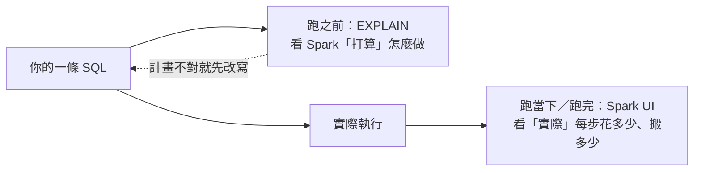
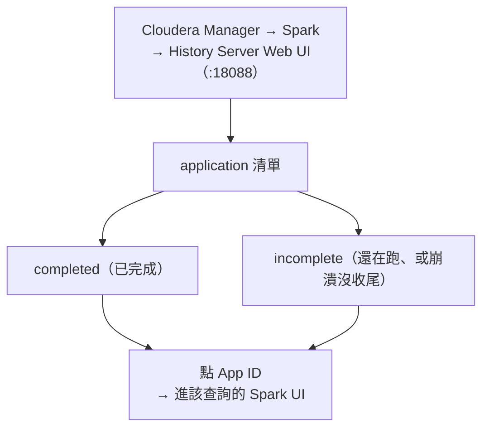
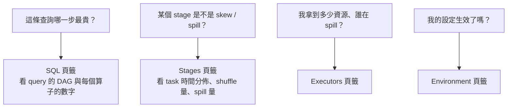
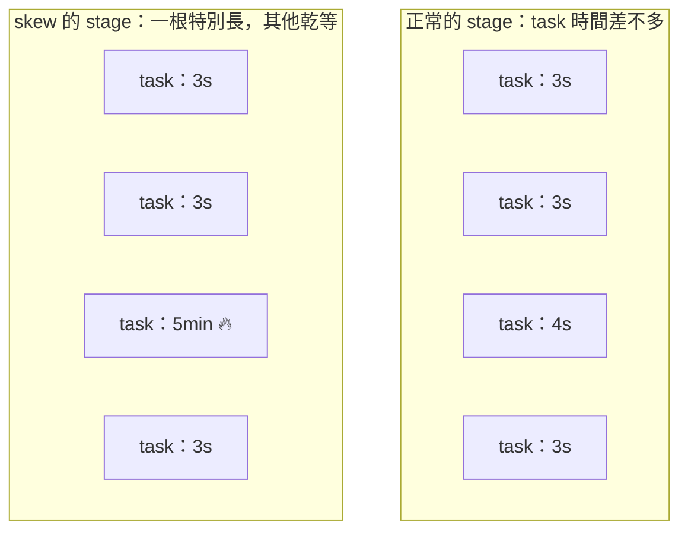

# 02 · 用 Spark UI 找瓶頸

> **本章前提**：你讀過[第 01 章](01-how-spark-runs-your-sql.md)，對 partition、shuffle、stage、task、spill、skew、executor 已經有心智模型；你會寫 SQL。
>
> 第 01 章告訴你「一條 SQL 在叢集裡會發生什麼、為什麼 shuffle 最貴」。但你怎麼**知道**自己手上這條查詢到底卡在哪？這一章教你用兩個工具把瓶頸**看出來**：跑之前用 `EXPLAIN` 看計畫，跑當下／跑完用 **Spark UI**（Spark 內建的網頁監控介面）看實況。學會看了，後面第 03–05 章的每一招才知道該不該用、用了有沒有效。
>
> 每節末附 📚 **來源**；章末「資料來源與精確度說明」列出哪些是刻意簡化、或工具沒能逐字查證的地方。

---

## 2.1 先量再調，不要憑感覺

新手最常犯的錯，是查詢一慢就開始亂槍打鳥：把記憶體調大、把 `spark.sql.shuffle.partitions` 改一改、到處加 hint（提示語法，告訴 Spark 該怎麼做某件事，第 03 章會講）。多數時候沒效，因為**沒先搞清楚到底慢在哪**。一條查詢可能慢在掃了太多資料、慢在某個 shuffle、慢在一個被 skew 拖住的肥 task——病因不同，藥也不同。**先量，再調。**

「量」有兩個時機、兩個工具：

- **跑之前——`EXPLAIN`**：不真的執行，只請 Spark 把「它打算怎麼做」這份計畫印出來給你看。幾秒就有結果，適合在送出大查詢前先檢查「我以為會發生的優化，真的有發生嗎」（例如該裁掉的月份有沒有被裁掉、小表有沒有走 broadcast）。
- **跑當下／跑完——Spark UI**：查詢實際執行時，Spark 把每個 stage、每個 task 花了多久、搬了多少資料、spill 了沒，全部記錄下來，用一個網頁介面呈現。這是「事後驗屍」也是「現場監看」，告訴你計畫**實際**跑起來的數字。



兩個工具互補：`EXPLAIN` 看「計畫對不對」（便宜、快），Spark UI 看「實際貴在哪」（要真的跑一遍）。本章其餘部分就帶你讀懂這兩樣。

> 📚 **來源**：`EXPLAIN` 用於檢視查詢計畫、Spark Web UI 用於監看執行，兩者定位見 [Spark SQL EXPLAIN 語法](https://spark.apache.org/docs/latest/sql-ref-syntax-qry-explain.html) 與 [Spark Monitoring and Instrumentation](https://spark.apache.org/docs/latest/monitoring.html)。「先量再調」是效能調校的通則，亦見《Spark: The Definitive Guide》Ch.18–19。

---

## 2.2 怎麼打開 Spark UI（在 CDP 上）

Spark UI 不是另外一個程式，而是每次跑 Spark 時它附帶的一個網頁。在 CDP 上，不論你的查詢**還在跑**還是**已經跑完**，都從同一個地方進去：**Spark History Server**。進去的方式：

1. 打開 **Cloudera Manager**（你們平台的管理介面）→ 點 **Spark** 服務 → 點 **History Server Web UI** 連結；
2. 或直接開 `http://<history-server-host>:18088`。

進去會看到一張 application 清單，分成兩種：

- **completed（已完成）**：已經跑完的查詢。
- **incomplete（未完成）**：**還在跑的查詢也在這裡**——所以你不必等它跑完，就能即時點進去看它現在卡在哪。（嚴格說，incomplete 是「還沒把自己標記成完成」的；所以萬一某個查詢中途崩潰、沒正常收尾，也會留在這個清單。）

點你那次查詢的 **App ID** 就進到它的 Spark UI。清單上要認出哪個是你的，靠你的**使用者名稱、送出時間、作業名稱**。

有兩個前提、一個延遲要知道：

- History Server 能事後（或執行中）重建這個 UI，是因為 Spark 邊跑邊把畫面要顯示的資訊寫成「事件記錄」（event log，寫到硬碟、之後還讀得到；**CDP 預設開著**）。
- History Server 是**每隔一段時間**（預設約 **10 秒**，由 `spark.history.fs.update.interval` 控制）才去掃一次這些記錄、更新畫面。所以看「還在跑」的查詢時，畫面會比真實進度**慢個幾秒到十幾秒**、資訊也隨它跑而逐步長出來——這是正常的，重整一下即可。



> **對營運的意義**：排程作業（第 08 章）通常半夜自己跑，你早上來看時它早結束了——History Server 把跑過的作業都留著，讓你回頭翻。它還讓你比較「同一支作業這週和上週各跑多久、搬了多少資料」，及早發現作業隨資料長大而退化（第 08 章監控會再談）。

> 📚 **來源**：History Server「列出 incomplete 與 completed 的 application」、incomplete 只間歇更新（間隔即 `spark.history.fs.update.interval`，預設 `10s`）、「未把自己標記完成的 application（含崩潰者）會列為 incomplete」、以及需 `spark.eventLog.enabled`，見 [Spark Monitoring](https://spark.apache.org/docs/latest/monitoring.html)。CDP 上經 Cloudera Manager → Spark → History Server Web UI（或 `:18088`）、點 App ID 看 application，見 [Cloudera CDP 7.1.9：Accessing the Web UI of a Completed Spark Application](https://docs.cloudera.com/cdp-private-cloud-base/7.1.9/monitoring-and-diagnostics/topics/cm-accessing-the-web-ui-of-a-completed-spark-application.html)。

---

## 2.3 跑之前先看計畫：`EXPLAIN`

`EXPLAIN` 把 Spark「打算怎麼執行這條 SQL」的計畫印出來，但**不真的跑**。對 SQL-first 的人，這是花費最低的診斷：在送出一個會跑很久的大查詢前，先花幾秒確認計畫沒走歪。

用法就是在你的查詢前面加一個字：

```sql
EXPLAIN FORMATTED
SELECT c.segment, SUM(t.amount) AS total
FROM card_txn t
JOIN dim_customer c ON t.cust_id = c.cust_id
WHERE t.month = '2026-05'
GROUP BY c.segment;
```

`EXPLAIN` 有幾種模式，差別在印多細：預設（不加字）只印**實際執行步驟**（physical plan）；`FORMATTED` 額外把每個步驟的細節分區整理、最好讀；另有 `EXTENDED`（連邏輯計畫一起印）、`COST`（附統計估算）、`CODEGEN`（印產生的程式碼）。**日常診斷用 `EXPLAIN FORMATTED` 就夠。**

跑出來大致長這樣（**以下為簡化示意**，實際排版以你環境為準，由下往上讀）：

```text
== Physical Plan ==
HashAggregate(keys=[segment], functions=[sum(amount)])     ← GROUP BY 的加總
+- Exchange hashpartitioning(segment, 200)                 ← ★ 一次 shuffle（為了 GROUP BY）
   +- BroadcastHashJoin [cust_id]                          ← ★ 走廣播 join、不為 join 做 shuffle
      :- Filter (month = '2026-05')
      :  +- Scan parquet card_txn
      :        PartitionFilters: [month = '2026-05']        ← ★ 有裁到月份，不掃別的月
      +- BroadcastExchange                                  ← 把小表 dim_customer 廣播出去
         +- Scan parquet dim_customer
```

讀計畫時，你不必看懂每一行，**只要會找三個關鍵字**（它們直接對應第 01 章學過的成本來源，上面用 ★ 標出來了）：

- **`Exchange`**：`Exchange hashpartitioning(...)` 這種就是一次 **shuffle**（§1.5 的跨機器重分配）。數一數有幾個，就知道這條查詢有幾次 shuffle——這通常是最大成本。上面那條查詢的 `GROUP BY` 造成了一個。（注意：計畫裡還會看到 `BroadcastExchange`，那是「把小表廣播出去」用的、**不是** shuffle，別把它算進 shuffle 次數。）
- **`BroadcastHashJoin` vs `SortMergeJoin`**：兩種 join 的實作方式。`BroadcastHashJoin` 表示 Spark 決定把一邊的小表廣播出去、**不為 join 做 shuffle**（便宜，§1.8 提過）；`SortMergeJoin` 表示兩邊都要 shuffle 再排序合併（大表對大表時的做法）。如果你**以為**某個小表會被廣播、計畫裡卻是 `SortMergeJoin`，那就是個警訊（第 03 章會教怎麼處理）。
- **`Scan` 那行的 `PartitionFilters` 與 `PushedFilters`**：`PartitionFilters` 列出哪些 `WHERE` 條件被用來**只讀需要的分區目錄**（partition 裁剪，§1.8）；`PushedFilters` 是被下推到讀檔層、提早篩掉資料的條件。你下了 `WHERE month = '2026-05'`，就該在這裡看到 `month` 出現——**沒出現，代表它沒裁到、整張表都會被掃**（第 03、05 章詳談）。

換句話說：`EXPLAIN` 讓你在花大錢執行前，先核對「我期待的省錢手段（少 shuffle、走 broadcast、裁掉分區）到底有沒有出現在計畫裡」。

> 📚 **來源**：`EXPLAIN` 語法與各模式（`EXTENDED`／`CODEGEN`／`COST`／`FORMATTED`，預設只印 physical plan；`FORMATTED` 分「physical plan outline + node details」兩段）見 [Spark SQL EXPLAIN 語法](https://spark.apache.org/docs/latest/sql-ref-syntax-qry-explain.html)。`Exchange`＝shuffle、`BroadcastHashJoin`/`SortMergeJoin` 為 join 物理算子、Scan 的 partition pruning，見《Spark: The Definitive Guide》Ch.8（Joins）、Ch.15、與 [Spark SQL Performance Tuning](https://spark.apache.org/docs/latest/sql-performance-tuning.html)。⚠️ 上面的 plan 是簡化示意（非逐字輸出），欄位與排版以你環境跑出來為準（見章末精確度說明）。

---

## 2.4 Spark UI 的頁籤地圖：哪個頁籤回答哪個問題

打開 Spark UI（§2.2）後，最上面有一排頁籤。對 SQL-first 的人，不必每個都熟，先知道「我這個問題該點哪一個」就好。主要有六個：

| 頁籤 | 回答的問題 | 你多常用 |
|---|---|---|
| **SQL** | 我這條查詢由哪些步驟組成、哪一步最貴？ | ★ 最常用 |
| **Stages** | 某個 stage 裡的 task，時間和資料量分佈正不正常（skew？spill？）？ | ★ 最常用 |
| **Jobs** | 這個 application 觸發了哪些 job、各花多久？ | 入口、概覽 |
| **Executors** | 我實際拿到幾個 executor、記憶體夠不夠、誰在 spill？ | 看資源 |
| **Storage** | 我 cache 起來的資料佔了多少記憶體？ | 用到 cache 才看（第 07 章） |
| **Environment** | 這次跑用了哪些設定值（我用 `SET`──在查詢前臨時設參數的指令──調的值生效沒）？ | 偶爾查設定 |



典型的看法是**由上而下**：先在 **SQL 頁籤**找出整條查詢裡最貴的那個步驟（哪個 shuffle 搬最多、哪個 scan 讀最多），鎖定它屬於哪個 stage，再跳到 **Stages 頁籤**看那個 stage 的 task 細節（是被某個肥 task 拖住，還是大家都在 spill）。下面兩節分別教這兩個頁籤。

> 📚 **來源**：Spark Web UI 的頁籤組成（Jobs、Stages、Storage、Environment、Executors、SQL；另有 streaming／JDBC 等）與各頁籤用途見 [Spark Web UI](https://spark.apache.org/docs/latest/web-ui.html)。Executors 頁籤顯示記憶體/磁碟用量、task 與 shuffle 資訊、Storage Memory（cache 用），同頁。

---

## 2.5 從 SQL 頁籤看「這條查詢花在哪」

SQL 頁籤是 SQL-first 的人最該先看的地方。點進你那條查詢，會看到一張**查詢執行的流程圖（DAG）**——把第 01 章那種 stage 圖畫出來，每個方塊是一個算子（你會看到 `Scan`＝讀檔、`Filter`＝過濾、`Exchange`＝shuffle、`HashAggregate`＝做 `GROUP BY` 的聚合、`BroadcastHashJoin`＝廣播 join 等），方塊上還掛著**實際跑出來的數字**。

最該看的兩個數字：

- **`number of output rows`（輸出列數）**：掛在大多數算子上（例如某個算子方塊上寫著 `number of output rows: 30,000,000`）。它告訴你「資料量在這條查詢裡怎麼變化」。例如某個 `Filter` 之後列數從 3000 萬掉到 3 萬，很正常；但若某個 `Join` 之後列數**暴增**（例如輸入 3000 萬、輸出卻爆成 3 億），那多半是一對多、甚至接近笛卡兒積的爆量 join（第 03 章會教怎麼抓）。
- **Exchange 上的 `shuffle bytes written total`（shuffle 寫出的位元組）**：每個 `Exchange`（§2.3 說的 shuffle）會顯示它搬了多少資料（例如某個 Exchange 上寫著 `shuffle bytes written total: 12.4 GB`）。**這是你找「最貴 shuffle」的直接依據**——哪個 Exchange 的位元組最大，那就是這條查詢的主要成本所在，也是你優化的第一目標。

所以在 SQL 頁籤的標準動作是：順著 DAG 看列數怎麼變（哪裡爆量）、看哪個 Exchange 搬最多（最貴的 shuffle 在哪），然後記住它落在哪個 stage，再去 Stages 頁籤（§2.6）查那個 stage 的 task。

> **AQE 的計畫在這裡才看得到最終版**：第 01 章說過 Spark 3.3 的 AQE 會在執行途中調整計畫（例如把過多的 shuffle 分區合併）。用了 AQE 的查詢，計畫的根節點會標成 **`AdaptiveSparkPlan`**，上面帶一個 **`isFinalPlan`** 旗標：`EXPLAIN`（§2.3，跑之前、不真的執行）永遠看到 `isFinalPlan=false`，那是**還沒被 AQE 改過**的初始計畫；要等查詢實際跑完、旗標變成 `isFinalPlan=true`，才是真正執行的最終計畫——而它只在 SQL 頁籤這張圖（跑完之後）看得到。所以兩邊對不起來是正常的，**以 SQL 頁籤為準**。

> 📚 **來源**：SQL 頁籤的 query details 顯示執行時間、關聯 jobs、與「query execution DAG」；每個算子掛 metrics，文件原文舉例「`number of output rows` 答 Filter 後輸出幾列」、「Exchange 算子的 `shuffle bytes written total` 顯示 shuffle 寫出的位元組」，見 [Spark Web UI（SQL Tab）](https://spark.apache.org/docs/latest/web-ui.html)。AQE 於執行期調整計畫見 [Spark SQL Performance Tuning（Adaptive Query Execution）](https://spark.apache.org/docs/latest/sql-performance-tuning.html)；查詢根節點為 `AdaptiveSparkPlan`、`EXPLAIN` 不執行故恆 `isFinalPlan=false`、跑完才 `isFinalPlan=true`，見 [Databricks：Adaptive Query Execution](https://docs.databricks.com/aws/en/optimizations/aqe)（Spark 核心團隊撰）與 [SPARK-33850](https://issues.apache.org/jira/browse/SPARK-33850)。

---

## 2.6 從 Stages 頁籤看「這個 stage 慢在哪」

鎖定了最貴的 stage，就到 Stages 頁籤點進去。這頁的精華是一張**「Summary Metrics」摘要表**：它不是把每個 task 列出來（一個 stage 動輒幾百個 task），而是用**分位數**幫你看分佈。分位數的意思是：把這個 stage 的所有 task 依某個指標**從小排到大**，再挑幾個代表點——**Min**＝最小（最快）那個、**Median（中位數）**＝排在正中間那個、**Max**＝最大（最慢）那個；**25th percentile** 是排在四分之一處的值（代表有 25% 的 task 比它小）、**75th percentile** 是排在四分之三處。每個指標（task 時間、讀取量、spill 量…）都列這五個點。

學會讀這張表，第 01 章的兩個敵人就現形了：

**認 skew（資料傾斜）——看 Max 和 Median 差多少。** 對 `Duration`（task 花的時間）這一列，如果 Median 是 3 秒、Max 卻是 5 分鐘，代表大多數 task 三秒就做完、卻有少數 task 跑了五分鐘——這就是 §1.6 講的 skew：某些 key 的資料特別多，全擠到少數 task，其他人做完只能乾等它（stage barrier）。**Max ≫ Median 就是 skew 的招牌訊號。** 同樣的差距也會出現在 `Shuffle Read Size / Records`（那幾個肥 task 讀進來的資料量遠大於別人）。

**認 spill（記憶體不足落磁碟）——看有沒有非零的 spill。** 表裡有兩列：**`Shuffle spill (memory)`** 和 **`Shuffle spill (disk)`**。你不用糾結它們的精確定義，記一句就好：**只要這兩個數字非零，就代表這個 stage 的記憶體不夠用、把資料溢寫到磁碟了**（§1.6 的 spill，雪上加霜的那次額外磁碟 I/O）。spill 越多，這個 stage 就越慢。看到它，你就知道問題是「記憶體相對資料量太小」——解法可能是減少要同時處理的資料（第 03 章改寫法）、調整分區數、或調資源（第 04 章）。



（上圖左邊 Max 和 Median 接近＝健康；右邊那根 5 分鐘的 task 把整個 stage 卡住＝skew。在 Summary Metrics 表上，就表現為 `Duration` 的 Max 遠大於 Median。）

一個出問題的 stage，它的 Summary Metrics 表大概長這樣（**數字為示意**，幫你想像實際畫面）：

| 指標 | Min | 25th pct | Median | 75th pct | Max |
|---|---|---|---|---|---|
| **Duration**（task 花的時間） | 8 s | 11 s | 12 s | 14 s | **9.2 min** |
| **Shuffle Read Size**（讀進來多少） | 240 MB | 250 MB | 260 MB | 290 MB | **6.1 GB** |
| **Shuffle spill (disk)** | 0 | 0 | 0 | 0 | **8.3 GB** |

這張表一眼看出兩件事：① `Duration` 的 Max（9.2 分）和 `Shuffle Read` 的 Max（6.1 GB）都**遠大於** Median（12 秒、260 MB）——代表絕大多數 task 十幾秒、讀 260 MB 就做完，卻有個 task 讀了 6 GB、跑了 9 分多 → **skew**；② 那個肥 task 還 `spill` 了 8.3 GB 到磁碟 → 記憶體被它撐爆。結論：少數熱點 key 造成傾斜、連帶吃光記憶體。這就是你要修的目標（第 03 章）。

> 📚 **來源**：Stages 頁籤的「Summary Metrics for Completed Tasks」以分位數呈現各 task 指標分佈；`Shuffle Read Size / Records`＝「本地與遠端讀入的 shuffle 總位元組」、`Shuffle spill (memory)`＝「shuffled data 在記憶體反序列化形式的大小」、`Shuffle spill (disk)`＝「資料在磁碟序列化形式的大小」，引用字句見 [Spark Web UI（Stage detail）](https://spark.apache.org/docs/latest/web-ui.html)。skew＝少數 task 因 key 分佈不均而資料量/時間遠大於其他、stage 卡在最慢 task，見 §1.6 與《Spark: The Definitive Guide》Ch.15。⚠️ 分位數的確切列標（Min/25th/Median/75th/Max）工具未能逐字擷取，屬 Spark UI 標準呈現（見章末）。

---

## 2.7 把它全部串起來：四種症狀對到 UI 上的哪個數字

把第 01 章的「敵人」和這章學的「看哪裡」接起來。實務上你遇到的慢，幾乎都歸到下面四種症狀之一；每一種都有它在 UI／`EXPLAIN` 上的**具體訊號**：

1. **shuffle 過大**（搬太多資料）
   - 看哪裡：**SQL 頁籤**某個 `Exchange` 的 `shuffle bytes written total` 特別大；或 `EXPLAIN` 裡 `Exchange` 個數很多。
   - 意思：這條查詢的主要時間花在跨機器搬資料。→ 第 03 章（減少 shuffle：broadcast join、先聚合再 join、避免不必要的 `DISTINCT`/`ORDER BY`）。

2. **skew（資料傾斜）**（少數 task 特別久）
   - 看哪裡：**Stages 頁籤** Summary Metrics 裡 `Duration` 或 `Shuffle Read Size` 的 **Max ≫ Median**。
   - 意思：某些 key 太肥，把 stage 卡在最慢那個 task。→ 第 03 章（salting、AQE skew join、熱點 key 分流）。

3. **spill（記憶體不足落磁碟）**
   - 看哪裡：**Stages 頁籤** `Shuffle spill (memory)` / `Shuffle spill (disk)` 非零；**Executors 頁籤**也看得到誰在 spill。
   - 意思：要處理的資料相對可用記憶體太大。→ 第 03 章（減少單次處理量）或第 04 章（分區數／executor 記憶體）。

4. **掃太多 / 小檔**（讀了不該讀的，或被一堆小檔拖累）
   - 看哪裡：`EXPLAIN` 的 `Scan` 沒有出現你預期的 `PartitionFilters`（→ 沒裁到分區、整表掃）；或 **SQL 頁籤**讀檔算子的輸入位元組／列數遠大於你以為的量；或讀檔 stage 的 task 數異常多（→ 小檔太多，§1.2）。
   - 意思：成本花在「讀」而不是「算」。→ 第 03 章（partition 裁剪、別 `SELECT *`）、第 05 章（檔案格式、partition 設計、小檔處理）。

這就是本章的核心循環：**先量（EXPLAIN／Spark UI）→ 認出症狀 → 才知道翻哪一章去調。** 跳過「量」直接調，多半白忙。

> 📚 **來源**：本節為 §2.3–§2.6 的綜合對照，所用指標名稱（`Exchange`／`shuffle bytes written total`／`Shuffle spill`／`PartitionFilters`）出處同前述各節；症狀對應的概念（shuffle、skew、spill、掃描量）見第 01 章。

---

## 2.8 完整走一遍：一條慢查詢的驗屍

把前面的工具串成一次真實的診斷。情境：你有一條算「每個客群本月刷卡總額」的查詢（就是 §2.3 那條），平常幾分鐘，今天**跑了 20 分鐘還沒完**。你不亂調參數，照步驟驗屍：

**第 1 步——先 `EXPLAIN FORMATTED`（不花錢、先看計畫）。** 你注意到兩件事：

- 接 `dim_customer` 那裡是 `SortMergeJoin`，**不是**你以為的 `BroadcastHashJoin`——小表沒被廣播（§2.3 教的關鍵字）。
- `Scan card_txn` 那行**有** `PartitionFilters: [month = '2026-05']`，月份有裁到，讀的量沒被放大。

→ 初步懷疑：這個 join 本來可以免 shuffle，現在卻白白多做了一次。

**第 2 步——讓查詢跑起來，從 History Server 的 incomplete 清單點進去，看 SQL 頁籤。** 順著 DAG 看數字：

- 某個 `Exchange` 的 `shuffle bytes written total` 是 **12.4 GB**——這是最貴的一步。
- `SortMergeJoin` 的 `number of output rows` 跟輸入差不多、沒暴增（§2.5）→ 排除「爆量 join」。

→ 確認主要成本在那個 shuffle；記住它落在哪個 stage。

**第 3 步——跳到那個 stage 的 Stages 頁籤，看 Summary Metrics（就是 §2.6 那張示意表）。** 看到 `Duration` Max 9.2 分 ≫ Median 12 秒、`Shuffle spill (disk)` 8.3 GB。

→ 結論：這條查詢同時中了兩刀——**該 broadcast 卻走了 `SortMergeJoin`**（白白多一次 shuffle），而且 join key 上有**熱點造成 skew**、把那個肥 task 撐到 spill。

**第 4 步——對症下藥，翻對應章節。** 兩個問題各有解：小表沒廣播 → 第 03 章 broadcast join／第 04 章調 broadcast 門檻；skew → 第 03 章 salting／AQE skew join。**改完再跑一次、回頭看同一張 Summary Metrics 表**：確認 Max 和 Median 拉近了、spill 歸零——用同一套工具驗證你的修改真的有效，診斷才算閉環。

> 整個流程沒有新東西，全是 §2.3–§2.7 的零件組起來：`EXPLAIN` 看計畫 → SQL 頁籤找最貴的步驟 → Stages 頁籤看 task 分佈與 spill → 認症狀 → 翻章調 → 用同樣的數字驗證。（本節數字皆為示意，幫你想像畫面；實際以你環境跑出來為準。）

---

## 2.9 速查：症狀 → 看哪裡 → 翻到哪章

把 §2.7 的四種症狀，拆細成一張隨手可查的表（同一種症狀可能有不只一個入手點，所以列數比四多；第 09 章場景索引、第 10 章速查會再彙整）：

| 症狀 | 在哪看、看什麼 | 多半的解法在 |
|---|---|---|
| 某個 shuffle 搬太多 | SQL 頁籤：Exchange 的 `shuffle bytes written total` 最大者 | 第 03 章（join／聚合改寫） |
| 少數 task 特別久（skew） | Stages 頁籤：`Duration` Max ≫ Median | 第 03 章（salting／AQE skew join） |
| 在 spill | Stages／Executors 頁籤：`Shuffle spill (memory/disk)` 非零 | 第 03 章（減量）、第 04 章（分區／記憶體） |
| 整表掃、沒裁分區 | `EXPLAIN`：Scan 缺 `PartitionFilters` | 第 03 章（裁剪）、第 05 章（partition 設計） |
| 讀檔 task 數爆多（小檔） | SQL／Stages 頁籤：讀檔 stage task 數異常多 | 第 05 章（小檔處理） |
| join 後列數暴增 | SQL 頁籤：Join 算子 `number of output rows` ≫ 輸入 | 第 03 章（避免爆量 join） |
| 該 broadcast 卻沒有 | `EXPLAIN`：小表處是 `SortMergeJoin` 而非 `BroadcastHashJoin` | 第 03 章（broadcast）、第 04 章（broadcast 門檻值 threshold） |

> 📚 **來源**：綜合表，無新技術主張；各列指標與解法出處見本章 §2.3–§2.7 及對應章節。

---

## 2.10 一句話帶走：先讓資料告訴你瓶頸在哪

把這章收成一條原則：

> **不要憑感覺調。先用 `EXPLAIN` 看計畫對不對、用 Spark UI 看實際貴在哪，認出是 shuffle 過大、skew、spill 還是掃太多——再翻到對應章節對症下藥。**

接下來：

- 認出問題多半出在 SQL 寫法（shuffle、skew、爆量 join、掃太多）？→ 第 03 章逐招教改寫。
- 想知道哪些 **Spark 設定**值得調、AQE 已經自動幫你處理了哪些（spill、過多分區、skew join）？→ 第 04 章。
- 問題在「讀」——檔案格式、partition 設計、小檔？→ 第 05 章。
- 想看「我這類工作（ad-hoc／排程／特徵）通常照哪些章、最常踩什麼雷」？→ 第 09 章。

---

## 資料來源與精確度說明


**版本對齊**：本章 Spark 官方連結指向「最新版」頁面（撰寫時自動工具無法直接驗證版本鎖定的 3.3.2 頁是否可達）。要對齊本手冊版本，把網址裡的版本字串改掉即可：`…/docs/latest/…` → `…/docs/3.3.2/…`。本章引用的頁籤組成、metric 名稱、`EXPLAIN` 模式自 Spark 3.x 起穩定，已對 3.3 行為核對。

**本章刻意簡化、或屬「行為已知但工具未能逐字查證」之處**（自行斟酌，必要時以你環境實跑為準）：

1. **§2.2 History Server port**：本章用 CDP 的 **18088**（Cloudera 文件）；上游 Apache Spark 文件的 History Server 預設是 **18080**。兩者各自情境下都對，以你平台實際設定為準。
2. **§2.2 incomplete 清單**：「History Server 同時列出 incomplete 與 completed、incomplete 含還在跑或崩潰未收尾者、間歇更新（預設 10s）、需 `spark.eventLog.enabled`」皆已逐字查證自 Spark Monitoring 文件；但 UI 上**切換／顯示 incomplete 的確切控制項字樣**官方文件未逐字載明，依你環境畫面為準。
3. **§2.3 `EXPLAIN FORMATTED` 輸出範例**：本章那段 plan 是**簡化示意**，只為標出你該找的關鍵字（`Exchange`／`BroadcastHashJoin`／`PartitionFilters` 等）；實際排版、欄位、縮排以你環境跑出來為準。
4. **§2.6／§2.8 的 Summary Metrics 表與驗屍數字**：皆為**示意，非真實截圖或輸出**（為幫你想像畫面與診斷流程），數字屬虛構、實際以你環境為準。轉成 HTML 時，這些示意面板可替換成你公司環境的**真實 Spark UI 截圖**，會更直觀。
5. **§2.6 Summary Metrics 的分位數列標**（Min / 25th percentile / Median / 75th percentile / Max）：屬 Spark UI Stage 頁的標準呈現，但查證工具未能逐字擷取這幾個列標字樣；`Shuffle spill (memory/disk)`、`Shuffle Read Size / Records` 的定義字句則已逐字查證。

> 引用原則：以 Spark 官方文件、Cloudera CDP 官方文件、Spark 核心開發者文章、《Spark: The Definitive Guide》(Chambers & Zaharia) 為限，不引用未經認證的個人部落格。

---

*←上一章* [01 · Spark 怎麼跑你的 SQL](01-how-spark-runs-your-sql.md)　|　*下一章 →* [03 · SQL 寫法優化](03-sql-tuning.md)　|　*回* [手冊首頁](index.md)
