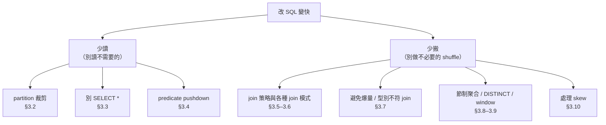
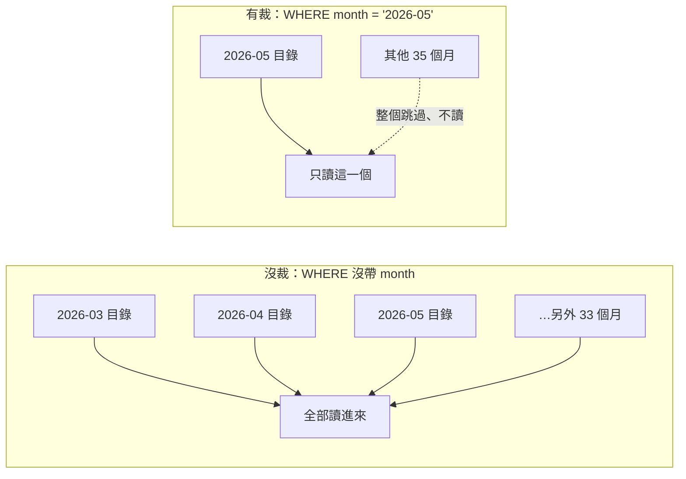
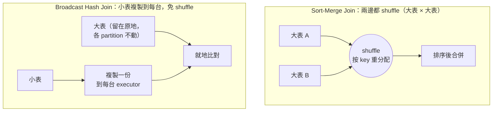
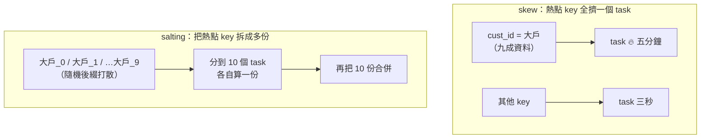

# 03 · SQL 寫法優化

> **本章前提**：你讀過[第 01 章](01-how-spark-runs-your-sql.md)（partition、shuffle、stage、task、spill、skew、broadcast、driver／executor 的心智模型）與[第 02 章](02-diagnose-with-spark-ui.md)（用 `EXPLAIN` 看計畫、用 Spark UI 看實況）；你會寫 SQL。
>
> 第 01 章的結論是一句話：**優化＝少搬、少讀、把機器用在刀口上**。第 02 章教你怎麼看出瓶頸在哪。這一章把它們落地成**你改 SQL 就能做到的具體手段**，不必動任何 Spark 設定（那是第 04 章），光靠改寫法，就能讓同一條查詢少搬一大堆資料、少讀好幾倍的量。
>
> 每招都用同一個格式講：**原理 → SQL before/after → 在 `EXPLAIN`／Spark UI 看到什麼變化 → 取捨**。每節末附 📚 **來源**，章末「資料來源與精確度說明」列出哪些是刻意簡化、或工具沒能逐字查證的地方。

---

## 本章目錄

- [3.1 本章地圖：所有招數都掛在「少讀」或「少搬」底下](#31-本章地圖所有招數都掛在少讀或少搬底下)
- [3.2 少讀（一）：只掃需要的分區（partition 裁剪）](#32-少讀一只掃需要的分區partition-裁剪)
- [3.3 少讀（二）：只取需要的欄位（別 `SELECT *`）](#33-少讀二只取需要的欄位別-select-)
- [3.4 少讀（三）：讓過濾提早發生（predicate pushdown），以及它為什麼會失效](#34-少讀三讓過濾提早發生predicate-pushdown以及它為什麼會失效)
- [3.5 少搬（一）：join 策略，broadcast vs sort-merge](#35-少搬一join-策略broadcast-vs-sort-merge)
- [3.6 少搬（二）：手動 `/*+ BROADCAST(t) */`，何時該自己出手](#36-少搬二手動--broadcastt-何時該自己出手)
- [3.7 少搬（三）：join 的兩個隱藏陷阱，key 型別不一致、爆量 join](#37-少搬三join-的兩個隱藏陷阱key-型別不一致爆量-join)
- [3.8 少搬（四）：聚合的成本，`GROUP BY`、`DISTINCT`、`COUNT(DISTINCT)`](#38-少搬四聚合的成本group-bydistinctcountdistinct)
- [3.9 少搬（五）：window function，每個 `PARTITION BY` 是一次 shuffle](#39-少搬五window-function每個-partition-by-是一次-shuffle)
- [3.10 少搬（六）：處理 skew（資料傾斜）](#310-少搬六處理-skew資料傾斜)
- [3.11 把它全部串起來：改寫一條慢查詢](#311-把它全部串起來改寫一條慢查詢)
- [3.12 一句話帶走：先少讀，再少搬，每招都回 UI 驗證](#312-一句話帶走先少讀再少搬每招都回-ui-驗證)

---

## 3.1 本章地圖：所有招數都掛在「少讀」或「少搬」底下

第 01 章說，一條查詢的成本主要來自兩件事：**讀資料**（從 HDFS 把 partition 讀進來）和**搬資料**（shuffle，跨機器重新分配）。所以「改 SQL 來變快」也只有兩個大方向：

- **少讀**：別把不需要的資料讀進來。包括只掃需要的**分區**（partition 裁剪）、只取需要的**欄位**（別 `SELECT *`）、讓過濾**提早**發生（predicate pushdown）。
- **少搬**：別做不必要的 shuffle，必要的 shuffle 也要搬得輕。包括選對 **join 策略**（小表用 broadcast，免一次 shuffle）、避免**爆量 join**、節制 `DISTINCT`／`COUNT(DISTINCT)`／window 這些「每用一次就一次 shuffle」的操作、以及處理 **skew**（讓某次 shuffle 不要卡在一個肥 task）。



每一節你只要記住它屬於「少讀」還是「少搬」，就知道它在幫你省第 01 章的哪一種成本。下面先講少讀（便宜、無腦該做），再講少搬（省最多、但要懂取捨）。

> 📚 **來源**：「優化＝減少 shuffle 與掃描量」的主軸見第 01 章 §1.10；本章把它拆成 SQL 層的具體手段，逐招出處見各節。

---

## 3.2 少讀（一）：只掃需要的分區（partition 裁剪）

**原理**。第 05 章會講，排程產出的大表通常會按某個欄位（最常見是日期／月份）**分區存放**，磁碟上不同 `month` 的資料放在不同目錄。當你的 `WHERE` 直接過濾分區欄位，Spark 只會去讀**命中的那幾個目錄**，其他目錄連碰都不碰。這叫 **partition 裁剪（partition pruning）**，是所有手段裡 CP 值最高的一個：少讀的不是幾個欄位，而是整批目錄。

`card_txn` 一個月約 3000 萬筆，若這張表存了三年（36 個月），整張表約 10 億筆。一條只看五月的查詢，裁到分區就只讀 1 個月、跳過另外 35 個，讀的量差了 **36 倍**。

**SQL before/after**。

```sql
-- ❌ 沒有過濾分區欄位：整張表 36 個月全掃
SELECT cust_id, SUM(amount) FROM card_txn GROUP BY cust_id;

-- ✅ 過濾分區欄位 month：只掃 2026-05 一個目錄
SELECT cust_id, SUM(amount)
FROM card_txn
WHERE month = '2026-05'
GROUP BY cust_id;
```

**在 `EXPLAIN`／UI 看到什麼**。`EXPLAIN`（§2.3）裡 `Scan` 那行會出現 `PartitionFilters: [month = '2026-05']`，這就是「裁到了」的證據。**沒裁到的話這行不會有 `month`**，而且 Spark UI 的讀檔算子會顯示一個大到不合理的輸入量（§2.7 的「掃太多」症狀）。



**取捨**。partition 裁剪幾乎沒有壞處，但有兩個前提：**(1) 這張表得真的按那個欄位分區**（怎麼設計分區是第 05 章的事；若表沒分區，`WHERE` 再準也省不了讀檔，只能靠 §3.4 的 pushdown 在讀進來後提早篩）。不確定一張表有沒有分區、分區欄是什麼，用 `SHOW PARTITIONS 表名` 或 `DESCRIBE EXTENDED 表名` 查。**(2) 別在分區欄位上包函數**，`WHERE substr(month,1,4)='2026'` 會讓裁剪失效（§3.4 詳述），要寫成 `WHERE month >= '2026-01' AND month <= '2026-12'` 這種「直接比較欄位」的形式才裁得到。

> 📚 **來源**：partition 欄位的 `WHERE` → 只讀命中目錄（partition pruning / discovery）見 [Spark SQL Parquet（Partition Discovery）](https://spark.apache.org/docs/latest/sql-data-sources-parquet.html)；裁剪在 `EXPLAIN` 呈現為 Scan 的 `PartitionFilters` 見 [Spark SQL Performance Tuning](https://spark.apache.org/docs/latest/sql-performance-tuning.html) 與第 02 章 §2.3。⚠️「36 個月＝差 36 倍」是把每月資料量視為相近的算術示意；實際各月筆數不同。

---

## 3.3 少讀（二）：只取需要的欄位（別 `SELECT *`）

**原理**。生產用的大表常常是**寬表**（欄位很多的表），一張特徵表動輒幾百、上千個欄位。第 05 章會講，這些表幾乎都用 **Parquet／ORC** 這類**欄式（columnar）檔案格式**存（**Parquet**＝一種存在 HDFS 上、為大數據查詢設計的開源檔案格式，是 Spark 生態最常見的選擇；ORC 則是 CDP 上 Hive 表的預設選擇，兩者同類、效果相近，內部結構與更進階的調優見第 05 章 §5.2）：把**同一個欄位**的值收在一起存（「欄」就是 column；相對地像 CSV 那種把整列綁在一起的叫逐列／行式存）。欄式的好處正是「**要哪幾欄就只讀哪幾欄**」，用不到的欄位的資料塊根本不會從磁碟讀出來。所以 `SELECT *` 和 `SELECT cust_id, amount` 在一張 1000 欄的寬表上，讀進來的量可能差幾十倍。

**SQL before/after**。

```sql
-- ❌ 一張 1000 欄的特徵寬表，只為了 2 個欄位卻整列讀進來
SELECT * FROM cust_features WHERE month = '2026-05';

-- ✅ 只取真正要用的欄位：磁碟上其他 998 欄不會被讀
SELECT cust_id, txn_cnt_30d FROM cust_features WHERE month = '2026-05';
```

**在 `EXPLAIN`／UI 看到什麼**。`EXPLAIN` 的 `Scan` 那行會列出 `ReadSchema: struct<cust_id,txn_cnt_30d>`，只有你要的欄位；用 `SELECT *` 則會列出全部欄位。對照 Spark UI 讀檔算子的輸入位元組，兩者差很多。這種「只讀需要欄位」叫 **column pruning（欄位裁剪）**。

**取捨**。這招**幾乎沒有壞處**，唯一要注意的是別在不知不覺中又把欄位要回來，例如 `SELECT *` 之後再 `JOIN`、或包一層 view 用 `*`，都會讓 column pruning 失效。原則：**從讀檔到最終輸出，全程只帶你真的會用到的欄位**。也因此，「先 `SELECT *` 撈進來再慢慢挑」這種 ad-hoc 習慣，在大表上代價很高。

> 📚 **來源**：欄式格式只讀取用到的欄位（column pruning）、配合謂詞下推見 [Spark SQL Parquet](https://spark.apache.org/docs/latest/sql-data-sources-parquet.html) 與《Spark: The Definitive Guide》Ch.9（Data Sources）。⚠️「1000 欄差幾十倍」是依欄位數與型別的量級示意，非逐字數字。

---

## 3.4 少讀（三）：讓過濾提早發生（predicate pushdown），以及它為什麼會失效

**原理**。理想情況下，`WHERE` 的過濾條件應該**在讀檔那一刻就生效**，而不是「先把幾億列全讀進記憶體、再慢慢篩」。Spark 會盡量把過濾條件**下推（push down）**到最靠近資料的地方：Parquet／ORC 檔內部存了每個資料塊的最小值／最大值統計，下推之後，**整個不可能命中的資料塊會被跳過、根本不解壓縮**。這叫 **predicate pushdown（謂詞下推；謂詞即 `WHERE` 後面的條件）**。

和 §3.2 的差別：partition 裁剪跳過的是**整個目錄**（分區欄位）；predicate pushdown 跳過的是檔案**內部的資料塊**（一般資料欄位）。兩者一個在目錄層、一個在檔案層，方向一樣，讓不需要的資料**根本不被讀出來**。

**在 `EXPLAIN` 看到什麼**。`Scan` 那行的 `PushedFilters: [GreaterThan(amount,1000)]`，代表 `amount > 1000` 這個條件被推到讀檔層了。

**重點：有些寫法會讓下推（甚至 §3.2 的分區裁剪）悄悄失效。** 這是 SQL-first 的人最常踩、又最難察覺的坑，因為查詢還是會跑對、只是慢得莫名其妙。兩個典型：

```sql
-- ❌ 用函數把欄位包起來：Spark 無法用欄位的統計值跳塊 → 下推失效、整批讀進來再算
WHERE substr(month, 1, 4) = '2026'          -- 包住 month → 連 §3.2 的分區裁剪也失效
WHERE year(txn_date) = 2026                 -- 包住 txn_date

-- ✅ 讓欄位「裸著」跟常數比較：下推 / 裁剪才生效
WHERE month >= '2026-01' AND month <= '2026-12'
WHERE txn_date >= '2026-01-01' AND txn_date < '2027-01-01'
```

原則：**過濾條件裡，要被下推的那個欄位最好「裸著」直接和常數比較**，別用函數、運算、或型別轉換把它包起來。包起來的瞬間，Spark 就無法拿欄位的統計值去跳塊／跳目錄，只能整批讀進來再逐列算，你以為下了 `WHERE`，其實一行都沒少讀。（後面 §3.7 會看到，**join key 上的隱式型別轉換**也是同一類坑。）

**取捨**。改寫成「裸欄位比較」通常不損失可讀性，幾乎沒有壞處。唯一的代價是你得知道哪些欄位有下推價值（分區欄位、Parquet 裡有統計的欄位），這要靠 `EXPLAIN` 確認 `PushedFilters`／`PartitionFilters` 有沒有出現，這正是第 02 章那套「先量再調」的用法。

> 📚 **來源**：predicate pushdown 把過濾推到資料源、Parquet 依 row-group 統計跳塊見 [Spark SQL Parquet（`spark.sql.parquet.filterPushdown`，預設 true）](https://spark.apache.org/docs/latest/sql-data-sources-parquet.html)；下推呈現為 `Scan` 的 `PushedFilters` 見第 02 章 §2.3。⚠️「用函數包住欄位 → 下推失效」方向正確，是 Spark 只能對「欄位 vs 常數」這類可轉成資料源 filter 的謂詞下推；個別函數是否仍能下推依版本與資料源而異，以 `EXPLAIN` 實際看 `PushedFilters` 為準。

---

## 3.5 少搬（一）：join 策略，broadcast vs sort-merge

進入「少搬」。join 是最常見、也最容易搬一堆資料的操作，先把兩種主要做法講清楚。

**原理**。Spark 把兩張表 join 起來，主要有兩種物理做法（第 02 章 `EXPLAIN` 裡看到的就是它們）：

- **Sort-Merge Join（`SortMergeJoin`）**：兩張表都按 join key 做一次 **shuffle**（把相同 key 的列搬到同一台機器），各自排序後合併。大表 × 大表時只能這樣，代價是**兩次 shuffle**，很貴。
- **Broadcast Hash Join（`BroadcastHashJoin`）**：如果有一邊**夠小**，Spark 直接把這張小表**整份複製（broadcast）到每一台 executor**，大表留在原地、各 partition 就地跟記憶體裡的小表比對。**完全不為這個 join 做 shuffle**，這是 §1.8 提過、「同一條 SQL 懂的人寫起來快得多」的關鍵。



**好消息：多數時候 AQE / 統計會自動幫你選 broadcast，前提是表有統計、Spark 估得出它夠小；沒統計就不會自動。** Spark 估計到一邊小於門檻 `spark.sql.autoBroadcastJoinThreshold`（**預設 10MB**）時，就自動走 broadcast。而且 Spark 3.3 的 **AQE**（Adaptive Query Execution，會在查詢**執行途中**自動調整計畫的機制，第 01 章 §1.6 提過、第 04 章詳談）更進一步：就算一開始計畫是 `SortMergeJoin`，執行途中發現某邊 shuffle 後實際很小，AQE 還會**動態改成 broadcast**。所以你常常什麼都不用做，它就對了。

**在 `EXPLAIN`／UI 看到什麼**。`EXPLAIN` 裡是 `BroadcastHashJoin` 還是 `SortMergeJoin`，一眼就分得出（§2.3）。若你**以為**某張小表會被廣播、計畫裡卻是 `SortMergeJoin`，那就是警訊，通常是下一節（§3.6）或型別問題（§3.7）造成的。

**取捨**。broadcast 省掉 join 的 shuffle（省時間），但要付**記憶體**：小表會在 driver 收集、再複製到**每一台** executor（§1.7 提過「廣播的小表每台各一份」）。**所以「小表」必須真的小**，若把一張其實很大的表硬廣播，會撐爆 driver 或 executor 記憶體（OOM）。這就是為什麼有個門檻、也是下一節手動 hint 要小心的地方。

> 📚 **來源**：broadcast hash join「把小表送到每個 worker、免去 join 的 shuffle」、`spark.sql.autoBroadcastJoinThreshold` 預設 `10485760`（10 MB）、AQE 於執行期把 sort-merge 動態轉 broadcast，見 [Spark SQL Performance Tuning（broadcast hint／autoBroadcastJoinThreshold／AQE）](https://spark.apache.org/docs/latest/sql-performance-tuning.html)；sort-merge vs broadcast 兩種物理 join 見《Spark: The Definitive Guide》Ch.8（Joins）。

### 補充：Spark 一共有哪幾種 join？一張表看懂

上面講的 broadcast hash 與 sort-merge，是你**九成時間會遇到的兩種**。但 `EXPLAIN`（§2.3）裡偶爾會冒出別的名字，尤其有一種會讓查詢慢到天荒地老。把 Spark 的 join 物理模式收成一張表，看到陌生名字時就知道它是誰、該不該緊張：

| 物理模式（`EXPLAIN` 裡的名字） | Spark 何時選它 | 要 shuffle 嗎 | 你該有的反應 |
|---|---|---|---|
| **`BroadcastHashJoin`** | 等值 join（`ON a.id = b.id`），且一邊夠小（< 10MB 門檻或有 `BROADCAST` hint） | 否（廣播小表） | 最快，理想狀態（把小表在記憶體建成 hash 表、大表逐列查，免 shuffle） |
| **`SortMergeJoin`** | 等值 join、兩邊都大 | 是（兩邊都 shuffle＋排序） | 大表 × 大表的正常做法 |
| **`ShuffledHashJoin`** | 等值 join、一邊夠小可建記憶體 hash 但沒小到能廣播 | 是（兩邊都 shuffle，但不排序） | 較少見；Spark 多半偏好 sort-merge，通常要靠 `SHUFFLE_HASH` hint 才會走它 |
| **`BroadcastNestedLoopJoin`** | **非等值** join（沒有 `=`），且一邊可廣播 | 否（廣播一邊） | ⚠️ 警訊，見下 |
| **`CartesianProduct`** | cross join／完全沒有 join 條件 | 否，但兩邊每列互配 | ⚠️ 多半是 join 寫漏了 |
| **`LEFT SEMI JOIN`** | 存在性過濾（只回左表、不帶右表任何欄位）：`WHERE key IN (SELECT ...)` 常見被改寫成此 | 依大小，小的那邊可 broadcast | 特徵庫「篩在母體內」場景首選；廣播小的那邊可免 shuffle |
| **`LEFT ANTI JOIN`** | 不存在性過濾（保留在右表找不到對應 key 的左表列）：`WHERE key NOT IN (...)` 的高效等價 | 依大小，小的那邊可 broadcast | 特徵庫「篩不在母體內」場景首選；同樣可 broadcast 小的那邊 |

前三種都是 **等值 join**（join 條件是 `=`）的做法，這也是日常絕大多數 join 的樣子，所以你主要就在 broadcast 和 sort-merge 之間權衡（本節前半 + 下一節 hint）。

**你最該認得的意外是 `BroadcastNestedLoopJoin`。** 當你的 join 條件**不是等號**（例如範圍 `ON t.txn_date BETWEEN p.start_date AND p.end_date`、不等式 `ON a.x < b.y`、或 join 條件裡夾了 `OR`／`CASE WHEN`）Spark 沒有「相等的 key」可以拿來 hash 或排序對齊，只能退化成**巢狀迴圈**：拿左邊每一列去比右邊每一列。它會把其中一邊廣播以求快，但本質是 **O(n×m)**（兩邊列數相乘），只要兩邊不夠小就會慢到失控、甚至跑不完。`CartesianProduct`（笛卡兒積）是更極端的版本，完全沒有可用 join 條件時出現，通常代表條件寫漏了（呼應 §3.7 陷阱二）。

**所以在 `EXPLAIN` 看到這兩個名字，先別急著加資源，回頭問一句：我的 join 是不是少了一個 `=`？** 能改成等值 join（哪怕先用等號 join、再用 `WHERE` 過濾範圍），就讓 Spark 回到便宜的 hash／sort-merge；真的非範圍／不等式不可，就確認被廣播那邊**夠小**，否則它會是整條查詢最大的坑。

> 📚 **來源**：四種 join 策略 hint 對應的物理 join（`BROADCAST`→broadcast hash／`MERGE`→shuffle sort merge／`SHUFFLE_HASH`→shuffle hash／`SHUFFLE_REPLICATE_NL`→shuffle-and-replicate nested loop）見 [Spark SQL Join Hints](https://spark.apache.org/docs/latest/sql-ref-syntax-qry-select-hints.html)；「broadcast join 依**有無 equi-join key** 決定走 broadcast hash join 或 **broadcast nested loop join**」見 [Spark SQL Performance Tuning（Join Hints）](https://spark.apache.org/docs/latest/sql-performance-tuning.html)，即沒有等值 key 時就退化成 nested loop。⚠️「巢狀迴圈成本＝兩邊列數相乘（O(n×m)）」是 nested loop 的**定義性**描述（拿左邊每一列去比右邊每一列），非官方逐字數字；「Spark 多半偏好 sort-merge 勝過 shuffle hash」由內部設定 `spark.sql.join.preferSortMergeJoin`（預設 true）決定，該設定**不在公開 Configuration 頁**。完整 join 選擇規則散在原始碼、官方公開文件未逐字完整載明，最終走哪種一律以 `EXPLAIN` 的實際算子為準（見章末精確度說明）。

---

## 3.6 少搬（二）：手動 `/*+ BROADCAST(t) */`，何時該自己出手

**原理**。上一節說 Spark 多半會自動選 broadcast，但它靠的是**統計估計**。當統計**不準或根本沒有**時，它可能誤判、走了昂貴的 `SortMergeJoin`。常見情形：

- 這張表沒跑過 `ANALYZE TABLE`（第 05 章），Spark 沒有它的大小統計，只能保守當大表。
- 表經過一連串 `WHERE`／子查詢後其實只剩很小一塊，但 Spark 在計畫階段**估不準**過濾後的大小。

這時你可以用 **broadcast hint** 直接告訴 Spark：「這張我確定小，廣播它。」

**SQL before/after**。

```sql
-- before：dim_branch 其實只有幾百列（幾十 KB），但因沒統計被當大表 → SortMergeJoin（多一次 shuffle）
SELECT t.*, b.branch_name
FROM card_txn t
JOIN dim_branch b ON t.branch_id = b.branch_id
WHERE t.month = '2026-05';

-- after：用 hint 強制廣播小表 dim_branch → BroadcastHashJoin，免掉這次 join 的 shuffle
SELECT /*+ BROADCAST(b) */ t.*, b.branch_name
FROM card_txn t
JOIN dim_branch b ON t.branch_id = b.branch_id
WHERE t.month = '2026-05';
```

hint 寫在 `SELECT` 後面、用 `/*+ ... */` 包起來，括號裡放**要被廣播的那張表**（用別名 `b`）。`BROADCAST` 也可寫成別名 `BROADCASTJOIN` 或 `MAPJOIN`，效果相同。

**在 `EXPLAIN` 看到什麼**。加 hint 前是 `SortMergeJoin`，加完變 `BroadcastHashJoin`，用 §2.3 的方法確認它真的生效了再送出大查詢。

**取捨（這招最需要講清楚的地方）**：

- hint 是「**我確定**，照做」，它會**蓋過**自動門檻 `autoBroadcastJoinThreshold`。所以**只在你真的知道那張表小**的時候用。對一張其實很大的表下 `BROADCAST`，Spark 會照辦，然後 driver 在收集那張表、或每台 executor 在塞那份副本時 **OOM**。寧可先用 `EXPLAIN`／實跑確認大小。
- hint 是**建議**、不是命令保證：某些 join 型別（如某些 outer join）不支援 broadcast 某一邊時，Spark 會忽略它。
- 更治本的做法常常是**去把統計補上**（第 05 章的 `ANALYZE TABLE`），讓 Spark 自己估得準、不必每條查詢都手動 hint。hint 適合「臨時、確定、AQE 又沒自動轉」的場合。

> 📚 **來源**：join 策略 hint（`BROADCAST`／`MERGE`／`SHUFFLE_HASH`／`SHUFFLE_REPLICATE_NL`）、`/*+ BROADCAST(t1) */` 語法與別名 `BROADCASTJOIN`／`MAPJOIN`、「hint 是建議、不保證採用」見 [Spark SQL Join Hints](https://spark.apache.org/docs/latest/sql-ref-syntax-qry-select-hints.html)；broadcast 受 `autoBroadcastJoinThreshold`（10 MB）與 AQE 影響見 [Spark SQL Performance Tuning](https://spark.apache.org/docs/latest/sql-performance-tuning.html)；補統計用 `ANALYZE TABLE` 見第 05 章。⚠️「沒統計 → 被當大表 → SortMergeJoin」是常見因果方向，實際是否走 broadcast 由估計大小與門檻共同決定，以 `EXPLAIN` 為準。

---

## 3.7 少搬（三）：join 的兩個隱藏陷阱，key 型別不一致、爆量 join

兩個不會報錯、但會悄悄讓 join 變超慢的寫法，單獨拉出來講，因為它們最難從結果看出來。

### 陷阱一：join key 型別不一致

**原理**。如果兩張表的 join key **型別不同**（例如 `card_txn.cust_id` 是 `bigint`、`dim_customer.cust_id` 是 `string`），Spark 不會報錯，而是**自動插入一次隱式型別轉換**（隱式＝你沒寫、Spark 自己偷偷補上的轉換）把一邊轉成另一邊。問題是：這個轉換**包在 key 欄位上**，效果跟 §3.4 的「用函數包住欄位」一樣：可能讓 broadcast／pushdown 的相關優化打折，也讓 key 比對多繞一層。它還**完全靜默**：多數情況下你的查詢結果還是對的、只是慢；**但若被轉的那邊含有無法乾淨轉換的值**（例如 `string` 裡其實是 `'A12'` 這種非純數字、轉成 `bigint` 會變 `NULL`），這些列就會在 join 時**對不到、被悄悄少算**，那就不只是慢，而是**算錯**了。

```sql
-- ❌ t.cust_id 是 bigint、c.cust_id 是 string → Spark 隱式把一邊 cast，可能擋掉優化
JOIN dim_customer c ON t.cust_id = c.cust_id

-- ✅ 從源頭對齊型別（理想：建表時就一致；退而求其次：明確轉成同型別、且清楚自己在做什麼）
JOIN dim_customer c ON t.cust_id = CAST(c.cust_id AS BIGINT)
```

**怎麼發現**：`EXPLAIN`（§2.3）裡 join 條件那行會看到 `cast(...)` 包在 key 上。例如（示意，實際格式依環境而異）：

```
SortMergeJoin [cast(cust_id#12 as bigint)], [cust_id#34], Inner
```

看到 key 被 `cast(...)` 包住，就是型別不一致的訊號。**治本是讓兩張表的 key 從建表起就同型別**（第 05、08 章的 schema 設計）；手動 `CAST` 只是補救。

### 陷阱二：一對多 / 笛卡兒積，爆量 join

**原理**。如果 join key 在某一邊**不是唯一的**（一對多），輸出列數會是兩邊的**乘積**而非相加。舉個小的：一位客戶名下有 3 張卡，拿交易表去 join 卡片資料表時，原本 1 筆交易就被複製成 3 筆，整張表列數膨脹好幾倍。極端情況（join 條件寫漏了、或本來就沒有可對應的 key）會變成**笛卡兒積（cross join：左邊每一列都去跟右邊每一列配一次）**：3000 萬 × 1000 萬，結果列數天文數字，把叢集塞爆。

**怎麼發現**：這正是第 02 章 §2.5 教的，SQL 頁籤看 **Join 算子的 `number of output rows`**。如果某個 join 之後列數**暴增**（輸入 3000 萬、輸出爆成 3 億），就是一對多或接近笛卡兒積。

**取捨 / 解法**：

- 先確認 join key 在「應該唯一的那一邊」**真的唯一**（維度表的主鍵別有重複；重複會讓事實表的列被複製好幾份）。
- 真的需要一對多，就接受列數會放大，但要**心裡有數**、並盡量**先過濾、先聚合再 join**（把要 join 的兩邊都縮小，再碰頭），而不是 join 完一大坨再來篩。

> 📚 **來源**：join key 型別不符會插入隱式 cast、影響計畫，見 [Spark SQL Performance Tuning](https://spark.apache.org/docs/latest/sql-performance-tuning.html) 與《Spark: The Definitive Guide》Ch.8；爆量／笛卡兒積 join 用 Join 算子 `number of output rows` 偵測見第 02 章 §2.5。⚠️「型別不符一定讓 broadcast 失效」說法過強，主要後果是多一層 cast、可能影響部分下推與比對效率；確切影響以 `EXPLAIN` 為準，但「對齊型別」永遠是安全的。

---

## 3.8 少搬（四）：聚合的成本，`GROUP BY`、`DISTINCT`、`COUNT(DISTINCT)`

**原理**。第 01 章說 `GROUP BY`、`DISTINCT` 都是寬依賴，**每一次都是一次 shuffle**。但它們的成本差很多，關鍵在 Spark 能不能先在各 partition **本地先算一輪**（術語叫 partial aggregation，「先在自己手上的資料算個小計、再把小計拿去 shuffle」）、把資料先縮小再 shuffle：

- **`GROUP BY` + `SUM`/`COUNT`/`AVG` 這類**：可以先本地聚合。每個 partition 先把自己手上的 3000 萬筆壓成「每個客戶一個小計」，再 shuffle 這些小計，搬的量小得多。這種相對便宜。
- **`COUNT(DISTINCT ...)`**：要去重，就得**先把所有不同的值都搬到一起**才能數，本地能先做的有限。對一個高基數（這個欄位有很多不同值）欄位（如 `cust_id`，1000 萬個不同值）做 `COUNT(DISTINCT)`，等於要把這些值幾乎全搬一遍，**很貴**；多個 `COUNT(DISTINCT)` 疊在一起更糟，因為每一個 `DISTINCT` 都需要各自維護一套去重狀態，彼此不能共用，Spark 等於要跑好幾趟昂貴的去重 shuffle。KPI summary 這類場景常見替代做法：拆成多個 CTE 各自先去重、再 JOIN 回來，讓每個 CTE 只專心做一次去重。

**SQL before/after**（當你能接受近似值時）：

```sql
-- ❌ 精確去重計數：高基數下要搬一大堆資料
SELECT month, COUNT(DISTINCT cust_id) AS active_custs
FROM card_txn GROUP BY month;

-- ✅ 近似去重計數：用 HyperLogLog++ 演算法，省大量 shuffle 與記憶體
SELECT month, approx_count_distinct(cust_id) AS active_custs
FROM card_txn GROUP BY month;
```

`approx_count_distinct` 用 **HyperLogLog++** 演算法估計「有幾個不同值」。它的訣竅是：每個 partition 只在自己手上維護一個**很小的「指紋摘要」**（不保存任何實際的 `cust_id` 值），最後把各 partition 的摘要合併、就能估出「總共大約幾個不同值」，因為**搬的是小小的摘要、不是上千萬個原始值**，所以省掉了精確去重那一大筆 shuffle，也省記憶體；代價是結果是**近似值**（預設最大相對誤差約 5%）。你也可以傳第二個參數調誤差（誤差要更小 → 花更多資源）。

**在 UI 看到什麼**：改用近似後，對應那次 shuffle 的 `shuffle bytes written total`（§2.5）會明顯變小、該 stage 也更不容易 spill。

**取捨**：

- `approx_count_distinct`：**犧牲一點精確度，換取更快執行與更省記憶體**。算「本月活躍客戶數大約多少」「某活動觸及人數量級」這種**看趨勢／量級**的指標，5% 誤差通常無所謂、該用；但**對帳、稽核、要跟財報對得起來的精確數字**，就得用精確的 `COUNT(DISTINCT)`，別圖快。
- 一般 `GROUP BY` 聚合：本身已相對便宜，重點是**先 `WHERE` 過濾、只 `SELECT` 要的欄位再 `GROUP BY`**，別讓它在一大坨原始資料上做。

> 📚 **來源**：`COUNT(DISTINCT)` 需去重故較貴、`GROUP BY` 聚合可做 partial（map-side）aggregation 見《Spark: The Definitive Guide》Ch.7（Aggregations）；`approx_count_distinct(expr[, relativeSD])`「以 HyperLogLog++ 估計基數、`relativeSD` 為允許的最大相對標準差」見 [Spark SQL Functions](https://spark.apache.org/docs/latest/api/sql/index.html#approx_count_distinct)。⚠️ 預設 `relativeSD`≈0.05（5%）出自 DataFrame API（`approxCountDistinct` 預設 rsd=0.05）；SQL 函數參考頁未逐字印出此預設值，章末精確度說明另記。

---

## 3.9 少搬（五）：window function，每個 `PARTITION BY` 是一次 shuffle

**原理**。window function（`ROW_NUMBER()`、`RANK()`、`SUM(...) OVER (...)` 等）很好用，但要記得它的成本：**`OVER (PARTITION BY x ...)` 裡的 `PARTITION BY x`，就是按 `x` 做一次 shuffle**（把同一個 `x` 的列聚到一起才能在窗內排序／累加），和 `GROUP BY x` 同等量級的搬動。

所以重點是：**不同的 `PARTITION BY` key ＝ 不同的 shuffle**。一條查詢裡如果有好幾個 window、各用不同的 `PARTITION BY`，就是好幾次 shuffle 疊起來。

**SQL：能共用就共用 `PARTITION BY`**。

```sql
-- 兩個 window 用「同一個」PARTITION BY cust_id → Spark 可共用同一次 shuffle
SELECT cust_id, txn_date, amount,
       ROW_NUMBER() OVER (PARTITION BY cust_id ORDER BY txn_date) AS seq,
       SUM(amount)  OVER (PARTITION BY cust_id ORDER BY txn_date) AS running_total
FROM card_txn WHERE month = '2026-05';
```

上面兩個 window 的 `PARTITION BY` 都是 `cust_id`，Spark 不必為它們各做一次 shuffle。反過來，若一個按 `cust_id`、一個按 `branch_id`，就躲不掉兩次。

**在 UI 看到什麼**：每個 `Window` 算子前面會有一個 `Exchange`（§2.3）；數一數有幾個 `Exchange`，就知道這條查詢為這些 window 付了幾次 shuffle。

**取捨**：window function 的表達力換來 shuffle 成本，**能用同一個 `PARTITION BY` 就盡量湊在一起**；真的需要多個不同 key 的 window，接受它就是多次 shuffle，並確認每一次都值得。若只是要「每組取第一筆」這類需求，有時 `GROUP BY` + 聚合更便宜，不一定要動用 window。

> 📚 **來源**：window function 的 `PARTITION BY` 需按該 key 重分配資料（一次 shuffle）、`Window` 算子前置 `Exchange` 見《Spark: The Definitive Guide》Ch.7（Window Functions）與 [Spark SQL Performance Tuning](https://spark.apache.org/docs/latest/sql-performance-tuning.html)（shuffle 機制）。⚠️「同一 `PARTITION BY` 可共用一次 shuffle」是 Catalyst 對相同分佈需求的合併最佳化，實際是否合併以 `EXPLAIN` 的 `Exchange` 個數為準。

---

## 3.10 少搬（六）：處理 skew（資料傾斜）

**原理**。第 01 章 §1.6 講過 skew：某些 key 的資料量特別大（一個超級大戶、一個 `NULL` key 吃掉一大塊），shuffle 後全擠到少數 task，於是 199 個 task 三秒做完、剩一個肥 task 跑五分鐘，整個 stage 卡在它身上（§2.6 那張 `Duration` Max ≫ Median 的表）。skew 是大表 join / 大 `GROUP BY` 最常見的拖累。

處理 skew 有三層手段，**從最省事的先試**：

**第一層：先靠 AQE（多半夠用，你什麼都不用做）。** Spark 3.3 的 AQE 內建 **skew join 處理**（預設開）：執行時它會自動偵測「哪個 partition 大得異常」，把那個肥 partition**再切成幾小塊、並行處理**，肥 task 就被拆開了。所以遇到 skew，**第一件事是確認 AQE 開著**（第 04 章）、讓它自動處理，往往就解決了，你**不必記任何數字**。（給想深究的人的細節：它判定「異常大」的門檻是「某 partition 同時 大於所有 partition 中位數的 5 倍、且 大於 256MB」，分別由 `spark.sql.adaptive.skewJoin.skewedPartitionFactor`〔預設 5.0〕與 `skewedPartitionThresholdInBytes`〔預設 256MB〕控制；知道有這兩個旋鈕即可，平常不用動。）

**第二層：AQE 處理不了時，手動 salting（加鹽）。** 如果熱點極端（例如九成資料集中在一個 key），AQE 也可能力有未逮。salting 的概念是**給 key 人工加上隨機後綴**，把一個肥 key 打散成 N 個小 key，分到 N 個 task，算完再合併：



salting 要改寫 SQL（在 join／group key 上 concat 一個隨機數、最後多一層彙整），稍微囉嗦，所以是 **AQE 不夠才用**的進階手段。

以 `GROUP BY` 聚合為例的 SQL 骨架（AQE 處理不了的極端 skew 才手動這樣做，示意）：

```sql
-- 第一層：打散熱點 — 在 group key 後接隨機後綴 0–15，把一個肥 key 拆成最多 16 份
SELECT
    join_key,
    CONCAT(join_key, '_', CAST(FLOOR(RAND() * 16) AS INT)) AS salted_key,
    SUM(amount) AS partial_sum
FROM big_table
GROUP BY join_key, CONCAT(join_key, '_', CAST(FLOOR(RAND() * 16) AS INT));

-- 第二層：去鹽合回 — 按原始 join_key 把 16 份小計加總
SELECT
    join_key,
    SUM(partial_sum) AS total_sum
FROM (/* 上面第一層 */)
GROUP BY join_key;
```

**第三層：熱點 key 分流。** 有些 skew 來自**沒意義的值**，大量 `NULL` 或預設值（如 `cust_id IS NULL` 的髒資料）擠成一塊。這種最乾淨的解法是**把它們分流**：能過濾就 `WHERE key IS NOT NULL` 濾掉，或把「NULL／預設值」那群單獨處理、不要讓它參與主 join。

**在 UI 看到什麼**：skew 的招牌就是 §2.6 的 `Duration`／`Shuffle Read Size` 的 **Max ≫ Median**。處理後**回頭看同一張 Summary Metrics 表**，Max 和 Median 拉近了，就是有效。

**取捨**：AQE 自動處理幾乎沒成本（該用）；salting 用**SQL 複雜度**換掉熱點（值得，但讓查詢變難讀難維護，非必要別先上）；分流要先確認那些被濾掉的值**業務上真的可以不要**。

> 📚 **來源**：AQE skew join「動態切分傾斜 partition」、判定門檻 `spark.sql.adaptive.skewJoin.enabled`（預設 true）／`skewedPartitionFactor`（預設 5.0）／`skewedPartitionThresholdInBytes`（預設 256MB）見 [Spark SQL Performance Tuning（Optimizing Skew Join）](https://spark.apache.org/docs/latest/sql-performance-tuning.html)；skew 的成因與 stage barrier 見第 01 章 §1.6；salting／熱點分流為處理傾斜的通用手段，見《High Performance Spark》Ch.6（Working with Key/Value Data，含 key skew 處理）。⚠️ salting 的具體寫法依 join／group 而異，本節給概念；倍率「九成資料」為示意。

---

## 3.11 把它全部串起來：改寫一條慢查詢

把這章的招數組到一條查詢上。情境：有人寫了下面這條「算 2026 年各客群活躍客數與刷卡總額」，跑得很慢，你來改。

**改寫前**（四個問題藏在裡面）：

```sql
SELECT c.segment,
       COUNT(DISTINCT t.cust_id)  AS active_custs,
       SUM(t.amount)              AS total
FROM card_txn t
JOIN dim_customer c
  ON CAST(t.cust_id AS STRING) = c.cust_id      -- ② c.cust_id 是 string，被迫把 t.cust_id 轉成 string
WHERE substr(t.month, 1, 4) = '2026'            -- ① 函數包住分區欄位
GROUP BY c.segment;
```

用 `EXPLAIN`（§2.3）一看就現形：

1. **`substr(t.month,...)` 包住分區欄位** → `Scan` 沒有 `PartitionFilters`，**整張表 36 個月全掃**（§3.2、§3.4）。
2. **`CAST(t.cust_id AS STRING)` 讓 join key 型別不符** → 計畫裡 key 被 cast 包住，擋掉優化（§3.7）。
3. **`COUNT(DISTINCT t.cust_id)`** 在高基數欄位上 → 一次昂貴的去重 shuffle（§3.8）。
4. **欄位**：這條只用到 `cust_id`／`amount`／`segment` 三欄、沒有 `SELECT *`，維持「只取需要欄位」即可（§3.3）。

**改寫後**：

```sql
SELECT c.segment,
       approx_count_distinct(t.cust_id) AS active_custs,   -- ③ 可接受近似 → 省去重 shuffle
       SUM(t.amount)                    AS total
FROM card_txn t
JOIN dim_customer c
  ON t.cust_id = c.cust_id                                 -- ② 已把 dim_customer.cust_id 的 schema 對齊為 bigint → 兩邊同型別、免 cast
WHERE t.month >= '2026-01' AND t.month <= '2026-12'        -- ① 裸欄位比較 → 分區裁到 2026
GROUP BY c.segment;
```

**改了什麼、省到哪**：

- **① 分區裁剪救回來**：`month` 裸著比較，`EXPLAIN` 出現 `PartitionFilters: [month >= '2026-01' ...]`，只掃 2026 的 12 個月、不再掃另外 24 個月（§3.2）。少讀。
- **② join key 對齊**：原本 `dim_customer.cust_id` 是 `string`、被迫用 `CAST(t.cust_id AS STRING)` 去配（§3.7 陷阱一）。**治本是把 `dim_customer.cust_id` 的 schema 從源頭改成 `bigint`**（第 05／08 章 schema 設計），兩邊同型別後 `CAST` 就拿得掉、join 條件乾淨，broadcast／下推不再被那層轉換擋住；若一時改不動 schema，退而求其次是只 `CAST` **小的那一邊**一次、別把轉換包在大表 `card_txn` 的 key 上。拿掉 cast 後，若過濾完的 `dim_customer` 夠小，AQE 還可能 runtime 改成 `BroadcastHashJoin`（§3.5–3.7）。
- **③ 近似去重**：`active_custs` 改 `approx_count_distinct`（已跟需求方確認「活躍客數看量級即可、容許約 5% 誤差」），省掉最貴的那次去重 shuffle（§3.8）。少搬。
- **驗證**：改完用第 02 章那套，`EXPLAIN` 確認 `PartitionFilters` 出現、join 不再被 cast 包住；實跑後在 SQL 頁籤看最貴 `Exchange` 的 `shuffle bytes written total` 變小、Stages 頁籤的 spill 歸零。**用同一套工具驗證修改真的有效，優化才算閉環。**

> 這條查詢沒有用到新東西，全是 §3.2–§3.10 的零件：先讓它**少讀**（分區裁剪、只取需要欄位），再讓它**少搬**（修 join、近似去重）。診斷與驗證都回到第 02 章。（本節數字為示意，實際以你環境跑出來為準。）

---

## 3.12 一句話帶走：先少讀，再少搬，每招都回 UI 驗證

把這章收成一條操作原則：

> **改 SQL 的順序：先用「少讀」（partition 裁剪、別 `SELECT *`、讓條件下推）把進來的資料壓小，再用「少搬」（broadcast 小表、避免爆量／型別不符 join、節制 `COUNT(DISTINCT)`／window、處理 skew）把 shuffle 減到最少，每改一招，都回第 02 章的 `EXPLAIN`／Spark UI 確認真的有效。**

最關鍵的直覺：**很多「慢」不是因為機器不夠，而是查詢白讀、白搬了一堆本來不必碰的資料。** 這些光改寫法就能省，不必動任何設定。

接下來：

- 改完 SQL 還想知道**哪些 Spark 設定**值得調、AQE 到底自動幫你做了哪些（合併分區、skew join、動態 broadcast）、executor 資源怎麼配？→ 第 04 章。
- 發現問題其實出在**資料怎麼存**（沒分區、欄位沒裁、滿地小檔、統計沒算 → broadcast 估不準）？→ 第 05 章（partition 設計、檔案格式、`ANALYZE TABLE`）。
- 想看「我這類工作（ad-hoc／排程／特徵）通常照哪些章、最常踩什麼雷」？→ 見[首頁場景速查](index.md#場景速查依你的工作型態)。

---

## 資料來源與精確度說明

**版本對齊**：本章 Spark 官方連結指向「最新版」頁面（撰寫時自動工具無法直接驗證版本鎖定的 3.3.2 頁是否可達）。要對齊本手冊版本，把網址裡的版本字串改掉即可：`…/docs/latest/…` → `…/docs/3.3.2/…`。本章引用的關鍵預設值（`autoBroadcastJoinThreshold` 10MB、AQE skew join 的 `skewedPartitionFactor` 5.0／`skewedPartitionThresholdInBytes` 256MB、`adaptive.enabled` 預設 true）皆已對 Spark 3.3 Performance Tuning 文件核對。

**本章刻意簡化、或屬「方向正確但無官方逐字數字／需以 `EXPLAIN` 為準」之處**（自行斟酌，必要時以你環境實跑為準）：

1. **§3.2** 「36 個月 ＝ 差 36 倍」、**§3.3** 「1000 欄差幾十倍」、**§3.10** 「九成資料集中在一個 key」，皆為幫助想像的量級示意，非逐字數字；實際視資料分佈而定。
2. **§3.4 / §3.7** 「用函數包住欄位 → 下推失效」「join key 型別不符 → 擋掉優化」，**方向正確**（包起來會讓 Spark 無法用欄位統計跳塊／多一層 cast），但個別函數、個別資料源是否仍能部分下推依版本而異；唯一可靠的判定是用 `EXPLAIN` 看 `PartitionFilters`／`PushedFilters`／join 條件有沒有被 cast 包住。「對齊型別、別包函數」這個建議本身永遠安全。
3. **§3.5–§3.6** broadcast 是否真的發生，由 Spark 對表大小的**估計**與門檻共同決定，且 AQE 會在執行期再調整，以 `EXPLAIN`／SQL 頁籤的實際算子（`BroadcastHashJoin` vs `SortMergeJoin`）為準，本章的因果敘述是常見情形而非保證。
4. **§3.5 補充表** Spark 自動在 5 種 join 物理模式間的**選擇規則**（含「非等值 → `BroadcastNestedLoopJoin`／`CartesianProduct`」「偏好 sort-merge 勝過 shuffle hash」）方向正確，「broadcast 依有無 equi-join key 分流 hash／nested loop」有官方出處（Spark SQL Performance Tuning）；但完整選擇演算法散在原始碼、官方公開文件未逐字完整載明，「O(n×m)」屬 nested loop 的定義性成本而非文件逐字數字。其中 `spark.sql.join.preferSortMergeJoin`（預設 true）屬內部設定、不在公開 Configuration 頁。實際走哪種一律以 `EXPLAIN` 算子名稱為準。
5. **§3.8** `approx_count_distinct` 的**預設最大相對誤差約 5%（`relativeSD`≈0.05）**，此預設值出自 Spark DataFrame API（`approxCountDistinct` 預設 `rsd=0.05`）；SQL 函數參考頁只說明「`relativeSD` 為允許的最大相對標準差」、未逐字印出預設值。要精確控制誤差請顯式傳第二個參數。
6. **§3.10** salting 的具體 SQL 寫法依 join／group 情境而異，本章只給概念（加隨機後綴打散熱點、最後多一層彙整）；實作前建議先確認 AQE skew join 是否已足夠。
7. **§3.11** 貫穿範例的數字（36／12／24 個月、5% 誤差）為示意，用來串起各招；實際省多少以你環境的 `EXPLAIN`／Spark UI 為準。範例「改寫後」假設 `dim_customer.cust_id` 的 schema 已對齊成 `bigint`（範例註 ②），這是把 §3.7「治本」套進範例的前提，不代表你環境現況；若 schema 改不動，請改用「只 `CAST` 小的那一邊」的退路。

> 引用原則：以 Spark 官方文件、Cloudera CDP 官方文件、Spark 核心開發者文章、《Spark: The Definitive Guide》(Chambers & Zaharia)、《High Performance Spark》(Karau & Warren) 為限，不引用未經認證的個人部落格。

---

*←上一章* [02 · 用 Spark UI 找瓶頸](02-diagnose-with-spark-ui.md)　|　*下一章 →* [04 · Spark 設定（AQE-first）](04-spark-config.md)　|　*回* [手冊首頁](index.md)
