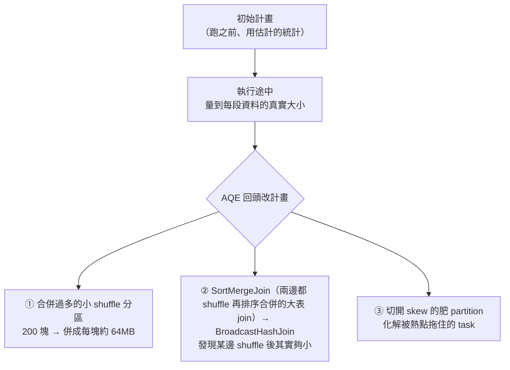
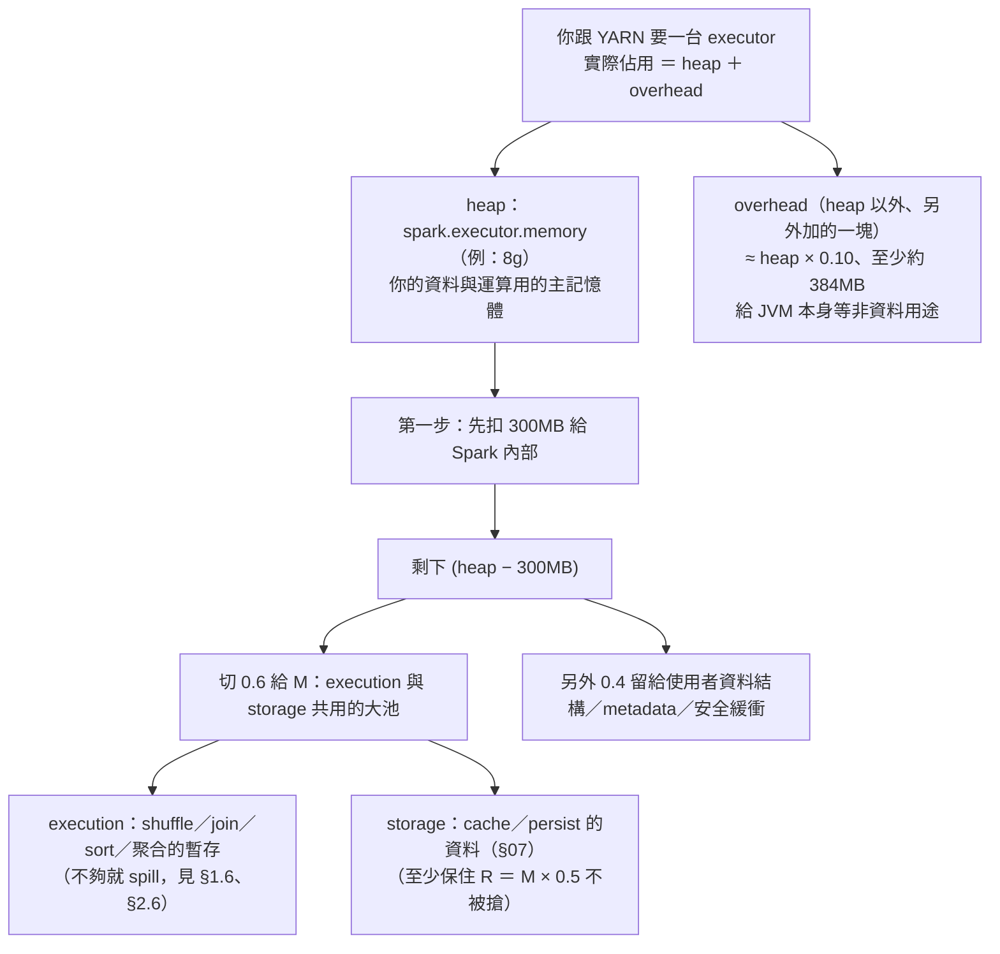
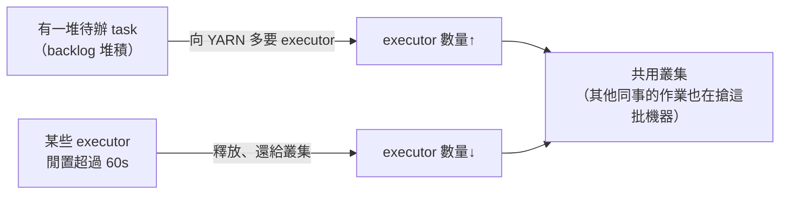

# 04 · Spark 設定（AQE-first）

> **本章前提**：你讀過[第 01 章](01-how-spark-runs-your-sql.md)（partition、shuffle、stage、task、spill，以及 executor 的 core／記憶體／台數取捨）、[第 02 章](02-diagnose-with-spark-ui.md)（用 Spark UI 的 Environment 頁籤確認設定生效、計畫根節點 `AdaptiveSparkPlan`／`isFinalPlan`）、[第 03 章](03-sql-tuning.md)（改 SQL 來少讀少搬、broadcast、`autoBroadcastJoinThreshold`、AQE skew join）；你會寫 SQL。
>
> 第 03 章是「**不動任何設定、光改寫法**」就能省。這一章談另一件事：**真的要動 Spark 設定時，動哪幾個、怎麼動、哪些別亂碰。** 核心心法只有一句——**AQE-first**：Spark 3.3 的 AQE 已經自動幫你處理掉多數 shuffle 痛點，你要做的多半只是「確認它開著」，而不是回到十年前那套手動調一堆靜態參數的習慣。
>
> 每節末附 📚 **來源**；章末「資料來源與精確度說明」列出哪些是刻意簡化、或工具沒能逐字查證的地方。

---

## 4.1 心法：先別急著轉旋鈕——AQE-first

第 02 章 §2.1 提過新手最常犯的錯：查詢一慢就開始亂槍打鳥，把記憶體調大、把 `spark.sql.shuffle.partitions` 改一改、到處加參數。這一章要先幫你**踩煞車**，建立兩個務實前提，再談該調什麼。

**前提一：對 SQL-first 的人，把 SQL 寫法和統計弄對，通常比硬調 config 省更多。** 第 03 章反覆說的那句——「**很多『慢』不是機器不夠，而是查詢白讀、白搬了一堆本來不必碰的資料**」——意思就是：你白讀白搬掉的量，給再多記憶體和核心也追不回來。所以動 config 之前，先確認第 03 章的少讀少搬（分區裁剪、別 `SELECT *`、broadcast 小表、節制 `COUNT(DISTINCT)`／window）和第 05 章的「喂統計」（`ANALYZE TABLE`）都做了。多數情況問題就解掉了，根本不必碰本章後半的資源旋鈕。

**前提二：Spark 設定分兩類，風險天差地遠——動之前先分清楚。**

- **SQL 層旋鈕**（`spark.sql.*`，如 `shuffle.partitions`、`autoBroadcastJoinThreshold`）：可以在你打 SQL 的當下臨時設、只影響接下來的查詢、隨時改回來。**低風險、可回退。**
- **資源層旋鈕**（`spark.executor.memory`／`cores`／台數、`spark.dynamicAllocation.*`、`spark.memory.fraction`）：在你這個 Spark 工作階段**啟動的那一刻就定死**，而且影響的是整支作業要佔叢集多少資源——調錯不是慢一點，是 **OOM（記憶體爆掉）或佔住資源排擠別的作業**。**高風險、要連多租戶一起想。**

本章順著這個風險梯度走：先講 AQE 自動做了什麼、怎麼確認它開著（§4.2–§4.3），再講剩下少數值得手動碰的 SQL 旋鈕（§4.4），最後才碰資源層（§4.5–§4.7），用一個排程作業的例子串起來（§4.8）。

> 📚 **來源**：「先量再調、別亂槍打鳥」見第 02 章 §2.1 與《Spark: The Definitive Guide》Ch.18–19；AQE 自動處理 shuffle 相關優化見 [Spark SQL Performance Tuning（Adaptive Query Execution）](https://spark.apache.org/docs/latest/sql-performance-tuning.html)；config 分「啟動時決定」與「執行期可改」兩類見 [Spark Configuration](https://spark.apache.org/docs/latest/configuration.html)（Spark properties 一節）。

---

## 4.2 AQE 自動幫你做的三件事

**AQE**（Adaptive Query Execution，自適應查詢執行）是 Spark 用「執行途中**真正量到**的資料大小」回頭修改執行計畫的機制——不像傳統優化器只能靠跑之前的**估計**。它從 **Spark 3.2 起預設開啟**（`spark.sql.adaptive.enabled` 預設 `true`），所以你在 3.3 上多半已經在享受它，只是沒意識到。

它在執行期自動做三件事，**而這三件正好就是第 03 章你手動在煩惱的事**：



- **① 合併過多的小 shuffle 分區（coalesce）**：第 01 章 §1.6 講過，shuffle 後的分區數被固定重設成 `spark.sql.shuffle.partitions`（**預設 200**）。如果結果其實只有幾 MB，200 塊就是 200 個幾乎空的 task ＋一堆小檔。AQE 在執行時看到實際資料量小，會把這些小分區**併成每塊大約 64MB**（`advisoryPartitionSizeInBytes`，預設 64MB）。所以在 AQE 下，200 比較像「起始的塊數上限」，真正剩幾塊由它依資料量往下併。
- **② 把 sort-merge 動態改成 broadcast**：第 03 章 §3.5 講過。就算計畫階段因為估不準而排了昂貴的 `SortMergeJoin`（兩邊都 shuffle 再排序合併的大表 join），執行時 shuffle 完發現某一邊其實小於廣播門檻，AQE 會**當場改走 broadcast**，省掉那次 shuffle。
- **③ 處理 skew join**：第 03 章 §3.10 講過。AQE 自動偵測「大得異常」的 partition，把它**切成幾小塊並行處理**，化解那個把整個 stage 拖住的肥 task。

換句話說：第 03 章你費心在煩惱的分區數、broadcast、skew，AQE 在執行期用**真實數字**幫你自動處理了一輪。這就是為什麼本章敢叫你「先別調」——底氣來自 AQE 已經在做事。

> 📚 **來源**：AQE「利用 runtime 統計選最有效率的計畫」並做 coalescing post shuffle partitions／converting sort-merge join to broadcast hash join／optimizing skew joins，`spark.sql.adaptive.enabled` 自 3.2.0 起預設 `true`、`shuffle.partitions` 預設 200、`coalescePartitions.enabled` 預設 `true`、`advisoryPartitionSizeInBytes` 預設 64MB，見 [Spark SQL Performance Tuning（Adaptive Query Execution）](https://spark.apache.org/docs/latest/sql-performance-tuning.html)；三件事分別對應第 01 章 §1.6、第 03 章 §3.5／§3.10。

---

## 4.3 確認 AQE 開著、怎麼用 `SET` 改設定

既然這麼依賴 AQE，第一件事是**確認它真的開著**（環境可能被前人關掉）。兩個地方看：

1. **跑完的查詢——Spark UI 的 SQL 頁籤**（§2.5）：用了 AQE 的查詢，計畫根節點會是 `AdaptiveSparkPlan`，跑完後 `isFinalPlan=true`。
2. **Environment 頁籤**（§2.4，「我的設定生效了嗎」那一頁）：直接搜 `spark.sql.adaptive.enabled`，看值是不是 `true`。

**怎麼改設定？在 Hue／notebook 用 `SET`。** 在你的查詢前面下 `SET`，對**接下來的查詢**生效：

```sql
SET spark.sql.adaptive.enabled=true;     -- 設值
SET spark.sql.shuffle.partitions=400;    -- 設值
SET spark.sql.adaptive.enabled;          -- 只給 key、不給值 = 查目前值
```

但這裡有個 **SQL-first 的人最容易誤會、白忙一場**的關鍵分野——回到 §4.1 的兩類旋鈕：

| 旋鈕類別 | 例子 | `SET` 能即時改嗎？ | 怎麼改 |
|---|---|---|---|
| **SQL 層**（`spark.sql.*`） | `shuffle.partitions`、`autoBroadcastJoinThreshold`、`adaptive.enabled` | ✅ 能，下一條查詢就生效，可隨時改回 | 在 Hue／notebook `SET` |
| **資源層** | `executor.memory`／`cores`／`instances`、`dynamicAllocation.*`、`memory.fraction` | ❌ **不能**——這些在你的 Spark 工作階段**啟動時就定死了**，啟動後 `SET` 不會改變你已經拿到的 executor | 在工作階段啟動時給（`spark-submit` 參數、Hue／Livy session 設定、notebook kernel 設定），或請平台調 |

**徵兆**：你 `SET spark.executor.memory=16g` 之後，跑去 Executors 頁籤一看，記憶體還是原本的數字——不是沒生效失敗，而是它**早在啟動時就定了**，`SET` 對它無效。資源類要調，得在「開這個 session」的時候就給。

（一個小例外要知道：`spark.sql.*` 裡有極少數是 **static（靜態）SQL config**，例如倉儲路徑 `spark.sql.warehouse.dir`——這些跟資源層一樣在啟動時定死，`SET` 它會直接報錯 `Cannot modify the value of a static config`。但本章點到的 `shuffle.partitions`／`autoBroadcastJoinThreshold`／`adaptive.enabled` 都是**可即時改的 runtime config**，放心調。)

你在 Hue 打 SQL 時，能改的就是 `spark.sql.*` 那一類 runtime config；至於 executor 大小、台數這些**資源層**——它們**不是你在 Hue 的查詢框裡能改的**，而是由你連上的那個 Spark 工作階段在啟動時決定（在 CDP 上，這個工作階段常透過一個叫 **Livy** 的服務（Hue 背後幫你開 Spark session 的服務，你不用直接操作它）、或 notebook 的 kernel 設定來開）。所以實務上，你多半是**請平台管理者**幫你把資源調好，或在「能設定 session 啟動參數的地方」（如 notebook 的啟動設定）給。這也呼應 §4.1——對日常 SQL-first 工作，你**能**動、**該**動的，主要就是低風險的 SQL 層。

打開 Environment 頁籤大致會看到這樣一張表（**數字為示意**，你環境的值多半不同）：

| 屬性 | 值 |
|---|---|
| `spark.sql.adaptive.enabled` | `true` |
| `spark.sql.shuffle.partitions` | `200` |
| `spark.sql.autoBroadcastJoinThreshold` | `10485760` |
| `spark.executor.memory` | `8g` |
| `spark.executor.cores` | `5` |
| `spark.dynamicAllocation.enabled` | `true` |

養成習慣：調完設定、或懷疑某個值沒生效時，**先來這頁對一下實際值**，別只憑你以為設了什麼。

> 📚 **來源**：`SET key=value` 設定、`SET key` 查值、`SET` 列出 session 設定見 [Spark SQL — SET 語法](https://spark.apache.org/docs/latest/sql-ref-syntax-aux-conf-mgmt-set.html)；「Spark properties 分『啟動時透過 SparkConf 給』與『runtime 可調的 SQL config』兩類」見 [Spark Configuration](https://spark.apache.org/docs/latest/configuration.html)；確認 AQE 用 `AdaptiveSparkPlan`／`isFinalPlan` 見第 02 章 §2.5、Environment 頁籤見 §2.4。⚠️「資源層 `SET` 不生效、SQL 層生效」是依「config 在 SparkContext 啟動後可否變更」的通則；個別 config 是否真的即時生效，以 Environment 頁籤實際值為準。

---

## 4.4 AQE 之後，還值得手動懂的少數 SQL 旋鈕

即使 AQE 自動做了很多，有三個 SQL 層旋鈕你該認得——它們都在前面章節出現過、都能 `SET`、都可回退，是你日常**最該先碰、也最安全**的調整對象：

| 旋鈕 | 預設 | 調它做什麼 | 取捨／風險 |
|---|---|---|---|
| `spark.sql.shuffle.partitions` | 200 | shuffle 後的（起始）分區數 | AQE 開時多半不用動；資料**超大**時 200 起點太少、每塊太大狂 spill（溢寫到磁碟，詳見 §4.5）（AQE 只併小、不拆大），才調大（如 400／1000）給 AQE 更細的起點 |
| `spark.sql.autoBroadcastJoinThreshold` | 10MB | 「多小才自動廣播」的門檻 | 調大→更多 join 走 broadcast 省 shuffle，但 driver 收集＋每台 executor 各存一份的**記憶體風險上升**（§3.5／§1.7）；這個爆的是 **driver** 端記憶體（見 §4.5 driver 小節），不是 executor；設 `-1` 關閉自動廣播（極少用） |
| `spark.sql.files.maxPartitionBytes` | 128MB | 讀檔時每個 partition 多大（§1.2） | 少數大檔想要更高讀檔平行度→調小（切更多塊）；但小檔太多的治本在第 05 章，不是這裡 |

三個都記同一個原則：**它們是「§03 改寫法、§05 補統計都做完之後」才輪到的微調**，不是第一手段。

特別說 `shuffle.partitions` 為什麼「AQE 下角色變了」：以前沒有 AQE 時，這個值要自己抓得剛好（太小每塊太大、太大一堆空 task、寫出時還散成一堆小碎檔），很難。現在 AQE 會把過多的小分區往下併（§4.2 ①，順帶也讓**寫出的小檔變少**——但小檔的完整成因與儲存層解法是第 05 章的主題），所以**你只要別把它設得太小**就好——它比較像給 AQE 的「起始塊數上限」，剩下的它自己收。唯一 AQE 幫不上的是「每塊太大」那頭（第 01 章 §1.6 的 ⚠️：AQE 只合併過小、不拆過大），那種情況才需要你手動把它調大。

> 📚 **來源**：`spark.sql.shuffle.partitions`（200）、`spark.sql.autoBroadcastJoinThreshold`（`10485760`＝10MB，設 `-1` 停用）、`spark.sql.files.maxPartitionBytes`（128MB）見 [Spark SQL Performance Tuning](https://spark.apache.org/docs/latest/sql-performance-tuning.html) 與 [Spark Configuration](https://spark.apache.org/docs/latest/configuration.html)；AQE 合併小分區但「只併不拆」見第 01 章 §1.6 與 §4.2；broadcast 的記憶體代價見第 03 章 §3.5、第 01 章 §1.7。

---

## 4.5 一個 executor 的記憶體裡裝了什麼：execution／storage／overhead

> **進階** — 日常只跑 ad-hoc 的讀者可先跳到 §4.8；要替排程作業配資源、跟同事共用叢集再回來細讀。

要碰資源層之前，得先看懂「記憶體」這塊。第 01 章 §1.7 說 executor 的記憶體被同時跑的 task 分掉、不夠就 spill。這節把那塊記憶體**拆開**看，你才知道 spill 時該往哪想、加記憶體加在哪。

你跟 YARN 要一個 executor、給它 `spark.executor.memory=8g`，這 8g 是它的 **heap**——也就是 Spark 所在的 **JVM**（Java 虛擬機，Spark 跑在它上面）拿來放「你的資料物件和運算暫存」的主記憶體區。但這塊 heap **不是整塊都拿去算你的資料**，而且 heap 之外還得**另外**再要一塊。由外而內拆：



- **overhead（heap 以外另外要的一塊）**：`spark.executor.memoryOverhead`，預設 ＝ `executor.memory × 0.10`、至少約 **384MB**。它**不在 heap 裡**，是另外加的，給 JVM 本身的額外開銷（VM overhead、interned strings、其他 native 記憶體，以及同一個 container 內的其他行程）等**非資料**用途。**YARN 實際從叢集扣的是 heap ＋ overhead**——你要 8g heap，它其實佔約 8.8g（這正是 §1.7 說「太瘦時 overhead 台數越多、被它吃掉的總量越多」的來源）。
- **heap 裡再分成三塊**（這套叫 unified memory，統一記憶體管理）：
  - **先扣 300MB** 給 Spark 內部固定開銷。
  - **M ＝（heap − 300MB）× `spark.memory.fraction`（預設 0.6）**：這是 execution 與 storage **共用**的大池。
    - **execution memory**：做 shuffle／join／sort／聚合時的運算暫存。**不夠用，就是 §1.6／§2.6 那個 spill**（溢寫到磁碟）。
    - **storage memory**：你用 `cache()`／`persist()`（第 10 章）存起來的資料放這。
  - **剩下約 40%**：留給使用者資料結構、Spark metadata、和估算誤差的安全緩衝。
- **execution 與 storage 會動態互相借用**：沒人 cache 時，execution 可以用滿整個 M；要 cache 時，storage 至少保得住 **R ＝ M × `spark.memory.storageFraction`（預設 0.5）** 這一塊不被搶走。execution 可以逼退 storage 一直到 R 為止，反過來 storage 不能逼退 execution。

**所以 spill 時該怎麼想？** §2.6 的 Summary Metrics 看到 `Shuffle spill` 非零，意思是「M 裡的 execution 那部分，相對你要處理的資料量太小了」。救法的**優先序**（從最有效到最後手段）：

1. **先減量（第 03 章）**：先 `WHERE` 過濾、先聚合再 join、別爆量 join——讓每個 task 要嚼的資料變少。**這幾乎永遠是最有效的**，因為它治的是「白搬」。
2. **提高平行度**：把資料切成更多、更小的塊，每個 task 要嚼的就變少（用 §4.4 的旋鈕：調大 `shuffle.partitions` 讓 shuffle 後切更多塊、或調小 `files.maxPartitionBytes` 讓讀檔切更多塊）。
3. **最後才加記憶體**：真的是資料量本來就大、前兩步都做了還在 spill，才加 `executor.memory`。

注意 `spark.memory.fraction`（0.6）和 `storageFraction`（0.5）這兩個官方明說「**建議維持預設**」——它們不是你日常該動的旋鈕，知道記憶體**怎麼分**、好在 spill 時判斷往哪救，比去調它們重要得多。

**Driver 也是一個獨立的 YARN container，別漏掉它。** 上面說的 execution／storage／overhead 全是 **executor** 的記憶體。除了 executor，**driver** 也會跟 YARN 要一個獨立的 container，由 `spark.driver.memory` 控制（預設 1g）。大量 `collect()`（把資料從 executor 抓回 driver）、或廣播小表時「在 driver 端把那份要廣播的資料組裝好再推出去」，都吃的是 driver 記憶體——**配再多 executor 記憶體也擋不住 driver OOM**。

> 📚 **來源**：`spark.executor.memoryOverhead` ＝ `executorMemory × memoryOverheadFactor`（預設 0.10）、最低約 384MB、用於 VM／native／shuffle 等非 heap 開銷，`spark.memory.fraction`（0.6，為「(heap − 300MB)」的比例，官方註明 leaving at default is recommended）、`spark.memory.storageFraction`（0.5，為 M 內 R 的比例）見 [Spark Configuration](https://spark.apache.org/docs/latest/configuration.html)；unified memory 的 M／R、execution 可逼退 storage 到 R、反之不行、無 cache 時 execution 可用滿 M，見 [Spark Tuning（Memory Management Overview）](https://spark.apache.org/docs/latest/tuning.html)；spill 出現在 §2.6 Summary Metrics、減量解法見第 03 章。⚠️「要 8g 佔約 8.8g」是 overhead ＝ 8g×0.10 的算術示意；overhead 有最低約 384MB 的下限，極小／極大 executor 與非 JVM 任務情況不同。

---

## 4.6 給 executor 配多少：core、記憶體、台數的實際設定

> **進階** — 日常只跑 ad-hoc 的讀者可先跳到 §4.8；要替排程作業配資源、跟同事共用叢集再回來細讀。

第 01 章 §1.7 用「胖 vs 瘦 executor」建立了取捨的直覺；這節給「實際要設哪幾個、在哪設」。三個資源層旋鈕（都在工作階段**啟動時**給，§4.3）：

- **`spark.executor.cores`**：每台幾個 core ＝ 這台**同時能跑幾個 task**（§1.7）。
- **`spark.executor.memory`**：每台的 heap（就是 §4.5 那塊被分配的記憶體）。
- **`spark.executor.instances`**：開幾台。（開了 dynamic allocation 時，這個變成初始值、真正範圍由 min／max 控，見 §4.7。）

**先提醒一個常見誤判**：`executor.memory` 的開源預設是 `1g`、`executor.cores` 在 YARN 上預設 `1`——但你的 CDP 環境**幾乎一定被 Cloudera Manager 或 session 設定改過**。所以**別假設你拿到的是 1g／1 core**，去 Environment 頁籤（§4.3）看實際值。

**工作範例**（接續 §1.7 的「YARN 給你共 100 core、400 GB」）。假設你想配成「每台 5 core」的瘦中帶胖（§1.7 說每台**至多約 5 個** core 是 HDFS 吞吐與管理開銷的平衡點，再多反而拖累吞吐）：

1. **台數**：100 core ÷ 每台 5 core ＝ **20 台**。
2. **每台跟 YARN 要的總額（含 overhead）**：400 GB ÷ 20 台 ＝ 每台 **20 GB**。
3. **從總額反推 heap**：§4.5 說 YARN 實際佔的是 heap ＋ overhead ＝ heap ＋ heap×0.10 ＝ **heap × 1.1**。所以要從「每台總額 20 GB」反推 heap，是 **20 ÷ 1.1 ≈ 18 GB**（不是 ×0.9），剩下的 overhead ≈ 1.8 GB。
4. **啟動時這樣給**（不能用 `SET`，§4.3）：

```bash
--num-executors 20 --executor-cores 5 --executor-memory 18g
# overhead 不必手動給，預設 = 18g × 0.10 ≈ 1.8g 會自動算上；YARN 每台實際佔 ≈ 20g
# 注意：--num-executors（命令列參數）與 spark.executor.instances（設定鍵）是同一件事，只是介面不同
```

這就和 §1.7 表格裡那個「20 台 × 5 core × 20 GB」的瘦 executor 對上了——只是這裡把它**翻成實際的啟動參數**。（提醒口徑：§1.7 的「20 GB」指每台跟 YARN 要的**總額**、含 overhead；這裡把它拆成 `executor.memory` 18g 的 heap ＋ 約 1.8g overhead。）

**配資源最常見的兩種死法**（症狀像、成因不同，先看 YARN ResourceManager 的頁面/日誌分辨）：(1) 單一 executor 或 driver 配**超過叢集層上限**（`yarn.scheduler.maximum-allocation-mb` 或 `maximum-allocation-vcores`，由叢集管理者設定）——YARN 給不出這麼大的 container，會**直接拒絕這個請求**（拋 `InvalidResourceRequestException`、作業根本起不來、立刻報錯）；(2) 大小沒超上限、但你所在 queue 當下被佔滿——作業會**卡在 ACCEPTED 狀態**等別人釋放資源。第一種改小 executor／driver、第二種等或換 queue。配之前先確認你的 executor 大小沒超過叢集的 container 上限。

**別忘了 driver 也是一個獨立的 YARN container**，由 `spark.driver.memory` 控制（預設 1g）。大量 `collect()`、把結果抓回 driver、或廣播小表時「在 driver 端組裝那份要廣播的資料」，都吃 driver 記憶體，**配再多 executor 也擋不住 driver OOM**。實務上 driver 給 2–4g 通常夠，但若作業大量 collect 結果，要相應加大。

**取捨**（每個方向都連到 §1.7 的直覺）：

- **core 調多**：平行度高，但同台記憶體被更多 task 分細、更容易 spill（§4.5），且一台對 HDFS 開太多讀取反而卡吞吐。
- **台數調多**：每台都要一份 overhead、廣播的小表要每台各複製一份（§3.5／§1.7），台數越多這些**固定成本的總量**越大。
- **記憶體調大**：單一 task 寬裕、少 spill，但每台佔 YARN 越多 → 你能同時開的台數越少、或**佔住叢集讓鄰居沒資源**（這就引到下一節的多租戶）。

> 📚 **來源**：`spark.executor.memory` 預設 `1g`、`spark.executor.cores` 在 YARN 預設 `1`（standalone 為該 worker 全部 core）、`memoryOverhead ＝ memory × 0.10`（最低約 384MB）見 [Spark Configuration](https://spark.apache.org/docs/latest/configuration.html)；「每 executor 約 4～5 core 平衡 HDFS 吞吐與開銷」見 [Cloudera CDP：Tuning Resource Allocation](https://docs.cloudera.com/runtime/7.2.10/tuning-spark/topics/spark-admin-tuning-resource-allocation.html)（目標環境同系）與第 01 章 §1.7。⚠️「100 core／400 GB → 20 × 5 core × 18g(+1.8g overhead)」是把總額度乾淨對切的示意，未含 driver／ApplicationMaster／節點其他開銷；實際每台還受 YARN container 上限與節點規格限制，以你環境為準。

---

## 4.7 dynamic allocation 與多租戶：別佔住資源排擠別的作業

> **進階** — 日常只跑 ad-hoc 的讀者可先跳到 §4.8；要替排程作業配資源、跟同事共用叢集再回來細讀。

到這裡進入**營運層**。前一節那種「`--num-executors 20` 一直掛著」的**靜態配置**有個問題：你的作業跑完了、或中途在等上游／在 spill 的空檔，那 20 台還掛在你名下，別人用不到。叢集是整個部門共用的（**多租戶**：多個使用者／作業共用同一批機器）。

**dynamic allocation（動態資源配置）** 解這件事：讓 Spark 隨工作量自動增減 executor——有一堆待辦 task（backlog）就向 YARN 多要、閒置就還回去給叢集。



**一個重要的環境差異，務必記住**：

- **開源 Spark 預設 `spark.dynamicAllocation.enabled=false`**（要自己開）。
- **但 CDP 預設是開的**——所以你在公司環境多半**已經在用** dynamic allocation。這時 `--num-executors` 變成「初始台數」，真正的範圍由 `minExecutors`（預設 0）和 `maxExecutors`（預設無上限）框住；executor 閒置超過 `executorIdleTimeout`（預設 60s）就會被釋放。（它能在釋放一台 executor 之後、仍不弄丟那台已經寫好的 shuffle 中間檔，靠的是一個**獨立保管這些中間檔的常駐服務**〔即 external shuffle service〕、或等價的 shuffle 追蹤機制——CDP 已經幫你設好，你不必管。）

**多租戶的第一道防線是 YARN queue，不是 `maxExecutors`。** 在多人共用叢集的環境，`spark.yarn.queue` 指定你的作業跑在哪個 **YARN queue**（預設是 `default`）。Queue 的容量上限由叢集管理者在 YARN 端配置，你的作業能拿到的資源**不會超過該 queue 的容量**——即使你把 `maxExecutors` 設得再大，YARN 也不給、作業搶不到。因此「設一個合理的 `maxExecutors`」的合理依據是**你所在 queue 的容量**，而不是憑空填。（不確定你的 queue 容量多少，問叢集管理者；或看 YARN ResourceManager UI 的 Scheduler 頁面。）

**對排程作業（第 07 章）的實務建議**：

- **設一個合理的 `maxExecutors`**，別讓它無上限——否則你的作業在半夜尖峰可能把整個叢集（或整個 queue）吃光，**排擠**同時在跑的其他作業。`maxExecutors` 設多少，參照你 queue 的容量與這支作業該佔的份額。
- **別對 streaming 作業開** dynamic allocation（持續不斷處理的串流，不是你的批次排程；批次讀者可略過——Cloudera 明確提醒兩者會衝突）。本手冊以批次為主，但知道有這個雷。
- **要穩定達成 SLA**（service-level agreement，對下游的服務承諾，例如「保證每天早上 8 點前把表產好」）**的關鍵作業**，可以給較高的 `minExecutors`，確保它一啟動就有基本資源、不必慢慢長。

**取捨**：dynamic allocation 把資源讓回叢集（對鄰居好、整體吞吐高），代價是 executor 反覆起降有啟動延遲、且要靠 shuffle service／tracking 保留中間資料。在多租戶環境，這個取捨幾乎**永遠該選「用它」**——重點是把 `maxExecutors` 框好。

> 📚 **來源**：`spark.dynamicAllocation.enabled`（開源預設 `false`）、`shuffleTracking.enabled`（`false`）、`minExecutors`（0）、`maxExecutors`（infinity）、`executorIdleTimeout`（60s）、需 external shuffle service 或 shuffle tracking 為前提，見 [Spark Configuration（Dynamic Allocation）](https://spark.apache.org/docs/latest/configuration.html) 與 [Spark Job Scheduling](https://spark.apache.org/docs/latest/job-scheduling.html)；**CDP 預設啟用 dynamic allocation**、可在 Cloudera Manager 以 `spark.dynamicAllocation.enabled=false` 關閉、streaming 應停用，見 [Cloudera CDP：Dynamic allocation](https://docs.cloudera.com/runtime/7.2.18/running-spark-applications/topics/spark-yarn-dynamic-allocation.html)。多租戶與排程營運見第 07 章。

---

## 4.8 把它全部串起來：替一支排程特徵作業配置

把這章的零件組到一個真實情境上。**情境**：你要把一支「每天算全行客戶特徵寬表」的排程作業（第 07 章那種）從「能跑」調到「跑得穩、又不擾鄰」。資料量是 3000 萬筆／月帳務 join 1000 萬客戶、加上好幾個 window。

照本章的風險梯度，**由低風險到高風險**地動：

1. **先別碰任何 config——把 SQL 弄對（第 03、05 章）。** 分區裁剪只算當天／當月（§3.2）、別 `SELECT *`（§3.3）、多個 window 共用同一個 `PARTITION BY`（§3.9）、小維度表走 broadcast（§3.5）；對大表跑 `ANALYZE TABLE`（§05）讓 Spark 估得準、broadcast 不誤判。**多數的慢在這一步就解掉了。**
2. **確認 AQE 開著（§4.3）。** Environment 頁籤看 `adaptive.enabled=true`、跑完看 `isFinalPlan=true`。分區合併、skew join、動態 broadcast 就自動有了——你不必手動調分區數。
3. **看 §2.6 的 Summary Metrics（在 Spark UI Stages 頁，見 §2.6）判斷還缺什麼。** 還在 spill？→ 先回第 1 步再減量、或 §4.4 把 `shuffle.partitions` 調大給 AQE 更細的起點；**真的是資料量本來就大、前面都做了**，才到第 4 步加記憶體。
4. **配資源（§4.6）。** 例如 `--executor-cores 5 --executor-memory 18g`；因為 CDP 的 dynamic allocation 已開（§4.7），重點是**設一個合理的 `maxExecutors`（例如 30）**，避免半夜尖峰把叢集吃光、排擠別的作業。這個數字的依據是你所在 YARN queue 的容量與這支作業該佔的份額粗估，不是固定值——queue 容量不同、合理的 `maxExecutors` 就不同，先問叢集管理者或看 YARN Scheduler 頁面。
5. **上線後持續看（第 07 章監控）。** 用 History Server（§2.2）比較「這支作業這週和上週各跑多久、搬多少」，等資料長大、開始退化，再回頭調——而且多半又是回到第 1 步。

一句話：**先 SQL、再確認 AQE、最後才動資源；而動資源時，連同多租戶一起想。**

> 這條流程沒有用到任何新東西，全是 §4.1–§4.7 的零件，外加第 02、03 章的診斷與改寫。（本節數字為示意，實際以你環境跑出來為準。）

---

## 4.9 一句話帶走：AQE-first，先 SQL 再資源

把這章收成一條操作原則：

> **AQE-first：Spark 3.3 的 AQE 已自動處理多數 shuffle 痛點（合併分區、動態 broadcast、skew join），先確認它開著；真要調，先動低風險、可回退的 SQL 層旋鈕（`shuffle.partitions`／`autoBroadcastJoinThreshold`／`files.maxPartitionBytes`），資源層（executor 的 core／記憶體／台數、dynamic allocation）只能在啟動時給、且要連多租戶一起想。而對 SQL-first 的人，第 03 章改寫法 ＋ 第 05 章喂統計，多半比硬調 config 省更多。**

最關鍵的直覺：**config 不是第一手段，而是「白讀白搬都消除掉之後」的微調**；資源給再多，也追不回被白白搬掉的那一大筆。

接下來：

- 很多「該 broadcast 卻沒有」「Spark 估不準」其實根源在**資料怎麼存**——沒分區、沒跑統計、滿地小檔？→ 第 05 章（partition 設計、檔案格式、`ANALYZE TABLE`）。
- 這支排程作業怎麼**長期穩定營運**（冪等可重跑、回填、跟鄰居要資源、監控退化）？→ 第 07 章。
- 想看「我這類工作（ad-hoc／排程／特徵）通常照哪些章、最常踩什麼雷」？→ 見[首頁〔場景對應〕](index.md#場景對應先認出你在做哪種工作)。

---

## 資料來源與精確度說明

**版本對齊**：本章 Spark 官方連結指向「最新版」頁面（撰寫時自動工具無法直接驗證版本鎖定的 3.3.2 頁是否可達，且 `latest` 目前已指向 4.x）。要對齊本手冊版本，把網址裡的版本字串改掉即可：`…/docs/latest/…` → `…/docs/3.3.2/…`。本章引用的關鍵預設值——`adaptive.enabled` 自 3.2 起 `true`、`shuffle.partitions` 200、`autoBroadcastJoinThreshold` 10MB、`files.maxPartitionBytes` 128MB、`advisoryPartitionSizeInBytes` 64MB、`memory.fraction` 0.6、`storageFraction` 0.5、`memoryOverheadFactor` 0.10、dynamic allocation 各項——皆已對 Spark 3.3 文件核對，且自 3.2／3.3 起到 4.x 未變。

**本章刻意簡化、或屬「方向正確但需以你環境為準」之處**（自行斟酌）：

1. **§4.6 executor 預設值**：`executor.memory=1g`、`executor.cores=1`(YARN) 是**開源預設**；你的 CDP 環境幾乎一定被 Cloudera Manager／session 改過，以 Environment 頁籤實際值為準，別假設是預設。
2. **§4.7 dynamic allocation 預設**：開源 Spark 預設 `false`、**CDP 預設 `true`**——這是重要環境差異，以你平台 Cloudera Manager 實際設定為準。
3. **§4.1／§4.9「改 SQL ＋ 喂統計 > 硬調 config」**：是對 SQL-first 讀者的**方向性**建議（因為多數慢來自白讀白搬，不是資源不足），**非任何情況皆然**；資源真的不足時，仍需照 §4.5–§4.7 調資源。
4. **§4.3 `SET` 生效範圍**：「SQL 層（`spark.sql.*`）`SET` 即時生效、資源層 `SET` 不改變已啟動的 executor」是依「config 在 SparkContext 啟動後可否變更」的通則。一個例外：`spark.sql.*` 裡少數是 **static SQL config**（如 `spark.sql.warehouse.dir`），同樣在啟動時定死、`SET` 會報 `Cannot modify the value of a static config`；本章點名的 `shuffle.partitions`／`autoBroadcastJoinThreshold`／`adaptive.enabled` 三個都是可即時改的 runtime config。個別 config 是否真的即時生效，以 Environment 頁籤實際值／實測為準。
5. **§4.5／§4.6 記憶體算術**：「要 8g 佔約 8.8g」「18g heap ＋ ≈1.8g overhead」為 `overhead ＝ memory × 0.10` 的算術示意；overhead 有最低約 **384MB** 的下限，極小／極大 executor、非 JVM 任務（如 K8s 的 0.40）情況不同。`memory.fraction` 0.6 是「(heap − 300MB)」的比例、`storageFraction` 0.5 是「M 內 R」的比例，官方建議維持預設，本章不鼓勵調。
6. **§4.6 資源配置範例**：`100 core／400 GB → 20 × 5 core × 18g` 是把總額度乾淨對切的教學示意，未扣 driver／ApplicationMaster／節點其他開銷，也未考慮 YARN container 上限；實際配置以你叢集規格與額度為準。
7. **§4.2／§4.4 AQE「只合併過小、不拆過大」**：見第 01 章 §1.6——超大資料下 `shuffle.partitions` 200 起點過小、每塊過大導致 spill 時，AQE 不會幫你拆，仍需手動把它調大。
8. **§4.3 Environment 面板**：表中數字為**示意**，幫你想像畫面；轉成 HTML 時可替換成你公司環境的真實 Spark UI 截圖。

> 引用原則：以 Spark 官方文件、Cloudera CDP 官方文件、Spark 核心開發者文章（如 Databricks）、《Spark: The Definitive Guide》(Chambers & Zaharia)、《High Performance Spark》(Karau & Warren) 為限，不引用未經認證的個人部落格。

---

*←上一章* [03 · SQL 寫法優化](03-sql-tuning.md)　|　*下一章 →* [05 · 儲存效率](05-storage-efficiency.md)　|　*回* [手冊首頁](index.md)
