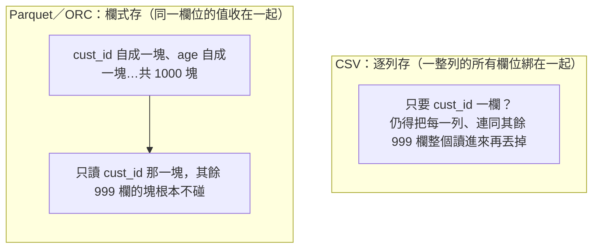
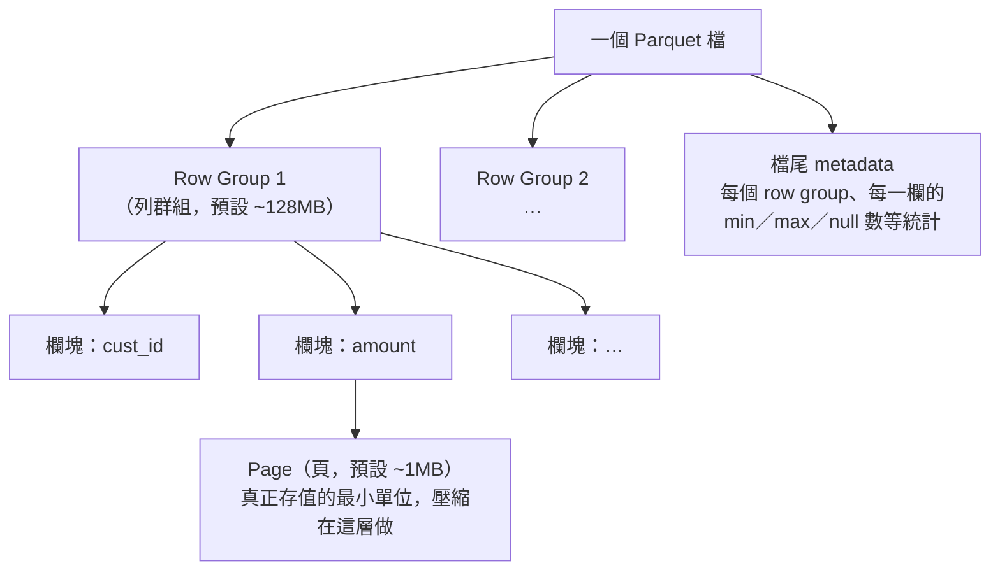
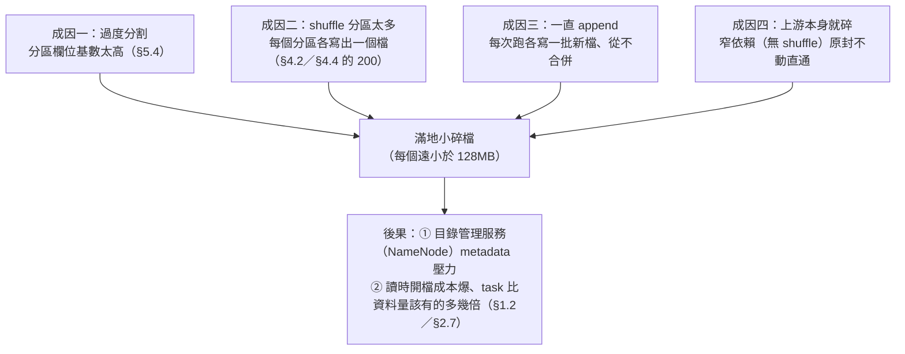

# 05 · 儲存效率

> **本章前提**：你讀過[第 01 章](01-how-spark-runs-your-sql.md)（partition、shuffle、task、spill 的心智模型，以及讀檔每塊約 128MB→一個 task）與[第 03 章](03-sql-tuning.md)（改 SQL 來少讀少搬，尤其 §3.2 partition 裁剪、§3.3 別 `SELECT *`、§3.4 predicate pushdown）；你會寫 SQL。
>
> 第 03 章教你「**改寫法**就能少讀」，但有個前提：表得**存得對**，真的有分區、用對格式、有統計。這一章談的是「**改存法**」：資料怎麼落到磁碟，決定了上游每一條查詢能少讀多少、會不會被一堆小碎檔拖垮。對要長期營運排程產表、經營共用資料產品（如特徵庫）的人，這一章是地基。
>
> （本章偶爾引用第 02 章的 Spark UI、第 04 章的 AQE 細節，都會在當場給足脈絡，沒讀過不影響理解；例如 §5.5 的「徵兆」雖提到第 02 章的 Spark UI，但同段也給了不靠 UI、直接看目錄的判斷法。）
>
> 每節末附 📚 **來源**；章末「資料來源與精確度說明」列出哪些是刻意簡化、或工具沒能逐字查證的地方。

---

## 本章目錄

- [5.1 本章地圖：第 03 章靠寫法少讀，這章靠存法讓你「能」少讀](#51-本章地圖第-03-章靠寫法少讀這章靠存法讓你能少讀)
- [5.2 用對格式：為什麼 Parquet／ORC 比 CSV 快又省](#52-用對格式為什麼-parquetorc-比-csv-快又省)
- [5.3 壓縮：snappy（快）vs zstd／gzip（小）的取捨](#53-壓縮snappy快vs-zstdgzip小的取捨)
- [5.4 設計 partition：選對欄位，但別過度分割](#54-設計-partition選對欄位但別過度分割)
- [5.5 管好檔案大小：小碎檔問題](#55-管好檔案大小小碎檔問題)
- [5.6 餵統計：`ANALYZE TABLE` 為什麼關鍵](#56-餵統計analyze-table-為什麼關鍵)
- [5.7 bucketing：何時有用，以及 Hive／Spark 不相容的雷](#57-bucketing何時有用以及-hivespark-不相容的雷)
- [5.8 營運共用資料表：Hive 3 的 managed／external、與 schema 演進](#58-營運共用資料表hive-3-的-managedexternal與-schema-演進)
- [5.9 把它全部串起來：設計一張每月帳務彙總表](#59-把它全部串起來設計一張每月帳務彙總表)
- [5.10 一句話帶走：存得對，上游每條查詢都省](#510-一句話帶走存得對上游每條查詢都省)

---

## 5.1 本章地圖：第 03 章靠寫法少讀，這章靠存法讓你「能」少讀

第 03 章的「少讀」（partition 裁剪、只取需要欄位、讓條件下推）全都**有個沉默的前提**：

- partition 裁剪能成立，是因為表**真的按那個欄位分區存**了；
- 「只讀需要的欄位」省得到，是因為表用了**欄式格式**（Parquet／ORC）；
- predicate pushdown 跳得掉資料塊，是因為檔案內部**存了統計**讓 Spark 知道哪塊可以跳。

換句話說：**第 03 章是「用對的寫法去花用存法給你的本錢」，這一章是「先把本錢存進去」。** 同一條查詢，跑在「存得好」的表上可能秒回，跑在「存得爛」的表（沒分區、CSV、滿地小檔、沒統計）上再怎麼改寫法都快不起來。

這章四個主軸，對著第 01 章「少讀」「別被小檔拖累」展開：

1. **用對格式**（§5.2 Parquet／ORC）＋**壓縮**（§5.3）：讓每一欄、每一塊都小而好跳。
2. **設計 partition**（§5.4）：讓 `WHERE` 裁得到目錄，但別過度分割。
3. **管好檔案大小／小檔**（§5.5）：別讓滿地小碎檔拖垮讀取與叢集。
4. **餵統計**（§5.6 `ANALYZE`）＋進階存法（§5.7 bucketing）＋**營運共用表**（§5.8）：讓優化器估得準、讓表能長期被多人安全共用。

> 📚 **來源**：「少讀的三個前提（分區／欄式／統計）」對應第 03 章 §3.2–§3.4；本章逐節出處見各節。

---

## 5.2 用對格式：為什麼 Parquet／ORC 比 CSV 快又省

第 03 章 §3.3 已經用到「欄式格式只讀需要的欄」，這節補齊**為什麼**。

把資料存成檔案，有兩種擺法：

- **逐列存（row-based，例如 CSV／純文字）**：一整列的所有欄位綁在一起寫。想只要 `cust_id` 一欄？沒辦法，你得把每一列、連同其餘 999 個用不到的欄位**整個讀進來**再丟掉。
- **欄式存（columnar，例如 Parquet／ORC）**：把**同一個欄位**的值收在一起、各自成塊存（「欄」＝column；繁中表格慣例裡欄是直的、列是橫的，所以「欄式」就是「同一直行收在一起」）。想只要 `cust_id`？就只讀 `cust_id` 那一塊，其餘 999 欄的塊**根本不從磁碟拿出來**。



欄式格式還順帶送你兩件第 03 章用到的好處：

- **壓縮率更好**：同一欄的值型別一致、長得像（一整欄都是日期、或都是金額），壓起來比混雜的一整列有效得多（§5.3）。
- **謂詞下推（predicate pushdown，§3.4）跳得掉資料塊**：Parquet／ORC 在每個資料塊存了該塊的最小／最大值等統計，`WHERE amount > 1000` 下推後，**整個不可能命中的塊直接跳過、連解壓縮都省了**。

所以排程產出的表，**幾乎一律該用 Parquet 或 ORC，不要用 CSV／純文字當長期儲存**。CSV 適合的是「跟外部系統交換」這種一次性場合，不是你天天要查的大表。Parquet 與 ORC 兩者都是成熟的欄式格式、效果相近；CDP 上 Hive 的 managed 表預設用 ORC（§5.8），Spark 生態則 Parquet 最常見，跟著你平台的主流走即可。

> 📚 **來源**：Parquet 為欄式格式、Spark 自動只讀需要的欄（column pruning）、`spark.sql.parquet.filterPushdown` 預設 `true`（謂詞下推依資料塊統計跳塊）見 [Spark SQL — Parquet Files](https://spark.apache.org/docs/latest/sql-data-sources-parquet.html)；欄式格式的壓縮與只讀必要欄優勢見《Spark: The Definitive Guide》Ch.9（Data Sources）。⚠️ 本手冊用「欄式（columnar）」指 column-oriented（同一欄收在一起）；繁中慣例欄＝column、列＝row，故不採易被讀成 row 的「列式」一詞，全書與第 03 章 §3.3 一致。

### 進階：Parquet 檔內部長什麼樣，以及這如何決定「跳得掉多少」

上面說欄式格式能「跳掉不可能命中的資料塊」，但那個「塊」到底是什麼、為什麼有時候明明下推了卻幾乎沒跳掉？這要看進 Parquet 檔的內部。**這節偏進階，日常查詢用不到也沒關係；但當你要負責產出、調校共用大表時，懂這層能解釋很多「為什麼快／為什麼沒效果」。**

一個 Parquet 檔的內部結構，由大到小是這樣：



- **Row group（列群組）**：把整個檔「橫著」切成幾大段，每段預設約 **128MB**；每個 row group 內部，才是「同一欄收在一起」。它是 Spark／Impala 跳塊（skip）的**基本單位**，§5.2 講的「跳掉不可能命中的塊」，跳的就是一整個 row group。
- **Column chunk（欄塊）**：一個 row group 裡某一欄的全部值。column pruning（§3.3 只讀需要的欄）就是只挑你要那幾欄的欄塊讀。
- **Page（頁）**：欄塊再切成許多頁，預設約 **1MB**，是壓縮（§5.3）與編碼真正作用的最小單位。

**為什麼這決定了「跳得掉多少」**：Parquet 在檔尾替**每個 row group、每一欄**存了 min／max／null 數等統計（較新的 Parquet 還有 page 層級的 **page index**，能跳到更細的頁）。`WHERE amount > 1000` 下推後，引擎逐個 row group 看：某個 row group 的 `amount` 最大值若 < 1000，**整段 128MB 連讀都不讀**。

關鍵的反面就在這裡，**統計能不能幫上忙，取決於資料怎麼排**：

- 若 `amount`（或你常拿來篩的欄）在檔裡是**亂序**的，幾乎每個 row group 的 [min, max] 都橫跨整個範圍 → 沒有一段排除得掉 → **下推了卻一段都跳不掉**。
- 若資料**照常篩的欄排序**（寫出前 `SORT BY`、或叢集化）再寫出，每個 row group 的範圍就**又窄又不重疊** → 大量 row group 一眼排除。**這是「為什麼有人下推有效、有人無效」最常見的答案**，也是你產表時能主動做的一招：把最常用來過濾的欄排好再寫出。

**幾個你產表、調 Spark／Hive 時會碰到的進階點**：

- **字典編碼（dictionary encoding）**：低基數欄位（如 `product_type` 只有 22 種值）Parquet 預設會字典化，存一份「編號→值」對照表＋一串編號，**又省空間、又多一種跳塊**（某個 row group 的字典裡根本沒有你要的值，就整段跳過）。所以「低基數＋有排序」的欄，壓縮與跳塊都特別有效。
- **向量化讀取（vectorized reader）**：Spark 讀 Parquet 預設**一次一批（預設 4096 列）**用欄式批次解碼（`spark.sql.parquet.enableVectorizedReader` 預設 `true`、批次大小 `spark.sql.parquet.columnarReaderBatchSize` 預設 4096），比逐列快很多。要知道它**對某些複雜巢狀型別（如 `array`／`struct` 這種「欄裡還有結構」的型別）會自動關掉**、退回逐列，若掃描莫名變慢，這是可疑點之一。
- **row group 別大過 HDFS block**：理想上一個 row group 落在**單一 HDFS block**（**HDFS block**＝HDFS 把檔案存到磁碟時切的固定大小區塊，§5.4 詳談，預設 128MB）內，讀一段 row group 就不必跨兩個 block／跨機器拉。寫出時若把 `parquet.block.size`（名字雖叫 block.size，它控制的其實是 **row group** 大小、不是 HDFS block）設得比 HDFS block 還大，反而製造跨 block 的遠端讀。（Parquet 官方建議 row group 512MB–1GB，是搭配「HDFS block 也設這麼大」的情境，不是叫你在 128MB block 上勉強塞進 1GB row group。）
- **min／max 幫不上的高基數等值查詢，靠 bloom filter**：篩 `WHERE card_no = 'xxxx'` 這種高基數、又沒排序的欄，min／max 範圍幾乎一定涵蓋到 → 跳不掉。Parquet／ORC 都支援對指定欄寫入 **bloom filter**（一種能快速回答「這段裡一定沒有這個值」的小索引），補上這個洞。屬進階、預設多半不開，要用時依你平台設定為指定欄開啟。

**ORC 也是同一套，只是換了名字**：CDP 上 Hive 的受管表預設用 ORC（§5.2／§5.8），它的對應物是：**stripe**（≈ row group，預設約 64MB）、**每 10000 列一個 row group index**（注意 ORC 把這層更細的索引單位也叫「row group」，跟 Parquet 那個 ~128MB 的 row group 不是同一層、別混；它是更細的跳塊單位）、stripe／row-group 層級的 min／max 統計、以及同樣可選的 **bloom filter**。所以上面「排序讓統計變窄、低基數好壓、bloom filter 補高基數」這些心法，在 Hive／ORC 一樣成立，你只要知道兩邊是同一回事、名詞不同即可。

> 📚 **來源**：Parquet 檔的 row group → column chunk → page 結構、檔尾 metadata、page index（頁層級跳讀）、dictionary 與 bloom filter 見 [Apache Parquet — File Format](https://parquet.apache.org/docs/file-format/)；row group 預設 128MB（`parquet.block.size`）、page 預設 1MB，Parquet 官方建議 row group 512MB–1GB（假設較大的 HDFS block）見 [Apache Parquet — Configurations](https://parquet.apache.org/docs/file-format/configurations/)；`spark.sql.parquet.filterPushdown`／`enableVectorizedReader` 預設 `true`、`columnarReaderBatchSize` 預設 4096、`aggregatePushdown`／`mergeSchema` 預設 `false` 見 [Spark SQL — Parquet Files](https://spark.apache.org/docs/latest/sql-data-sources-parquet.html)；ORC 的 row group index（預設每 10000 列）／min-max 統計／bloom filter（Hive 1.2 起）見 [Apache ORC — Indexes](https://orc.apache.org/docs/indexes.html)、stripe 預設 64MB（`orc.stripe.size` = 67108864）見 [Apache ORC — Hive Configuration](https://orc.apache.org/docs/hive-config.html)。⚠️ row group 128MB 是 parquet-hadoop 函式庫的預設值（`parquet.block.size`），Spark 寫出沿用；確切值可由叢集設定覆寫，以你平台為準。「排序讓 row group 統計變窄→跳更多」方向正確，實際跳掉比例依資料分佈與 row group 大小而異，無官方逐字數字；向量化讀取對哪些型別會退回逐列依 Spark 版本而異。

---

## 5.3 壓縮：snappy（快）vs zstd／gzip（小）的取捨

欄式檔案還要選一個**壓縮編碼**。Spark 寫 Parquet 的預設是 **snappy**（`spark.sql.parquet.compression.codec` 預設 `snappy`），這對多數情況是好預設，理由是它的取捨點站在「**解壓快**」這邊：

- **snappy**：壓縮率中等，但壓／解壓都**很快**、CPU 成本低。大表反覆被查時，每次查都要解壓，解壓快，省的是**每一次查詢的時間**。
- **gzip／zstd**：壓縮率更高（檔案更小、省 HDFS 儲存），但**更耗 CPU**。zstd 在「壓縮率」和「速度」間比 gzip 平衡得好，是近年常見的「想更省空間又不想太慢」的選擇。

**取捨講白**：這是典型的「**時間 vs 儲存**」兩難。

- 一張**天天被很多查詢掃**的熱表：選 snappy，省下的解壓時間，乘上查詢次數，遠比多佔的那點儲存值錢。
- 一張**很少查、只是長期歸檔**的冷表（例如三年前的帳務）：可以選 zstd／gzip，它幾乎不被查，CPU 成本付得少，省下的儲存是實打實的。

對 SQL-first 的人，**多數時候不必動它**：跟著預設 snappy 走，把力氣花在分區設計（§5.4）和小檔（§5.5）上，CP 值高得多。

> 📚 **來源**：`spark.sql.parquet.compression.codec` 預設 `snappy`、可選 `none`／`uncompressed`／`snappy`／`gzip`／`lzo`／`brotli`／`lz4`／`lz4_raw`／`zstd` 見 [Spark SQL — Parquet Files](https://spark.apache.org/docs/latest/sql-data-sources-parquet.html)（編碼 codec＝壓縮資料用的演算法）。⚠️「snappy 快、gzip／zstd 小但耗 CPU」是各編碼的設計取向，方向正確；確切壓縮率與速度依資料內容而異，無官方逐字倍率。

---

## 5.4 設計 partition：選對欄位，但別過度分割

第 03 章 §3.2 教你「`WHERE` 帶分區欄位就只讀命中目錄」。那是**用**分區；這節是**設計**分區，分區設計錯了，那招就用不出來、甚至反過來害你。

**partition 的本質**：在磁碟上，按某個欄位的值把資料分到**不同目錄**。例如 `card_txn` 按 `month` 分區，磁碟上就是 `…/card_txn/month=2026-05/`、`…/month=2026-04/`… 一個月一個目錄。`WHERE month='2026-05'` 就只進那一個目錄（§3.2 的 partition 裁剪）。

**選對分區欄位的原則：選「你幾乎每條查詢都會拿來過濾、而且值的種類數適中」的欄位。** 對銀行的大表，最典型的就是**日期／月份**：帳務按 `month`（36 個月＝36 個目錄）、App 行為按 `dt`（日期）。因為你查帳務幾乎一定帶時間範圍，分區就幾乎一定裁得到。

**最重要的反面教訓：千萬別用「高基數」欄位分區。** 基數＝不同值的個數。


如果你把 1000 萬客戶的表**按 `cust_id` 分區**，磁碟上會生出**1000 萬個目錄**，每個目錄裡只有那位客戶的幾 KB 資料。後果是災難性的：HDFS 用一個叫 **NameNode**（檔案系統的「目錄管家」，在**記憶體**裡保管整個檔案系統「有哪些目錄、哪些檔、各在哪」的清單）的服務來管這些資訊，**每多一個目錄／檔案，就多一筆要常駐它記憶體的紀錄**（一筆約 150 bytes，千萬個檔就吃掉約 3GB 記憶體）。幾百萬個碎目錄會把 NameNode 的記憶體壓垮；而且讀的時候光是「開啟上百萬個小檔」的成本，就遠超過真正算資料的成本（這就是 §5.5 的小檔問題）。

**目標檔案大小**：分區切到「**每個分區裡的檔案大約落在 128MB–1GB**」這個區間最舒服，對齊第 01 章 §1.2 說的「讀檔每塊約 128MB＝一個 task」（HDFS 的預設區塊大小也是 128MB），讓每個 task 嚼一塊大小剛好的資料，既不會小到開檔成本爆、也不會大到單 task 撐不住。

**共用特徵表的分區欄位要同時顧及下游的主要存取模式**：訓練常按**時間**（`snap_date`）過濾、推論／reverse ETL 有時按 **entity**（如 `cust_id`）過濾，兩者拉扯時以**最高頻、最吃掃描量**的那個為主，通常時間欄勝出，因為 `WHERE snap_date = ?` 裁掉的資料量最大；若 reverse ETL 的 entity 過濾需求也很重，推送通道的選擇見第 09 章；此處的原則是：**時間優先、entity 留給下游按需過濾**，不要為 entity 多加一層分區讓目錄數暴增。

**取捨講白**：分區**切得越細**，`WHERE` 能裁掉的越多（少讀），但**小檔與 metadata 的壓力越大**。所以分區欄位要選「裁得到、又不會把表拆成幾百萬個碎目錄」的，日期類幾乎永遠是安全牌；真要按客群之類再切，頂多用低基數的 `segment`（幾十種），絕不用 `cust_id` 這種一人一值的欄位。

> 📚 **來源**：partition 把資料按欄位值分到不同目錄、`WHERE` 分區欄位→只讀命中目錄見 [Spark SQL — Parquet（Partition Discovery）](https://spark.apache.org/docs/latest/sql-data-sources-parquet.html) 與第 03 章 §3.2；HDFS 預設區塊 128MB、NameNode 保管所有檔案系統 metadata 見 [Apache Hadoop HDFS Architecture](https://hadoop.apache.org/docs/r3.1.3/hadoop-project-dist/hadoop-hdfs/HdfsDesign.html)；「過多小檔壓垮 NameNode 記憶體（每個 metadata 物件約 150 bytes、千萬檔約 3GB 記憶體）」見 [Cloudera：The Small Files Problem](https://blog.cloudera.com/the-small-files-problem/)（Cloudera 官方部落格）；「目標檔案 128MB–1GB、勿用高基數欄位分區」見《High Performance Spark》Ch.5（資料布局）。⚠️「128MB–1GB」是業界常見的目標區間（對齊 HDFS block），非官方逐字硬規定；HDFS block 大小可由叢集設定（`dfs.blocksize`），以你平台為準。

### 補充：DataNode、資料本地性，與你的存法有什麼關係

**先講結論：這一小段是「知道有這回事就好」、幾乎不用你手動調；它只是解釋「為什麼把資料存好，本身就會變快」。** 想先跳過、之後再回來看也行。

先補上 HDFS 的另一半：前面說 **NameNode** 是「目錄管家」（只記清單）；真正存放資料塊的是 **DataNode**，你的每個資料塊，預設在不同 DataNode 上存 **3 份副本**（容錯，壞一台不丟資料）。

**資料本地性（data locality）**：Spark 排 task 時，會盡量把 task 排到「**它要讀的那塊資料剛好所在的那台機器**」上算，因為「把幾 KB 的程式送過去」遠比「把上百 MB 的資料拉過網路」便宜（這就是第 01 章 §1.6「網路慢」的另一面）。排不到最近的，就退而求其次找次近的（同一台機器 → 同一機櫃 → 更遠）。

**為什麼通常不用你管**：它**自動**發生（背後的 `spark.locality.wait` 官方說預設多半夠用）；而「能不能就近」主要看**運算和資料在不在同一批機器、HDFS 有幾份副本（預設 3）、那台忙不忙、資料是放本地 HDFS（有 locality）還是遠端物件儲存（沒有、全網路讀）**，這些多半是平台層的事，不是你寫 SQL 能調的。**頻寬**同理：你不會去「調頻寬」，而是**靠少搬（少 shuffle）讓網路傳輸變少**來省它。

**那這跟你的存法有什麼關係？一個確實成立、一個被誇大**：

- **確實成立的**：一個**大到無法切分的怪檔**（例如整個 gzip）只能由單一 task 從頭讀到尾，它的區塊又散在不同節點 → 大部分只能遠端讀，locality 就破功。
- **被誇大的**：**滿地小碎檔**的主要傷害其實是**別的**（NameNode metadata、排程開銷、每 task 沒幾筆可做，見 §5.5），它對 locality 本身的影響**間接、偏弱**，別把小檔的問題怪到 locality 頭上。

結論不變：**把格式／分區／檔案大小做好（§5.2–§5.5），自然少踩 locality 與頻寬的雷。**

> 📚 **來源**：DataNode 存實際資料塊、區塊預設複製 3 份、NameNode 管 metadata 見 [Apache Hadoop HDFS Architecture](https://hadoop.apache.org/docs/r3.1.3/hadoop-project-dist/hadoop-hdfs/HdfsDesign.html)；資料本地性「把序列化的程式送到資料端比搬資料便宜」、等級 `PROCESS_LOCAL`／`NODE_LOCAL`／`NO_PREF`／`RACK_LOCAL`／`ANY`、`spark.locality.wait`「預設通常夠用」見 [Spark Tuning（Data Locality）](https://spark.apache.org/docs/latest/tuning.html)（本節為精簡只在內文用「同機→同機櫃→更遠」帶過、未逐一列出英文常數）。⚠️ 本節把資料本地性放在「知道有這回事、且影響你的存法」的深度；其排程細節是第 01 章心智模型的延伸，`spark.locality.*` 非 SQL-first 日常該動的旋鈕。⚠️「小碎檔對 locality 的影響是間接、偏弱，真正傷 locality 的是不可切分的大檔」，小碎檔的主要傷害是 NameNode metadata 與排程開銷（見 §5.5），不應主要歸因到 locality。

---

## 5.5 管好檔案大小：小碎檔問題

小碎檔（small files：大量遠小於一個 HDFS 區塊、只有幾 KB～幾 MB 的檔案）是排程產表最常見、也最容易累積成災的問題。它和分區設計、shuffle 分區數都有關，單獨拉出來講透。

### 成因、徵兆、解法

**成因**，三條路都會生出小檔：



- **成因一，過度分割**（§5.4）：分區欄位基數太高，每個分區只剩一點點資料。
- **成因二，shuffle 分區太多**：第 01 章 §1.6 說 shuffle 後預設切成 200 塊；如果這 200 塊每塊資料都很少、又直接寫出，就是 200 個小檔。（好消息：第 04 章 §4.2 的 **AQE** 會在執行時把過小的 shuffle 分區**合併**，順帶減少這種小檔；但 AQE 幫的是「寫出當下」，幫不了已經堆在磁碟上的歷史小檔。）
- **成因三，一直 append**：排程每天／每次跑都「附加」一批新檔、從不回頭合併，日積月累就是滿地碎檔。
- **成因四，上游本身就碎**：你讀的來源表若已是滿地小檔，而你的查詢又是**窄依賴**（只有 `SELECT`／`WHERE`、沒有會 shuffle 的 `JOIN`／`GROUP BY`），分區數從頭到尾不變，上游幾千個小檔**原封不動傳到下游**，寫出又是一堆小檔（垃圾進、垃圾出）。Spark 讀檔時雖會把小檔**打包**進同一分區（填到約 128MB），但每個檔要外加約 **4MB 的固定開檔成本**（`spark.sql.files.openCostInBytes`），於是一個 1MB 的檔在打包帳上被當約 5MB 算。拿 1 萬個 1MB 小檔算給你看：真實資料才約 **9.8GB**（理想：9.8GB ÷ 128MB ≈ **77 塊**就夠）；但打包帳上每檔算 5MB → 1 萬 × 5MB ＝ **50GB**（虛胖後的帳面）÷ 128MB ≈ **~400 塊（task）**，比理想的 77 塊**多了約 5 倍**，還沒開始算就先多花了幾倍的排程成本。檔越碎，這個倍數越大。

> **先澄清一個常見誤會**：會寫出**幾個檔**，看的是「**最後寫出那個 stage 有幾個分區**」，**不是**你有幾台 executor、幾個 core。executor／core 數只決定這些分區**多快跑完**，不決定有幾個檔（10 個分區，給你 2 核或 200 核，都是寫 10 個檔）。所以控制檔數的旋鈕是**分區數**（下面的 hint），不是資源大小。

**徵兆**，怎麼發現：

- **最直接、不靠任何工具：列出表的目錄看檔案大小。** 一個分區底下若躺著成百上千個幾 KB～幾 MB 的檔（而不是少數幾個上百 MB 的檔），就是小檔。
- **若你讀過第 02 章**：讀這張表的查詢，會在「讀檔那個 stage」看到 **task 數異常多**（第 01 章 §1.2：task 數≈資料塊／檔案數；幾萬個 task 多半就是幾萬個小檔），這正是第 02 章 §2.7「掃太多／小檔」那條症狀。

**解法**，讓寫出的檔案「夠大、夠少」。對 SQL-first 的人，最直接的是**在寫出的 `SELECT` 上加一個 hint**，控制寫出成幾塊（＝幾個檔）：

```sql
-- 把要寫出的塊數收斂成 16 塊（每塊約 128MB），避免散成一堆小檔
INSERT OVERWRITE TABLE monthly_summary PARTITION (month='2026-05')
SELECT /*+ REPARTITION(16) */ cust_id, SUM(amount) AS total
FROM card_txn WHERE month='2026-05' GROUP BY cust_id;
```

- **`/*+ REPARTITION(n) */`**：重新分配成 n 塊（會觸發一次 shuffle，但分得**均勻**）。**n 怎麼估？**目標塊數 ≈ 這份資料總大小 ÷ 目標檔案大小（128MB–1GB）；例如 30GB 資料想讓每塊約 256MB，就約 120 塊（`REPARTITION(120)`）。
- **`/*+ COALESCE(n) */`**：把塊數**減少**到 n（**不**觸發 shuffle、便宜，但可能分得不均）。
- ⚠️ 這個 hint 裡的 `COALESCE` 跟 SQL 的 `COALESCE(a, b)` 函數（取第一個非 null 值）**只是剛好同名、毫無關係**，一個是寫在 `/*+ ... */` 裡的分區提示，一個是一般欄位函數，別混。

例如一天的結果只有 2GB，與其讓它預設寫成 200 個 10MB 的小檔，不如用 `/*+ REPARTITION(16) */` 收成約 16 塊、每塊約 128MB。（習慣用 DataFrame API 的人，對應的是 `.repartition(n)`／`.coalesce(n)`，第 10 章談。）

其餘兩個方向：

- **定期 compaction（把累積的小檔合併成大檔）**：對已經堆出小檔的表，定期跑一支「把一個分區讀進來、重寫成少數大檔」的維護作業（第 07 章營運維護的一環）。
- **從源頭別過度分割**（§5.4）：不要用高基數欄位分區。

### `REPARTITION` vs `COALESCE` 怎麼選

這兩個常被搞混，講清楚你才知道何時用哪個：

| hint | 做什麼 | 要 shuffle 嗎 | 什麼時候用 |
|---|---|---|---|
| **`/*+ COALESCE(n) */`** | 只**減少**分區數（把現有的塊併起來） | 否，便宜 | 只想「**少寫幾個檔**」、且原本塊數本來就比 n 多時（例如過濾後只剩一點資料、塊數遠超所需） |
| **`/*+ REPARTITION(n) */`** | 重新**均勻**打散成 n 塊 | 是，一次 shuffle | 想**增加**塊數（提高平行度）、或塊大小**很不均**要弄勻、或 `COALESCE` 併出來偏斜時 |

還有一個常被忽略的代價，正好點出兩者的**本質差別**：

- **`COALESCE` 不 shuffle、不切 stage**，所以你給的 n 會**往上游一路傳染**，變成「從這裡回推到上一次 shuffle（或讀檔）為止，**整段的平行度上限**」。沒有什麼門檻：**n 就是那段的天花板**。`COALESCE(10)` 會讓那段最多 10 個 task 跑、`COALESCE(1)` 等於叫**一個** task 扛全部上游（別為了「只寫成一個檔」就這樣做）。
- **`REPARTITION` 反而沒這問題**：它**故意 shuffle、會切出一道 stage 邊界**，所以**上游照樣用原本的寬平行度跑**（例如 240 個 task），洗牌之後才收成 n 塊給寫出那段，代價就是那一次 shuffle。

一句話：**砍得少、剩下還夠平行 → `COALESCE`（省 shuffle）；砍得兇、或要保住上游平行度 → `REPARTITION`（值得那次 shuffle）。**

**`REPARTITION(n)` vs `REPARTITION(n, key)` 差在「怎麼分」**：

- **`/*+ REPARTITION(16) */`**（只給數字）：**平均打散**成 16 塊，不管哪列去哪塊，目的就是「塊數對、大小勻」，最適合單純控制輸出檔數。
- **`/*+ REPARTITION(16, cust_id) */`** 或 **`/*+ REPARTITION(cust_id) */`**（帶欄位）：按 `cust_id` 重分，讓**同一個 `cust_id` 的列進同一塊**。當下游總是按這個 key 讀／join，這樣存能讓它少搬資料；但**若這個 key 本身傾斜**（某大戶佔九成，第 03 章 §3.10），就會分出一塊肥的（小檔問題換成 skew 問題）。
- （**用到再查就好**）另有 `/*+ REPARTITION_BY_RANGE(col) */` 按值的**範圍**分（想讓輸出大致有序時用）；以及 `/*+ REBALANCE */`（需 AQE）會**自動**把每塊調到合理大小、還順手幫你拆傾斜，**懶得自己猜 n 時，這個最省心**。

### 兩個實戰問題：寫分區表帶不帶欄位、hint 放哪個 `SELECT`

**問題一：寫「分區表」（`PARTITIONED BY`）時，repartition 要帶那個分區欄位。** 寫分區表有個專屬陷阱：**每個 task 會為它手上碰到的每一個分區值各寫一個檔**。所以：

- **一次寫很多個分區**（動態分區、或回填一整段歷史）又用**裸 `REPARTITION(n)`**（隨機散）→ 每個分區值都被打散到全部 n 個 task → **每個分區目錄 n 個檔** → `分區數 × n` 的小檔暴增。
- **正解：按分區欄位重分** `/*+ REPARTITION(dt) */`（或 `/*+ REPARTITION(n, dt) */`），讓同一個 `dt` 集中到同一（或少數）個 task → 每個分區目錄只剩 1（或少數）個大檔。某個分區值特別肥（skew）就用 `/*+ REBALANCE(dt) */`。
- **只寫單一靜態分區**（像上面 `PARTITION (month='2026-05')` 那例，只有一個輸出目錄）→ 裸 `REPARTITION(16)` 就對了，不會踩這個雷。

**問題二：多個 CTE，hint 放哪？放「最後寫出的那個 `SELECT`」。** hint 只影響它所在那個 `SELECT`；**決定最終寫幾個檔的，是最外層、真正落地那一步**。所以即使你的查詢是一長串 `WITH a AS (...), b AS (...)`，hint 也要放在**最外層那個 `SELECT`**（`INSERT … SELECT /*+ REPARTITION(16) */ …` 的那個）；塞進中間的 CTE 只影響那段中間結果，控不到最終輸出。

**取捨講白**：寫出檔案「大」省了讀取與 metadata 成本，但別大到單一檔案處理不動，回到 §5.4 那個 128MB–1GB 的舒適區（`coalesce`／`repartition` 怎麼選，見上一小節）。

> 📚 **來源**：SQL 的 `/*+ COALESCE(n) */`／`/*+ REPARTITION(n[, col]) */`／`/*+ REPARTITION_BY_RANGE(col) */`／`/*+ REBALANCE */` hint 與其語意（`COALESCE`「reduce the number of partitions」、`REPARTITION`「使用指定 partitioning expressions 重分」、`REPARTITION_BY_RANGE` 按範圍、`REBALANCE` 需 AQE、自動讓輸出分區大小合理並拆傾斜）見 [Spark SQL Partitioning Hints](https://spark.apache.org/docs/latest/sql-ref-syntax-qry-select-hints.html) 與 [Spark SQL Performance Tuning（Coalesce Hints）](https://spark.apache.org/docs/latest/sql-performance-tuning.html)；`repartition`「shuffles all data over the network」、`coalesce` 不全量 shuffle、且過度 coalesce 會降低上游平行度見 [RDD Programming Guide](https://spark.apache.org/docs/latest/rdd-programming-guide.html)；shuffle 預設 200 分區、AQE 合併過小分區見第 01 章 §1.6、第 04 章 §4.2；讀檔把小檔打包進分區、每檔計入 `spark.sql.files.openCostInBytes`（預設約 4MB）見 [Spark SQL Performance Tuning](https://spark.apache.org/docs/latest/sql-performance-tuning.html) 與第 01 章 §1.2；小檔導致讀檔 task 數比資料量該有的多見第 02 章 §2.7；過多小檔壓垮 NameNode 見 [Cloudera：The Small Files Problem](https://blog.cloudera.com/the-small-files-problem/)。⚠️「2GB→16 塊×128MB」、「1 萬個 1MB 檔虛胖成 ~400 塊、約 5 倍」皆為依「每檔約 5MB＝1MB＋4MB openCost、每分區約 128MB」的估算示意，實際分區數依版本打包演算法略有出入。⚠️「`REPARTITION(n, col)` 把同一 `col` 值放同一塊」是依官方「partitioning expressions」重分的實務行為（等同按該欄雜湊分區），官方頁未逐字寫「hash」；「寫分區表時每個 task 為碰到的每個分區值各寫一檔」為 Spark 分區寫出的標準行為，兩者皆以實際輸出為準。

---

## 5.6 餵統計：`ANALYZE TABLE` 為什麼關鍵

第 03 章 §3.6 留了一個伏筆：「沒跑過 `ANALYZE TABLE`，Spark 沒有表的大小統計，只能保守當大表，於是該 broadcast 的小表走了昂貴的 `SortMergeJoin`。」這節把它講清楚。

**原理**。Spark 在**計畫階段**（真正開跑前、先排好「打算怎麼執行」那份計畫的時候）要決定「這個 join 要不要走 broadcast」（第 03 章 §3.5：小於門檻 `autoBroadcastJoinThreshold` 10MB 就廣播），靠的是它對表大小的**估計**。這個估計從哪來？兩個來源：一是直接量資料源的檔案大小，二是**你跑 `ANALYZE TABLE` 後存進「中繼目錄」（catalog／Hive Metastore——專門記錄「有哪些表、各多大、欄位是什麼」的目錄；注意它和 §5.4 那個 NameNode 管的「檔案清單」是兩個不同的東西）的統計**。沒有後者時，Spark 對「經過一連串 `WHERE`／join 之後還剩多大」往往估不準，就容易誤判、不敢廣播。

**怎麼跑**：

```sql
-- 只收「表有多大、幾列」這種表層級統計（NOSCAN = 不掃全表、只看檔案大小，很快）
ANALYZE TABLE card_txn COMPUTE STATISTICS NOSCAN;

-- 連「列數」也要準（會掃一遍）
ANALYZE TABLE dim_customer COMPUTE STATISTICS;

-- 進階：連「每個欄位的分布」（不同值個數、null 比例…）都收，給更聰明的優化用
ANALYZE TABLE dim_customer COMPUTE STATISTICS FOR COLUMNS cust_id, segment;
```

- **不加選項**：收**列數 ＋ 大小**（會掃表）。
- **`NOSCAN`**：只收**大小**、不掃表，很快，日常想讓 broadcast 估得準，這個通常就夠。
- **`FOR COLUMNS`**：再收**欄位級**統計（某欄有幾個不同值、多少 null…）。

**這些統計餵給誰？**（這裡有層次，別搞混）：

1. **broadcast／join 策略的大小估計**：靠表層級統計（列數／大小）。**這是日常最該做的**，而且**不必特別開什麼開關**，補了統計，Spark 自然估得準、該廣播的就廣播。
2. **CBO（Cost-Based Optimizer，成本式優化器）**：用**欄位級**統計做更進階的優化（例如多表 join 時自動排出較省的 join 順序）。CBO 預設是**關著**的（`spark.sql.cbo.enabled` 預設 `false`；連「自動 join 重排序」還要再另開 `spark.sql.cbo.joinReorder.enabled`，也預設 `false`），要手動開、且要先跑 `FOR COLUMNS`。對 SQL-first 的人，這屬於進階、不是第一優先。
3. **AQE（第 04 章）**：注意 AQE 用的是**執行途中**（查詢真的跑起來、邊跑邊量）的真實大小，**不靠 `ANALYZE` 的事前統計**，所以就算你沒跑 `ANALYZE`，AQE 仍能在執行期把 sort-merge 動態改成 broadcast。但**計畫階段的初始**選擇仍受益於 `ANALYZE`，兩者不衝突、互補。

**要自己跑，`ANALYZE` 不會自動發生。** Spark **不會**在你每次寫表後自動幫你重算統計；所以實務上要**主動把它排進排程**：產完表後跟著跑一次 `ANALYZE`（資料變了統計才準，第 07 章維護），不是建好表就一勞永逸。（有個 `spark.sql.statistics.size.autoUpdate.enabled` 能在你用 Spark 指令改動表時自動更新「大小」，但**預設是關的**，而且只更新大小、不含欄位級統計，別指望它代勞。）

**統計過期的可觀測性**：若你的表是**每週 append 新快照**、卻沒有跟著每次重跑 `ANALYZE`，優化器會拿**過期統計**做計畫，常見後果是：原本大小合格可以 broadcast 的小維度表，因為舊統計記錄的列數還停在幾個月前的舊數字（或完全沒統計），被優化器當成大表、改走開銷更高的 `SortMergeJoin`，查詢突然明顯變慢。**怎麼發現**：第 02 章 §2.5 的 EXPLAIN 若看到 join 走了 `SortMergeJoin` 而你覺得那張表應該小到可以 broadcast（§2.9 Broadcast Hint 一節），過期統計就是首要嫌疑，跑一次 `ANALYZE TABLE … COMPUTE STATISTICS` 再重看計畫，若變成 `BroadcastHashJoin` 就確認了。另外，特徵表有 1500 欄時，**不必對全部欄位跑 `FOR COLUMNS`**，對**常用於 join 或 `WHERE` 過濾的欄**（例如 `cust_id`、時間欄）跑即可，其餘欄的欄位統計對 broadcast 決策幫助有限、掃描成本卻按欄數線性增加。

**取捨講白**：`ANALYZE` 要花一次掃描成本（`NOSCAN` 便宜很多），但它讓之後**每一條**查詢都估得更準、少走冤枉的 shuffle。對排程定期產出的大表，**產完表後跟著跑一次** 幾乎永遠值得。

> 📚 **來源**：`ANALYZE TABLE … COMPUTE STATISTICS [NOSCAN | FOR COLUMNS …]` 語法與各選項收集的統計（預設＝列數＋大小、`NOSCAN`＝只大小、`FOR COLUMNS`＝欄位級）見 [Spark SQL — ANALYZE TABLE](https://spark.apache.org/docs/latest/sql-ref-syntax-aux-analyze-table.html)；join 大小估計「來自資料源或 catalog（後者由 `ANALYZE TABLE` 收集／更新）」、`autoBroadcastJoinThreshold` 10MB 見 [Spark SQL Performance Tuning](https://spark.apache.org/docs/latest/sql-performance-tuning.html)；AQE 用 runtime 統計、不靠事前 `ANALYZE` 見第 04 章 §4.2；`ANALYZE` 為使用者主動下的指令（非自動）見上述 ANALYZE TABLE 頁。`spark.sql.cbo.enabled`（CBO 需手動開並先跑 `FOR COLUMNS`）、`spark.sql.statistics.size.autoUpdate.enabled`（只自動更新大小、不含欄位統計）預設皆 `false`，已對 Spark 3.3.2 原始碼（`SQLConf`）確認。

---

## 5.7 bucketing：何時有用，以及 Hive／Spark 不相容的雷

**bucketing（分桶）**是另一種存法：在表內**預先**按某個 join／group key 的雜湊把資料分到固定數量的「桶」存。好處是：之後反覆用**同一個 key** join 這張表時，因為兩邊資料已經按同一規則分好桶、相同 key 早就落在對應的桶裡，**可以省掉 join 的那次 shuffle**。

聽起來很美，但對 SQL-first 的人，務實的結論是：**先不用急著自己設 bucketing，但要知道它存在、以及一個會踩雷的相容性問題。**

- **何時才值得**：一張**很大、又會反覆拿同一個 key 去 join** 的表（例如某張總是按 `cust_id` 跟別人 join 的大事實表）。一次性查詢不值得為它 bucketing。
- **Hive／Spark 不相容的雷**（CDP 上特別要小心）：**Spark 的 bucketing 用的雜湊（hash——把 key 算成一個固定編號、用來決定它該落哪個桶）函數和 Hive 的不一樣、兩者不相容。** 具體後果：你用 Spark 想**寫入**一張 Hive 的 bucketed 表，會直接報錯（`AnalysisException：Spark 目前不會產生與 Hive 相容的 bucketed 輸出`）。而跨引擎讀彼此的 bucketed 表時，「分桶能省 shuffle」這類 **bucket-aware 優化也不保證跨引擎互通**（不同 bucketing 版本之間更要小心）。所以在 CDP 這種 Spark／Hive／Impala 並存的環境，**碰到 bucketed 表先確認它是誰、用什麼引擎建的，並在你的環境實測驗證**，別假設能無縫互通。

**怎麼確認 bucket-aware join 真的生效**：用 `EXPLAIN` 看那個 join 上方**沒有** `Exchange`（即沒有 shuffle 節點），或到 Spark UI 確認該 stage **沒有 shuffle write/read 資料量**，有 Exchange 就代表 Spark 沒有信任兩邊的 bucketing、仍觸發了 shuffle，呼應第 02 章 §2.5 的計畫讀法。

**取捨講白**：bucketing 用「**存的時候多花工、且綁死一個 key**」換「之後該 key 的 join 免 shuffle」。鍵選錯、或跨引擎不相容，反而是包袱。對日常工作，把 §5.2–§5.6（格式／分區／小檔／統計）做好，收益通常已經足夠；bucketing 是有特定反覆 join 場景、且確認過相容性後才上的進階手段。

> 📚 **來源**：「Spark 的 bucketing 與 Hive 的 bucketing 雜湊不同、不相容；寫 Hive bucketed 表會丟 `AnalysisException`」見 [Cloudera CDP — Write to Hive bucketed tables](https://docs.cloudera.com/cdp-public-cloud/cloud/cdppvc-data-migration-spark/topics/cdp-one-workload-migration-spark-bucketed.html)；bucketing 的概念與「同 key 反覆 join 可省 shuffle」見《Spark: The Definitive Guide》Ch.9。⚠️ bucket-aware 優化能否跨引擎／跨 bucketing 版本互通依平台與版本而異，本節只給「先實測驗證」的安全建議、不宣稱具體後果。

---

## 5.8 營運共用資料表：Hive 3 的 managed／external、與 schema 演進

前面都在講「怎麼存得快又省」。但如果你的表是**要長期給很多人、很多作業共用**的資料產品（特徵庫就是典型），還有一層營運課題，這是 §07–§08 營運兩章的鋪墊。對 SQL-first 的你，先記**三個務實結論**，背後的為什麼放後面、知道有這回事即可：

1. **你用 Spark 產的共用表，多半是「external（外部）表」**，就是一般的 Parquet 檔放在 HDFS、誰都能直接讀。下游用 Spark／Impala 直接讀沒問題，照 §5.2–§5.6 存好即可。
2. **要去讀「別的團隊用 Hive 建的表」時，先別假設 Spark 直接讀就對。** Hive 3 有一種「受管交易表」（下面解釋），從 Spark 讀它有時要透過一個叫 **HWC** 的橋接元件，讀不到時，**知道可能是這個原因，去問平台**就好。
3. **schema（這張表的欄位定義）要「只加不改」**（見下），別隨手改型別／刪欄打爛下游。

**背後的為什麼（知道有這回事即可，不必深究）**：Hive 3 / CDP 把表分兩種：

- **managed（受管）表**：在 **Hive** 裡直接 `CREATE TABLE` 建出來的預設就是這種，預設是**交易表**（**ACID**：像資料庫那樣支援 insert／update／delete，用 ORC 存）。代價是它背後用「增量檔」累積變更、要定期**合併維護**（compaction）才不會越拖越慢。**從 Spark 存取這種表通常要走 HWC**（Hive Warehouse Connector，讓 Spark 安全存取 Hive 受管表的橋接元件）。
- **external（外部）表**：就是「一般檔案放那、Hive 不特別管」，**不是**交易表。**你在 CDP 上用 Spark SQL `CREATE TABLE` 建的，預設就是 external**，所以你產的表多半落這類，Spark／Impala 讀寫都不需要 HWC。而且因為它一樣**登記在共用的中繼目錄（Hive Metastore）**裡，所以**用 Hue 在 Hive 上、或用 Impala，都一樣查得到這張表**（這正是 external「大家都能讀」的好處；反過來，Hive 那種 managed/ACID 表才是 Spark 要繞 HWC 的那種）。不過要注意：**Spark 寫出新分區後，Impala 不會自動感知**，需要在 Impala 端執行 `REFRESH <table>` 或 `INVALIDATE METADATA <table>` 才能看到新分區（細節見 [第 06 章 §6.6](06-engine-selection.md)，本章不重講）。

（你多半不必、也不會在 Hue 打 SQL 時去操心底層走不走 HWC，那通常是平台幫你接好的。若你的團隊用 **dbt-spark** 之類工具建模型表，它底層也是走 Spark SQL 建表，所以同樣吃上面這條規則，預設多落在 external 那一類；要它建成別種、或放到哪個位置，看你 dbt 的 materialization／`file_format`／`location` 設定。跨引擎的定位與選用，第 06 章專門談。）

**schema 演進（schema evolution）——共用表的頭號風險**：一張被很多下游讀的表，**改 schema 不能隨便**，否則打爛既有讀者。安全原則：

- **加欄位**通常安全：舊查詢沒 `SELECT` 到新欄、不受影響（Parquet／ORC 讀舊檔時會把缺的新欄補成 null；至於「跨檔自動合併不同 schema」的 `spark.sql.parquet.mergeSchema` **預設是關的**，要時才開）。
- **改既有欄位的型別、改名、刪欄**是危險動作，下游 `SELECT 那個欄位` 會壞掉或語意悄悄改變（呼應第 03 章 §3.7「join key 型別不一致」那類坑）。要做就**新開一欄、或版本化並通知下游**，別原地改舊欄。

**取捨講白**：給共用表設計 partition 與檔案大小時，要為「**下游怎麼讀**」著想（大家都按 `month` 查，就按 `month` 分區），而不只是自己寫起來方便；schema 要演進得「**只加不改**」，把對下游的衝擊降到最低。這些營運課題（冪等可重跑、回填、資料品質驗證、時間點正確性、監控退化、表維護）第 07–08 章會完整展開。

> 📚 **來源**：「Hive 3 預設 `CREATE TABLE` 建 managed ACID（ORC）表、external 表非 ACID」見 [Cloudera CDP — Apache Hive 3 tables](https://docs-archive.cloudera.com/runtime/7.1.0/using-hiveql/topics/hive_hive_3_tables.html)；「Spark SQL `CREATE TABLE` 在 CDP 建的是 external 表、存取 Hive managed 表需 HWC、external 表不需、external 表登記於共用 Hive Metastore 供 Hive/Impala 存取」見 [Cloudera CDP — Apache Spark access to Apache Hive](https://docs-archive.cloudera.com/runtime/7.1.0/securing-hive/topics/hive_spark_access_to_hive.html)；Parquet/ORC 支援加欄、`spark.sql.parquet.mergeSchema` 預設 `false` 見 [Spark SQL — Parquet（Schema Merging）](https://spark.apache.org/docs/latest/sql-data-sources-parquet.html)；ACID compaction（major/minor）、營運維護見第 07 章。⚠️ HWC 的確切使用方式、ACID 表從 Spark 的可讀寫範圍依 CDP 版本與設定而異，以你平台為準；schema 演進「加欄安全、改／刪危險」是通則，個別型別變更是否相容依資料源與設定而定。⚠️ dbt-spark 屬第三方工具、不在本手冊權威來源範圍，「建表走 Spark CREATE TABLE 規則」為其行為的合理推論，實際 materialization／表類型依你的 dbt 設定，以實測為準。

---

## 5.9 把它全部串起來：設計一張每月帳務彙總表

把這章的零件組到一個排程產表的決定上。**情境**：你要新建一張「每月各客戶帳務彙總」的表 `monthly_cust_txn`，給下游很多查詢與特徵作業天天讀。怎麼存？

1. **格式（§5.2）**：用 **Parquet**（或跟平台主流），不要 CSV，下游要的就是「只讀幾個欄位、謂詞下推跳塊」這些欄式好處。
2. **壓縮（§5.3）**：天天被查的熱表，用預設 **snappy**（解壓快，省的是每次查詢的時間），不為了省一點空間去用 gzip 拖慢每次查詢。
3. **分區（§5.4）**：按 **`month`** 分區（下游幾乎都帶時間範圍查，裁得到；36 個月＝36 個目錄，基數適中）。**絕不**按 `cust_id` 分區（1000 萬目錄＝小檔災難）。
4. **檔案大小（§5.5）**：假設一個月的彙總約 4GB，寫出時用 `/*+ REPARTITION(32) */` 收成約 **32 塊**（每塊約 128MB），別讓它散成 200 個小檔（這裡一次只寫一個月＝單一靜態分區，裸 `REPARTITION(32)` 即可；若是一次**回填多個月**＝動態分區，要改用 `/*+ REPARTITION(month) */` 按分區欄位分，見 §5.5）；之後若靠 append 累積出碎檔，排定期 compaction（§07）。
5. **統計（§5.6）**：每月產完表後跑一次 `ANALYZE TABLE monthly_cust_txn PARTITION(month='2026-05') COMPUTE STATISTICS`，讓下游拿它 join 時 Spark 估得準、該 broadcast 就 broadcast。
6. **共用與演進（§5.8）**：它多半是 external Parquet 表，下游直接讀；日後要加特徵欄就**加欄**、別改既有欄的型別，保護下游。

這樣存出來的表，下游每一條「`WHERE month=… SELECT 幾個欄位`」的查詢，自動就吃到 §03 的少讀（裁分區、欄式只讀需要欄、下推），而且不會被小檔拖累、broadcast 也估得準。**存得對，上游就省得多，這就是這章的全部重點。**

> 本節沒有新東西，全是 §5.2–§5.8 的零件。（檔案大小／塊數為對齊目標區間的示意，實際以你資料量與平台為準。）

---

## 5.10 一句話帶走：存得對，上游每條查詢都省

把這章收成一條原則：

> **用欄式格式（Parquet／ORC）＋合理壓縮（熱表 snappy）、按「查得到又不過度分割」的欄位（多半是日期）設計 partition、把檔案控在 ~128MB–1GB 別讓小檔成災、產完表跑 `ANALYZE` 餵統計；給多人共用的表，還要為「下游怎麼讀」設計、schema 只加不改。**

最關鍵的直覺：**第 03 章的「少讀」是花用本錢，這章是把本錢存進去。** 一張存得爛的表，再會改寫法也救不回來；一張存得好的表，連不太會調優的人去查都快。

接下來：

- 同一張 Hive 表，什麼時候該用 Spark、什麼時候用 Impala／Hive on Tez 去查？managed/ACID 表跨引擎怎麼處理？→ 第 06 章（引擎選用）。
- 這些表怎麼**長期穩定營運**：冪等可重跑、回填、資料品質驗證、時間點正確性、定期 compaction／重算 `ANALYZE`、schema 演進不打爛下游？→ 第 07–08 章（營運兩章）。
- 想看「我這類工作（ad-hoc／排程／特徵）通常照哪些章、最常踩什麼雷」？→ 見[首頁〔場景對應〕](index.md#場景對應先認出你在做哪種工作)。

---

## 資料來源與精確度說明

**版本對齊**：本章 Spark 官方連結指向「最新版」頁面（撰寫時自動工具無法直接驗證版本鎖定的 3.3.2 頁是否可達，且 `latest` 目前已指向 4.x）。要對齊本手冊版本，把網址裡的版本字串改掉即可：`…/docs/latest/…` → `…/docs/3.3.2/…`。本章關鍵事實（Parquet 預設壓縮 `snappy`、`parquet.filterPushdown` 預設 `true`、`autoBroadcastJoinThreshold` 10MB、`ANALYZE TABLE` 語法與選項）已對 Spark 3.3 文件核對；HDFS／Hive 3 行為以 CDP 7.1.9 同系文件（Hadoop 3.1.3、Hive 3）為準。

**本章刻意簡化、或屬「方向正確但需以你環境為準」之處**（自行斟酌）：

1. **§5.3 壓縮取捨**：「snappy 快、gzip／zstd 小但耗 CPU」是各編碼的設計取向，方向正確；確切壓縮率／速度依資料內容而異，無官方逐字倍率。
2. **§5.4 目標檔案大小 128MB–1GB、HDFS block 128MB**：128MB–1GB 是業界常見目標區間（對齊 HDFS block），非官方逐字硬規定；HDFS block 大小可由叢集設定（`dfs.blocksize`），以你平台為準。
3. **§5.4／§5.5 數字**（36 目錄、1000 萬目錄、2GB→16 塊、4GB→32 塊）為對齊資料量與目標區間的算術示意，實際以你資料分布與平台設定為準。
4. **§5.6 `spark.sql.cbo.enabled`／`cbo.joinReorder.enabled`／`spark.sql.statistics.size.autoUpdate.enabled` 預設皆 `false`**：CBO 為 opt-in（需先 `ANALYZE … FOR COLUMNS`、自動 join 重排序另開 `joinReorder.enabled`）、`autoUpdate` 只自動更新大小不含欄位統計、`ANALYZE` 須使用者主動下，三者預設已對 **Spark 3.3.2 原始碼（`SQLConf`）**確認為 `false`。`ANALYZE` 語法／broadcast 大小估計、AQE 用 runtime 統計亦已逐字查證。
5. **§5.7 bucketing**：「Spark 與 Hive bucketing 雜湊不相容、寫 Hive bucketed 表丟 `AnalysisException`」有 Cloudera 出處；至於 bucket-aware 優化能否跨引擎互通（含不同 bucketing 版本），依平台與版本而異，本章只給「先實測驗證」的安全建議、不宣稱具體後果。
6. **§5.8 Hive 3 managed/external 與 HWC**：「Hive 3 預設 `CREATE TABLE`＝managed ACID(ORC)、Spark SQL `CREATE TABLE`＝external、存取 managed 表需 HWC、external 表登記於共用 Metastore 供 Hive/Impala 查」有 Cloudera 出處；但 HWC 確切用法、ACID 表從 Spark 的可讀寫範圍依 CDP 版本與設定而異，以你平台為準。schema 演進「加欄安全、改／刪危險」為通則，個別型別變更是否相容依資料源與設定而定。
7. **§5.5 `REPARTITION(n, col)` 按欄位分**：官方頁用字是「使用指定的 partitioning expressions 重分」，「同一 `col` 值進同一塊（等同按該欄雜湊分區）」是其實務行為，官方未逐字寫「hash」；`REBALANCE` 需 AQE。實際分法以輸出為準。
8. **§5.4 補充（DataNode／資料本地性）**：本手冊把 data locality 放在「知道有這回事、且影響存法」的深度；`spark.locality.*` 屬可調設定但官方說預設多半夠用、非 SQL-first 日常旋鈕；locality 排程細節是第 01 章心智模型的延伸。本節主張的影響因素（executor 與資料同機、副本數、叢集忙閒、儲存類型）為通用機制；另需留意：**小碎檔對 locality 的影響是間接、偏弱（真正傷 locality 的是不可切分大檔）**，小檔的主要傷害是 metadata／排程開銷（§5.5），不應主要歸因到 locality。
9. **§5.8 dbt-spark**：屬第三方工具、不在本手冊權威來源範圍；「建表走 Spark `CREATE TABLE` 規則、多為 external」為合理推論，實際 materialization／表類型／位置依你的 dbt 設定，以實測為準。

> 引用原則：以 Spark 官方文件、Apache Hadoop 官方文件、Cloudera CDP 官方文件（含 Cloudera 官方工程部落格 `blog.cloudera.com`）、Spark 核心開發者文章、《Spark: The Definitive Guide》(Chambers & Zaharia)、《High Performance Spark》(Karau & Warren) 為限，不引用未經認證的個人部落格。

---

*←上一章* [04 · Spark 設定（AQE-first）](04-spark-config.md)　|　*下一章 →* [06 · 引擎選用](06-engine-selection.md)　|　*回* [手冊首頁](index.md)
