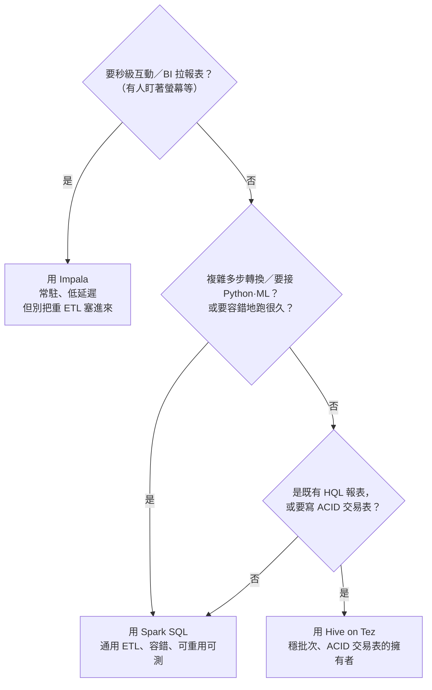
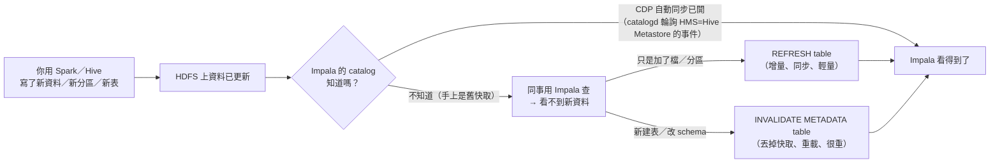
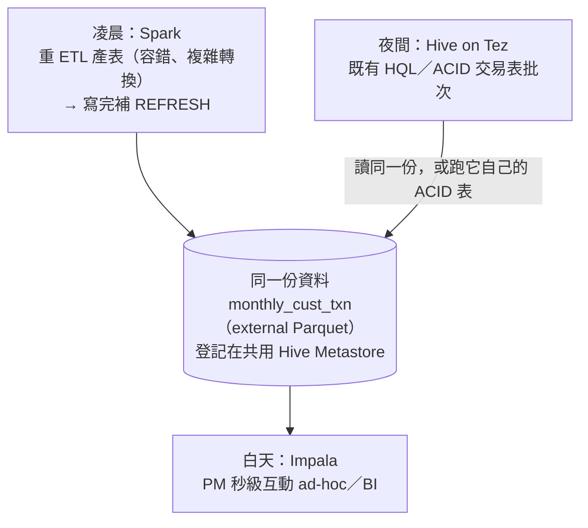

# 06 · 引擎選用：Spark vs Hive on Tez vs Impala

> **本章前提**：你讀過[第 01 章](01-how-spark-runs-your-sql.md)（driver／executor、shuffle、task、容錯靠 task 重試／stage 重算的心智模型，尤其 §1.9「為什麼 Spark 比老 Hive（MapReduce）快」）、[第 02 章](02-diagnose-with-spark-ui.md)（先量再調、用 Spark UI／`EXPLAIN` 找瓶頸）、[第 05 章](05-storage-efficiency.md)（同一份資料登記在共用的 Hive Metastore、external Parquet 表誰都能讀、managed／ACID 交易表是另一回事、§5.8 與 §5.9）；你會寫 SQL。
>
> 前五章都在講「**用 Spark 把一件事做快**」。但在 CDP 上，你面前其實有**三個能查同一份資料的引擎**：Spark、Hive on Tez、Impala。這一章談的是上一層的決定：**這件工作，到底該交給哪個引擎？** 選錯通常不是「算不出來」，而是「慢得多、卡別人、或白花資源」。
>
> 每節末附 📚 **來源**；章末「資料來源與精確度說明」列出哪些是刻意簡化、或工具沒能逐字查證的地方。

---

## 6.1 本章地圖：同一份資料，三個引擎都能查

先把最重要的事實講清楚，後面才不會誤會：**在 CDP（你們公司的 Cloudera 資料平台，第 01 章）上，Spark、Hive、Impala 共用同一個 Hive Metastore（§5.8 那個「記錄有哪些表、各多大、欄位是什麼」的中繼目錄）、讀同一份放在 HDFS 上的資料。** 你按 §5.9 用 Spark 產出的那張 external Parquet 表 `monthly_cust_txn`，Hive 查得到、Impala 也查得到，**不必為了換引擎而搬資料或複製一份**。

所以「選引擎」不是選「資料存哪」，而是選「**用哪個引擎去算這份共用的資料**」。這帶來兩個好消息和一個要小心的地方：

- **好消息一**：你可以「對的工作交給對的引擎」，重 ETL 給 Spark、秒級互動給 Impala，各取所長，資料只有一份。
- **好消息二**：選錯多半只是**慢／吃資源／卡到別人**，不是「跑不出結果」。代價是效率，不是正確性。
- **要小心**：三個引擎各自把 metadata 快取在自己手裡，所以「Spark 剛寫的東西，Impala 看不看得到」會是個現實的坑（§6.6）；而 Hive 的 ACID 交易表跨引擎有支援限制（§6.7）。

三個引擎一句話定位（細節在 §6.2、§6.8）：

| 引擎 | 為什麼存在（為誰設計） | 一句話 |
|---|---|---|
| **Spark SQL** | 複雜多步轉換、與 Python／ML 整合的大型 ETL | 通用、容錯、最會做複雜的事 |
| **Hive on Tez** | 穩定、能容錯的長批次；既有 HQL；ACID 交易表的寫入 | 穩、適合長批次與既有報表 |
| **Impala** | 低延遲互動查詢、BI／ad-hoc（ad-hoc＝臨時、隨手查，不是排程跑的固定報表） | 快、為「人在等結果」而生 |

**那「選引擎」實際上在哪選？** 多半就看你**從哪個入口下 SQL**：在 **Hue**（你平常在瀏覽器寫 SQL 的網頁介面）裡，Impala 編輯器和 Hive 編輯器是分開的兩個，選哪個編輯器，就是選哪個引擎；排程作業則在腳本裡指定（用 `spark-submit` 跑 Spark、`impala-shell` 跑 Impala、`beeline` 跑 Hive）。**同一張表，換個入口就是換個引擎**，資料完全不動。所以這一章教你的是「**這次該從哪個入口進去**」。

> 📚 **來源**：CDP 上 Hive／Impala／Spark 共用 Hive Metastore、同一張 external 表跨引擎可讀見 [Cloudera CDP — Apache Spark access to Apache Hive](https://docs-archive.cloudera.com/runtime/7.1.0/securing-hive/topics/hive_spark_access_to_hive.html) 與第 05 章 §5.8；三引擎定位見 §6.2、§6.8 各自出處。

---

## 6.2 三個引擎是怎麼跑你的查詢的

它們之所以快慢不同、適合的工作不同，根源在**跑法不一樣**。把這三種跑法看懂，後面的選擇就都是常識。

```mermaid
flowchart TB
    subgraph IMPALA["Impala：常駐 daemon（一直開著待命的背景程序）、為秒級互動而生"]
        direction TB
        I1["每台資料節點上有一個<br/>「一直開著」的 impalad 程序"]
        I2["查詢一來，立刻就有人算<br/>沒有「先起一個叢集／申請容器」的開銷"]
        I3["盡量在記憶體裡算（不夠才 spill 到磁碟）"]
        I4["不容錯：中途死一台 → 整條查詢失敗、要重跑"]
    end
    subgraph TEZ["Hive on Tez：每查起一個 YARN 應用、為穩定批次而生"]
        direction TB
        T1["每條查詢向 YARN 申請容器（有啟動開銷）"]
        T2["Tez＝比老 MapReduce 有效率的 DAG 引擎<br/>（不是 §1.9 那個慢的老 Hive）"]
        T3["容錯：中途失敗會重試；是 ACID 交易表的擁有者"]
    end
    subgraph SPARK["Spark SQL：driver + executor、為複雜轉換／ML 而生"]
        direction TB
        S1["起一個 application（第 01 章那套）"]
        S2["容錯：task 重試／stage 重算（第 01 章）"]
        S3["最會做複雜多步轉換、與 Python／ML 整合"]
    end
```

**Impala：一直待命，所以快。** Impala 在每台資料節點上跑一個**常駐**的程序（一直開著待命的背景程序叫 **daemon**，這支叫 `impalad`，字尾 `d` 就是 daemon；後面 §6.6 還會遇到 `catalogd`），365 天開著等查詢。所以一條查詢進來，**不需要像 Spark／Hive 那樣先「起一個 application／向 YARN 申請容器」**。這裡先把兩個關鍵字講清楚，後面整章都會用到：**YARN** 是第 01 章那個叢集的資源管家，誰要算東西都得先跟它要資源；它撥給你這次工作的一塊運算資源（一份 CPU＋記憶體的配額）就叫一個**容器（container）**。光是「跟 YARN 申請容器、等它調度好」這一步，在互動場景動輒就要好幾秒到幾十秒，對「人坐在螢幕前等結果」是致命的。Impala 省掉這一步，加上它是 **MPP** 架構（massively parallel processing，大規模平行處理：把一份工作拆給很多台機器同時算，最後再彙整），盡量在記憶體裡算、用 C++ 寫的執行引擎（C++ 直接管記憶體，少了 Spark／Hive 那層 Java／JVM 的開銷），就換來「秒級回應」。代價在下一點。

**Impala：不容錯，所以不適合長跑。** Impala**不像** Spark／Hive 那樣容錯。第 01 章說 Spark 某個 task 掛了會自動重試、某個 stage 的資料沒了會重算；Impala**沒有**這層保護，查詢跑到一半某台機器掛了，**整條查詢就失敗、得從頭重來**。對跑幾秒的互動查詢，重跑一次無所謂；對跑幾小時的重 ETL，跑到第 3 小時掛掉要從頭，就是災難。這就是「Impala 為互動而生、不為長批次而生」的根本原因。（它**能** spill 到磁碟、不是一律 OOM〔out of memory，記憶體爆掉〕，但「不容錯」這條躲不掉。）

**Hive on Tez：不是 §1.9 那個慢老 Hive。** 這裡要特別澄清，免得你誤會：第 01 章 §1.9 說「Spark 比老 Hive 快」，那個「老 Hive」指的是**跑在 MapReduce 上的 Hive**，每個 stage 都把中間結果寫回 HDFS、再讀出來，慢在這。但**在 CDP 上，Hive 早就不用 MapReduce 了**（CDP 直接把 MapReduce 執行引擎拿掉，你硬指定它還會報錯），改用 **Tez**：和 Spark 一樣是「DAG 引擎」（DAG＝把一條查詢拆成一張「哪步接哪步」的工作流程圖，按圖一路算下去、stage 之間盡量不把中間結果落地寫回 HDFS），容器可重用，比老 MapReduce 快得多。所以「Hive on Tez」是個**穩健、能容錯的現代批次引擎**，不是該被嫌棄的老古董，它只是每條查詢仍要走「申請 YARN 容器」這個批次起跑流程，互動體感不如常駐的 Impala。

**Spark SQL：你已經熟的那套。** 前五章講的就是它：起 application、driver 排程、executor 平行算、shuffle、容錯靠重試／重算。它的甜蜜點是**複雜多步轉換**（一長串 join／window／聚合）、**與 Python／機器學習生態整合**（本手冊所屬的 repo 就是 Spark pipeline）、以及需要**寫成可重用、可測試程式**的場合（第 10 章）。

> 📚 **來源**：Impala 為 **MPP（massively parallel processing）database engine**、原生執行（官方原話「circumvents MapReduce to directly access the data」、不轉成 MapReduce job）見 [Impala — Components of Impala](https://impala.apache.org/docs/build/html/topics/impala_components.html) 與 [Impala — Overview](https://impala.apache.org/overview.html)（Apache Impala 官方）；「Impala 低延遲互動、記憶體密集、不像 Hive 那樣容錯」見 [Cloudera Blog — Apache Hive LLAP vs Apache Impala](https://www.cloudera.com/blog/technical/choosing-the-right-data-warehouse-sql-engine-apache-hive-llap-vs-apache-impala.html)（Cloudera 官方部落格；該文逐字寫的是「Hive is designed to be very fault-tolerant」，Impala 不容錯為其對比所隱含、非逐字直述）；Impala 近記憶體上限時 spill 到磁碟、可設 `MEM_LIMIT` 見 [Impala — Scalability Considerations](https://impala.apache.org/docs/build/html/topics/impala_scalability.html)；CDP 的 Hive 只跑在 Tez（MapReduce 不支援、指定會報錯）、Tez 以 DAG 改善查詢效能見 [Cloudera CDP — Hive on Tez introduction](https://docs.cloudera.com/runtime/7.2.18/hive-introduction/topics/hive-on-tez.html)；Spark 的 driver／executor／容錯機制見第 01 章。⚠️ 「常駐 daemon 省下啟動開銷」「不容錯」是各引擎的設計取向，方向正確；確切啟動秒數、spill 行為依叢集設定與查詢而異，無官方逐字數字。

---

## 6.3 怎麼選：一張決策表

把 §6.2 的跑法差異，翻成你實際下決定時會看的幾個維度：

| 你的工作長什麼樣 | 偏向 Spark | 偏向 Hive on Tez | 偏向 Impala |
|---|---|---|---|
| **延遲需求**（人在等嗎） | 排程跑、不急在這幾秒 | 排程跑、不急 | **要秒級回應**（人盯著螢幕） |
| **查詢複雜度** | 多步 join／window／自訂邏輯 | 中等～複雜（既有 HQL 報表常落這） | 相對單純的掃描／聚合／join |
| **資料量／單次工作規模** | 很大、很重 | 很大、很重 | 中小～中（單次工作別太重；超大 join／聚合會吃力） |
| **要不要容錯長跑** | 要（會跑很久、不能半途重來） | 要 | 不要（短查詢，重跑也快） |
| **要不要寫回大表／寫 ACID 交易表** | 寫 external 大表、複雜寫入 | **寫 ACID 交易表**（§6.7） | 主要是查；寫入有限制（§6.7） |
| **要不要接 Python／ML** | **要**（第 10 章） | 不要 | 不要 |
| **誰在用** | 資料工程／排程 | 排程／既有 HQL 報表 | 分析師／PM／BI 互動 |

（**HQL**＝Hive 的 SQL 方言，你平常寫的 SQL 幾乎都通用，差別在少數函式與語法；本表「查詢複雜度」這一欄三個引擎講的是**同一根軸：查詢有多複雜**：Spark 一格是「多步複雜邏輯」、Impala 一格是「相對單純」，Hive 一格之所以寫成「既有 HQL 報表常落這」，是因為那類報表的複雜度多半落在中間，不是在講 HQL 這個語言本身。**「單次工作別太重」怎麼抓**：SQL-first 的你很難事先估出「中間結果幾 GB」，所以改用兩個**看得出來的代理訊號**：① 你的 join／聚合會不會把資料**放大很多倍**（例如多張大表互相 join、或一對多展開）；② 你是不是**一次要跨很多月、掃一張很大的表**。任一個成立就偏「重」、別賭 Impala；反過來，單純掃一個月、聚合出幾萬列，就是 Impala 的舒適區。真要量，用 §6.4 的 query profile 看它有沒有一直 spill。）

把它收成一棵決策樹（從最強的訊號「延遲」問起）：

（樹底 Q3 答「否」（既不是互動、也不是 HQL／ACID、又不特別複雜的普通查詢）之所以**預設導向 Spark**，只因 Spark 最通用、容錯、什麼都能接；你團隊若以 Hive 為主，這種查詢落 Hive on Tez 一樣對。）

這棵樹是**傾向**、不是法律：很多工作 Spark 和 Hive on Tez 都能穩穩做（兩者都容錯、都適合長批次），這時跟著你團隊的既有慣例走即可（既有一堆 HQL → 沿用 Hive；既有 Spark pipeline → 沿用 Spark）。真正**界線分明**的只有一條：**「有人在等的秒級互動」幾乎一定走 Impala，「容錯的重批次」一定別走 Impala。**

> 📚 **來源**：「Impala 適合低延遲 ad-hoc／BI、Hive 適合容錯批次 ETL、Impala 不適合重型 join／長跑」見 [Cloudera Blog — Hive LLAP vs Impala](https://www.cloudera.com/blog/technical/choosing-the-right-data-warehouse-sql-engine-apache-hive-llap-vs-apache-impala.html) 與 [Cloudera Community — Hive on Spark or Impala in batch (ETL)](https://community.cloudera.com/t5/Support-Questions/Hive-on-Spark-or-Impala-in-batch-Process-ETL/td-p/54314)；Spark 與 ML／Python 整合見第 10 章。⚠️ 本表為「典型傾向」的整理，邊界案例（Spark vs Hive 都可）依團隊既有技術棧與工作負載而定，非硬規則。

---

## 6.4 各引擎怎麼看「為什麼慢」：診斷工具對照

第 02 章教你用 **Spark UI** 給 Spark 查詢做「完整診斷」。好消息是：**那套「先量再調、找最慢的 stage／看資料分佈／看 spill」的心法，三個引擎通用**，只是各自有自己的「診斷工具」：

| 引擎 | 看哪裡 | 主要看什麼 |
|---|---|---|
| **Spark** | **Spark UI**（第 02 章，從 History Server 進） | 哪個 stage 最久、shuffle 量、skew（task 時間分佈）、spill |
| **Hive on Tez** | **Tez UI**（多半從 Hue 的查詢頁進） | Tez DAG 各 vertex（≈stage）的時間、資料量、哪個 vertex 卡住 |
| **Impala** | **Impala query profile**（`PROFILE` 指令／Impala web UI／Hue） | 各 fragment（≈stage）時間、**記憶體用量與有沒有 spill**、估計列數 vs 實際列數差多少 |

對 SQL-first 的你，重點不是背每個工具的每個欄位，而是記住**心法一致**：

1. **先確認瓶頸在哪一段**（Spark 的 stage／Tez 的 vertex／Impala 的 fragment）。
2. **再看那一段是哪種病**：資料太多（少讀，第 03/05 章）、搬太多（shuffle）、還是分佈不均（skew）。Impala 的 profile 額外好用的一點是它會列出「**優化器估計幾列 vs 實際幾列**」，差很多就表示**統計過時**，這時該回去 §5.6 跑 `ANALYZE`（或 Impala 端的 `COMPUTE STATS`）。
3. **對症下藥**：改寫法（第 03 章）、調存法（第 05 章）、或（這一章的重點）**換個引擎**。

> 📚 **來源**：Spark UI 用法見第 02 章；Impala `PROFILE` 提供查詢執行細節（各 fragment 時間、記憶體、spill）見 [Impala — Scalability Considerations](https://impala.apache.org/docs/build/html/topics/impala_scalability.html) 與 Impala 文件的 `EXPLAIN`／`PROFILE`／`SUMMARY` 工具族；Hive on Tez 把查詢拆成 Tez DAG（多個 vertex）執行見 [Cloudera CDP — Hive on Tez introduction](https://docs.cloudera.com/runtime/7.2.18/hive-introduction/topics/hive-on-tez.html)。⚠️ 各 UI 的確切入口（Cloudera Manager／Hue／web 連結、Tez DAG 的檢視位置）依你平台的部署與權限而異，以你環境為準；本節只給「每個引擎都有對應的診斷工具、心法與第 02 章相同」這個層次，不逐一示範各工具欄位。

---

## 6.5 CDP 實務一：三引擎共用同一張表，威力與陷阱

回到 §6.1 的核心事實：三引擎共用 Metastore 與 HDFS 資料。這讓你能組出很順的分工：**同一張表，誰擅長什麼就用誰**：

- 用 **Spark** 跑夜間重 ETL，產出一張 external Parquet 表（§5.9）。
- 白天讓分析師用 **Impala** 對它做秒級 ad-hoc。
- 既有的 HQL 報表照樣用 **Hive on Tez** 讀它。

資料只有一份，沒有任何複製或搬運。這正是 §5.8 強調「產共用表優先用 external Parquet」的回報：**external 表是三引擎的「最大公約數」**：誰都能直接讀、不綁特定引擎、不必走 §5.8 的 HWC 橋接。

但威力的另一面是兩個現實陷阱，剩下兩節分別講透：

1. **metadata 不同步**（§6.6）：Spark 剛寫的新資料／新分區，Impala 可能「還不知道」，查出來是舊的、或說表不存在。
2. **ACID 交易表的跨引擎限制**（§6.7）：§5.8 那種 Hive managed／ACID 交易表，不是三引擎都能自由讀寫。

> 📚 **來源**：external 表登記於共用 Hive Metastore、供 Hive／Impala／Spark 存取，managed／ACID 表存取受限（Spark 需 HWC）見 [Cloudera CDP — Apache Spark access to Apache Hive](https://docs-archive.cloudera.com/runtime/7.1.0/securing-hive/topics/hive_spark_access_to_hive.html) 與第 05 章 §5.8。

---

## 6.6 CDP 實務二：Impala 看不到新資料？`REFRESH` 與 `INVALIDATE METADATA`

**最常見的真實場景**：你的 Spark 排程半夜把 `monthly_cust_txn` 灌了新的一個月分區，早上同事用 Impala 一查，**新分區的資料出不來，或乾脆說沒這張表**。資料明明寫進 HDFS 了，怎麼回事？

**原因**：Impala 為了快，把「有哪些表、各有哪些分區與檔案」這些 metadata **快取在自己的 catalog 裡**。這裡要分清兩個很容易混為一談的東西：**Hive Metastore（簡稱 HMS，§5.8 那個三引擎共用的中繼目錄）是 metadata 的共用源頭**，記著「有哪些表、欄位是什麼、各多大」；而 **Impala 的 catalog 是 Impala 自己另外存的一份快取副本**，它的源頭仍是 HMS，但 Impala 平常查的是手上這份快取、不是每次都回去問 HMS。所以外面（Spark／Hive）改了共用源頭 HMS 上的資料，Impala 手上那份快取副本**不會自動立刻跟上**，於是它還拿著舊的清單回答你。

解法是叫 Impala 去**重新同步** metadata，有兩個指令，**輕重差很多，別用錯**：

**`REFRESH table`（輕量，優先用這個）**：增量地重載這張表的 metadata，重新去 Metastore 拿表資訊、並從 HDFS 增量更新「檔案與資料塊（block，HDFS 把檔案切成的塊）」清單。**用在「資料變了、但表結構沒變」**：Spark／Hive 對既有表 `INSERT` 了資料、加／改了分區。可以只刷一個分區：`REFRESH monthly_cust_txn PARTITION (month='2026-05')`。它是**同步**的（指令回來就刷好了）、很快。

**`INVALIDATE METADATA table`（很重，少用）**：直接把這張表的快取 metadata **整個丟掉**，標記為「過期」，等下次有人查它時才重新載入（**非同步**）。官方明講這「比 `REFRESH` 的增量更新**昂貴得多**」。**只在「表結構層級變了」才需要**：在 Hive 裡新建了一張表、改了 schema、改了權限。

> ⚠️ **`INVALIDATE METADATA` 不帶表名 = 把所有表的 metadata 全部失效**，整個叢集的 Impala catalog 都要重載，**非常貴**，正常情況下絕不要這樣下。要刷就指名道姓刷那一張表。

**原則一句話**：**能用 `REFRESH` 就別用 `INVALIDATE METADATA`**（官方原話：when possible, prefer `REFRESH`）。絕大多數「Spark 寫完、Impala 看不到」其實只是加了資料／分區，`REFRESH 那張表`就解決了。

**知道有這回事就好，CDP 多半會自動同步**：CDP 可以開「**事件驅動的自動 invalidate／refresh**」，Impala 的 catalog 服務（catalogd）定時去輪詢 Hive Metastore 的變更事件，自動把對應的表刷新。在你們的 CDP 7.1.9 上，這個輪詢間隔（Cloudera Manager 的「HMS Event Polling Interval」，對應 `hms_event_polling_interval_s`）**預設是 2 秒**（設成 0 就關閉這個功能；Cloudera 建議值小於 5 秒）。開了之後，多數情況**不用你手動下**這兩個指令。但仍要懂它們，因為：①自動同步有**輪詢間隔的延遲**，預設雖只 2 秒，但「Spark 寫完同一瞬間就要 Impala 看到」時，手動 `REFRESH` 仍最即時、不必賭那個輪詢剛好追上；②自動同步**可能被關（設成 0）、或被針對某些表停用**（`impala.disableHmsSync`）。所以把手動 `REFRESH`／`INVALIDATE METADATA` 當成「Impala 看不到新資料時的救命指令」記著。

**落地建議**：如果你的排程「Spark 產表 → 下游馬上要用 Impala 查」，可以在 Spark 寫完那一步**後面接一個 `REFRESH`**（透過你的排程工具對 Impala 下指令），別賭自動同步剛好那一刻已經追上。

**反過來的那條坑：Spark 自己也會讀到過時的 metadata。** 上面講的都是「Spark 寫 → Impala 沒跟上」這個方向，但同一個快取問題反過來也會咬人，**Spark 也把 metadata 快取在自己手裡**。如果你開了一個**長時間存活的 SparkSession**（例如一個跑很久的 notebook、或常駐的服務），中途**別人**（Hive、Impala、或另一個 Spark 作業）往某張表補了新分區、或改了 schema，**你這個 session 可能還拿著啟動時那份舊的表 metadata**，於是讀不到新分區、或看到的還是舊的欄位結構。解法對稱：對那張表下 `REFRESH TABLE 表名`（Spark SQL 的指令，叫 Spark 重新去 Metastore 拿這張表的 metadata），或乾脆**重啟 session**。所以「長命的 session ＋ 同一張表有別人在動」這個組合，記得先 `REFRESH` 再讀。

> 📚 **來源**：`REFRESH` 重載 metastore 的表 metadata、增量重載 HDFS 的檔案與資料塊清單、為同步、比完整載入輕量、用於外部加／改檔案或分區見 [Impala — REFRESH Statement](https://impala.apache.org/docs/build/html/topics/impala_refresh.html)；`INVALIDATE METADATA` 標記一或全部表 metadata 為過期、為非同步、「比 `REFRESH` 的增量更新昂貴得多，可能時優先用 `REFRESH`」、不帶表名會 flush 所有表見 [Impala — INVALIDATE METADATA Statement](https://impala.apache.org/docs/build/html/topics/impala_invalidate_metadata.html)；CDP 事件驅動自動 invalidate／refresh（catalogd 以 `hms_event_polling_interval_s` 輪詢 HMS 事件、可用 `impala.disableHmsSync` 停用、`hms_event_polling_interval_s=0` 關閉功能）見 [Cloudera CDP — Automatic Invalidation/Refresh of Metadata](https://docs.cloudera.com/cdp-private-cloud-base/7.1.8/impala-manage/topics/impala-auto-metadata-sync.html)；該 polling interval 在 CDP 7.1.9 的 Cloudera Manager **預設值為 2 秒**（屬性名「HMS Event Polling Interval」）見 [Cloudera CDP — Impala Properties in Cloudera Runtime 7.1.9](https://docs.cloudera.com/cdp-private-cloud-base/7.1.9/configuration-properties/topics/cm_props_cdh710_impala.html)（注意：上游 Impala 旗標文件描述「設正整數才啟用」、Cloudera 建議值 <5 秒，CDP 透過 Cloudera Manager 預設給 2 秒）。Spark 端長命 session 的 catalog 快取需 `REFRESH TABLE 表名` 重抓 metastore metadata 見 [Apache Spark SQL — REFRESH TABLE](https://spark.apache.org/docs/3.3.2/sql-ref-syntax-aux-cache-refresh-table.html)。

---

## 6.7 CDP 實務三：ACID／交易表跨引擎的限制

§5.8 提過 Hive 有一種「受管交易（ACID）表」。要判斷「**該不該用它、跨引擎會不會卡**」，得先搞懂 ACID 表到底是什麼、為什麼會想用它，這節**不預設你學過資料庫交易**。

### 先補基礎：普通表只能「整批覆寫」，ACID 表才能「改既有的列」

一張放在 HDFS 上的普通表（CSV、或我們一路在推的 external Parquet），骨子裡就是**一堆檔案**。對檔案，你天生只能做粗粒度的事：加一批新檔、把**整個分區整批覆寫**、或整張砍掉重建。你**沒辦法**像在一般資料庫那樣說「把第 12345 號客戶那一列的金額改成 500」，那一列藏在某個 Parquet 檔中間，檔案不是設計來「就地改一格」的。

**ACID 表就是來補這個能力的**：它讓存在 HDFS 上的表行為**像資料庫**，你能下 `UPDATE … WHERE`、`DELETE … WHERE`、`MERGE`（有就更新、沒有就新增，俗稱 upsert），**精準改／刪某幾列**。名字 **ACID** 是資料庫對「**交易**」的四個保證的縮寫。先講「交易（transaction）」是什麼：它是資料庫術語，指**把一組修改綁成一個整體、一起算數**。**這裡的「交易」是資料庫術語，跟銀行業務那種「一筆交易帳」（一筆轉帳、一筆刷卡）完全是兩回事，別被同一個詞混淆，它講的是「資料庫怎麼把一組改動安全地做完」，不是業務上的金流。** 對這樣一個整體，資料庫給四個保證，白話講就是：

- **不可分割（Atomicity）**：一次修改要嘛全成、要嘛全不成，不留「改一半」的爛狀態；
- **一致 ＋ 隔離（Consistency／Isolation）**：有人在改、同時有人在查，查的人看到的是「改之前」或「改之後」的完整、對得起來的樣子（不會出現「帳算到一半、總額兜不攏」的中間態），**不會讀到改到一半的混合**；
- **持久（Durability）**：改動一旦 **commit**（送出、正式生效）了就不會掉，斷電也還在。

它怎麼做到「不重寫整個檔還能改一列」？靠**增量檔**：每次 update／delete 只寫一個小小的「變更紀錄」（delta 檔），讀的時候把原始檔（base）＋ delta 疊起來算出最新值；delta 累積多了，再用 **compaction**（§5.8 提過的合併動作）併回大檔，不然讀會越來越慢。

**所以「有 ACID」跟「沒有」最根本的差別，就是能不能改既有的列**：

- **沒有（external Parquet）**：要改／刪某幾列，只能「讀整個分區 → 改 → 整批覆寫」；想刪掉一個客戶，得把含他的每個分區整個重寫成「不含他」。粗、貴，而且覆寫途中不保證別人讀到一致狀態。
- **有（full ACID 表）**：直接 `UPDATE … WHERE cust_id=X`／`DELETE … WHERE …` 就地改那幾列，邊改邊查也安全。（「full」是相對於「只能新增」的 insert-only 表而言，Hive 的 ACID 表分這兩種，下一小節分清楚。）

**那什麼時候真的需要它？** 當你的工作**會去改既有的資料**，例如：① **更正**：某筆帳務記錯，要改「那一筆」並留痕，而不是整個月重算；② **合規刪除**（被遺忘權）：法遵要求刪掉「某個客戶」的資料；③ **維度表 upsert**：維度表（描述客戶／產品「屬性」的表，相對於記一筆筆交易的事實表）要逐筆 `MERGE`（有就更新、沒有就新增）。**反過來，如果你只是「每次重算整個月、整批換掉」（像 §5.9 那張 `monthly_cust_txn`），你從不改某一列，就根本不需要 ACID。**

### 跨引擎的限制：誰能讀、誰能寫

知道 ACID 表是什麼之後，回到本章主題：它跨引擎時有支援限制。先把「表的種類」理清楚（延續 §5.8）：**managed 表**（在 Hive 裡 `CREATE TABLE` 預設建的）底下又分 **full ACID**（可 `UPDATE`／`DELETE`／新增）和 **insert-only**（只新增、不改不刪）；**external 表**（你用 Spark `CREATE TABLE` 多半建這種）是另一類、**不是**交易表。誰能讀、誰能寫就落在這張表上：

| 表種 | Hive | Impala | Spark |
|---|---|---|---|
| **external**（非交易，§5.8 的最大公約數） | 讀／寫 | 讀／寫 | 讀／寫（**不需** HWC） |
| **managed・full ACID**（可 `UPDATE`／`DELETE`） | 讀／寫（擁有者、負責維護；**不支援 `INSERT OVERWRITE`**） | **只能讀、不能建／寫** | 讀／寫需走 **HWC**（**別直讀 HDFS 路徑**） |
| **managed・insert-only**（只新增） | 讀／寫 | 讀／寫 | 讀／寫需走 **HWC** |

（**HWC**＝Hive Warehouse Connector，§5.8 提過的、讓 Spark 安全存取 Hive managed／ACID 表的橋接元件；讀 external 表不需要它。CDP 7.1.x 起 Impala 可直接讀 full ACID〔ORC〕表、不必特別設定。）一句話讀這張表：**full ACID 的「寫」只歸 Hive**（由它建、由它維護含 compaction），Impala 對它只能讀；Spark 要碰任何 managed／ACID 表都得繞 HWC，碰 external 表才直接。

> ⚠️ **最容易踩、又最危險的一條：要在 Spark 讀 full ACID 表，務必走 HWC，別自己直讀它在 HDFS 上的檔案路徑。** 為什麼這很危險？回想前面講的，full ACID 表的資料是 **base 檔 ＋ 一堆 delta／delete-delta 增量檔**疊出來的，「某一列現在的正確值」要把這些檔按交易順序合併、並套用刪除標記才算得出來。HWC 會幫你做這層合併（它懂交易語義）；但**如果你繞過 HWC、直接拿 Spark 去掃那個目錄的底層檔案，Spark 不懂這套交易語義**，就可能把**已經被刪掉的列**、或**被更新前的舊版列**也讀進來，而且這通常**不會報錯**，你拿到的是一份「看起來正常、其實混進髒資料」的結果。對拿來訓練模型／建特徵庫的場景，這種**靜默的錯誤**比直接報錯更可怕（你不會發現，髒資料就這樣進了特徵）。所以規則很死：**Spark 讀 full ACID 表只走 HWC，不直讀 HDFS 路徑。**（嚴格的逐字保證以 Cloudera HWC 文件為準，見本節來源；上述「會讀到刪除／舊版列」的機制是基於 ACID base＋delta 結構的合理推論，方向明確，但不是官方逐字承諾「無錯誤訊息」。）

把這些限制收成一個**最省事的設計原則**：

> **要給多個引擎共用、又想避開 ACID 跨引擎的麻煩 → 就用 §5.8 那種 external Parquet 表。** 它不是交易表、沒有 ACID 那層增量檔與 compaction 包袱，三個引擎都能直接讀、Spark 寫也不必走 HWC，這就是為什麼 §5.8 與 §5.9 一路推「共用表優先 external Parquet」。

**還有一條寫入限制值得記：full ACID 表不支援 `INSERT OVERWRITE`。** 這跟上面「Spark 想重算整批就用 `INSERT OVERWRITE ... PARTITION`」是直接衝突的，只要表是 full ACID（OutputFormat 實作 `AcidOutputFormat` ＋ ACID transaction manager），Hive 從 0.14 起就**禁掉**這張表的 `INSERT OVERWRITE`（目的是避免有人不小心把交易歷史整個蓋掉）。想清空重灌得改用 `TRUNCATE TABLE` 或 `DROP PARTITION` ＋ `INSERT INTO`。換句話說，**「整批覆寫」這個我們最愛用的 idiom，在 full ACID 表上就是不能用**，這又是一個「能用 external Parquet 就別碰 ACID」的理由。

**選了 ACID，就接手了一筆隱性運維成本：compaction 要有人跑。** 前面說 ACID 表靠 base＋delta 增量檔，delta 會越積越多、讀會越來越慢，要靠 **compaction** 定期把 delta 併回大檔。這件事是 **Hive 端負責**的（full ACID 表本來就歸 Hive 寫與維護），但「歸 Hive 負責」不等於「自動就好、你不用管」：如果 compaction 長期沒被排上、或被關掉，delta 一路累積，這張表會**越讀越慢**。所以選用 ACID 表時，要把「誰來確保它的 compaction 有在跑」當成一個明確的 ownership 問題，別假設它會自己處理。

回到前面那個判斷：如果你的需求其實是「每次重算整個月、整批換掉」，那 §5.9／§07 講的「**整個 partition 覆寫**」（`INSERT OVERWRITE ... PARTITION`）配 external Parquet 就夠了，根本不需要 ACID，也順帶躲開這節所有跨引擎限制（包含上面那條 full ACID 不能 `INSERT OVERWRITE`）。**只有真的要「改／刪既有的列」時（更正、合規刪除、upsert），才值得為 ACID 扛上 compaction 維護 ＋ 跨引擎讀寫限制。**

> 📚 **來源**：**ACID** 為資料庫交易四保證（Atomicity／Consistency／Isolation／Durability）的通用資料庫概念；Hive ACID 表用 base ＋ delta 增量檔記錄變更、靠 compaction 合併（見下方 Hive 3 tables 連結與 §5.8）。「Impala 可讀 full ACID v2（ORC）交易表、但不能 CREATE 或寫入 full ACID 表；insert-only 交易表 Impala 可讀可寫；full ACID 表由 Hive 建與改、Impala 只讀」見 [Cloudera CDP — READ Support for FULL ACID ORC Tables](https://docs.cloudera.com/runtime/7.2.17/impala-manage/topics/impala-read-fullacid-orc.html)；「Hive 3 預設 `CREATE TABLE`＝managed ACID(ORC)、Spark 存取 managed 表需 HWC、external 表不需」見 [Cloudera CDP — Apache Hive 3 tables](https://docs-archive.cloudera.com/runtime/7.1.0/using-hiveql/topics/hive_hive_3_tables.html)、[Apache Spark access to Apache Hive](https://docs-archive.cloudera.com/runtime/7.1.0/securing-hive/topics/hive_spark_access_to_hive.html) 與第 05 章 §5.8；`INSERT OVERWRITE ... PARTITION` 整批覆寫見 §5.9／第 07 章。**「Spark 存取 Hive managed／ACID 表需走 HWC」**（"You need to use the HWC if you want to access Hive managed tables from Spark"）見 [Cloudera CDP — Introduction to HWC](https://docs-archive.cloudera.com/cdp-private-cloud-base/7.1.3/integrating-hive-and-bi/topics/hive_hivewarehouseconnector_for_handling_apache_spark_data.html)；**「full ACID 表不支援 `INSERT OVERWRITE`」**：「if a table has an OutputFormat that implements AcidOutputFormat and the system is configured to use a transaction manager that implements ACID, then INSERT OVERWRITE will be disabled for that table」（Hive 0.14 起，避免覆寫交易歷史）見 [Apache Hive — LanguageManual DML](https://cwiki.apache.org/confluence/display/hive/languagemanual+dml)，CDP 對應遷移建議改用 truncate＋insert 見 [Cloudera CDP — INSERT OVERWRITE](https://docs.cloudera.com/cdp-public-cloud/cloud/cdppc-workload-migration-hive/topics/cdp-one-workload-migration-insert-overwrite.html)；**ACID 表 base＋delta／delete-delta 結構與 compaction 合併（Hive 端負責、不跑會越讀越慢）**見 [Cloudera CDP — Apache Hive 3 ACID transactions](https://docs-archive.cloudera.com/runtime/7.2.6/using-hiveql/topics/hive_3_internals.html) 與 §5.8。⚠️ Impala 對 full ACID 表的可讀範圍依 CDP／Impala 版本而異（本手冊環境 CDP 7.1.9；full ACID 讀支援在 7.1.x／Runtime 7.2.2+ 文件均有，確切邊界以你平台實測為準）；HWC 的確切用法依版本與設定而定。**「Spark 不走 HWC 直讀 full ACID 會讀到刪除／舊版列且無錯誤訊息」屬基於 ACID base＋delta 結構的合理推論與社群觀察（Cloudera Community／工程部落格）的方向性說法，非官方逐字保證；官方逐字只到「存取 managed 表需用 HWC」。**

---

## 6.8 取捨講白：每個引擎的甜蜜點與雷區

把三個引擎的「該用」與「別用」並排，這是本章最該帶走的一頁：

**Impala**
- **甜蜜點**：秒級互動、BI 儀表板、分析師／PM 在 Hue 上反覆 ad-hoc（「上月某客群消費 top 20」拉來拉去）。常駐、無啟動延遲、為「人在等」而生。
- **雷區**：**不容錯**，別拿它跑幾小時的重 ETL（跑到一半死一台要從頭）。**重 join／聚合特別吃記憶體**，這類運算即使能 spill，也比 Spark／Tez 的批次吃力（Impala 多數查詢其實是 CPU-bound，但 join／聚合這種就會逼近記憶體上限）。多人同時對它丟重查詢時，記憶體壓力會互相排擠。
- **一句話**：要快、要互動找它；要穩、要跑很久別找它。

**Hive on Tez**
- **甜蜜點**：穩定的長批次 ETL、既有一堆 HQL 報表、需要 **full ACID 交易表**（`UPDATE`／`DELETE`／合規刪資料）的場合。容錯、Hive 是 full ACID 表的擁有者與維護者（§6.7）。
- **雷區**：每條查詢有「申請 YARN 容器」的啟動開銷，**互動體感慢**（別拿它當 BI 工具讓人即時拉報表）。
- **一句話**：穩批次與既有 HQL 的可靠老手，但不是給人即時互動的。

**Spark SQL**
- **甜蜜點**：複雜多步轉換（一長串 join／window／自訂邏輯）、與 Python／ML 整合、要寫成**可重用可測試**的程式（第 10 章）。容錯、最通用。
- **雷區**：起 application／排程有成本，**拿它開一個秒級小 ad-hoc 不划算**（啟動可能比查詢還久，那種就丟 Impala）。學習曲線也最陡。
- **一句話**：複雜、要接 ML、要工程化就靠它；但別用大砲打小鳥。

**兩個最常見的選錯**，記住就少踩坑：

1. **為了「快」，把幾小時的重 ETL 勉強塞給 Impala** → 不容錯＋記憶體壓力，遲早爆。重 ETL 給 Spark／Hive on Tez。
2. **為了「都用 Spark」，拿 Spark 開一個秒級小查詢給人互動** → 啟動開銷比查詢本身還久。互動給 Impala。

> 📚 **來源**：Impala 低延遲互動／不容錯／記憶體密集、不適合重型 join；Hive 容錯適合批次 ETL 見 [Cloudera Blog — Hive LLAP vs Impala](https://www.cloudera.com/blog/technical/choosing-the-right-data-warehouse-sql-engine-apache-hive-llap-vs-apache-impala.html) 與 [Cloudera Community — Hive on Spark or Impala in batch (ETL)](https://community.cloudera.com/t5/Support-Questions/Hive-on-Spark-or-Impala-in-batch-Process-ETL/td-p/54314)；Impala spill 行為見 [Impala — Scalability Considerations](https://impala.apache.org/docs/build/html/topics/impala_scalability.html)；Spark 與 ML／工程化整合見第 10 章。⚠️ 「啟動開銷」「記憶體壓力」為設計取向的方向性描述，確切數字依叢集設定與查詢而異。

---

## 6.9 把它全部串起來：一天裡，三個引擎各司其職

把這章的零件組到「銀行的一天」這個情境上，**同一份資料**，被三個引擎按各自甜蜜點接力使用：

1. **凌晨・Spark 跑重 ETL**：排程用 **Spark** 把 3000 萬筆/月的帳務，經多步 join／window 算成 §5.9 那張 `monthly_cust_txn`（每月各客戶彙總）。選 Spark 是因為：轉換複雜、會跑一陣子、要**容錯**（跑到一半死一台不能從頭來）。產出 **external Parquet**（§5.8 最大公約數）、按 `month` 分區、`/*+ REPARTITION(32) */` 控檔案大小（§5.5），產完跑 `ANALYZE`（§5.6）。

2. **寫完・補一個 `REFRESH`**：因為下游 PM 等等要用 Impala 看這張表的新分區，排程在 Spark 寫完後**對 Impala 下 `REFRESH monthly_cust_txn PARTITION(month='2026-05')`**（§6.6），別賭 CDP 自動同步剛好追上，確保早上第一個查詢就看得到新資料。

3. **白天・Impala 互動**：行銷 PM 在 Hue 上用 **Impala** 對這張表秒級 ad-hoc：「上月 `segment='premium'` 消費 top 20 客戶」「換成 top 50 再看一次」「改個月份再拉」。選 Impala 是因為：**人在等、要秒回、查詢相對單純、重跑也便宜**。慢了就開 query profile（§6.4）看是不是統計過時。

4. **既有 HQL 報表・Hive on Tez**：某張歷史上用 Hive HQL 維護、且需要 update 更正的 **ACID 交易表**，沿用 **Hive on Tez** 跑它的夜間批次，它穩、容錯、而且 ACID 交易表本來就**歸 Hive 寫**（§6.7）。沒必要為了「統一引擎」把它硬遷走。

**重點不是「哪個引擎最強」，而是「同一份資料，讓每段工作落在對的引擎」**：重 ETL 的容錯給 Spark、互動的秒回給 Impala、既有 HQL 與 ACID 寫入給 Hive on Tez，中間用 external Parquet 當共用底座、用 `REFRESH` 接住 metadata 同步。

> 這條時間線把 §6.1–§6.8 的選擇邏輯放到真實的一天跑一遍，零件全來自前面各節＋第 05 章的存法。（情境與數字為示意，實際以你資料量與排程為準。）

---

## 6.10 一句話帶走：同一份資料，對的工作交給對的引擎

把這章收成一條原則：

> **重批次／複雜轉換／要接 ML → Spark；秒級互動／BI／ad-hoc → Impala；既有 HQL 穩批次／要寫 ACID 交易表 → Hive on Tez。** 三引擎共用同一份資料，跨引擎共用就用 **external Parquet** 當最大公約數；Impala 看不到 Spark 剛寫的新資料時，用 **`REFRESH`**（加了檔／分區）或 `INVALIDATE METADATA`（新建表／改 schema，很重、能免則免）把它叫醒。

最關鍵的直覺：**選引擎選錯，多半只是慢、卡、費資源，不是算不出來**，因為資料只有一份、三引擎都讀得到。所以這一章不是要你背規格，而是讓你在「這件工作該交給誰」時，按「延遲？複雜度？要不要容錯長跑？」三個問題快速分流（§6.3 那棵樹）。

接下來：

- SQL 有時就是不夠用（複雜可重用邏輯、要單元測試、要接 Python／ML），什麼時候、怎麼從 SQL 改用 **PySpark DataFrame API**？→ 第 10 章。
- 這些跨引擎的表怎麼**長期穩定營運**：冪等可重跑、回填、資料品質驗證、時間點正確性、定期 compaction／重算 `ANALYZE`、metadata 同步排進排程？→ 第 07–08 章（營運兩章）。
- 想看「我這類工作（ad-hoc／排程／特徵）通常照哪些章、用哪個引擎、最常踩什麼雷」？→ 見[首頁〔場景對應〕](index.md#場景對應先認出你在做哪種工作)。

---

## 資料來源與精確度說明

**版本對齊**：本章 Spark 官方連結指向「最新版」頁面（撰寫時自動工具無法直接驗證版本鎖定的 3.3.2 頁是否可達，且 `latest` 目前已指向 4.x）；要對齊本手冊版本，把網址裡 `…/docs/latest/…` 改成 `…/docs/3.3.2/…` 即可。Impala 與 CDP 行為以 **CDP Private Cloud Base 7.1.9 同系文件**（Impala、Hive 3、Hive on Tez）為準；本章關鍵事實（`REFRESH` 增量同步、`INVALIDATE METADATA` 昂貴且應優先用 `REFRESH`、不帶表名 flush 全部、CDP 事件驅動自動同步、Impala 可讀 full ACID／不可寫、Hive 只跑 Tez）皆已對 Impala 官方文件與 Cloudera CDP 文件核對。

**本章刻意簡化、或屬「方向正確但需以你環境為準」之處**（自行斟酌）：

1. **§6.2 引擎跑法**：「Impala 常駐省啟動開銷、不容錯」「Hive on Tez 是 DAG、比老 MapReduce 快」「Spark 容錯靠重試／重算」皆為設計取向的方向性描述，方向正確；確切啟動秒數、容錯邊界、spill 觸發點依叢集設定與查詢而異，無官方逐字數字。
2. **§6.3 決策表／決策樹**：為「典型傾向」的整理，**非硬規則**；Spark 與 Hive on Tez 在「容錯長批次」上大量重疊，邊界案例依團隊既有技術棧而定。唯一界線分明的是「秒級互動走 Impala、容錯重批次別走 Impala」。
3. **§6.4 診斷工具**：各 UI 的確切入口（Cloudera Manager／Hue／web 連結）與權限依你平台部署而異；本節只給「每引擎都有對應診斷工具、心法與第 02 章相同」的層次，未逐一示範各工具欄位。
4. **§6.6 metadata 同步**：`REFRESH`（增量、同步、輕量、用於外部加改檔案／分區）與 `INVALIDATE METADATA`（丟快取、非同步、昂貴、用於新表／改 schema、不帶表名 flush 全部、官方建議可能時優先 `REFRESH`）已對 Impala 官方文件逐字核對；CDP 事件驅動自動同步（catalogd 以 `hms_event_polling_interval_s` 輪詢 HMS 事件、`impala.disableHmsSync` 可停用、設 0 關閉）有 Cloudera 出處。**輪詢間隔在 CDP 7.1.9 的 Cloudera Manager 預設為 2 秒**（屬性「HMS Event Polling Interval」，已對 7.1.9 configuration-properties 頁核對）；注意上游 Impala 旗標文件的措辭是「設正整數才啟用」，與 CDP 經 Cloudera Manager 給的 2 秒預設是不同層級的事，是否啟用／實際間隔仍依你叢集設定為準。Spark 端長命 session 自有 catalog 快取、需 `REFRESH TABLE 表名` 重抓，為 Spark SQL 文件記載的對稱情形。
5. **§6.7 ACID 跨引擎**：「Impala 讀 full ACID／不可寫、insert-only 可讀寫、full ACID 由 Hive 寫與維護、Spark 存取 managed 表需 HWC」有 Cloudera 出處；**「full ACID 表不支援 `INSERT OVERWRITE`」**有 Apache Hive DML（Hive 0.14 起 disabled）＋ CDP 遷移文件出處；**「ACID 表 compaction 由 Hive 端負責、不跑會越讀越慢」**為 base＋delta 結構的直接後果、有 Hive 3 ACID 文件支撐。**「Spark 不走 HWC 直讀 full ACID 會靜默讀到刪除／舊版列」**：「需走 HWC」官方逐字成立，但「直讀會得到含髒資料且無錯誤訊息」是基於 ACID base＋delta 結構的合理推論＋社群觀察的方向性說法，非官方逐字保證，已在正文以保守語氣標明。Impala 對 full ACID 的可讀範圍依 CDP／Impala 版本而異（本手冊環境 7.1.9；確切邊界以你平台實測為準）。「需要 update／delete 才用 ACID，否則整批 partition 覆寫＋external Parquet 即可」為設計建議。
6. **§6.8 取捨**：甜蜜點／雷區為三引擎設計取向的整理，方向正確；個別工作是否「該換引擎」仍須以你環境量測（§6.4）為準，不照單全收。

> 引用原則：以 Spark 官方文件、Apache Impala 官方文件、Apache Hadoop 官方文件、Cloudera CDP 官方文件（含 Cloudera 官方工程部落格 `blog.cloudera.com`）、Spark 核心開發者文章、《Spark: The Definitive Guide》(Chambers & Zaharia)、《High Performance Spark》(Karau & Warren) 為限，不引用未經認證的個人部落格。Cloudera Community 論壇答覆僅作「方向性傾向」的佐證、非規格來源。

---

*←上一章* [05 · 儲存效率](05-storage-efficiency.md)　|　*下一章 →* [07 · 營運（一）：可靠地把排程跑起來](07-operating-pipelines.md)　|　*回* [手冊首頁](index.md)
