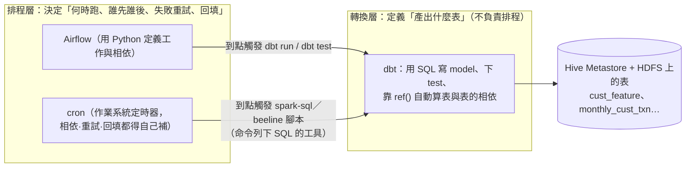
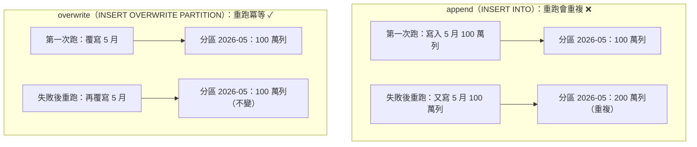
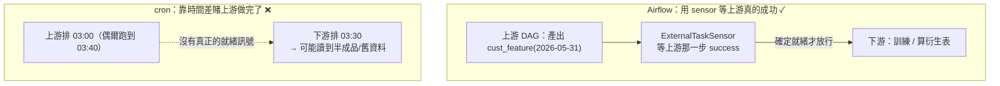

# 07 · 營運（一）：可靠地把排程跑起來

> **本章前提**：你讀過[第 01 章](01-how-spark-runs-your-sql.md)（partition、shuffle、HDFS/Hive Metastore、容錯）、[第 03 章](03-sql-tuning.md)（SQL 寫法）、[第 04 章](04-spark-config.md)（資源與多租戶）、[第 05 章](05-storage-efficiency.md)（partition 設計、小檔、`ANALYZE`、external/managed 表）；你會寫 SQL。
>
> 前面七章都在教「怎麼把一條查詢跑得快」。但當你的查詢變成**每天自動跑、產出給別人用的表**，問題就換了一種：不是「快不快」，而是「**半夜自己跑、出錯了會怎樣、能不能安全重跑、上游沒好它會不會亂跑**」。這一章（和下一章）講的就是這條**營運線**。
>
> 本章（營運一）只談**把排程可靠地跑起來**：冪等可重跑、相依、回填、監控、維護。產出「對不對、可不可信、能不能重現」留給[第 08 章](08-data-product-correctness.md)（營運二）。
>
> 每節先講**通用原則**（不管你用什麼工具都成立），再落到你們的三件工具上。每節末附 📚 來源，章末有「資料來源與精確度說明」。

---

## 7.1 本章地圖：從「跑得快」到「跑得可靠」，以及你的三層工具

前七章是**優化線**——讓一條查詢少讀、少搬、用對資源。這一章起是**營運線**——讓查詢變成「**天天自動產出、可信賴的資料服務**」。一個只跑一次的 ad-hoc 查詢，跑錯了你重跑就好；但一支每天半夜自動跑、下游好幾個模型都等著用的排程作業，**跑錯的代價是隔天才發現、而且可能已經污染了下游**。所以營運線的優先序是：**正確 > 可靠 > 可維護 > 快**。

要把這件事做好，你手上其實有**三層工具，各管不同的事**。先把它們分清楚，因為最常見的誤解就是把它們混為一談：



- **dbt（轉換層）**：一個讓你**用 SQL `SELECT` 定義一張表怎麼算**（一個 `SELECT` 就是一個 **model**）、並能對產出**下測試**的開源工具。它最有用的一點：你在 model 裡用 `ref('上游表')` 引用別的 model，dbt 就**自動算出表與表的相依順序**。但請記住——**dbt 不是排程器**：它不決定「每天幾點跑」，那是排程層的事。
- **Airflow（排程層）**：用 Python 定義「**有哪些工作、何時跑、誰先誰後、失敗怎麼重試、要不要補跑歷史**」的開源排程器（scheduler）。它**觸發** dbt（或任何 SQL 腳本），自己不算資料。
- **cron（簡單 job 的排程）**：作業系統內建的定時器——「到某個時間就跑這條指令」。它**沒有相依、重試、回填的概念**；這些你全得靠紀律手工補。所以本章一個反覆出現的對比是：**Airflow 把可靠性內建給你，cron 沒有**——這正好用來說明「為什麼這些原則重要」。

> ⚠️ 「DAG」這個詞在本手冊出現兩次、指**兩個不同層級**的東西：第 01 章 §1.4 的 DAG 是「一條查詢的 Spark stage 圖」（運算內部）；這裡 dbt/Airflow 的 DAG 是「**工作與工作之間的相依圖**」（排程層）。同名、不同層，別混。

> ⚠️ **Airflow 版本提醒（影響本章所有 Airflow 範例）**：本章以 **Airflow 2.x** 為基準（CDP 上多透過 Cloudera Data Engineering 使用 2.x）。Airflow **3.x** 改了若干 API——`sla` 改為 **Deadline Alerts**、`airflow dags backfill` 改為 `airflow backfill create`、部分 sensor 的匯入路徑移到 providers 套件——用時請對你們叢集實際的 Airflow 版本官方文件確認。

> 📚 **來源**：dbt model＝以 `SELECT` 定義的轉換、`ref()` 建立相依並決定執行順序見 [dbt — About dbt models](https://docs.getdbt.com/docs/build/models) 與 [dbt — ref function](https://docs.getdbt.com/reference/dbt-jinja-functions/ref)；Airflow 為以 Python 定義工作流（DAG）的排程器、DAG＝任務與相依的集合見 [Apache Airflow — DAGs](https://airflow.apache.org/docs/apache-airflow/2.10.5/core-concepts/dags.html)。⚠️ 「dbt 不是排程器、需由 Airflow/cron 觸發」是兩者的職責分工（dbt 官方定位為 transformation 工具），方向明確；你們實際怎麼把 Airflow 接上 dbt（`BashOperator` 跑 `dbt run`、或用 Cosmos 把每個 model 展成 task）依部署而定，本章範例採最通用的「Airflow 觸發 `dbt run`」。

---

## 7.2 冪等與可重跑：重跑會壞，是頭號營運風險

**原則。** 排程作業遲早會失敗重跑——機器掛了、上游延遲、你修了 bug 要補算。**冪等（idempotent）**的意思是：**同一步驟重跑幾次，結果都跟只跑一次一樣**。不冪等的作業，重跑一次就多一份資料，這是營運最常見、最難查的災難。

差別全在「你怎麼寫入」：

- **append（`INSERT INTO`）**：把新資料**接在後面**。第一次寫 5 月 100 萬列；失敗重跑又寫一次 → 5 月變 200 萬列、**重複**。不冪等。
- **overwrite（`INSERT OVERWRITE`）**：用新結果**整批換掉**舊的。重跑幾次，那個分區永遠是「最新算出來的那一份」。冪等。



**落地（CDP SQL）——安全的預設寫法：指定分區值。**

```sql
-- 最安全、最直觀：明確指定要覆寫哪一個分區（snapshot_date 給定值）
INSERT OVERWRITE TABLE cust_feature PARTITION (snapshot_date='2026-05-31')
SELECT cust_id, feat_a, feat_b, ...      -- 不含分區欄 snapshot_date（它在 PARTITION 子句已給）
FROM   ...
WHERE  ...;
```

這條重跑幾次，`snapshot_date=2026-05-31` 這個分區永遠被換成最新結果、**其他分區一根寒毛都不動**。這是排程產表的黃金預設。

**落地——一次寫多個分區時的 footgun（務必懂）。** 有時你想一次算好幾個 snapshot、讓分區值**由資料決定**（動態分區，`PARTITION(snapshot_date)` 不給值）。這時行為由 `spark.sql.sources.partitionOverwriteMode` 決定：

- **`static`（預設）**：**覆寫範圍比你以為的大**——它會把符合 `PARTITION` 子句的範圍整批清掉再寫；用「不給值的動態分區」時，**可能清掉的遠不只你這批算到的那幾個分區**。
- **`dynamic`**：**只換**新資料實際寫到的那些分區，其他保留。

```sql
-- 要一次動態覆寫多個分區，先切到 dynamic，否則預設 static 的覆寫範圍會超乎預期
SET spark.sql.sources.partitionOverwriteMode = dynamic;

INSERT OVERWRITE TABLE cust_feature PARTITION (snapshot_date)
SELECT cust_id, feat_a, feat_b, ..., snapshot_date   -- 動態分區欄放在最後
FROM   ...;
```

> ⚠️ 「沒設 dynamic 就動態覆寫 → 不小心清掉整表」是很多人踩過的坑。**最穩的習慣是回到上面那條「指定分區值」的寫法**；真的要一次多分區，就先 `SET … = dynamic`。確切的覆寫範圍依表型別（Hive 表 vs datasource 表）與設定而異（datasource 表的 `INSERT OVERWRITE … PARTITION` 自早期版本〔Spark 2.1〕起就只覆寫「符合指定的分區」、不再整表覆寫；Hive 表另有自己的語意），**請在你環境實測確認一次**。

**落地（dbt）——`insert_overwrite` 策略就是同一招。** 你把 model 設成 incremental（增量），策略選 `insert_overwrite`、指定 `partition_by`，dbt 就會幫你產生「動態覆寫所涵蓋分區」的 `INSERT OVERWRITE`。先認一下 dbt 的模板語法：dbt model 是「**SQL ＋ Jinja 模板**」，`{{ }}` 用來取值／設定、`` 是流程控制（if 等），這些在 `dbt run` 時才**展開成真正的 SQL** 送進 Spark：

```sql
{{ config(
    materialized='incremental',
    incremental_strategy='insert_overwrite',
    partition_by=['snapshot_date'],
    file_format='parquet'
) }}

SELECT cust_id, feat_a, feat_b, ..., snapshot_date
FROM   {{ ref('cust_feature_raw') }}

WHERE  snapshot_date = '{{ var("run_date") }}'   -- 只重算這次要的分區

```

（上面 `var("run_date")` ＝你在 `dbt run --vars` 傳進來的值，下節 §7.4 回填會用到；`is_incremental()` 只在「增量重跑」時為真，所以那段 `WHERE` 只在重跑時生效、首次建表時不套用。）

dbt 官方有一條**關鍵 caveat**：用 `insert_overwrite` 時，**該分區的資料要在這次 query 裡全部重新 select 出來**——因為它會把整個分區換掉，少 select 的就會在重跑時消失。這正好是冪等的另一面：**覆寫的單位是「一整個分區」，所以你每次都要把那個分區「算完整」。**

**落地（cron）——cron 不會幫你，所以更要靠 SQL 本身冪等。** cron 只是「到點就跑這支腳本」。如果腳本裡是 `INSERT INTO`（append），那 cron 半夜因為逾時自動重跑一次，你就得到兩份資料——**而且沒有人會告訴你**。所以在沒有 Airflow 的簡單 job 上，「SQL 寫成 `INSERT OVERWRITE` 指定分區」不是選配、是保命。

**⚠️ 致命 footgun：`INSERT … SELECT` 按「位置」對欄、不是按名稱。** 這是最會默默寫錯資料、又最難查的維運雷。`INSERT OVERWRITE TABLE t SELECT a, b, c` 是把 `SELECT` 的**第 1、2、3 欄**塞進目標表的**第 1、2、3 欄**——**完全不看名字對不對**。所以只要上游某天**多加一欄**、或有人**調動了 `SELECT` 的欄序**，你就會把 `feat_a` 的值寫進 `feat_b` 的格子：**沒有任何錯誤、下游照跑、結果全錯。**

```sql
-- ❌ 危險：SELECT * 或裸欄序，上游一改欄就錯位、不報錯
INSERT OVERWRITE TABLE cust_feature PARTITION (snapshot_date='2026-05-31')
SELECT * FROM staging_features WHERE snapshot_date='2026-05-31';

-- ✓ 安全：寫明確的欄位清單，順序由你掌控；新版 Spark 可用 BY NAME 按名稱對齊
INSERT OVERWRITE TABLE cust_feature PARTITION (snapshot_date='2026-05-31')
SELECT cust_id, feat_a, feat_b      -- 明確列出、和目標表欄序一致
FROM   staging_features WHERE snapshot_date='2026-05-31';
```

**原則：排程產表的寫入，永遠列出明確欄位清單、不要 `SELECT *`**（dbt 因為 model 是具名 `SELECT`、相對安全，但底層仍是位置對欄，schema 變動時一樣要留意）。（上面的 `BY NAME`＝在 `INSERT` 後加這個關鍵字、讓 Spark 改**按欄名**對齊而非位置；但它**自 Spark 3.5 起才有**〔SPARK-42750〕、本手冊基準的 3.3.2 沒有——所以最穩的仍是「明確欄位清單」。）

> 📚 **來源**：`INSERT OVERWRITE … PARTITION(col='val')` 覆寫指定分區語意見 [Spark SQL — INSERT（含 INSERT OVERWRITE）](https://spark.apache.org/docs/latest/sql-ref-syntax-dml-insert-table.html)；`spark.sql.sources.partitionOverwriteMode`（`static`／`dynamic`）、以及「datasource 表 `INSERT OVERWRITE … PARTITION` 只覆寫符合的分區（自 Spark 2.1 起、非 3.3 新增）」見 [Spark — Migration Guide: SQL, Datasets and DataFrame](https://spark.apache.org/docs/latest/sql-migration-guide.html)（搜該頁「Upgrading from Spark SQL 2.0 to 2.1」段）；dbt `insert_overwrite` 增量策略「動態覆寫 query 涵蓋的分區、需重新 select 該分區全部資料」見 [dbt — Spark configurations（incremental_strategy）](https://docs.getdbt.com/reference/resource-configs/spark-configs)。⚠️ `static` 模式對「不給值的動態分區」的確切覆寫範圍依表型別與版本而異，本節給「指定分區值最安全、動態覆寫先設 dynamic」的可操作建議，邊界以你平台實測為準。

---

## 7.3 排程相依：上游沒齊，別跑下游

**原則。** 你的下游作業（訓練模型、算衍生表）依賴上游的表先產好。最危險的不是「上游失敗」——那看得見；而是**上游還沒跑完、或只寫了一半，下游就開跑**，讀到**半成品或舊資料**，算出一個「沒報錯但其實錯」的結果。所以下游開跑前要有一道**閘門（gate）**：確認上游**真的就緒**了才放行。「就緒」不是「時間到了」，是「上游那一步**成功完成**了」。

這對共用特徵庫尤其要命：一張 `cust_feature` 表下游可能**扇出（fan-out）給 N 個模型**取用，上游晚了或壞了，N 個下游一起遭殃。



**落地（dbt）——同一工具內的相依，`ref()` 自動搞定。** 只要下游 model 裡寫了 `FROM {{ ref('cust_feature') }}`，dbt 就知道「`cust_feature` 要先建、這個 model 後建」，`dbt run` 會**自動照相依順序跑**。同一個 dbt 專案內的表，你**不必手動排順序**。

**落地（Airflow）——跨工具／跨 DAG 的閘門，用 `ExternalTaskSensor`。** 當相依跨出 dbt（例如上游是另一個團隊的 Airflow DAG、或一支非 dbt 的 Spark 作業），就需要排程層的閘門。**sensor** 是 Airflow 裡一種「一直等到某條件成立才放行」的特殊任務；`ExternalTaskSensor` 專門用來**等另一個 DAG 裡的某個任務成功**：

```python
from airflow.sensors.external_task import ExternalTaskSensor   # Airflow 2.x 匯入路徑（3.x 移到 providers 套件）

wait_for_features = ExternalTaskSensor(
    task_id="wait_for_cust_feature",
    external_dag_id="build_cust_feature",   # 等哪個上游 DAG
    external_task_id="publish",             # 等它的哪個任務（None=等整個 DAG）
    allowed_states=["success"],             # 只有「成功」才算就緒
    timeout=2 * 60 * 60,                    # 等最多 2 小時，逾時就失敗
)

wait_for_features >> train_model            # 上游 success 後才跑下游
```

**落地（cron）——沒有就緒訊號，只能靠「時間差」或「sentinel 檔」。** cron 不知道上游做完沒，它只認時間。兩種常見補法、都比 Airflow 脆弱：

- **時間差**：上游排 03:00、下游排 03:30，賭上游半小時內跑完。上游偶爾跑到 03:40，下游就讀到舊資料。**能避就避。**
- **sentinel 檔**（較可靠）：上游成功後寫一個「我好了」的記號檔（如 HDFS 上的 `_SUCCESS`），下游開頭先檢查它在不在：

```bash
# cron 下游腳本開頭：上游的 _SUCCESS 沒出現就先別跑（最多等 60 分鐘）
# hdfs dfs -test -e <路徑>：測試該 HDFS 路徑是否存在（存在回傳 0／成功）
for i in $(seq 1 60); do
  if hdfs dfs -test -e /warehouse/cust_feature/snapshot_date=2026-05-31/_SUCCESS; then
    break
  fi
  sleep 60
done
hdfs dfs -test -e /warehouse/cust_feature/snapshot_date=2026-05-31/_SUCCESS || exit 1
spark-sql -f train_inputs.sql   # 確認就緒才跑
```

這段手寫的等待＋逾時，正是 `ExternalTaskSensor` 內建幫你做掉的事——這就是「Airflow 把可靠性內建、cron 要自己補」的具體樣子。

> 📚 **來源**：dbt `ref()` 建立 model 間相依、`dbt run` 依相依順序執行見 [dbt — ref function](https://docs.getdbt.com/reference/dbt-jinja-functions/ref)；`ExternalTaskSensor` 等待另一 DAG／任務到指定狀態（`external_dag_id`／`external_task_id`／`allowed_states`／`timeout`，預設等其 success）見 [Apache Airflow 2.10 — Cross-DAG Dependencies（ExternalTaskSensor）](https://airflow.apache.org/docs/apache-airflow/2.10.5/howto/operator/external_task_sensor.html)。⚠️ HDFS 寫出成功時產生 `_SUCCESS` 標記是 Hadoop 輸出格式的慣例（`mapreduce.fileoutputcommitter.marksuccessfuljobs`，預設開），可作就緒訊號；確切路徑與是否啟用以你平台為準。

---

## 7.4 回填：補歷史，要分批、可中斷、別擾鄰

**原則。** 你常需要**回填（backfill）**——補算過去某段時間本該產出的資料：新上線一張特徵表要補三年歷史、修了 bug 要重算上個月、漏跑了幾天要補。回填的三個鐵則：**分批**（一個 snapshot/分區一批，別一條 SQL 撈三年）、**可中斷續跑**（跑到一半掛了，從斷點接、別從頭來）、**別擾鄰**（回填很重，別把當天的正常排程資源吃光）。

分批＋冪等是天生一對：因為每個分區的寫入是 `INSERT OVERWRITE PARTITION`（§7.2，冪等），所以回填可以**一個分區一個分區補，補到哪算數，中斷再續跑也不會重複**。

**落地（Airflow）——`catchup` 與 `backfill`。** Airflow 的 DAG 有「資料區間」概念：你給它一個 `start_date` 和排程週期，它知道「從那天起每一天/每月該有一次執行」。

- **`catchup`**：若設 `catchup=True`，DAG 一上線就會**自動把 `start_date` 到今天之間每一個還沒跑的區間都補跑**。這對新表補歷史很方便，但**也是 footgun**——一張 `start_date` 設在三年前的新 DAG 上線，會瞬間排出上千個 run 把叢集塞爆。**所以一般排程作業多半設 `catchup=False`**，要補歷史時改用下面的指令式回填。
- **指令式回填**：用 `airflow dags backfill` 明確指定要補的日期區間，可控、可分批：

```bash
# 明確補 2026-03-01 ~ 2026-05-31，限制同時最多 4 個 run（別擾鄰）
airflow dags backfill build_cust_feature \
    --start-date 2026-03-01 --end-date 2026-05-31 \
    --max-active-runs 4
```

**落地（dbt）——重跑指定 model、用變數圈定分區，自己分批。** dbt 沒有「日期區間」的內建回填；你用變數把要補的分區傳進去（呼應 §7.2 那個 `var("run_date")`），外層用 Airflow 或 shell 迴圈逐日呼叫：

```bash
# 逐日回填：每天一次 dbt run，只重算該天分區（冪等，掛了重跑該天即可）
for d in 2026-03-01 2026-03-02 ... 2026-05-31; do
  dbt run --select cust_feature --vars "{run_date: $d}" || exit 1
done
```

**落地（cron）——同上，但全靠你寫迴圈＋記進度。** cron 場景沒有 `backfill` 指令，就是上面那種 shell 迴圈；「可中斷續跑」要你自己記「補到哪了」（例如把成功的日期寫進一個檔，重跑時跳過）。

**資源別擾鄰（接第 04 章）。** 回填是重活，和當天的正常排程搶同一個 YARN 佇列（queue）會兩敗俱傷。實務上**把回填丟到獨立、限額的佇列**，或挑離峰跑。多租戶與佇列怎麼設、dynamic allocation 怎麼讓回填用完就把資源還回去，見[第 04 章 §4.7](04-spark-config.md)。

**⚠️ 致命 footgun：排程／可回填的 SQL 裡別寫 `current_date()`。** 回填能成立，前提是「**補哪一天，就用哪一天的邏輯算**」。但只要 SQL 裡出現 `current_date()`／`now()`，它取的是**腳本實際執行的那天**、不是你要補的那天：

```sql
-- ❌ 不可重現：回填 3 月卻用「今天」過濾 → 補出來的全是錯的，且永遠重現不出來
WHERE event_date = current_date()

-- ✓ 可重現：日期一律當參數傳進來（這次要算/要補的那一天）
WHERE event_date = '{{ var("run_date") }}'   -- dbt；Airflow 用 logical_date、cron 用腳本參數
```

於是你 `backfill` 2026-03-01，SQL 卻拿今天的資料去算，**補出來的歷史全錯、而且明天再跑又是另一個結果**。**原則：排程或會被回填的 SQL，所有「現在幾號」一律從外面當參數傳進來**（§7.2 的 `var("run_date")`、Airflow 的 logical_date——這次排程被指派的「邏輯日」，由 Airflow 自動傳進來、不是執行當天），程式內**不碰 `current_date()`**。這也是「冪等」的時間版本：同一個邏輯日重跑，結果要一樣。

> 📚 **來源**：Airflow `catchup`（控制是否自動補跑 `start_date` 起未執行的區間）、`airflow dags backfill` 指定日期區間補跑見 [Apache Airflow — DAGs（Catchup / Backfill）](https://airflow.apache.org/docs/apache-airflow/2.10.5/core-concepts/dags.html)；dbt 以 `--vars` 傳執行參數、`--select` 圈定 model 見 [dbt — dbt run](https://docs.getdbt.com/reference/commands/run)。⚠️ `catchup` 預設值依 Airflow 版本與 `catchup_by_default` 設定而定（多數部署為 True），故文中建議排程作業明設 `catchup=False`；YARN 佇列隔離為通則，確切佇列配置以你平台為準。

---

## 7.5 監控與退化：作業會隨資料長大而變慢

**原則。** 一支今天 10 分鐘跑完的作業，半年後資料長大、可能變 40 分鐘還不自知，直到某天撞上 **SLA**（service-level agreement，服務水準協議——這裡就是「這支作業該在幾點前跑完」的承諾）或把下游卡住。營運不是「跑得起來就好」，是**持續盯著它有沒有在退化**。要看三件事隨時間的變化：**跑多久、處理多少資料量、shuffle/spill 有沒有惡化**。

**落地（Spark UI / History Server，接第 02 章）。** [第 02 章 §2.2](02-diagnose-with-spark-ui.md) 講過：排程作業半夜自己跑，你早上來它早結束了——但 **History Server 把跑過的作業都留著**，而且能**比較同一支作業這週 vs 上週**跑多久、搬多少資料。這就是抓退化的主力工具：定期翻一支關鍵作業的歷史曲線，看它是不是在慢慢變慢。

**落地（Airflow）——把「跑多久」變成自動告警。** Airflow 記錄每個任務每次的執行時長（duration），你可以設 **SLA**（這個任務該在多久內跑完，超過就通知）：

```python
train_model = BashOperator(
    task_id="train_model",
    bash_command="dbt run --select train_inputs",
    retries=2,                              # 失敗自動重試 2 次（cron 沒有這個）
    retry_delay=timedelta(minutes=5),
    sla=timedelta(hours=1),                 # 超過 1 小時沒跑完 → 觸發 SLA miss 通知
)
```

`retries`／`retry_delay` 還順帶是一個**健康訊號**：一支作業最近老是要靠重試才成功，本身就是「它在惡化」的警報——cron 完全沒有這層可觀測性（失敗就是默默地失敗）。

**落地（dbt）——run 時間趨勢。** dbt 每次 run 會產生執行結果（含每個 model 的耗時，落在 `run_results.json`）。把它收集起來看趨勢，就能抓出「哪個 model 最近愈跑愈久」。

**⚠️ footgun：cron 的「靜默失敗」——監控的前提是失敗真的會冒出來。** Airflow 失敗會標紅、會重試、會通知；**cron 預設不會**——它只是默默把腳本跑完、回一個你沒在看的 exit code。更糟的是 shell 的兩個預設：①一支腳本中間某條指令失敗，**後面照樣往下跑**（沒設 `set -e`）；②用 `a | b` 串接時，**只看最後一個指令的成敗**（中間的 `spark-sql` 掛了也被吞掉）。結果就是「作業看起來成功了，其實半路就壞了」。cron 腳本開頭固定加上：

```bash
#!/usr/bin/env bash
set -euo pipefail   # 任一指令失敗就停（-e）、用到未設變數就報錯（-u）、pipe 中間失敗也算失敗（pipefail）
spark-sql -f build_features.sql
hdfs dfs -touchz /warehouse/cust_feature/snapshot_date=2026-05-31/_SUCCESS   # touchz＝在該路徑放一個空標記檔；真的成功才落 _SUCCESS（給 §7.3 下游當就緒訊號）
```

沒有這行，你的監控（和 §7.3 下游靠的 `_SUCCESS`）都建立在沙上——壞了也不會有人知道。

> 📚 **來源**：History Server 保留已完成/進行中作業、可回看與比較歷次執行見[第 02 章 §2.2](02-diagnose-with-spark-ui.md) 與 [Spark — Monitoring and Instrumentation](https://spark.apache.org/docs/latest/monitoring.html)；Airflow 任務 `retries`／`retry_delay`（`BaseOperator`，預設 `retries=0`、`retry_delay=5 分鐘`）、`sla` 與 SLA miss 通知見 [Apache Airflow 2.10 — Tasks（SLAs）](https://airflow.apache.org/docs/apache-airflow/2.10.5/core-concepts/tasks.html)（SLA 為 Airflow 2.x 功能，3.x 起改為 Deadline Alerts，見 §7.1 版本提醒）；dbt 產出 `run_results.json`（含各 model 執行時間）見 [dbt — run_results.json](https://docs.getdbt.com/reference/artifacts/run-results-json)。⚠️ 「隨資料長大而退化」是營運常態觀察，無官方逐字數字；確切告警管道（email/Slack/PagerDuty）依你平台整合而定。

---

## 7.6 檔案與統計維護：把產出的健康維持住

**原則。** 共用表是活的：天天被寫入、被查。不維護，它會慢慢爛——小檔愈堆愈多（拖垮讀取與 NameNode，§5.5）、統計過期（查詢計畫變爛，§5.6）、過期分區佔著儲存。維護**不是一次性**，是**排進排程的例行公事**：多久做一次、誰負責、漏做的後果。**機制第 05、06 章已教過，這裡只給「怎麼排進營運」＋你最常要的那段具體程式。**

**落地——compaction（合併小檔）＝重寫，因為你的表是 external Parquet/ORC。** 這裡要分清楚（接 §6.7）：

- **ACID 交易表**（Hive managed）才有 `ALTER TABLE … COMPACT 'major'/'minor'`，由 Hive 在背景合併 base＋delta 檔。
- **你們用 Spark 產的多半是 external Parquet/ORC 表**（§5.8）——它**沒有** `ALTER COMPACT`。compaction 的做法是**把分區讀進來、重寫成少數大檔**：

```sql
-- external 表 compaction：把一個分區重寫成少數大檔（這就是「重寫式 compaction」）
-- REPARTITION(4) 控制這個分區輸出成幾個檔（呼應 §5.5 控檔大小）
INSERT OVERWRITE TABLE cust_feature PARTITION (snapshot_date='2026-05-31')
SELECT /*+ REPARTITION(4) */
       cust_id, feat_a, feat_b, ...      -- 不含分區欄
FROM   cust_feature
WHERE  snapshot_date='2026-05-31';
```

它正是 §7.2 的冪等覆寫——所以 compaction 本身也是安全可重跑的。

**落地——重算統計（`ANALYZE`）。** §5.6 講過 `ANALYZE` 不會自動發生、資料變了統計才準。維護面的重點是：**產完表/補完資料就跟著重算、把它排進同一支作業**，別等查詢計畫變爛才想起：

```sql
ANALYZE TABLE cust_feature PARTITION (snapshot_date='2026-05-31') COMPUTE STATISTICS;
```

**落地——清過期分區。** 留太多歷史分區會佔儲存、也讓分區數膨脹（§5.4）。按保留政策定期刪：

```sql
ALTER TABLE cust_feature DROP IF EXISTS PARTITION (snapshot_date='2023-01-31');
```

（注意：external 表 `DROP PARTITION` 預設只移除 Metastore 登記、HDFS 檔案可能還在，要一併清檔需確認你環境的設定或另外刪目錄——這點以平台為準。）這也和[第 08 章 §8.5](08-data-product-correctness.md) 的「資料版本／保留歷史」直接相關：要留幾版、留多久，是同一個政策的兩面。

> 📚 **來源**：external（非 ACID）表無 `ALTER COMPACT`、compaction 以「讀進來重寫」達成、小檔成因與檔大小控制見[第 05 章 §5.5](05-storage-efficiency.md)；ACID 表 `ALTER TABLE … COMPACT`（major/minor、由 Hive 觸發）見[第 06 章 §6.7](06-engine-selection.md) 與 [Cloudera CDP — Hive compaction tasks](https://docs.cloudera.com/cdp-private-cloud-base/7.1.9/managing-hive/topics/hive-compaction-tasks.html)；`ANALYZE TABLE … COMPUTE STATISTICS` 見[第 05 章 §5.6](05-storage-efficiency.md) 與 [Spark SQL — ANALYZE TABLE](https://spark.apache.org/docs/latest/sql-ref-syntax-aux-analyze-table.html)；`ALTER TABLE … DROP PARTITION` 見 [Spark SQL — ALTER TABLE](https://spark.apache.org/docs/latest/sql-ref-syntax-ddl-alter-table.html)。⚠️ external 表 `DROP PARTITION` 是否一併刪 HDFS 檔依表設定（`external.table.purge` 等）與平台而異，以你環境實測為準。

---

## 7.7 常見維運踩雷（速查）

把本章（和跨章）最常默默出事的維運雷收成一張表。**多數的共通特徵是「不報錯、只是默默算錯或默默不跑」**——所以它們特別貴。症狀對上了，去對應章節看修法：

| 症狀（你會看到的） | 成因 | 修法 | 哪節 |
|---|---|---|---|
| 重跑後資料變兩份 | 用 `INSERT INTO`（append）重跑 | 改 `INSERT OVERWRITE` 指定分區（冪等） | §7.2 |
| 一次動態覆寫，結果整表被清空 | `partitionOverwriteMode` 預設 `static` | 動態覆寫前 `SET … = dynamic`；能指定分區值就指定 | §7.2 |
| 沒報錯但欄位值全錯／錯位 | `INSERT … SELECT` 按位置對欄，上游加欄或改欄序 | 寫明確欄位清單、不 `SELECT *`；可用 `BY NAME` | §7.2 |
| 回填出來的歷史是錯的、且重現不出來 | 排程 SQL 用 `current_date()` 而非參數 | 日期一律當參數傳（`var`／logical_date），程式內不碰 `current_date()` | §7.4 |
| 下游讀到半成品／舊資料 | 沒有就緒閘門，靠時間差賭上游做完 | Airflow `ExternalTaskSensor`／dbt `ref()`；cron 用 `_SUCCESS` sentinel | §7.3 |
| 新 DAG 一上線就把叢集塞爆 | `catchup=True` 自動補跑大量歷史區間 | 排程作業設 `catchup=False`，補歷史用 `backfill --max-active-runs` | §7.4 |
| cron 作業「成功」了其實半路就壞 | 沒 `set -euo pipefail`、exit code/pipe 失敗被吞 | 腳本開頭 `set -euo pipefail`、成功才落 `_SUCCESS` | §7.5 |
| 重試把問題放大成 N 倍災難 | 對**非冪等**作業設了 `retries` | 先讓作業冪等（§7.2）再開重試；兩者要搭配 | §7.2＋§7.5 |
| 一支 job 卡死、整條線跟著堵住 | sensor／作業沒設 timeout，無限等下去 | 給 sensor 與長作業都設 `timeout`，逾時就失敗、好讓人介入 | §7.3 |
| Impala／下游看不到剛寫的新資料 | metadata 沒同步、統計過期 | Impala `REFRESH`、寫完跑 `ANALYZE` | §6.6＋§7.6 |
| 表愈查愈慢、計畫變爛 | 小檔堆積、統計過期、分區爆量 | 定期 compaction（重寫）＋`ANALYZE`＋清過期分區，排進排程 | §7.6＋§5.5 |
| 改一張共用表，一次打爛 N 個下游 | schema 改動（改／刪欄）破壞既有讀者 | schema「只加不改」、變更先溝通版本化 | →[§8.4](08-data-product-correctness.md) |
| 特徵「測得很準、上線很差」 | 用到未來資料／label 期間（時間點洩漏） | 只讀 snapshot 之前資料、絕不讀未來分區 | →[§8.3](08-data-product-correctness.md) |

> 最後兩列屬「**資料對不對**」的正確性問題，是[第 08 章](08-data-product-correctness.md)（營運二）的主場，這裡只先讓你在同一張表上看見它們的存在。

---

## 7.8 取捨總表

| 取捨 | 一邊 | 另一邊 | 怎麼選 |
|---|---|---|---|
| 寫入方式 | append（`INSERT INTO`）：簡單 | overwrite 指定分區：冪等可重跑 | 排程產表**一律 overwrite 指定分區**；append 只在「純追加、絕不重跑同一批」時 |
| 動態覆寫 | static（預設）：覆寫範圍大、易誤清 | dynamic：只換寫到的分區 | 一次多分區動態覆寫前**先 `SET … = dynamic`**；能指定分區值就指定 |
| 相依閘門 | cron 時間差：簡單但脆弱 | Airflow sensor / dbt `ref()`：確定就緒才放行 | 跨工具相依用 `ExternalTaskSensor`；同 dbt 專案內靠 `ref()`；cron 退而求其次用 sentinel 檔 |
| 回填 | `catchup=True` 自動補：方便但易塞爆 | 指令式 `backfill` 限額：可控 | 排程作業設 `catchup=False`，補歷史用 `backfill --max-active-runs` 並丟獨立佇列 |
| 維護節奏 | 漏做：慢慢爛（小檔/爛計畫/佔儲存） | 排進排程：例行 compaction/`ANALYZE`/清分區 | 維護當成排程的一部分，不是出事才做 |

---

## 7.9 一句話帶走：營運的作業，正確與可重跑優先於快

把這章收成一條原則：

> **讓你的排程作業冪等（`INSERT OVERWRITE` 指定分區）、有真正的就緒閘門（sensor 而非時間差）、回填可分批可中斷、並把維護排進日常——可靠先於快，因為半夜跑錯的代價遠高於慢幾分鐘。**

工具上記住分層：**dbt 算什麼、Airflow 管何時與相依、cron 是沒上這兩者時得自己補紀律的退路。**

接下來：

- 作業跑得可靠了，但**產出的資料對不對、可不可信、能不能重現**（品質驗證、時間點正確性／特徵洩漏、共用特徵庫契約、資料版本）？→ [第 08 章](08-data-product-correctness.md)（營運二）。
- 想看「我這類工作（ad-hoc／排程／特徵）通常照哪些章、最常踩什麼雷」？→ 第 11 章。

---

## 資料來源與精確度說明

**版本對齊**：Spark 連結用 `/docs/latest/` 頁（與全書一致），要對齊本手冊的 Spark 3.3.2 把網址版本字串改為 `/docs/3.3.2/`——注意主站的 version-locked 舊頁多已 404，需改用 `archive.apache.org/dist/spark/docs/3.3.2/…`。Airflow 範例以 **2.x** 為基準（見 §7.1 版本提醒），連結指向 2.10 官方頁（3.x 部分 API 已改名）；dbt 連結為官方文件。皆官方專案文件、非個人部落格（spec §6 已納入權威來源），確切行為以你環境實測。

**本章刻意簡化、或屬「方向正確但依環境而異」之處**（自行斟酌、別當精確值）：

1. **§7.1** dbt/Airflow/cron 三層分工是職責定位；你們實際怎麼把 Airflow 接上 dbt（`BashOperator` vs Cosmos vs dbt Cloud）依部署而定，範例採最通用的「Airflow 觸發 `dbt run`」。
2. **§7.2** `static` 模式對「不給值的動態分區」的確切覆寫範圍依表型別（Hive／datasource）與 Spark 版本而異；本章給「指定分區值最安全、動態覆寫先 `SET … = dynamic`」的可操作建議。
3. **§7.3** `_SUCCESS` 標記作就緒訊號是 Hadoop 輸出慣例；確切路徑、是否啟用以平台為準。`ExternalTaskSensor` 在 Airflow 較新版屬 `providers-standard` 套件，匯入路徑依版本略有不同。
4. **§7.4** `catchup` 預設值依 Airflow 版本與 `catchup_by_default` 而定（多數部署 True），故建議排程作業明設 `catchup=False`；佇列隔離為通則。
5. **§7.5** `retries` 預設 0、`retry_delay` 預設 5 分鐘為 `BaseOperator` 預設；告警管道依平台整合。「隨資料長大退化」是常態觀察，無逐字數字。
6. **§7.6** external 表 `DROP PARTITION` 是否一併刪 HDFS 檔依表設定與平台而異。

> 引用原則：以 Spark／Hadoop／Cloudera CDP 官方文件、Spark 核心開發者文章、**你們在用工具的官方文件（Apache Airflow、dbt）**、指定書籍為限，不引用未經認證的個人部落格。

---

*←上一章* [06 · 引擎選用](06-engine-selection.md)　|　*下一章 →* [08 · 營運（二）：讓資料產品可信](08-data-product-correctness.md)　|　*回* [手冊首頁](index.md)
