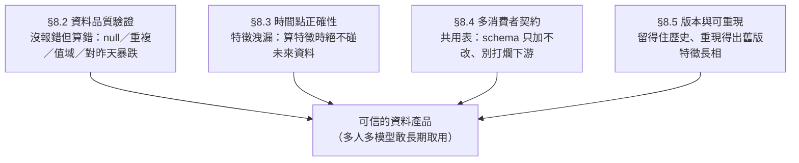
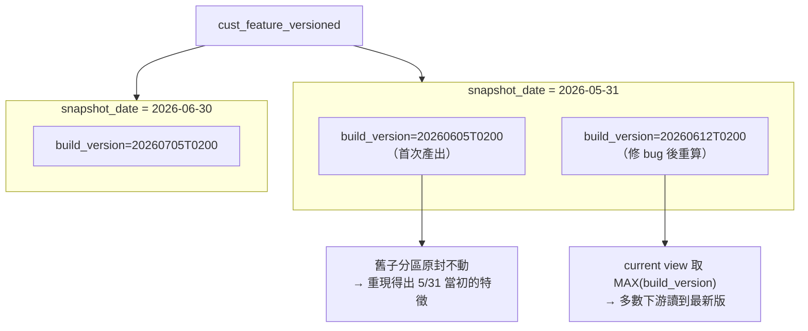
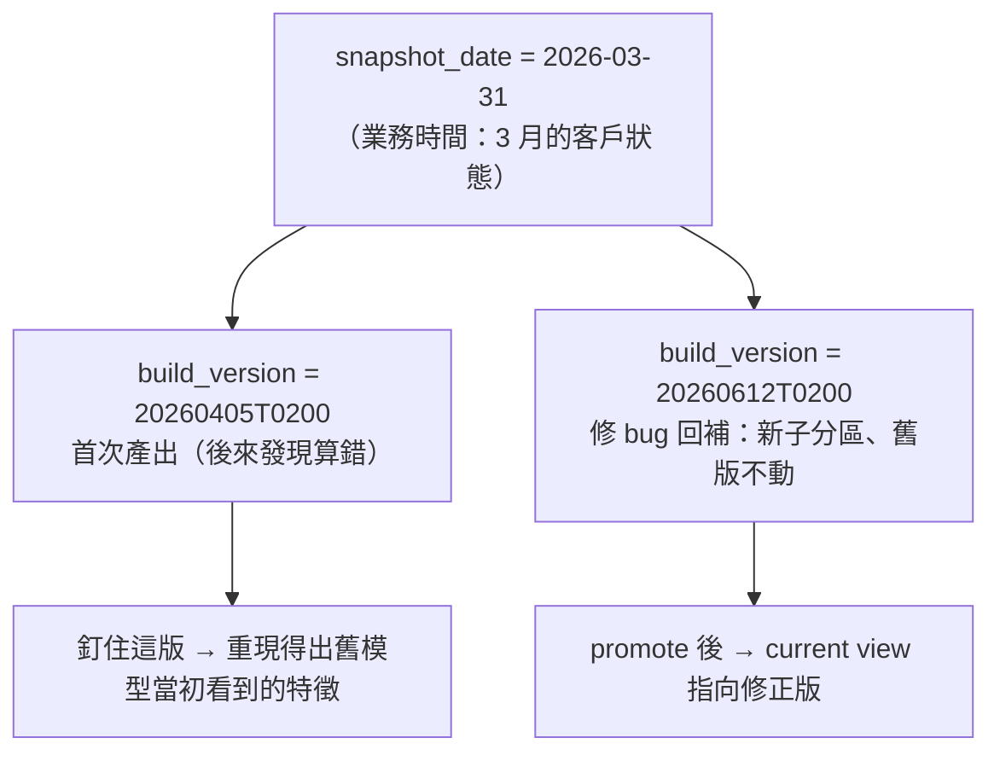

# 08 · 營運（二）：讓資料產品可信

> **本章前提**：你讀過[第 01 章](01-how-spark-runs-your-sql.md)（partition、HDFS/Hive Metastore）、[第 03 章](03-sql-tuning.md)（SQL 寫法、join）、[第 05 章](05-storage-efficiency.md)（partition 設計、external/managed 表、`ANALYZE`、schema 演進）、[第 07 章](07-operating-pipelines.md)（冪等 `INSERT OVERWRITE`、相依就緒閘門、dbt/Airflow/cron 三層工具）；你會寫 SQL。
>
> [第 07 章](07-operating-pipelines.md)（營運一）讓你的排程**可靠地跑起來**——冪等、相依、回填、監控。但「跑成功」不等於「**算對**」：一支作業可以 **exit 0**（程式正常結束、回傳成功代碼）、半夜準時跑完，產出的卻是一堆 null、客戶數悄悄掉一半、或用到了未來資料的特徵。這一章（營運二）顧的就是這些產出的**可信度**——只要你的表有別人長期拿去用，它就是一個**資料產品**，得對得起依賴它的人：對不對、可不可信、能不能重現。
>
> 沿用第 07 章的**三層工具**（dbt＝轉換層、Airflow＝排程層、cron＝沒上前兩者時的退路），每節先講通用原則、再落到這三件工具。每節末附 📚 來源，章末有「資料來源與精確度說明」。

---

## 8.1 本章地圖：把表/特徵當成「有人長期依賴的產品」

第 07 章把產出的表當成「要長期營運的服務」，盯的是它**跑不跑得起來**。這一章再進一步：你產的 `cust_feature`（**貫穿本章的例子＝每個客戶每個月底長什麼樣的特徵表，一列＝一個客戶 × 一個月**）不是你私人的中間結果，而是**好幾個模型、好幾個同事長期取用的資料產品**。產品的命門不是快，是**可信**——下游敢不敢閉著眼睛拿去用、三個月後出事查不查得回去。

可信，拆成四個面向，本章一節一件（它們彼此會互相支援、不是各自獨立）：



這四件事有個共同性格，和第 07 章 §7.8 那張踩雷表一樣：**它們出事時多半不報錯，只是默默給你一個「看起來對、其實錯」的結果**。所以這一章的每一招，本質都是**主動去抓那些不會自己冒出來的錯**。

> 📚 **來源**：「資料品質驗證／時間點正確性／特徵庫契約」屬營運資料產品的通用課題，本章對應到本手冊環境（Spark 3.3＋Hive 3.1.3/CDP、SQL-first、特徵以 (entity, snapshot_date) 分區）的具體做法；個別技術主張的出處見各節 footer。

---

## 8.2 資料品質驗證：主動抓「沒報錯的錯」

**原則。** 排程作業 exit 0 只代表「程式沒當掉」，不代表「資料是對的」。最常見的無聲災難：上游某欄突然全是 null、一個本該唯一的 key 冒出重複、label（label＝你要預測的目標，例如「下個月會不會違約」，§8.3 詳解）跑出非法值（該是 0/1 卻出現 2）、或今天的列數比昨天暴跌一半（上游漏給資料）。這些都不會讓 SQL 報錯——**你不主動驗，就只能等下游模型訓練爆掉、或上線出事才回頭查**。所以正確的營運是：**每次產完表，跟著跑一輪資料品質檢查，沒過就擋住、別讓壞資料流到下游**。

驗什麼，有幾個固定面向：**非空**（key 不該 null）、**唯一**（grain——也就是「一列代表什麼」、例如「一個客戶一個月一列」——不該重複）、**值域**（label〔要預測的答案，例如「會不會買」「會不會違約」〕、類別欄只能是合法值）、**參照完整**（外鍵在維度表裡找得到）、**漂移**（列數／null 比例對昨天別暴跌）。

**落地（dbt）——`tests` 把這幾個面向變成宣告式檢查。**「宣告式」的意思是：你只**宣告**「要驗什麼」、不用自己寫驗證 SQL，dbt 照著幫你生 SQL 去跑。dbt 內建四個 **generic test**（預先做好、可重複套到任何欄的檢查），直接寫在 model 的 YAML 上、`dbt test` 一跑就驗：

```yaml
# models/cust_feature.yml
models:
  - name: cust_feature
    columns:
      - name: cust_id
        tests:
          - not_null                      # 客戶 ID 不該有 null
      - name: label
        tests:
          - not_null
          - accepted_values:              # label 只能是 0 或 1，出現別的就抓
              values: [0, 1]
              quote: false                # label 是數值欄；dbt 預設 quote: true 會當字串比較，數值欄要設 false
      - name: prod_id
        tests:
          - relationships:                # 每個 prod_id 都要在 dim_product 找得到（沒有孤兒外鍵）
              to: ref('dim_product')
              field: prod_id
```

四個內建 test 對應：`not_null`（非空）、`unique`（單欄唯一）、`accepted_values`（值域）、`relationships`（參照完整）。（範例裡的 `ref('dim_product')` 就是[第 07 章 §7.3](07-operating-pipelines.md) 那個 dbt 跨表參照，指向另一張 model。）

> ⚠️ **唯一性別只測單欄。** 本書的特徵表 grain 是 **(cust_id, snapshot_date)**——同一個 `cust_id` 會在每個月的分區各出現一次。所以對 `cust_id` 單獨下 `unique` **會誤判失敗**（跨 snapshot 本來就重複）。要測的是「**同一個 snapshot 內** cust_id 不重複」，那是**多欄組合**唯一，得用 `dbt_utils.unique_combination_of_columns`（dbt-utils＝dbt 的社群工具套件，需在 `packages.yml` 宣告後 `dbt deps` 安裝）或自訂 generic test，不是內建的單欄 `unique`。這正是「具體 grain 決定你該測什麼」——抄一個 `- unique` 上去反而天天假警報。

**落地（dbt）——severity：哪些該硬擋、哪些只示警。** 每個 test 可設 `severity`：

- **`severity: error`（預設）**：測失敗就讓 `dbt test`／這一步**失敗**——下游（靠 §7.3 的就緒閘門）因此不會拿到這批壞資料。用在「錯了絕不能放行」的硬底線（key null、label 非法）。
- **`severity: warn`**：失敗只**記成警告、不擋**。用在「可疑但不該停整條線」的軟訊號（例如某個比例略微偏移）。
- 還能用 `error_if` / `warn_if` 設**閾值**：少量違規只 warn、超過某數才 error。

```yaml
      - name: feat_a
        tests:
          - not_null:
              config:
                severity: warn            # feat_a 偶有 null 只示警、不擋線
                error_if: ">1000"         # 但一旦 null 超過 1000 列，升級成 error 擋住
```

這條 `warn`／`error` 的線，就是把「資料品質」接上第 07 章「監控與退化」的地方：**error 是硬閘門、warn 是退化訊號**。

**落地（非 dbt 作業）——用純 Spark SQL 自己做品質閘。** dbt 和純 SQL 品質閘是**兩條路擇一**：沒用 dbt 的人可跳過上面 dbt 段、直接看這裡的純 SQL 版。不是每支作業都走 dbt（cron 腳本、純 Spark 作業）。同樣的檢查用一段 SQL 表達：把每項檢查算成「違規列數」，**只要有任何一項 > 0 就讓作業失敗**：

```sql
-- 品質閘：把各項檢查 union 成一張「違規清單」，回傳任何一列就讓外層作業 exit 非 0
SELECT 'cust_id_null'        AS check_name, COUNT(*) AS bad_rows
FROM   cust_feature WHERE snapshot_date='2026-05-31' AND cust_id IS NULL
HAVING COUNT(*) > 0
UNION ALL
SELECT 'label_out_of_domain', COUNT(*)
FROM   cust_feature WHERE snapshot_date='2026-05-31' AND label NOT IN (0, 1)
HAVING COUNT(*) > 0
UNION ALL
SELECT 'dup_grain', cnt                              -- 同一 snapshot 內 (cust_id) 重複 = grain 壞了
FROM  (SELECT cust_id, COUNT(*) AS cnt
       FROM   cust_feature WHERE snapshot_date='2026-05-31'
       GROUP  BY cust_id HAVING COUNT(*) > 1) d;
```

外層腳本（cron/Airflow）拿這段的回傳列數判生死：**有列＝有違規＝讓這一步失敗**。具體怎麼把「SQL 回了幾列」變成「作業失敗」？把違規**數成一個數字**、在 shell 裡判它是不是 0 就好：

```bash
# 把上面那段品質檢查包成子查詢、只取「違規項數」這一個數字
violations=$(spark-sql -S -e "SELECT COUNT(*) FROM ( <上面的 union-all 品質檢查> ) v")
if [ "$violations" -gt 0 ]; then
  echo "資料品質檢查未過：$violations 項違規" >&2
  exit 1                       # 讓這一步失敗 → §7.3 下游就緒閘門就會把後面擋住
fi
```

（`spark-sql -S -e` 把查詢結果安靜地印到 stdout，shell 用 `$(...)` 接住那個數字；CDP 叢集節點通常有 `spark-sql` CLI，不確定就問 IT。）「對昨天漂移」（今天列數比昨天掉超過 20% 就可疑）同理——join 昨天的分區比一下列數，超標就回一列。

**落地——品質閘擋下後的行動路徑。** 品質閘擋住是第一步，接下來「誰決定怎麼辦」是最燙手的問題，給一個可操作的預設處置：

1. **擋住該版**：讓這一步 exit 非 0，下游就緒閘門（§7.3）因此不推進。
2. **下游 fallback 前一版**：設計下游時預留「讀前一個通過驗證的 snapshot」的退路——這正是 §8.5/§8.6 版本化的用途：舊版沒被蓋掉，降級時才有版可退。
3. **通知負責人決定是否強制放行**：品質閘的 `warn` 通道（或 Airflow `on_failure_callback`）通知到人；人工評估後，若確定可接受（例如已知的上游波動），才由人下指令強制繼續——不讓 pipeline 自己決定。

多 snapshot 情境下的額外判斷：**一個 snapshot 驗失敗，不必停整條線**——只擋住那個 snapshot 的下游，其他 snapshot 照常跑。把每個 snapshot 的品質閘當成獨立的一步，失敗只影響那一個切片。

**落地——警報要有真去處。** 擋住只是第一步，**得有人知道**。dbt/Airflow 失敗會進你既有的告警（Airflow 可掛 `on_failure_callback` 通到 email/Slack）；cron 則靠 §7.5 的 `set -euo pipefail`＋非 0 exit 接上你們的監控。本章不假設你們用哪個管道，但原則固定：**驗出問題 → 擋住下游 → 通知到人**，三步缺一不可。

> 📚 **來源**：dbt 四個內建 generic test（`unique`／`not_null`／`accepted_values`／`relationships`）與在 model YAML 的 `tests:`／`data_tests:` 宣告見 [dbt — Add data tests to your DAG](https://docs.getdbt.com/docs/build/data-tests)；`severity`（`error` 預設／`warn`）與 `error_if`／`warn_if` 閾值見 [dbt — severity](https://docs.getdbt.com/reference/resource-configs/severity)。⚠️ 新版 dbt（≥1.8）把 `tests:` 改名為 `data_tests:`（舊鍵仍相容）、並可把參數收進 `arguments:`；多欄組合唯一性需 `dbt_utils.unique_combination_of_columns` 或自訂 test，非內建單欄 `unique`。漂移門檻（20%）為示意值，依你資料波動設定。

---

## 8.3 時間點正確性與特徵洩漏：算特徵時，絕不碰未來

**原則（特徵庫的頭號命門）。** 先定錨兩個詞：**特徵（feature）**＝描述每個客戶的一個數字／屬性（近 30 天消費、目前餘額…），模型拿它來預測；**label**＝你要模型預測的那個答案（會不會買、會不會違約）。訓練模型時，每一筆特徵都該回答一個問題：「**在要做預測的那個時間點，這個資訊真的拿得到嗎？**」如果你不小心用了「預測當下還不可能知道的資訊」去當特徵，就是**特徵洩漏（data leakage）**。它的可怕之處是：離線評估會**虛高到爆**（因為偷看了答案），但一上線、真的只能用當下資訊時，模型就**原形畢露**。第 07 章 §7.8 最後一列「測得很準、上線很差」講的就是它。

本書環境的特徵是 **snapshot-partition 模型**：一列一個 **(entity, snapshot_date)**（**entity＝你排序或算特徵的對象，本書示例是客戶 `cust_id`，換個應用場景可以是商品、帳戶、裝置等**；**snapshot**＝在某個時間點對全體客戶拍的一張快照，**一個 snapshot ＝ 一個 `snapshot_date` 分區**）。每個 `snapshot_date` 分區＝「**在那個時間點，每個客戶長什麼樣**」。在這個模型下，時間點正確性可以收斂成一句非常具體、可檢查的規則：

> **算 `snapshot_date = D` 的特徵，只准用 D（含）以前的資料；D 之後的東西只能當 label（要預測的答案），絕不能當特徵。**


**洩漏的三種典型長相**（都不會報錯）：

1. **直接用到未來資料**：算 5/31 的特徵時，把帳務「全部」加總，沒設時間上界 → 6 月、7 月的消費被算進了 5/31 的特徵。
2. **label 期間混進特徵**：label 是「6 月有沒有違約」，特徵卻含了 6 月的還款行為——特徵窗和 label 窗**重疊**，等於偷看了答案的一部分。
3. **跨 snapshot 取錯**：join 特徵表時忘了鎖 `snapshot_date`，配到了別的時間點的特徵列。

**落地——正解＝讀對分區、用切線過濾事件。** 第 1 類靠「事件表加時間上界」擋掉：

```sql
-- ❌ 洩漏：算 5/31 的特徵卻把所有帳務都加總（含 5/31 之後）
SELECT cust_id, SUM(amount) AS total_spend
FROM   txn
GROUP  BY cust_id;                         -- 沒有任何時間上界，未來消費也被算進來

-- ✓ 正確：時間點切線——只用 snapshot 當天（含）以前
SELECT cust_id, SUM(amount) AS total_spend
FROM   txn
WHERE  txn_date <= DATE '2026-05-31'       -- 絕不跨過 snapshot 線
GROUP  BY cust_id;
```

**落地——第 3 類靠「join 時鎖住 snapshot_date」擋掉。** 把 label 和特徵拼起來訓練時，兩邊的時間點必須對齊：

```sql
-- ❌ 跨 snapshot 取錯：join 沒鎖 snapshot_date → label 可能配到別月的特徵
SELECT l.cust_id, l.label, f.feat_a
FROM   labels l
JOIN   cust_feature f ON f.cust_id = l.cust_id;          -- 漏了 snapshot_date 條件

-- ✓ 正確：特徵的 snapshot 與 label 的 snapshot 對齊（同一個時間點）
SELECT l.cust_id, l.label, f.feat_a
FROM   labels l
JOIN   cust_feature f
  ON   f.cust_id       = l.cust_id
 AND   f.snapshot_date = l.snapshot_date                 -- 鎖在同一條時間切線上
WHERE  f.snapshot_date = '2026-05-31';
```

**training 與 serving 必須同一套 snapshot 定義。**（**training**＝用歷史資料訓練模型那一步；**serving**＝上線後、真的拿模型去對每個客戶算分數那一步。）訓練時你用「歷史的 snapshot 分區」配「未來窗的 label」；上線推論時你用「最新的 snapshot 分區」算分數。只要兩邊「特徵怎麼定義、用哪個時間點的資料」**對得起來**，模型在線上看到的特徵才會和訓練時一致——對不上，就是另一種洩漏的近親（training–serving skew，訓練與上線的特徵算法不一致；注意這裡的 skew 指**訓練與線上推論用的特徵算法不一致**，跟第 01 章那個「資料傾斜」是不同的 skew）。snapshot-partition 模型天生幫你對齊：兩邊都是「讀某個 `snapshot_date` 分區」，定義同一份。

**snapshot 模型讓「時間對齊」變成一個等值條件（進階旁註，不熟可跳過）。** 上面 ✓ 的那句 `f.snapshot_date = l.snapshot_date`，本質就是「把特徵和 label 對齊到同一個時間點」——而且只用一個 `=` 就做完了。這正是 snapshot 設計的一大好處：它把「時間對齊」這件事**預先固化成分區**，下游只要等值 join，省事又不易錯。

> 對照組（你不必用、但值得知道它存在）：若特徵不是「每月一張快照」、而是**帶任意更新時間的事件流**（每個客戶的特徵在不規則時間點更新），要對齊就得用所謂的 **as-of join**——「對每個 label 時間點，找出當時**最新**的特徵值」這種**不等值**對齊。Spark 3.3 **沒有原生的 AS OF JOIN 語法**（join 類型只有 inner/outer/semi/anti/cross），得自己用 window function 模擬、又貴又易錯。snapshot 模型讓你完全繞開這個麻煩——這就是為什麼它是個好設計。

> 📚 **來源**：Spark 3.3 SQL 支援的 join 類型（inner/cross/left[outer]/left semi/right[outer]/full[outer]/left anti，**無 AS OF／temporal join**）見 [Spark SQL — JOIN](https://spark.apache.org/docs/latest/sql-ref-syntax-qry-select-join.html)（要對齊 3.3.2 把網址 `latest` 改 `3.3.2`，主站舊頁多已 404、需用 `archive.apache.org/dist/spark/docs/3.3.2/`）。⚠️ 「特徵洩漏」「時間點正確性」「training–serving skew」是機器學習特徵工程的通用方法學概念，本節給的是它在 snapshot-partition 模型下的具體 SQL 做法（時間上界過濾、join 鎖 snapshot_date）；無單一官方逐字出處，方向（用到未來資訊→離線虛高、上線崩盤）明確。

---

## 8.4 共用特徵庫的多消費者契約：改一張表＝同時改 N 個下游

**原則。** 第 07 章 §7.3 提過：一張 `cust_feature` 可能**扇出（fan-out）給 N 個模型**取用。這帶來一個容易被忽略的責任——**這張表是一個公共介面，不是你私人的中間表**。你改它的 schema，等於同時動了 N 個下游的地基；改錯一次，一次打爛一整排（§7.8 倒數第三列）。所以共用表的演進要守一份**契約**。

**契約一：schema「只加不改」（接 §5.8）。** [第 05 章 §5.8](05-storage-efficiency.md) 講過這條原則，這裡點明為什麼它對多消費者是硬規則：

- **加欄（安全）**：新增一個特徵欄，舊讀者 `SELECT` 的是既有欄、根本不碰新欄，不受影響。

```sql
-- 安全：加新特徵欄，舊下游不受影響
ALTER TABLE cust_feature ADD COLUMNS (feat_new DOUBLE);
```

- **改/刪/改名/改型別（危險）**：刪欄或改欄名，下游 `SELECT old_col` 直接壞；**最陰險的是「同名欄改語意」**——欄名沒變、值的定義變了（本來是「近 30 天消費」改成「近 90 天」），下游一行程式都不用改、卻**默默開始用錯的數字訓練**，沒有任何錯誤。「不要改同名欄語意」是人工約定、改了不會自動有訊號；可操作的防線是在資料字典或契約文件裡記**欄位語意版本**，語意一變就 bump、下游據以判斷——這是機器可讀的標記，不是只靠人記得。
- **真要改語意，用「新增＋過渡＋棄用」取代「原地改」**：開一個新欄 `feat_x_v2`、和舊欄並存一段過渡期、通知下游遷移、確認沒人用了再刪舊欄——而不是把 `feat_x` 原地改掉。

**契約二：避不掉的破壞性變更要版本化。** 有時就是得做破壞性改動。原則是**別偷偷來**：透過版本化讓新舊並存、給下游遷移期——可以是新表（`cust_feature_v2`）、或用 §8.5 的 `build_version` 區分。核心是下游能**選**在準備好時才切過去，而不是某天早上發現表變了、模型壞了。

**契約三：消費者的「就緒」＝分區完整且過了品質閘（接 §7.3＋§8.2）。** 下游讀某個 snapshot 前，要確定的不只是「上游 DAG 成功了」，而是「**我要的那個 `snapshot_date` 分區，資料完整、而且過了 §8.2 的品質檢查**」。所以理想的就緒訊號（§7.3 的 `_SUCCESS`／sensor）應該是**品質閘通過後才落**——把「跑完」和「驗過」綁成同一個就緒定義，下游才真的安全。

> 📚 **來源**：schema「只加不改」對共用表的意義見[第 05 章 §5.8](05-storage-efficiency.md)；`ALTER TABLE … ADD COLUMNS` 加欄語法見 [Spark SQL — ALTER TABLE](https://spark.apache.org/docs/latest/sql-ref-syntax-ddl-alter-table.html)；相依就緒閘門（sensor／`_SUCCESS`）見[第 07 章 §7.3](07-operating-pipelines.md)。⚠️「同名欄改語意最危險」「破壞性變更要版本化＋過渡期」為資料產品介面治理的通用工程實踐，方向明確、無單一官方逐字出處；過渡期長短依你下游數量與遷移成本而定。

---

## 8.5 資料版本與可重現性：沒有 time-travel，怎麼留住歷史

**原則（先把問題講清楚）。** 第 07 章 §7.2 教你「冪等覆寫」是好習慣——`INSERT OVERWRITE` 同一個分區，重跑幾次都是最新那份。但冪等的代價是：**舊版被蓋掉了**。於是三個月後，當有人問「當初訓練那個模型、用的 5/31 特徵到底長什麼樣？」或稽核要你回答「這個分數是用哪一版特徵算的」，你**重現不出來**（「可重現」指日後能重現歷史某個版本算出來的結果，不是「同一支程式跑兩次位元相同」）——因為 5/31 那個分區早被後來的重算覆蓋了。

有些**較新的表格式**（Iceberg、Delta Lake）內建 **time-travel**（一行語法就查得到任意歷史版本的資料）。但本書環境是**純 Hive ＋ Parquet/ORC，沒有 time-travel**。所以要可重現，得自己搭。下面三招由輕到重、按需求疊加：

**招式一：build-version 標記欄——至少「知道這是哪次跑的」。** 每次產出蓋一個版本戳（建議用**可排序的時間戳**字串，如 `20260605T0200`），讓資料帶著「我是哪次 build 的產物」這個資訊。

```sql
SELECT cust_id, feat_a, feat_b, '20260605T0200' AS build_version, ...
```

但注意：如果你**還是 overwrite 同一個 `(snapshot_date)` 分區**，舊 build 依然被蓋掉——標記欄只解決「**識別**」（事後看得出這份是哪版），不解決「**保存**」（舊版沒留著）。要真的留歷史，看招式三。

**招式二：audit 帳本表——把「每次跑的元資料」記成一本流水帳（通用模式）。** 開一張 **append-only** 的 log 表，每次成功產出就**追加一列**：哪張表、哪個 snapshot、哪個 build_version、產了幾列、幾點跑的、誰跑的、用哪版程式碼。它**不存特徵本身、只存元資料**，輕量，卻讓你事後查得到「5/31 被重算過幾次、每次幾點、哪支作業」。

```sql
-- audit 帳本：只記元資料、不存特徵；append-only，這些是不可變的歷史事實
CREATE TABLE IF NOT EXISTS feature_build_audit (
    table_name     STRING,
    snapshot_date  STRING,
    build_version  STRING,
    row_count      BIGINT,
    built_at       TIMESTAMP,
    built_by       STRING,        -- 哪支作業（如 airflow:build_cust_feature）
    code_version   STRING         -- 程式碼版本（git sha 等）→ 追得到「用哪版邏輯算的」
)
STORED AS PARQUET;

-- 每次成功產出後，追加一列（這是 §7.2 裡「append 才對」的少數場景：歷史事實永不覆寫）
INSERT INTO feature_build_audit
SELECT 'cust_feature', '2026-05-31', '20260605T0200',
       COUNT(*), current_timestamp(), 'airflow:build_cust_feature', 'a1b2c3d'
FROM   cust_feature WHERE snapshot_date='2026-05-31';
```

> 這裡用 `current_timestamp()` 是對的，和 §7.4「排程 SQL 別用 `current_date()`」**不衝突**：§7.4 禁的是拿執行當天去冒充**業務邏輯日期**；audit 要記的正是「**這次實際幾點跑的**」這個維運事實，本來就該用真實時鐘。`INSERT INTO`（append）在這裡也正確——audit 列是不可變的歷史事實，永遠只追加、不覆寫（呼應 §7.2「append 只在絕不重跑同一批時才對」）。

**招式三：連 build_version 一起分區——真正把舊版留在磁碟上。** 要能重現「5/31 當初的特徵長相」，就把 `build_version` 也升級成**分區鍵**，做成**雙層分區**。關鍵性質：**不同 build_version 是不同子分區、互不覆蓋**——新 build 寫進新子分區，舊 build 原封不動留著。

```sql
-- 雙層分區：snapshot_date 之下再切 build_version
CREATE TABLE cust_feature_versioned (
    cust_id  BIGINT,
    feat_a   DOUBLE,
    feat_b   DOUBLE
    -- ...
)
PARTITIONED BY (snapshot_date STRING, build_version STRING)
STORED AS PARQUET;

-- 每次產出寫到「這個 snapshot 的這一版」子分區；
-- 重算 = 換一個新的 build_version = 寫進新子分區，舊版完全不動
INSERT OVERWRITE TABLE cust_feature_versioned
PARTITION (snapshot_date='2026-05-31', build_version='20260605T0200')
SELECT cust_id, feat_a, feat_b      -- 不含兩個分區欄（都在 PARTITION 子句給了）
FROM   ...;
```



**讀的時候要挑版本**——這是雙層分區的代價，但有兩種乾淨的挑法：

- **要重現**：釘死版本，`WHERE snapshot_date='2026-05-31' AND build_version='20260605T0200'`，拿回當初那一份。
- **要最新（多數下游）**：用一個 **current-build view** 把「選最新版」的邏輯固化起來，下游照常查、根本不必知道 `build_version` 存在：

```sql
-- 多數下游只想要「每個 snapshot 的最新一版」→ view 幫他們選好
-- （build_version 用可排序的時間戳格式，MAX 才能正確選到最新）
CREATE OR REPLACE VIEW cust_feature_current AS
SELECT f.*
FROM   cust_feature_versioned f
JOIN  (SELECT snapshot_date, MAX(build_version) AS build_version
       FROM   cust_feature_versioned
       GROUP  BY snapshot_date) latest
  ON   f.snapshot_date = latest.snapshot_date
 AND   f.build_version = latest.build_version;
```

**取捨——這招不是預設，是按需付費（接 §5.4）。** 把 `build_version` 變第二層分區會**讓分區數翻倍成長**：每個 snapshot 留幾版、就乘以幾。[第 05 章 §5.4](05-storage-efficiency.md) 警告過的「高基數分區 → 分區數膨脹＋小檔」在這裡會發生，而且**每留一版就多吃一份儲存**。所以：

- **多數表**只留 current（單層 `snapshot_date` 分區、冪等覆寫就好）。
- **只有真的需要可重現/稽核的關鍵特徵表**，才升級成雙層分區，並**配一條清理政策**（如「只留最近 3 版、其餘定期 `DROP PARTITION`」，呼應 §7.6 清過期分區）。

可重現性是有價的；雙層分區是你**為它付的儲存與維護成本**，按需採用、別全表都上。

> 以上是入門三招。要把它升級成**可回滾、扛得住歷史回補與稽核**的設計（並認識背後「兩條時間軸」的模型），看下一節 §8.6。

> 📚 **來源**：多欄 `PARTITIONED BY`（巢狀子分區）見 [Spark SQL — CREATE TABLE](https://spark.apache.org/docs/latest/sql-ref-syntax-ddl-create-table-hiveformat.html)；`INSERT OVERWRITE … PARTITION(a=,b=)` 寫指定子分區、`CREATE VIEW` 見 [Spark SQL — INSERT](https://spark.apache.org/docs/latest/sql-ref-syntax-dml-insert-table.html)、[Spark SQL — CREATE VIEW](https://spark.apache.org/docs/latest/sql-ref-syntax-ddl-create-view.html)；高基數分區→分區膨脹/小檔的取捨見[第 05 章 §5.4](05-storage-efficiency.md)、清過期分區見[第 07 章 §7.6](07-operating-pipelines.md)。⚠️ build-version 標記欄／audit 帳本／雙層分區是**通用的可重現性模式**（純 Hive/Parquet-ORC、無 Iceberg/Delta time-travel 時的常見做法），非某特定產品功能；`MAX(build_version)` 取最新依賴版本字串可排序（用時間戳格式），保留版數與清理政策依你稽核需求與儲存預算定。

---

## 8.6 進階：資料版本化的設計模式與歷史回補

> 本節較進階，給「要長期經營特徵庫、會碰到歷史回補與稽核」的人。只做當期產表的人，§8.5 三招就夠了。

§8.5 把版本化當「保存歷史」。但一旦你要**回補（backfill——補算或更正過去某個 snapshot）**，版本化就從「存檔」升級成一個要認真設計的東西。先給一個讓全節都通的心智模型。

### 兩條時間軸：bitemporal 心智模型

`cust_feature_versioned` 的兩個分區鍵，其實是**兩條不同的時間軸**：

- **`snapshot_date`＝業務時間（valid time）**：這份資料**描述**的是哪個時間點的客戶狀態（「3 月底的客戶長相」）。
- **`build_version`＝處理時間（transaction time）**：這份資料**什麼時候被算出來**的（「首次跑」還是「修 bug 重算」）。

同時拿這兩條軸記資料，在資料倉儲裡叫 **bitemporal（雙時間軸）**——雙層分區就是它最樸素的實作。一講清這兩條軸，回補就只剩一句話：

> **回補＝對一個「舊的 `snapshot_date`」、寫一個「新的 `build_version`」。**



### 回補 × 版本化：一個具體走查

情境：**6 月你發現 3 月的某個特徵算錯了**（漏了一個 join 條件），修好 code，要重算 `2026-03`。

**沒版本化（單層分區、直接覆寫）會怎樣：**

```sql
-- 直接覆寫 3 月分區：舊的（錯的）3 月資料就此消失
INSERT OVERWRITE TABLE cust_feature PARTITION (snapshot_date='2026-03-31')
SELECT cust_id, feat_a, feat_b FROM ... ;     -- 修好的邏輯
```

兩個後果，都不報錯：

1. **舊模型再也重現不出來**：當初拿「錯版 3 月」訓練的模型，現在表裡已經沒有那份資料，你無法解釋、也無法重算它當初看到了什麼。
2. **表與模型悄悄不一致**：表已經是修正版，但用舊版訓練、還在線上跑的模型學的是錯的——表說一套、模型是另一套，這個落差**沒有任何訊號**。

**有 `build_version`（雙層分區）會怎樣：**

```sql
-- 回補寫成「3 月的新一版」子分區；舊版子分區原封不動
INSERT OVERWRITE TABLE cust_feature_versioned
PARTITION (snapshot_date='2026-03-31', build_version='20260612T0200')
SELECT cust_id, feat_a, feat_b FROM ... ;     -- 修好的邏輯

-- 同時 append 一列 audit（§8.5），把「為什麼重算」留下底
INSERT INTO feature_build_audit
SELECT 'cust_feature_versioned', '2026-03-31', '20260612T0200',
       COUNT(*), current_timestamp(), 'airflow:backfill_2026_03',
       'fix-missing-join-cond@a1b2c3d'          -- code_version 帶上「修了什麼」
FROM   cust_feature_versioned
WHERE  snapshot_date='2026-03-31' AND build_version='20260612T0200';
```

> ⚠️ 這裡**兩個分區值都要寫成靜態的**（`snapshot_date='…', build_version='…'`）。若把 `build_version` 留成動態欄（`PARTITION (snapshot_date='2026-03-31', build_version)`），覆寫範圍會變成「該 snapshot 底下**所有** build」——正好把你想保護的舊版一起清掉。靜態值才只動這一個子分區。

於是：**舊版（`20260405…`）留著 → 重現得出舊模型**；**current view 指到修正版 → 下游重訓讀到對的**；**audit 帳本留了一筆「3 月於 6/12 因 X 重算」→ 稽核查得到**。

這也正是 [§7.4](07-operating-pipelines.md)「回填要分批、可中斷、別擾鄰」能成立的底層原因：因為每個 `(snapshot, build)` 子分區的寫入**冪等且不可變**，回補才能一個 snapshot 一個 snapshot 補、補到哪算數、中斷再續跑都不會弄髒別的版本。

### 設計模式：把「產出」和「發佈」分開——active-version 指標

§8.5 的 current view 用 `MAX(build_version)`＝「最新一版自動就是對外那一版」。多數時候沒問題，但它有個盲點：**萬一你的回補本身有 bug 呢？**「最新」就不再是「最好」，而 `MAX` 會**自動把壞版本推上線**，你還沒有乾淨的辦法退回去。

更穩的設計是把兩件事拆開：

- **產出（build）**：把新版算出來、寫進 `(snapshot, build)` 子分區。這一步只代表「**算好了**」，不代表「對外用這版」。
- **發佈（promote）**：明確記下「**這個 snapshot 現在對外發佈哪一版**」。這是一個**刻意的動作**，過了品質閘（§8.2）才做。

實作上不需要去「改」任何資料——而且**純 external Parquet 在 Spark 3.3 本來就不支援 `UPDATE`／`MERGE` 改單列**（那要 Iceberg/Delta 那種支援列級操作的格式，同 §7.2 對 `MERGE` 的說明）。最乾淨的是一張 **append-only 的「發佈紀錄」表**：每次 promote 就**追加一列**，現行版本（**active-version＝「目前對外公開、下游讀到的那一版」**）＝每個 snapshot「最後一次被 promote」的那版。

```sql
-- 發佈紀錄：append-only，每次 promote／rollback 都只追加一列
CREATE TABLE IF NOT EXISTS feature_version_promotion (
    table_name     STRING,
    snapshot_date  STRING,
    build_version  STRING,        -- 這次要對外發佈的版本
    promoted_at    TIMESTAMP,
    promoted_by    STRING,
    reason         STRING         -- 'initial' / 'backfill bugfix' / 'rollback' …
)
STORED AS PARQUET;

-- promote 3 月的修正版（過了品質閘才做）：就是 append 一列
INSERT INTO feature_version_promotion
VALUES ('cust_feature_versioned', '2026-03-31', '20260612T0200',
        current_timestamp(), 'analyst:alice', 'backfill bugfix');
```

current view 改成「join 到每個 snapshot 最後一次 promote 的版本」，而不是盲取 `MAX`：

```sql
CREATE OR REPLACE VIEW cust_feature_current AS
WITH active AS (          -- 每個 snapshot：取「最後一次被 promote」的那一版
  SELECT snapshot_date, build_version
  FROM  (SELECT snapshot_date, build_version,
                ROW_NUMBER() OVER (PARTITION BY snapshot_date
                                   ORDER BY promoted_at DESC) AS rn
         FROM   feature_version_promotion
         WHERE  table_name = 'cust_feature_versioned') t
  WHERE rn = 1
)
SELECT f.*
FROM   cust_feature_versioned f
JOIN   active a
  ON   f.snapshot_date = a.snapshot_date
 AND   f.build_version = a.build_version;
```

這帶來兩個你原本沒有的能力：

- **回滾（rollback）零成本**：發佈的新版出包，再 append 一列指回舊 build 就好（`reason='rollback'`）——資料一點沒動，只是把「對外指標」撥回去。
- **產出與發佈解耦**：可以先把好幾個月的回補**全部算完、全部驗過**，再一次性 promote，避免「補一半、半新半舊」被下游讀到。跨 N 個 snapshot 的批次回補若要整批回滾，需**原子地** promote N 筆指標；中途失敗會進「半新半舊」狀態，下游讀到的版本混雜。建議把整批 promote 包成一次切換（例如在 trigger 腳本裡迴圈 `INSERT INTO feature_version_promotion` 全部成功才視為完成），或保留一個總 view 一次切。

這其實就是資料版的 **blue/green 部署**（blue/green＝先把新版資料整份備在旁邊、驗好後把「現用版」指標一次切到新版；出事可秒切回舊版，使用者全程讀到的都是完整的某一版）：新版先擺旁邊備好、確認沒問題才切過去、出事立刻切回。而且——**promote 是一個人為把關的決定，不是 `MAX` 自動發生的**。要不要做到這一層，看這張表下游有多關鍵、出錯代價有多高。

**這個模式有個業界名字：Write-Audit-Publish（WAP）。** 把它和 §8.2 串起來看，三步剛好對上本章：

| WAP 步驟 | 對到本章 |
|---|---|
| **Write** | 把新 build 寫進 `(snapshot, build)` 子分區——指標還沒指它、下游看不到 |
| **Audit** | 對那個指定 `build_version` 跑 §8.2 的品質閘 |
| **Publish** | 過了才 promote（append 發佈紀錄／撥指標）→ current view 這才指過去 |

WAP 的核心保證就是這一句：**消費者永遠只讀到驗過的資料**。我們這裡「Write 到一個還看不到的地方」靠的是『新 build 先寫進子分區、但 current view 還沒指它』——而且這個暫存的 build **可以用它的 `build_version` 直接查到**，剛好讓你就地 audit、過了再 flip 指標。

> （更簡單的等價作法：發佈紀錄表也可以「每個 snapshot 只留一列、用 `INSERT OVERWRITE` 整表覆寫」來改指向，因為它很小。append-only 版的額外好處是**連『誰在何時把哪版換成哪版』都留了底**，本身就是一份發佈稽核。）

### 保留與清理：別讓雙層分區無限長大

雙層分區的代價 §5.4 就警告過：`build_version` 是高基數的第二層分區，**留越多版、分區數與儲存越膨脹**（36 個月 × 每月留 N 版）。所以雙層分區**一定要配一條保留政策**，否則遲早壓垮 NameNode 與查詢計畫。常見幾種：

- **留 current ＋ 最近 N 版**：每個 snapshot 只保最新幾版，更舊的 `DROP PARTITION`（§7.6）。
- **「被釘住的」全留、其餘按時清**：被生產模型訓練用過、要長期可重現的 snapshot/build 標記為 **pinned** 全留；沒被引用的按時間清。
- **時間制**：build 超過 90 天就清，pinned 除外。

**audit 帳本（§8.5）是讓清理變安全的關鍵**：清之前先查「這個 build 還有沒有被任何模型／報表引用」，確定沒人用了才刪。

> ⚠️ **回補的清理陷阱**：「每 snapshot 只留最近 N 版」這條政策，可能會把你**回補前那一版（想留作稽核基準的）給刪掉**——因為它現在「比較舊」。所以清理政策要認得 pinned／baseline 版本，別純按時間或版次砍。

### 其他模式與邊界（誠實收尾）

- **列級版本化（SCD Type 2，Slowly Changing Dimension Type 2，維度變動時新增一列保留歷史、不覆蓋舊值）**：在每一列加 `effective_from`／`effective_to`／`is_current`，讓**單列**帶生效區間。比分區級的 `build_version` 細，但讀「某時間點的樣子」要回到 §8.3 刻意避開的 **as-of join**、也較重。我們的特徵是「整批重算一個 snapshot」的粒度，**分區級 `build_version` 剛好對得上**、更簡單；列級 SCD2 留給「維度表少量列零星變動」的場景。
- **若日後能上 Iceberg／Delta Lake**：它們內建 snapshot／tag／branch ＋ time-travel，能用一行語法取代本節整套手搭機制（回補＝寫一個新 snapshot、可命名 tag、可 time-travel 查任意版）。**WAP 在這類表格式是原生的**——例如 Iceberg 用 `spark.wap.branch` 把寫入導到一條 audit 分支、驗過再 `fast_forward` 把 main 快轉過去發佈；我們上面那套指標／view，就是在沒有分支的純 Hive/Parquet 上手搭出同樣的語意。**本書環境目前沒有**，故只在此點到；真要長期經營特徵庫，評估換表格式是值得的一步。
- **邊界（別 overclaim）**：本節給的是**資料**可重現的原語（哪份特徵、哪一版、何時算的）。完整的**實驗**可重現（模型超參、隨機種子、執行環境）是 ML 平台（如 MLflow 之類）的事，不是這張表能全包的——兩者搭著用才完整。

> 📚 **來源**：`INSERT OVERWRITE … PARTITION(a=,b=)` 子分區、`CREATE VIEW`、`ROW_NUMBER() OVER (PARTITION BY … ORDER BY …)` 視窗函式見 [Spark SQL — INSERT](https://spark.apache.org/docs/latest/sql-ref-syntax-dml-insert-table.html)、[CREATE VIEW](https://spark.apache.org/docs/latest/sql-ref-syntax-ddl-create-view.html)、[Window Functions](https://spark.apache.org/docs/latest/sql-ref-syntax-qry-select-window.html)；「純 Hive/Parquet 表在 Spark 3.3 不支援 `UPDATE`／`DELETE`／`MERGE` 改單列（row-level DML 需 DataSource v2 支援列級操作，如 Iceberg/Delta）」見 [Spark SQL — DELETE FROM](https://spark.apache.org/docs/latest/sql-ref-syntax-dml-delete-from.html) 與 §7.2 對 `MERGE` 的同款說明；**Write-Audit-Publish（WAP）**為資料工程通用工作流（Write→Audit→Publish，消費者只見驗過的資料），Iceberg 原生支援（`spark.wap.branch` audit 分支寫入＋`fast_forward`／`publish_changes` 發佈）見 [Apache Iceberg — Branching and Tagging](https://iceberg.apache.org/docs/latest/branching/) 與 [Spark Writes](https://iceberg.apache.org/docs/latest/spark-writes/)。⚠️ **bitemporal（valid time／transaction time）**、**產出/發佈分離（WAP、blue/green、promote 指標）**、**SCD Type 2** 皆為通用資料倉儲設計模式，無單一官方逐字出處、方向明確；保留版數與清理政策依你稽核需求與儲存預算定；`ROW_NUMBER` 依 `promoted_at` 取最新，promote 時間需單調遞增（同一時刻多次 promote 要另加序號 tie-break）。

---

## 8.7 取捨總表

| 取捨 | 一邊 | 另一邊 | 怎麼選 |
|---|---|---|---|
| 驗證嚴格度 | `severity: error` 硬擋：壞資料絕不放行 | `severity: warn` 只示警：不停線 | key/值域等底線用 error；可疑但不致命的軟訊號用 warn＋`error_if` 閾值 |
| 唯一性怎麼測 | 內建單欄 `unique`：簡單 | 多欄組合唯一：對 (cust_id, snapshot_date) grain 才正確 | snapshot-partition 表**必用組合唯一**（`unique_combination_of_columns`／自訂），別單欄 |
| 時間對齊 | snapshot 分區等值 join：便宜、本書做法 | as-of join：特徵帶任意 effective_date 才需要、Spark 3.3 無原生 | 維持 snapshot 模型→只需等值 join；別把它複雜化成 as-of |
| schema 演進 | 原地改/刪欄：省事 | 只加不改＋新欄過渡：不打爛下游 | 共用表**一律只加不改**；破壞性變更走版本化＋遷移期 |
| 留不留歷史 | 單層分區＋冪等覆寫：省儲存、但舊版沒了 | 雙層 `(snapshot_date, build_version)`：可重現、但吃儲存＋要清理 | 多數表只留 current；要稽核/可重現的關鍵表才上雙層分區＋清理政策 |
| 回補更正歷史 | 直接覆寫舊 snapshot：簡單、但舊版與舊模型沒了 | 寫新 `build_version` 子分區：可重現＋表模型可對齊 | 會被回補/受稽核的特徵表用新 build；一次性 backfill 純補洞可直接覆寫（§8.6） |
| current 版怎麼選 | `MAX(build_version)` 自動：簡單、但壞回補會自動上線 | 發佈紀錄＋promote 指標：可回滾、人為把關 | 一般表 `MAX` 夠；關鍵/高代價表用「產出/發佈分離」（§8.6） |

---

## 8.8 一句話帶走：跑成功 ≠ 算對，可信的資料產品要主動去守

把這兩章營運線收束：第 07 章讓作業**可靠地跑**，這一章讓產出**值得信**。

> **每次產完表就驗（品質閘 error 硬擋／warn 示警）、算特徵時死守時間切線（只讀 snapshot 之前、絕不碰未來）、共用表 schema 只加不改、需要可重現就連 build_version 一起分區留歷史——因為這些錯都不報錯，你不主動守，就只能等下游出事才發現。**

工具上仍是那三層：**dbt 用 `tests` 把驗證宣告在表上、Airflow 把失敗接上告警與就緒閘門、cron 靠 `set -euo pipefail`＋品質 SQL 自己補。**

接下來：

- 想看「我這類工作（ad-hoc／排程產表／特徵運算）通常照哪些章、最常踩什麼雷」的索引？→ 第 11 章（撰寫中）。
- 想要一頁速查（config 預設、症狀→對策、中英名詞）？→ 第 12 章（撰寫中）。

---

## 資料來源與精確度說明

**版本對齊**：Spark 連結用 `/docs/latest/` 頁（與全書一致），要對齊本手冊的 Spark 3.3.2 把網址版本字串改為 `/docs/3.3.2/`——注意主站 version-locked 舊頁多已 404，需改用 `archive.apache.org/dist/spark/docs/3.3.2/…`（§8.3 的「無 AS OF join」即以 3.3.2 archive 頁逐字確認）。dbt 連結為官方文件（`tests`／`severity`）。皆官方專案文件、非個人部落格（spec §6 已納入權威來源），確切行為以你環境實測。

**本章刻意簡化、或屬「方向正確但依環境而異」之處**（自行斟酌、別當精確值）：

1. **§8.2** dbt 內建 `unique` 是單欄唯一；本書 (cust_id, snapshot_date) grain 的「同 snapshot 內唯一」需多欄組合 test（`dbt_utils.unique_combination_of_columns` 或自訂），非內建。新版 dbt（≥1.8）`tests:`→`data_tests:`、參數可收進 `arguments:`，舊語法相容。漂移門檻（如 20%）為示意。
2. **§8.3** 「特徵洩漏／時間點正確性／training–serving skew」為 ML 特徵工程通用方法學，本章給的是 snapshot-partition 模型下的具體 SQL 做法；無單一官方逐字出處，方向（用未來資訊→離線虛高/上線崩盤）明確。Spark 3.3 無原生 AS OF join 已對 3.3.2 join 文件逐字確認。
3. **§8.4** 「同名欄改語意最危險」「破壞性變更版本化＋過渡期」為資料產品介面治理通用實踐；過渡期長短依下游數量與遷移成本。
4. **§8.5** build-version 標記欄／audit 帳本／雙層分區為通用可重現性模式（無 Iceberg/Delta time-travel 時的常見做法），非特定產品功能；`MAX(build_version)` 取最新依賴版本字串可排序（時間戳格式）；保留版數與清理政策依稽核需求與儲存預算。
5. **§8.6** bitemporal（valid time／transaction time）、產出/發佈分離（promote 指標、blue/green）、SCD Type 2 為通用資料倉儲設計模式，無單一官方逐字出處、方向明確。「純 Hive/Parquet 表在 Spark 3.3 不支援 `UPDATE`／`MERGE` 改單列、需 DataSource v2 列級操作（Iceberg/Delta）」已對 Spark 3.3 行為查證（故 promote 用 append-only 發佈紀錄或整表 `INSERT OVERWRITE`）；發佈紀錄以 `promoted_at` 取最新，同一時刻多次 promote 需另加序號 tie-break。保留/清理政策、是否上 active-version 指標依下游關鍵度與儲存預算定。**Write-Audit-Publish（WAP）**為通用工作流，§8.6 的「產出/發佈分離」＋§8.2 品質閘即其手搭版；Iceberg/Nessie 等表格式原生支援，本書環境（純 Hive/Parquet）以指標／view 間接層達成等價語意。

> 引用原則：以 Spark／Hadoop／Cloudera CDP 官方文件、Spark 核心開發者文章、**你們在用工具的官方文件（dbt、Apache Airflow）**、指定書籍為限，不引用未經認證的個人部落格。

---

*←上一章* [07 · 營運（一）：可靠地把排程跑起來](07-operating-pipelines.md)　|　下一章 → 第 09 章（撰寫中）　|　*回* [手冊首頁](index.md)
