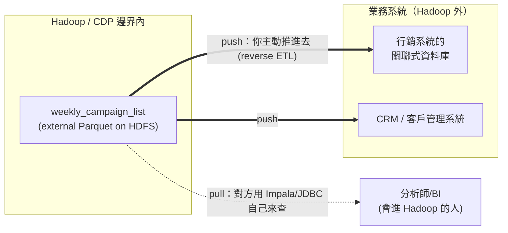
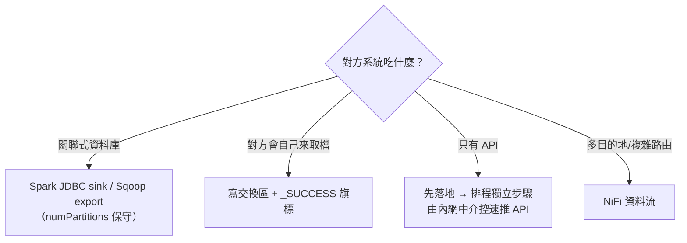
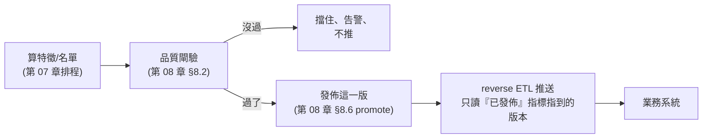

# 09 · 營運（三）：把資料送出去——reverse ETL 回業務系統

> **本章前提**：你已讀過第 05（儲存效率：external 表）、06（引擎選用：共用表怎麼被多引擎讀）、07（排程可靠：冪等、相依、監控）、08（資料產品正確：品質閘、時間點正確、版本與發佈）。你可以假設已懂：external 表是三引擎的共用最大公約數、`INSERT OVERWRITE` 冪等覆寫、品質閘、「已發佈版本」。**本章要幹的事**：把你算好、驗過的特徵／行銷名單，從 Hadoop 推回 Hadoop 外面的業務系統（客戶行銷及管理系統、CRM、行銷自動化平台），完成兩條主線的最後一哩。

前八章一路把資料「算得快、存得好、排得穩、信得過」，但有個前提一直沒打破：**資料都還待在 Hadoop 裡**。PM 不會登入 Hue 跑 SQL，行銷自動化系統也不會來查你的 Hive 表，它們各自有自己的資料庫。**把算好的資料主動送進那些系統，這件事叫 reverse ETL**（一般 ETL 是把外面的資料抽進倉庫；reverse 是反過來，把倉庫裡加工好的結果送回營運系統去用）。這是「資料變成業務動作」的臨門一腳，也是本手冊兩條主線交付資料的最後一哩，只是交付方式有兩種（讓對方自己來查的 pull、主動送出去的 push），§9.1 就先把它分清楚（初階「出名單給 PM」常常 pull 就夠，不一定要 push）。

---

## 本章目錄

- [9.1 問題定位：算好的資料還在 Hadoop 裡，怎麼出去](#91-問題定位算好的資料還在-hadoop-裡怎麼出去)
- [9.2 推送通道：四條路，先挑對的](#92-推送通道四條路先挑對的)
- [9.3 推送的冪等與重試：目標在外部，重跑不能變兩份](#93-推送的冪等與重試目標在外部重跑不能變兩份)
- [9.4 就緒閘與發佈：只推「驗過、已發佈」的那一版](#94-就緒閘與發佈只推驗過已發佈的那一版)
- [9.5 PII、權限與稽核：資料一出 Hadoop 邊界，合規就跟著走](#95-pii權限與稽核資料一出-hadoop-邊界合規就跟著走)
- [9.6 對齊行銷系統要的格式與 key](#96-對齊行銷系統要的格式與-key)
- [9.7 貫穿範例：一份行銷名單從算好到送達](#97-貫穿範例一份行銷名單從算好到送達)
- [9.8 取捨](#98-取捨)
- [9.9 一句話帶走](#99-一句話帶走)

---

## 9.1 問題定位：算好的資料還在 Hadoop 裡，怎麼出去

你已經有一張算好、驗過、發佈好的表，例如每週的行銷名單 `weekly_campaign_list`（1000 萬客戶裡篩出本週要推的 30 萬人＋推薦產品＋分數）。它躺在 HDFS 上的 external Parquet 表裡。問題是：**要用它的人在 Hadoop 外面。**

把資料交出去有兩種根本不同的模型，先分清楚你是哪一種，後面所有選擇都跟著它走：

- **pull（拉）**：你只負責把表準備好放在共用 Metastore 裡，**下游自己來取**：用 Impala／JDBC 連進來查你的表。第 06 章那種「Spark 寫、Impala 讀」的共用表就是 pull。**你不動，對方來。**
- **push（推）= reverse ETL**：你**主動**把資料寫進對方的系統（對方的關聯式資料庫、或丟一個檔給對方、或打對方的 API）。**對方不動，你送過去。**



**怎麼選**：能讓對方自己來查就 **pull**：最省事、最鬆耦合，你只要維護好那張共用表（第 06 章）。但行銷系統、CRM 這類業務系統通常**只認自己的資料庫或 API、不會、也不被允許連進 Hadoop**；這時就只能 **push**。本章其餘部分講的都是 push 這條較麻煩的路。

> 📚 **來源**：reverse ETL 指「把倉庫／資料湖裡加工好的資料送回營運系統」的資料整合模式，相對於傳統 ETL 的反向；pull 模型對應第 06 章共用 Metastore 的多引擎存取。

---

## 9.2 推送通道：四條路，先挑對的

push 不是只有一招。挑通道前先問三件事：**對方系統吃什麼進料**（資料庫？檔案？API？）、**多即時**（馬上要？隔天也行？）、**你這邊用什麼排**（第 07 章那套）。下面四條是 CDP 上的實務選項：

| 通道 | 怎麼做 | 適合 | 主要限制／坑 |
|---|---|---|---|
| **Spark JDBC sink** | `df.write.format("jdbc")…` 直接把 DataFrame 寫進對方關聯式 DB（JDBC，Java Database Connectivity，連關聯式資料庫的標準介面；Spark 內建，可用它直接讀寫對方 DB） | 目標是關聯式 DB、量中等、要程式化控制 | `numPartitions` 是同時對目標 DB 開幾條連線，**開太多會打垮對方 OLTP（線上交易處理資料庫，就是業務系統那台要即時服務、不能被你一次灌爆的 DB）** |
| **檔案落「交換區」** | 把結果寫成 CSV/Parquet 到雙方約定的目錄，下游/SFTP 來取 | 鬆耦合、批量大、跨組織 | 非即時；要寫 `_SUCCESS` 旗標、命名帶日期、講好誰清檔 |
| **NiFi（Cloudera Flow Management）** | 用 CDP 的視覺化資料流工具做 egress（資料外送/出口）、可路由/轉換/重試 | 複雜路由、要 GUI 維運、多目的地 | 多一套工具要學/維護 |
| **Sqoop export** | `sqoop export` 把 HDFS 批量匯到 RDBMS（關聯式資料庫） | 既有 Sqoop 流程 | CDP 仍隨附，但屬**較舊的工具**，新案 Cloudera 多建議改用 Spark/NiFi（以你平台為準） |

**Spark JDBC sink 最常用，但有個一定要記的坑。** 把名單寫進行銷系統的 MySQL/SQL Server：

```sql
-- 概念示意（實際以 DataFrame writer 設定）：
-- df.write.format("jdbc")
--   .option("url", "jdbc:mysql://mktg-db-internal:3306/campaign")
--   .option("dbtable", "weekly_list")
--   .option("user", ...).option("password", ...)   -- 走金鑰管理，別寫死（走公司的金鑰管理/secret store，不確定問平台/IT）
--   .option("batchsize", 1000)        -- 每批寫幾列，預設 1000
--   .option("numPartitions", 4)       -- 同時幾條連線寫目標 DB ← 關鍵
--   .option("truncate", "true")       -- overwrite 時清表重寫、不 drop 重建
--   .mode("overwrite")
--   .save()
```

`numPartitions` 決定**同時有幾條連線在灌對方資料庫**。你的 Spark 有 50 個 task 能平行，不代表對方那台 OLTP 撐得住 50 條連線同時寫，它還要服務線上業務。**這個值要保守（個位數起跳），先問對方 DBA**，不然你一支排程就能讓行銷系統的資料庫卡住。這跟前面各章「盡量平行」的直覺相反：**寫外部 OLTP 時，瓶頸與風險都在對方那台機器，不在你的叢集。**

**對方只有 API、沒有資料庫怎麼辦？** 一個關鍵原則：**不要在 Spark executor 裡直接打外部 API**。executor 動輒數十上百個、平行又無法控速，會瞬間對對方開出大量連線、打爆它的 rate limit，失敗了也難重試；何況很多銀行內網對外網存取本就有管制。正確做法是**先把資料落地成檔（交換區），再由排程的一個獨立步驟**（driver 端腳本或公司內網的中介服務）把它分批、控速地推給對方 API。「先落地、再由獨立步驟推」正是為了能**控速**，配合對方系統的流量上限（rate limit）與收批時間窗，你不知道什麼時候到這筆、什麼時候超量，用落地檔當緩衝就能在推送層精確控制速率。



> 📚 **來源**：Spark JDBC 寫出選項（`url`／`dbtable`／`user`／`password`／`batchsize`〔預設 1000〕／`numPartitions`／`truncate`／`isolationLevel`、`SaveMode`）見 [Spark 3.3.2 — JDBC To Other Databases](https://spark.apache.org/docs/3.3.2/sql-data-sources-jdbc.html)；CDP 的 NiFi（Cloudera Flow Management）與 Sqoop 定位見 Cloudera CDP 官方文件（docs.cloudera.com）。⚠️ Sqoop 在你環境的確切狀態、各通道的權限與部署細節依平台而異，以你平台為準。

---

## 9.3 推送的冪等與重試：目標在外部，重跑不能變兩份

第 07 章的冪等講的是「重跑同一個 Hive 分區，結果一樣」，靠 `INSERT OVERWRITE` 整批覆寫。推到外部系統時，**你不再擁有那張表、不能整批覆寫了**，得換一套思路，但目標一樣：**同一批資料推一次和推三次，對方看到的結果要相同。**

- **半推半成怎麼辦**：推到一半連線斷了，對方 DB 裡留了一半的名單。下次重推，不能用「純 append（只新增）」，那會把已經進去的那一半再疊一次、變成重複列。正解是**目標端 upsert**：用一個**穩定業務鍵**（例如 `cust_id ＋ 名單日期`），有就更新、沒有就新增。各家 DB 語法不同（同一件事）：

```sql
-- 目標 DB 是 MySQL：
INSERT INTO weekly_list (cust_id, campaign_date, product, score)
VALUES (...)
ON DUPLICATE KEY UPDATE product = VALUES(product), score = VALUES(score);

-- 目標 DB 是 PostgreSQL：
INSERT INTO weekly_list AS t (...) VALUES (...)
ON CONFLICT (cust_id, campaign_date) DO UPDATE SET ...;

-- 目標 DB 是 Oracle / SQL Server：用 MERGE
```

- **整批換掉**：如果語意是「這批名單整個換新」，可以「先刪掉這個 `campaign_date` 的所有列、再寫」放在**一個交易**裡（要嘛全成、要嘛全不成），或用 JDBC writer 的 `truncate` + `overwrite`（但那是整張表、不是單批，慎用）。
- **失敗重試＝重推同一批**：把「補推」設計成「重推同一批」，靠 upsert／業務鍵保證不重複，這樣第 07 章的 `retries`、人工補跑才安全。**最危險的反例是用 append 當重試**，它每重跑一次就多一份。

一句話：**推外部系統的冪等，靠的是「目標端有業務鍵 + upsert」，不是你這邊的 `INSERT OVERWRITE`。**

**增量 vs 全量**：本章示範的邏輯是**全量**：把這次算好的整批名單（30 萬筆）送進去、整個換掉。但實務上大表常用**增量**：只推這次的異動（靠資料裡的異動時間欄或版本欄挑出新列），目標端一樣用 upsert 保證冪等。兩種模式的取捨：全量簡單直接、但資料量大時每次都跑整批很慢；增量省時省連線，但你要能正確抓出「哪些是新異動」，抓漏就漏推（靠 upsert 也救不回來），抓重靠 upsert 可以擋住重複。一句點明：30 萬筆整批 vs 只推今天真正變動的幾千筆，差的是這個設計選擇。

**部分成功（partial reject）的陷阱**：JDBC 批次寫入遇到目標端 constraint 違反（重複鍵、NOT NULL、型別不符）時，通常是**整批失敗**，不是「跳過壞那幾筆、其餘繼續」。幾百筆格式不對的壞列夾在 30 萬筆裡，整批都進不去，而你在 Spark 這邊看到的只是一個 exception。正解是**推送前先在 Hadoop 內把資料驗乾淨**（接第 08 章 §8.2 品質閘），別指望目標 DB 幫你挑掉壞的：它不會挑，它只會全部拒絕。

> 📚 **來源**：upsert（有則更新、無則新增）為各關聯式資料庫的標準寫法（`MERGE`／`ON CONFLICT`／`ON DUPLICATE KEY UPDATE`）；冪等與重試紀律延續第 07 章 §7.2。

---

## 9.4 就緒閘與發佈：只推「驗過、已發佈」的那一版

推出去的資料**收不回來**，名單一旦進了行銷系統、開始外撥/發訊，你沒辦法像改 Hive 表那樣 `INSERT OVERWRITE` 蓋掉。所以 reverse ETL 的鐵律是：**只推經過第 08 章品質閘、而且是已發佈版本的資料。**

把整條線串起來，推送是**最後一棒**，前面每一棒都不能省：



- **就緒閘**：推送作業的上游相依，不是「名單算完了」，而是「名單**驗過了、發佈了**」。在第 07 章的 DAG 裡，推送這個 task 要等品質閘 task 成功、且發佈指標已更新，才准跑（接 §8.6 的 active-version／WAP——WAP＝Write-Audit-Publish，先寫好、驗過、才發佈；active-version＝目前對外公開的那一版）。
- **別推半成品或壞回補**：第 08 章 §8.6 講過「壞掉的回補可能自動上線」的盲點，在 reverse ETL 這裡後果更嚴重（資料已經出門）。推送只認「已發佈」那一版，不認最新算出來的那一版。
- 這也呼應第 07 章 §7.2 的 staging 精神：**先在 Hadoop 內把對的版本確定下來，再往外推**，不要邊算邊推。

> 📚 **來源**：品質閘見第 08 章 §8.2、發佈／promote／WAP 見第 08 章 §8.5–§8.6、staging 過渡見第 07 章 §7.2。

---

## 9.5 PII、權限與稽核：資料一出 Hadoop 邊界，合規就跟著走

行銷名單幾乎一定含 **PII（個人可識別資訊，Personally Identifiable Information）**：客戶 ID、可能還有姓名、聯絡方式。資料留在 Hadoop 裡時，第 06 章那套 Metastore 權限、加上 **Apache Ranger** 的政策（誰能讀哪張表、哪些欄要遮罩）管著它。**一旦推出 Hadoop 邊界，這層保護就不自動跟著走了**，所以推送前要自己顧三件事：

- **誰能推、推什麼**：reverse ETL 作業等於開了一個「資料合法外流」的口子。要明確：哪個帳號／服務有權推、能推哪些表、推到哪些目標。Ranger 可以對來源表設政策，但「推出去」這個動作本身要有人核准、有設定管控。
- **遮罩與最小揭露**：對方系統真的需要完整 PII 嗎？能用代碼（surrogate key）就別送真實身分證號；該遮罩的欄位在**推送前**就處理掉（在 Hadoop 內遮，別指望外部系統會遮）。推送前用 `SELECT` 只挑需要的欄、或對敏感欄做雜湊/代碼化，在 Hadoop 內就遮好，**別 `SELECT *` 把不需要的欄也帶出去。**
- **稽核留痕**：每次推了什麼、幾筆、推到哪、誰觸發的，要留紀錄（接第 08 章 §8.5 的 audit 帳本精神）。稽核要記到能**查得出事**的粒度（哪一批、哪個版本、幾筆、誰觸發），只記「幾筆」不夠，出事時你還需要知道是哪一版資料、哪個排程作業推的，才能重現與回應。出事時（例如名單外洩、推錯對象）要查得出來。Ranger 本身有 audit，但「推出邊界」這段要確保也在稽核範圍內。

**這不是可選的加分項**：在銀行，客戶資料離開受控環境是合規與法遵盯得最緊的一條線。reverse ETL 把這條線變成你排程的一部分，就得把它當第一級的事來設計，不是事後補。

> 📚 **來源**：Apache Ranger 提供集中式授權、欄位遮罩（masking）與稽核（audit），見 [Apache Ranger 官方](https://ranger.apache.org/) 與 Cloudera CDP Security 文件；audit 帳本概念見第 08 章 §8.5。

---

## 9.6 對齊行銷系統要的格式與 key

最後一哩最容易卡在「資料對了、但對方系統吃不下」。推之前，跟對方把介面講清楚：

- **主鍵對齊**：對方用什麼當一筆名單的唯一鍵（`cust_id`？對方自己的會員編號？），這決定 §9.3 upsert 的業務鍵，也決定你要不要先做一次 ID 對應。
- **欄位名稱與型別**：對方表的欄位名、型別（你的 `decimal` 分數對方可能要 `float`、你的日期格式對方可能要 `yyyymmdd` 字串）。不對齊就會在寫入時報錯或靜默截斷。
- **編碼與空值**：中文編碼（UTF-8）、空值對方當 `NULL` 還是空字串、布林用 `0/1` 還是 `Y/N`。
- **批次大小與時間窗**：對方系統有沒有「每批最多幾筆」「只在離峰時段收」的限制，對接外撥/簡訊平台尤其常見。

把這些寫進一份雙方都認的**介面約定**（接第 08 章 §8.4 的「共用表是公共介面」精神，只是這次介面在 Hadoop 外）。介面變更要像 schema 演進那樣審慎（同第 08 章 §8.4「只加不改」原則：新增欄位通常安全，改名/刪欄/改型別則必然破壞對方）：你改了名單欄位，可能就讓對方系統的匯入掛掉。

**schema drift 防禦**：反過來也一樣危險，**對方 DB 的 schema 也可能悄悄漂移**（drift）。對方哪天把欄位改了名、改了型別、或把某欄從可 NULL 改成 NOT NULL，你的推送**下次跑到才爆**，而且錯在對方那邊，你的程式碼沒動、測試都還是綠的。這是 reverse ETL 比一般 ETL 更難顧的地方：你不能控制目標端的 schema。對策有兩道：①推送時**明確列出欄位白名單**（`SELECT cust_id, product, score`，**別 `SELECT *`**，否則對方加欄或你這邊加欄都可能出問題）；②推前對目標端 schema 做一次比對/探測（用 JDBC metadata 查 column list），發現對不上就先擋下告警，別硬推進去讓對方系統吃到格式錯誤的資料。

---

## 9.7 貫穿範例：一份行銷名單從算好到送達

把本章串起來，走一遍一支每週名單的 reverse ETL：

1. **算**（第 07 章）：週一凌晨排程算出 `weekly_campaign_list`，`INSERT OVERWRITE PARTITION (campaign_date='2026-06-22')`，冪等可重跑。
2. **驗**（第 08 章 §8.2）：品質閘：名單筆數在合理區間（不是 0、也不是暴增到 300 萬）、`cust_id` 不重複不為空、分數在 0–1。沒過就擋住、告警、**不往下**。
3. **發佈**（第 08 章 §8.6）：驗過了，把這一版標記為 `campaign_date='2026-06-22'` 的已發佈版本。
4. **遮罩**（§9.5）：推送前在 Hadoop 內把不需外送的 PII 欄位去掉/代碼化，只留行銷系統要的 `cust_id ＋ product ＋ score`。
5. **推**（§9.2–§9.3）：排程的推送 task 等「發佈」成功才跑；用 JDBC sink 寫進行銷系統的 DB、`numPartitions=4` 保守、目標端用 `ON DUPLICATE KEY UPDATE (cust_id, campaign_date)` upsert，重推不會變兩份。
6. **稽核**（§9.5）：記下「推了 30 萬筆、到 mktg-db、週一 03:40、by campaign_pipeline」。

整條 DAG 的相依是 `算 → 驗 → 發佈 → 推`，任何一棒失敗，後面都不准跑，這正是 reverse ETL 跟「隨手把表 export 出去」的差別：**它是受控、可重跑、留痕、只送驗過版本的營運流程。**

---

### 動手前先確認這四件事

在開始實作推送前，把這四項逐一確認：

1. **DB 連線資訊與密碼**：JDBC URL、帳號、密碼都走金鑰管理（secret store），不寫死在程式碼或 config 裡（走公司的金鑰管理/secret store，不確定問平台/IT）。
2. **跟對方 DBA 確認 `numPartitions`／併發上限**：你的 Spark 能開 50 條連線，不代表對方那台 DB 撐得住，先問，個位數起跳，要追加再談。
3. **對方表有沒有 unique key 能給 upsert 當業務鍵**：沒有 unique key 就沒辦法做 upsert 保冪等；要確認或請對方建索引，才能安全重試。
4. **Ranger 授權與需遮罩的欄位**：確認來源表的讀取授權（你的排程服務帳號有權讀）、以及 PII 欄位已在推送前處理掉（不靠對方 DB 遮，在 Hadoop 內就遮）。

---

## 9.8 取捨

- **push vs pull**：push 即時、對方不必懂 Hadoop，但你**耦合了對方的 schema 與節奏**（對方改表、對方 DB 忙，你都受影響）；pull 解耦、你只維護一張共用表，但對方得有能力、有權限來取。**能 pull 就別 push。**
- **即時 vs 鬆耦合**：JDBC 直寫最即時但最耦合、最容易壓垮對方 DB；檔案交換區最鬆耦合最穩但非即時。多數行銷名單其實不需要秒級即時，**交換區常常是更穩的預設選擇**。
- **平行度**：本手冊前面一路教你「加平行度求快」，到了 reverse ETL **反過來**，`numPartitions` 要保守，因為瓶頸與風險都在對方那台機器。
- **送多少 PII**：送越完整對方越好用，但合規風險越大；以「對方真正需要的最小集合」為界。
- **多目的地（DB＋CRM 同時推）**：推多個目的地時，一個成功一個失敗是常態，別把它們當成一次原子操作，**各目的地各自冪等、各自重試**，每條推送路徑獨立記稽核、獨立處理失敗，互不連帶。

---

## 9.9 一句話帶走

> **reverse ETL 是把「算好的資料」變成「業務動作」的最後一哩：先確定能不能讓對方來 pull，不行才 push；push 就挑對通道（DB→JDBC、檔案→交換區、API→落地後內網中介）、靠目標端 upsert 求冪等、只推驗過且已發佈的版本、把 PII 與稽核當第一級的事顧好。它收不回來，所以前面每一棒（算→驗→發佈）都不能省。**

到這裡，營運線三章（07 可靠地跑、08 可信地產、09 安全地送出）走完了，你手上的資料從「在 Hadoop 裡算得對」一路接到「在業務系統裡被用」。

---

*←上一章* [08 · 營運（二）：讓資料產品可信](08-data-product-correctness.md)　|　*下一章 →* [10 · （進階）何時與如何改用 PySpark DataFrame API](10-pyspark-dataframe-api.md)　|　*回* [手冊首頁](index.md)

---

> **資料來源與精確度說明**
>
> - **Spark JDBC 寫出**：`format("jdbc")` 的 `url`／`dbtable`／`user`／`password`／`batchsize`（預設 1000）／`numPartitions`／`truncate`／`isolationLevel` 與 `SaveMode` 語意對齊 [Spark 3.3.2 JDBC To Other Databases](https://spark.apache.org/docs/3.3.2/sql-data-sources-jdbc.html)。
> - **CDP egress 通道**（NiFi＝Cloudera Flow Management、Sqoop export）與 **Apache Ranger** 的授權/遮罩/稽核為 Cloudera CDP／Apache 官方功能；**確切的通道可用性、Sqoop 在 CDP 7.1.9 的定位、Ranger 政策設定，依你平台部署而異，以你平台文件與管理者為準**，本章只給「有哪些路、各自取捨、合規要顧」的決策層次，未逐一示範各工具設定。
> - **upsert 語法**（`MERGE`／`ON CONFLICT`／`ON DUPLICATE KEY UPDATE`）依目標資料庫而異，本章示意 MySQL／PostgreSQL，實際以對方 DB 為準。
> - 名單筆數（30 萬／1000 萬客戶）、`numPartitions` 數字皆為示意，非建議值；對外部 OLTP 的併發上限請以對方 DBA 給的為準。
> - 引用原則：以 Spark 官方文件、Apache（Ranger/Sqoop/NiFi）官方、Cloudera CDP 官方文件為限，不引未認證個人部落格。
