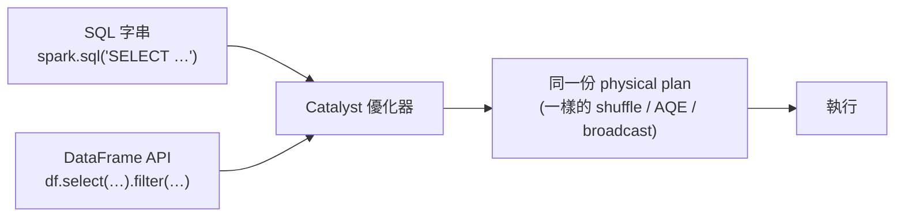

# 第 10 章 （進階）何時與如何改用 PySpark DataFrame API

> **本章前提**：你已讀過第 01 章（心智模型：partition／shuffle／lazy／Catalyst）與第 03 章（SQL 寫法優化）；若你要做營運級特徵庫，第 07、08 章（排程可靠、資料產品正確）也建議讀過。本章是**進階、視需要**的一章——前九章都用 SQL，這章告訴你：**當 SQL 開始不夠用時，下一步往哪走。不碰 RDD 那種低階 API。**

這本手冊一路用 SQL，是刻意的：你會 SQL、SQL 夠用、而且 SQL 經過的優化跟 DataFrame API 一模一樣。所以這章不是要你改寫所有東西成 PySpark——**大多數查詢留在 SQL 最好**。它要回答的是一個很具體的問題：**什麼情況下，SQL 這個工具開始綁手綁腳，值得多學一層 DataFrame API？**

---

## 10.1 什麼時候 SQL 不夠用，該考慮 DataFrame API

留在 SQL 是預設值。出現下面這些訊號，才值得換：

- **同一段邏輯要參數化、重複套用**：例如要對 50 個特徵欄位做同一種轉換（去空白、補預設值、分箱）。SQL 要你把這段複製貼上 50 次；DataFrame API 可以寫一次、用迴圈/清單套到 50 個欄位。
- **要寫單元測試**：純 SQL 字串很難測——你只能整段跑一次看結果。DataFrame API 可以把一段邏輯包成函式，餵幾列假資料、斷言輸出對不對（§10.5）。
- **要動態生成查詢**：欄位清單、篩選條件是程式跑起來才知道的（從設定檔讀、從另一張表算出來）。SQL 要你拼字串（容易出錯、難讀）；DataFrame API 用程式組起來自然得多。
- **巢狀子查詢／`CASE WHEN` 疊到 SQL 已經難讀難維護**：一條 SQL 長到三百行、五層子查詢，改一個地方要小心翼翼——這時拆成幾個有名字的 DataFrame 步驟會清楚很多。
- **要跟 Python／ML 程式整合**：特徵工程算完直接接訓練流程（sklearn、LightGBM），全程在 Python 裡比「SQL 算完落表、再用 Python 讀回來」順。

**沒有這些訊號，就留在 SQL。** 為一條一次性的查詢改用 DataFrame API，只是徒增閱讀門檻、團隊裡只會 SQL 的人就看不懂了。

---

## 10.2 關鍵觀念：它們是同一個引擎，換 API 不是為了更快

這是全章最重要、也最常被誤解的一點：**SQL 與 DataFrame API 跑的是同一個引擎。**

你寫的 SQL 字串、和你用 DataFrame API 串的那串 `.select().filter().groupBy()`，**都會被 Catalyst（第 01 章那個優化器）編譯成同一份 physical plan**——同樣的 `Exchange`（shuffle）、同樣走 AQE、同樣的 broadcast 決策。所以：



**結論：選 DataFrame API 是為了「工程性」——可測試、可重用、可組合——不是為了效能。** 同一段邏輯，SQL 寫和 API 寫跑出來一樣快、一樣的資源。所以：

- **別期待「把 SQL 改寫成 PySpark 就會變快」**——不會。要變快還是回第 03–05 章那套（少讀、少搬、存得對）。
- 反過來，**也別怕「用 SQL 比較低階、比較慢」**——它跟 API 是平起平坐的兩個入口，效能完全相同。

唯一例外是 **Python UDF**（§10.4）：那是真的會比 SQL／內建函式慢，因為它要在 JVM 和 Python 之間搬資料——但那是 UDF 的問題，不是 DataFrame API 的問題。

> 📚 **來源**：Spark SQL 與 DataFrame/Dataset API 共用同一套 Catalyst 優化器與 Tungsten 執行引擎、編譯成相同的執行計畫，見 [Spark SQL, DataFrames and Datasets Guide](https://spark.apache.org/docs/3.3.2/sql-programming-guide.html)。

---

## 10.3 基本對照：你已經會的 SQL，換成 API 長什麼樣

拿一個熟悉的查詢（算每位客戶近 30 天刷卡總額、只看本月、金額過門檻的），SQL 與 DataFrame API 並排：

```python
# SQL（你已經會的）
spark.sql("""
    SELECT cust_id, SUM(amount) AS amt_30d
    FROM txn
    WHERE month = '2026-06'
    GROUP BY cust_id
    HAVING SUM(amount) > 1000
""")

# DataFrame API（同一件事、同一份 plan）
from pyspark.sql import functions as F
(txn
   .filter(F.col("month") == "2026-06")          # WHERE
   .groupBy("cust_id")                            # GROUP BY
   .agg(F.sum("amount").alias("amt_30d"))         # SUM(...) AS ...
   .filter(F.col("amt_30d") > 1000))              # HAVING
```

對照表：

| SQL | DataFrame API |
|---|---|
| `SELECT a, b` | `.select("a", "b")` |
| `WHERE x > 1` | `.filter(F.col("x") > 1)` |
| `GROUP BY k` ＋ `SUM(v)` | `.groupBy("k").agg(F.sum("v"))` |
| `JOIN … ON …` | `.join(other, on="k", how="inner")` |
| `col AS new` / 新增欄 | `.withColumn("new", F.col("col") * 2)` |

**兩者可以混用**：`spark.sql("SELECT …")` 回傳的就是一個 DataFrame，你可以接著用 API 串下去；反過來，把一個 DataFrame 註冊成臨時 view（`df.createOrReplaceTempView("t")`）後又能用 SQL 查它。**不必非黑即白——哪段用哪個順手就用哪個。**

---

## 10.4 改用時最容易踩的坑

DataFrame API 的心智模型跟 SQL 一樣（第 01 章），但有幾個 Python 端特有的坑：

- **lazy 一樣**：`.select()`、`.filter()`、`.withColumn()` 都是 transformation，只是在累積計畫；要 `.show()`、`.count()`、`.write` 這種 action 才真的跑（同第 01 章）。所以在中間「印一下 DataFrame 變數」不會花錢，跑 action 才會。
- **別在 Python 迴圈裡反覆 `withColumn`／`union`**：每呼叫一次就在計畫上長一截，幾百次之後 **Catalyst 光是分析、優化這個超長計畫就慢到爆**（甚至 driver 端 StackOverflow）。要對很多欄位做事，**一次 `select` 把多個欄一起算出來**；要把很多片段疊起來，先收集成 list 再用 `functools.reduce(DataFrame.unionByName, dfs)` 一次合，別一筆一筆 `union`。
- **避免 `collect()` 把大量資料抓回 driver**：`.collect()`／`.toPandas()` 會把**整份資料拉回 driver 那一台機器的記憶體**——資料一大就 driver OOM（接第 04 章 driver 記憶體那段）。要看幾筆用 `.show(20)`；要落地用 `.write`；只有「結果本來就很小」（少數幾列）才 `collect`。
- **No UDF 紀律（生產約束，務必守）**：能用內建的 `pyspark.sql.functions`（`F.when`、`F.col`、`F.regexp_replace`、`F.coalesce`…）就**別寫 Python UDF**。Python UDF 要把每一列在 **JVM 和 Python 之間搬來搬去**、逐列呼叫你的 Python 函式，慢得多；而且本手冊環境**生產禁用 UDF**。內建 function 走的是 Catalyst、和 SQL 一樣快——幾乎所有你想用 UDF 做的事，內建函式都有對應寫法，先找它。

> 📚 **來源**：DataFrame 為 lazy、action 才觸發見第 01 章與 [SQL Programming Guide](https://spark.apache.org/docs/3.3.2/sql-programming-guide.html)；`collect` 把所有資料載回 driver、內建函式優於 Python UDF（跨 JVM/Python 邊界序列化成本）見 [PySpark `functions`](https://spark.apache.org/docs/3.3.2/api/python/reference/pyspark.sql/functions.html) 與第 04 章 driver 記憶體。

---

## 10.5 可測試與重用：這才是進階主線要它的真正原因

§10.1 那些訊號，最有份量的是**可測試、可重用**——對「營運共用特徵庫」這條線尤其關鍵。做法是把一段特徵計算**包成一個函式：吃一個 DataFrame、回一個 DataFrame**：

```python
from pyspark.sql import DataFrame, functions as F

def add_amt_30d(df: DataFrame) -> DataFrame:
    """近 30 天刷卡總額；缺值補 0（與訓練、推論共用這一份）。"""
    return df.withColumn(
        "amt_30d", F.coalesce(F.sum("amount").over(...), F.lit(0))
    )
```

包成函式後就有兩個好處：

- **可以寫單元測試**：建幾列假資料的小 DataFrame、套這個函式、斷言輸出對不對。純 SQL 字串做不到這件事。

```python
def test_add_amt_30d(spark):
    df = spark.createDataFrame([(1, 100), (1, 200), (2, None)], ["cust_id", "amount"])
    out = add_amt_30d(df).collect()   # 測試資料很小，collect 沒問題
    assert out[...] == ...            # 斷言：客戶 1 = 300、客戶 2 缺值補 0
```

- **同一段邏輯餵訓練表與推論**：這正是第 08 章 §8.3 講的「**特徵定義單一真實來源**」——`add_amt_30d` 只有一份，訓練時拿它算歷史快照、推論時拿它算最新快照，**不會有「訓練一套算法、推論另一套」的 drift**。SQL 也能用共用 model（dbt）達到類似效果，但當特徵邏輯複雜、要單元測試、要跟 Python 訓練流程綁在一起時，DataFrame 函式是更自然的載體。

**這就是為什麼「進階 analytics engineer」這條線最終會需要 DataFrame API**：純 SQL 很難對複雜特徵邏輯做單元測試與重用，而特徵庫的正確性恰恰靠這個。

---

## 10.6 取捨與一句話帶走

- **SQL 直觀、人人會改、團隊門檻低**；DataFrame API 可測試、可重用、可組合，但**多一層學習、要會 Python**，團隊裡只會 SQL 的人就讀不了。
- 換 API **換到的是工程能力，不是速度**（§10.2）——別為了「更快」改寫。
- 不是全有全無：**一條查詢用 SQL、一段要重用的特徵邏輯用 DataFrame 函式**，混著用最務實。

> **一句話帶走**：**SQL 能清楚表達的就留 SQL；要參數化、要單元測試、要重用，或要接 Python／ML，才值得換 DataFrame API——而且要記住，換的是工程能力不是速度（同一個 Catalyst、同一份計畫），唯一真的會慢的是 Python UDF，能用內建函式就別碰它。**

---

*← 上一章：[第 09 章 營運（三）：reverse ETL 回業務系統](09-reverse-etl.md)　｜　下一章：[第 11 章 場景對應（索引）](11-scenario-playbooks.md)*

---

> **資料來源與精確度說明**
>
> - **SQL 與 DataFrame API 共用 Catalyst、編譯成相同計畫、效能相同**，見 [Spark SQL, DataFrames and Datasets Guide](https://spark.apache.org/docs/3.3.2/sql-programming-guide.html)。
> - **內建函式優於 Python UDF**（UDF 跨 JVM/Python 邊界逐列序列化、較慢）為 Spark 普遍建議；本手冊環境另有「生產禁用 UDF」的硬約束。
> - 本章程式碼（`add_amt_30d`、window 寫法、pytest 風格測試）為**示意**，重在表達結構，非可直接複製執行的完整程式；`over(...)` 的 window 規格、缺值語意請依你的特徵定義補全。
> - 引用原則：以 Spark 官方文件為限，不引未認證個人部落格。
