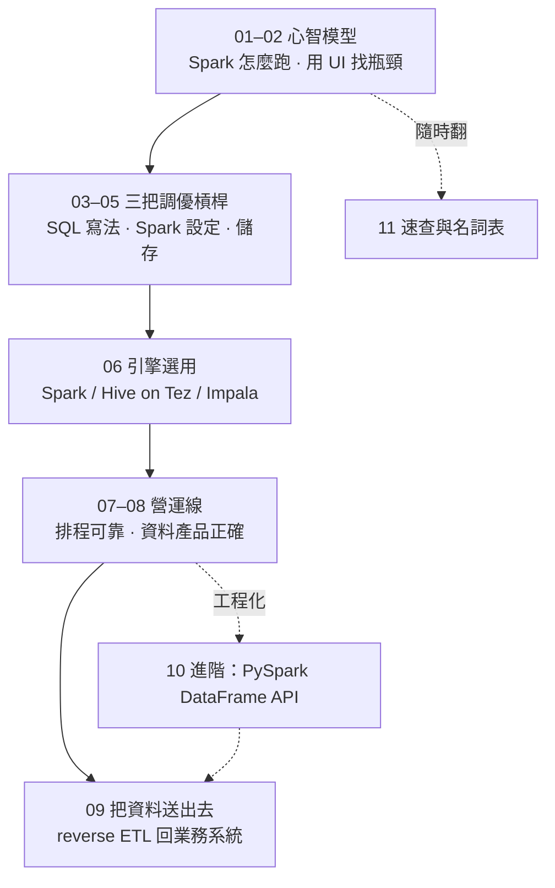

# Spark 優化參考手冊

寫給數據部門同事的實用手冊：自己**讀懂查詢為什麼慢、改寫 SQL、調 Spark 設定、選對引擎、設計資料儲存，最後把資料可靠地送出去**，把資料處理變快、變省、變可信。「效率」涵蓋三件事、遇取捨明講：**運算時間**、**記憶體**（OOM／spill）、**資料儲存**。環境：**Spark 3.3.x ＋ Hive 3.1.3 ＋ Impala on CDP（YARN＋HDFS）**，範例以 SQL 為主。

---

## 全書地圖

> **兩條主線都在第 09 章把資料送出去**：**初階分析師** 沿 01→08 建立優化與營運能力 → 出名單給 PM；**進階 analytics engineer** 再加第 10 章工程化 → reverse ETL 回業務系統（CRM／行銷平台）。

---

## 章節導覽

| 章 | 標題 | 一句話 |
|---|---|---|
| 01 | [Spark 怎麼跑你的 SQL](01-how-spark-runs-your-sql.md) | 建立心智模型：一條 SQL 在叢集裡發生什麼、為什麼 shuffle 最貴 |
| 02 | [用 Spark UI 找瓶頸](02-diagnose-with-spark-ui.md) | 先量再調：怎麼讀 `EXPLAIN` 與 Spark UI，認出 shuffle/skew/spill/小檔 |
| 03 | [SQL 寫法優化](03-sql-tuning.md) | 改寫法就變快：partition 裁剪、join 策略、避免爆量、處理 skew |
| 04 | [Spark 設定（AQE-first）](04-spark-config.md) | AQE 自動幫你做了什麼、剩下少數真正值得調的旋鈕 |
| 05 | [儲存效率](05-storage-efficiency.md) | 檔案格式、partition 設計、小檔問題、壓縮與統計的取捨 |
| 06 | [引擎選用](06-engine-selection.md) | Spark vs Hive/Tez vs Impala：什麼情況用哪個 |
| 07 | [營運（一）：可靠地把排程跑起來](07-operating-pipelines.md) | 三層落地（dbt/Airflow/cron）：冪等可重跑、排程相依、回填、監控退化、檔案與統計維護 |
| 08 | [營運（二）：讓資料產品可信](08-data-product-correctness.md) | 資料品質驗證、時間點正確性／特徵洩漏、共用特徵庫契約、資料版本與可重現性 |
| 09 | [營運（三）：把資料送出去——reverse ETL 回業務系統](09-reverse-etl.md) | 把模型輸出／名單回寫 CRM/行銷平台，確保送出的資料正確、可追蹤 |
| 10 | [（進階）何時與如何改用 PySpark DataFrame API](10-pyspark-dataframe-api.md) | SQL 不夠用時的升級路徑：何時值得改、改用時要注意什麼 |
| 11 | [速查與名詞表](11-cheatsheet-and-glossary.md) | 取捨速查、config 速查、中英名詞對照 |

---

## 場景速查：你在做哪種工作

先認出你的工作型態，順著「主場章 → 頭號雷」走，細節都在它指向的章：

| 你在做什麼 | 主場章（順序） | 最常踩的頭號雷 | 主線 |
|---|---|---|---|
| ① 在 Hue ad-hoc 探索、一次性分析 | 02→03→06 | 全表掃／走錯引擎（秒級互動該用 Impala） | 初階 |
| ② 定期排程產表／出行銷名單給 PM | 07（＋03/04/05）→08→09 | 重跑變兩份／cron 靜默失敗 | 初階→進階 |
| ③ 經營共用特徵庫、reverse ETL 回業務 | 08（＋05/06/07/09）→10 | 特徵洩漏／改壞共用表 | 進階 |

兩條鐵律：**先量再調（第 02 章）** 是所有「嫌慢」的起點；**冪等與品質（07／08 章）** 是所有「要長期跑」的底線。

---

## 預設讀者與環境

**讀者**：會寫 SQL、熟悉自己業務資料的分析師／資料科學家；**不需要**資料工程或分散式系統背景——partition、shuffle、executor 這些詞第一次出現時都會解釋。

| 項目 | 內容 |
|---|---|
| 計算引擎 | Spark 3.3.x（AQE 預設開啟）、Hive 3.1.3、Impala，跑在 CDP（Cloudera）平台上 |
| 底層 | YARN ＋ HDFS |
| 你怎麼下指令 | 主要是 SQL（Spark SQL、Hive/Hue、Impala）；DataFrame API 集中在第 10 章 |

> 資料量級參考（本手冊範例會用到）：客戶數 ~1000 萬、信用卡帳務 ~3000 萬筆/月、App ~1000 萬筆/天。
