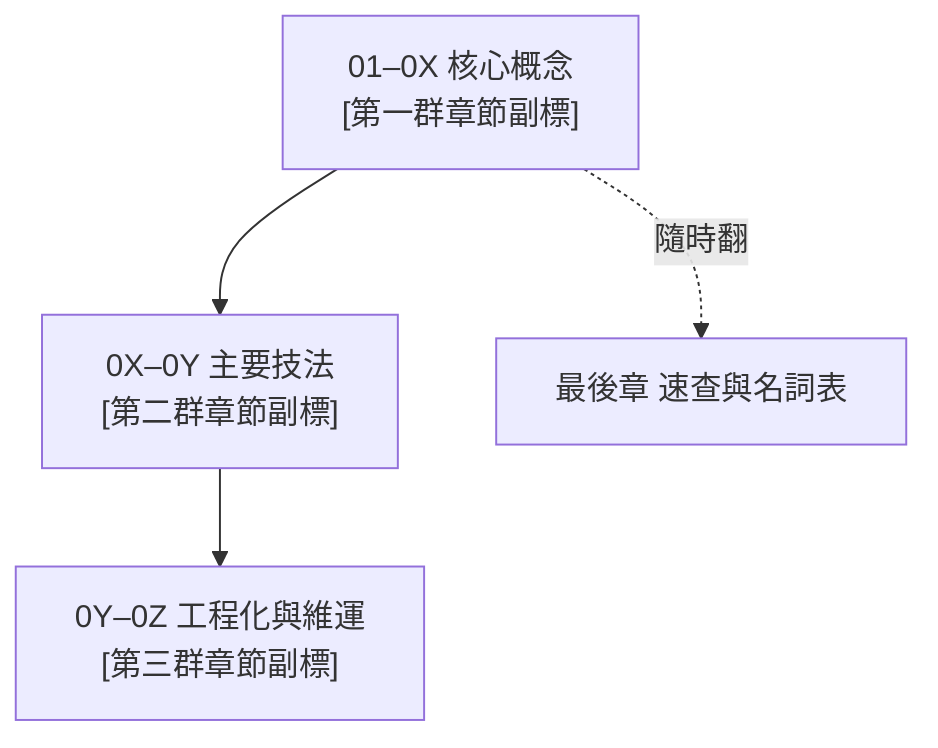

# 首頁設計食譜（Landing Page Recipe）

手冊首頁的目標只有一個：**讓讀者在 30 秒內判斷「這本書管不管用、我從哪裡切入」**，然後消失——好的首頁把人送走，不是把人留在這裡。

---

## 一、動線四段：為什麼是這個順序

```
全書地圖（鳥瞰）
    ↓
如何使用本手冊（對號入座）
    ↓
章節導覽（逐段細目）
    ↓
預設讀者與環境（置底聲明）
```

順序邏輯是讀者的認知解鎖流：先有全局地圖才看得懂「如何使用」在說什麼；知道自己的切入點後才有動機逐章瀏覽；環境聲明置底是因為「確認我的環境對不對」通常是最後才查的問題，不是進門第一個障礙。

### 第一段：全書地圖（概念圖）

用一張 mermaid 流程圖畫出**全書的知識骨架**：章群之間的方向、主線與支線。節點文字格式：`[章號範圍 主題名稱\n一句副標]`；主線用實心箭頭 `-->`，補充/跳讀用虛線箭頭 `-.->|說明|`。

圖之後必須跟一段**導讀文字**（2–4 句），解釋怎麼「讀這張圖」——圖本身無法自解，讀者需要知道方向代表什麼、虛線是什麼意思。略去導讀文字等於把地圖丟在路邊沒人問津。

### 第二段：如何使用本手冊

兩種切入法並列，缺一不可：

**依即時需求**：用 bullet list，每條 `想做 X → [第 N 章](link.md)`。覆蓋最常見的 4–6 種即時需求，每條一行，不寫廢話。

**依工作型態（場景速查表）**：一張表，欄位固定為「你在做什麼 ｜ 主場章（建議順序）｜ 最常踩的雷 ｜ 程度」。3–5 列，對號入座完整的讀書路徑，並點出頭號雷（這是表格最有價值的欄位）。

段末加**兩條鐵律**（全書最重要的兩個原則，粗體），讓讀者帶著這兩句話進入每一章。

### 第三段：章節導覽

用**粗體段標題**把章群分段，每段下接一張**獨立小表**（欄：章號 ｜ 標題（含連結）｜ 一句話）。段標題只描述這群章節的共同目的，不加章號範圍（章號已在表格欄裡，重複很醜）。

### 第四段：預設讀者與環境（置底）

一句話描述**讀者畫像**（「會做 X、不需要 Y 背景」），然後一張小表列環境項目。如果手冊有「資料量級參考」之類的數字基準，在此用 blockquote 附上。

---

## 二、反面教訓：過瘦失脈絡

首頁最常見的失敗模式：瘦身過頭，拿掉所有「看起來像廢話」的文字，剩下一堆表格牆。結果讀者打開首頁，只看到一格格數字與標題，完全不知道這本書在講什麼、為什麼要讀它。

**必須保留、不能刪的三件事：**

1. **全書一句話主軸**——放在 H1 標題之後、第一段正文。不超過兩句。它決定了這本書有沒有「魂」。拿掉它，首頁只是個目錄。
2. **概念圖的導讀段落**——圖本身無法自解。一定要跟一段話說明「怎麼讀這張圖、方向代表什麼」，否則 mermaid 只是裝飾。
3. **章節分段（帶說明的段落標題）**——把章節按概念分群，告訴讀者「這幾章是一個主題」。沒有分段，表格就是流水帳。

**「band 標籤別塞儲存格」**：分段標籤（例如「01–06 建立基礎」）不要擠進表格的某一欄或某一格。表格格子裡塞段落名稱很醜，而且讀者掃表時會卡住、搞不清楚這欄在說什麼。正確做法是用 markdown 粗體標題獨立一行，表格只放章號、標題、一句話。

---

## 三、可套改的骨架範例

以下是一個領域中性的首頁骨架，把 `[佔位]` 換成真實內容即可直接使用。

### 3-1 概念地圖（mermaid）

````markdown
## 全書地圖



> 圖從左到右是 [一個抽象物件/問題] 的「成熟之路」：先 [了解它是什麼（第一群）]→ [把它做好（第二群）]→ [讓它長期可靠（第三群）]。最後一章隨時查。
````

### 3-2 場景速查表

```markdown
### 場景速查：依你的工作型態

| 你在做什麼 | 主場章（順序） | 最常踩的頭號雷 | 程度 |
|---|---|---|---|
| [場景 A，例：一次性探索] | [章]→[章] | [雷] | 初階 |
| [場景 B，例：定期產出供下游用] | [章]→[章]→[章] | [雷] | 初階→進階 |
| [場景 C，例：維護共用資產] | [章]→[章] | [雷] | 進階 |

兩條鐵律：**[鐵律 1——全書最重要的起點原則]**；**[鐵律 2——全書最重要的底線原則]**。
```

### 3-3 分段導覽（粗體段標題＋獨立小表）

```markdown
## 章節導覽

**[第一群：建立概念基礎]**

| 章 | 標題 | 一句話 |
|---|---|---|
| 01 | [標題](01-xxx.md) | 建立心智模型：[核心概念是什麼、最重要的直覺] |
| 02 | [標題](02-xxx.md) | [這章解決的問題] |

**[第二群：核心技法]**

| 章 | 標題 | 一句話 |
|---|---|---|
| 03 | [標題](03-xxx.md) | [這章解決的問題] |
| 04 | [標題](04-xxx.md) | [這章解決的問題] |

**[第三群：工程化與維運]**

| 章 | 標題 | 一句話 |
|---|---|---|
| 05 | [標題](05-xxx.md) | [這章解決的問題] |

**速查**

| 章 | 標題 | 一句話 |
|---|---|---|
| 0N | [速查與名詞表](0N-xxx.md) | [各類速查、名詞對照] |
```

### 3-4 預設讀者與環境（置底）

```markdown
## 預設讀者與環境

**讀者**：[一句話描述——「會做 X、熟悉 Y；不需要 Z 背景」]。第一次出現的技術詞彙都會就地解釋。

| 項目 | 內容 |
|---|---|
| [環境要素 1] | [版本或說明] |
| [環境要素 2] | [版本或說明] |
| [你怎麼下指令] | [主要介面：CLI / SQL / API / ...] |

> [量級基準，例：「資料量級參考：X ~1000 萬筆 / Y ~3000 萬筆/月」]（可省略）
```

---

完整實例可參考本 repo 的 Spark 優化手冊首頁（`docs/handbooks/spark-tuning/index.md`），是上述四段結構的完整落地，可在套改骨架時對照參考。
